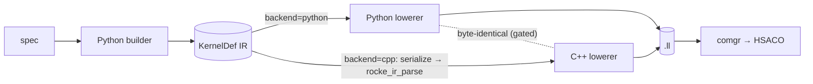

# CK DSL Documentation

This folder is a deep, code-adjacent guide to `rocke`, the Python authoring layer for CK Tile-style GPU kernels on AMDGPU. The package README is the quick tour. These notes are the field manual: how kernels are described, how the Python SSA IR works, how the lowering stack maps DSL operations to AMDGPU LLVM IR and HSACO, what each primitive means, how the shipped instances execute step by step, what limits matter, and how to validate changes.

> **Getting started / prerequisites.** New to the DSL? Start with
> [`development/setup_guide.md`](./development/setup_guide.md) — recommended stack
> (**ROCm 7.2 + PyTorch 2.12, Python 3.12**), virtual-environment setup, building
> the optional C++ engine, the environment-variable reference (`ROCKE_BACKEND`,
> `ROCKE_LLVM_FLAVOR`, …), and step-by-step setup for **Linux and Windows**.
> Then follow [`development/onboarding.md`](./development/onboarding.md) to learn
> to author kernels. To reproduce the example READMEs' numbers, use the ROCm 7.2
> stack (older ROCm needs `ROCKE_LLVM_FLAVOR=llvm22` to match a 7.2 comgr).

## Two engines at a glance

rocke has two interchangeable engines (Python authoring + a peer C++ runtime
engine) that emit byte-identical LLVM IR. Select the lowering back end with
`ROCKE_BACKEND` (default `cpp`, auto-falls back to Python if the C++ extension
isn't built; `both` = run both and assert identical).



Full picture (the front-end/back-end matrix, every interconnect, how to switch,
and the hipDNN provider's Fast / JIT / IR-artifact / C-JIT modes):
[`architecture/engines_and_switching.md`](./architecture/engines_and_switching.md).

The implementation tree is:

```text
Python/rocke/
├── core/ # SSA IR, IR printer, conservative passes, LLVM/HIP/CK Tile lowering
├── runtime/ # libamd_comgr + libamdhip64 ctypes; launcher, workspace, timing
├── helpers/ # CK Tile-like authoring helpers and the high-level compile entrypoint
├── analysis/ # LLVM IR + HSACO/ISA + resource inspection
├── benchmark/ # repeated-run benchmark summaries (median, spread)
├── instances/ # spec-driven kernel builders (gemm, conv, attention, small ops)
├── examples/ # Python-owned example generators and parity harnesses
├── transforms.py # coordinate-transform DAG (pad/embed/unmerge/merge/indirect)
├── run_manifest.py # python -m rocke.run_manifest (HSACO + manifest runner)
├── sweep.py # parallel build-on-the-fly sweep driver
├── sweep_bench.py # benchmark driver over a sweep manifest
└── torch_backend.py # torch.compile backend (rocke.compile)
```

## Reading Order

New to the DSL? Read in this order:

1. `architecture/mental_model.md`
2. `architecture/authoring_model.md`
3. `ir_lowering/ir_model.md`
4. `ir_lowering/lowering_pipeline.md`
5. `ir_lowering/backend_details.md`
6. `primitives/intrinsics_and_primitives.md`
7. `primitives/memory_layout_and_transforms.md`
8. `primitives/wave_and_cross_lane.md`
9. `primitives/quantization.md`
10. `instances/index.md`
11. `instances/gemm.md`
12. `instances/convolution.md`
13. `instances/attention.md`
14. `instances/small_ops.md`
15. `runtime/compile_launch_and_manifest.md`
16. `runtime/manifest_schema.md`
17. `runtime/comgr_and_hipmodule.md`
18. `runtime/limitations.md`
19. `optimization/optimization_runbook.md` — long-form, section-by-section (includes the iteration loop, knob catalog, case studies, probe workflow, arch reference)
20. `optimization/runbook_mapping.md`
21. `optimization/measured_results.md`
22. `fusion/overview.md`
23. `autotune/overview.md`
24. `development/testing.md`
25. `development/extending.md`
26. `development/setup_guide.md` — prerequisites (ROCm 7.2 / PyTorch 2.12), venv setup, building the C++ engine, env-variable reference; Linux & Windows
27. `development/onboarding.md` — guided learning path for kernel authors
28. `development/engine_contributing.md` — the dual-backend contract; required reading before editing engine internals
29. `development/engine_parity.md` — the Python⇄C++ parity rule: every optimization needs both engines (for humans and AI agents)
30. `development/invariants.md` — non-obvious rules (the landmines) for engine contributors
31. `development/troubleshooting.md` — engine/build failure catalog (stale-artifact class, gate failures)
32. `reference/file_index.md`
33. `reference/api_index.md`
34. `reference/env_flags.md` — every environment variable (core, provider, tooling, diagnostic)
35. `reference/op_vocabulary.md`
36. `reference/mfma_atom_catalog.md`
37. `reference/glossary.md`

## One-Screen Summary

`rocke` lets a kernel author write Python objects and IR-builder calls instead of C++ template metaprogramming. A typical path is:

```text
spec dataclass
 └─> instance builder
 └─> KernelDef SSA IR (core/ir.py)
 ├─> optional passes (core/passes.py)
 ├─> MLIR-style text (core/ir_print.py, for inspection only)
 └─> AMDGPU LLVM IR (core/lower_llvm.py)
 └─> libamd_comgr (runtime/comgr.py)
 └─> HSACO bytes
 └─> hipModuleLoadData -> hipModuleLaunchKernel
 (runtime/hip_module.py + launcher.py)
```

Hard facts:

- The production compile path is **LLVM IR text -> libamd_comgr -> HSACO -> hipModule**. There is no MLIR pipeline at runtime. `print_ir()` emits MLIR-style text for humans only.
- `core/lower_hip.py` (`lower_kernel_to_hip`) is a debugging/inspection backend that emits readable HIP C++. It is not the production runtime path. Op coverage is narrower than LLVM lowering.
- `core/lower_cktile.py` emits CK Tile C++ from selected high-level specs (`UniversalGemmSpec`, `ImplicitGemmConvSpec`). It does not consume `KernelDef`. It exists for parity/reference.
- Default target ISA is `amdgcn-amd-amdhsa--gfx950` (CDNA3+). The DSL also runs on `gfx940/gfx942` where the chosen MFMA atoms and waitcnt encoding are valid. The datalayout in `core/lower_llvm.py::_DATALAYOUT` is the clang-emitted gfx950 string.
- Wave size is fixed at 64 in current MFMA lane mappings and helpers.
- Kernel authors usually compose helpers (`TensorDescriptor`, `TensorView`, `TileWindow`, `MfmaAtom`, `WarpGrid`, `CoalescedTileLoader`, `AsyncTileLoader`, `SchedulePolicy`, `SoftwarePipeline`, `DirectEpilogue`, `CShuffleEpilogue`, `block_lds_reduce`, `sweep_row_chunks`).
- Non-bijective addressing (convolution, paged attention, indirection) is expressed with the transform DAG in `transforms.py`.
- Runtime is persistent: `KernelLauncher` loads HSACO once and is called repeatedly. `PipelineLauncher` chains stages on one stream. `WorkspacePool` keeps long-lived torch workspaces alive across launches. `time_launches` is the canonical HIP-event timer.
- Buffer-resource descriptors are constructed with `flags=0x00027000` (= 159744). The DW3 encoding is TYPE=2 (BUFFER_RESOURCE), DATA_FORMAT=4 (32-bit dword), NUM_FORMAT=4 (UINT). With this, OOB lanes silently return zero — the canonical tail-safe primitive used by conv and attention.
- `AsyncTileLoader.choose_dwords` selects `{4, 3, 1}` only (the AMDGPU `raw_ptr_buffer_load_lds` intrinsic on this target does not accept 2 dwords).
- `Value.__bool__` raises by design. SSA values cannot drive Python branches; use `IRBuilder.static_if(...)` for Python booleans and `IRBuilder.scf_if(...)` for runtime predicates.

## Validation Status

The docs in this folder are written against the current code. Run commands
from the `rocKE/` root with the Python interpreter for your ROCm environment:

```bash
export PYTHONPATH=Python

PYTHONDONTWRITEBYTECODE=1 python tests/test_rocke.py

OUT_DIR="${OUT_DIR:-$(mktemp -d)}"
python -m rocke.examples.common.bake_off_implicit_gemm --output-dir "$OUT_DIR"
python -m rocke.run_manifest "$OUT_DIR"/*.hsaco "$OUT_DIR"/manifest.json --verify
```

See `development/testing.md` for the full procedure and
`optimization/measured_results.md` for one recorded validation pass.

## Source Material

These docs are written against the current code. When this file and code disagree, trust code. The most important source files are listed in `reference/file_index.md`.

Conventional anchors:

- Package re-exports: `Python/rocke/__init__.py`, `Python/rocke/helpers/__init__.py`.
- IR + builder: `Python/rocke/core/ir.py`.
- Production lowering: `Python/rocke/core/lower_llvm.py`.
- HIP debug lowering: `Python/rocke/core/lower_hip.py`.
- CK Tile parity emission: `Python/rocke/core/lower_cktile.py`.
- Conservative passes: `Python/rocke/core/passes.py`.
- COMGR: `Python/rocke/runtime/comgr.py`.
- HIP runtime: `Python/rocke/runtime/hip_module.py`.
- Launcher / workspace / timing: `Python/rocke/runtime/launcher.py`.
- Torch arg packing: `Python/rocke/runtime/torch_module.py`.
- High-level compile: `Python/rocke/helpers/compile.py`.
- Manifest schema: `Python/rocke/helpers/manifest.py`.
- Optimization runbook: `gpu-op-optimization-runbook` Cursor skill.
- DSL runbook compliance table: `dsl_docs/optimization/runbook_compliance.md`.
- Coordinate-transform DAG walkthrough: `Python/rocke/TRANSFORM_DAG.md`.
- Helpers reference: `Python/rocke/helpers/README.md`.
