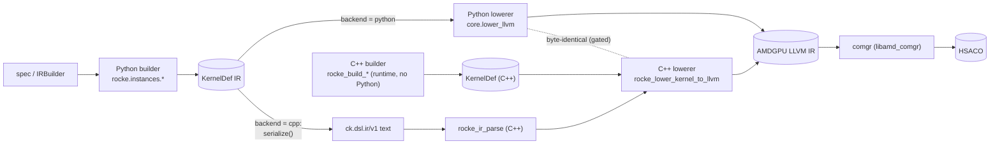
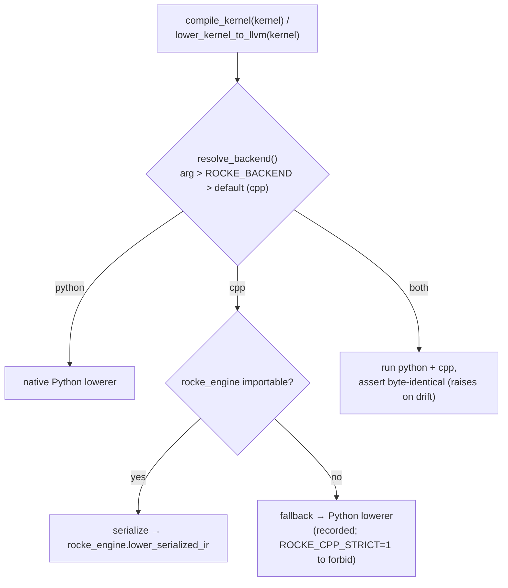
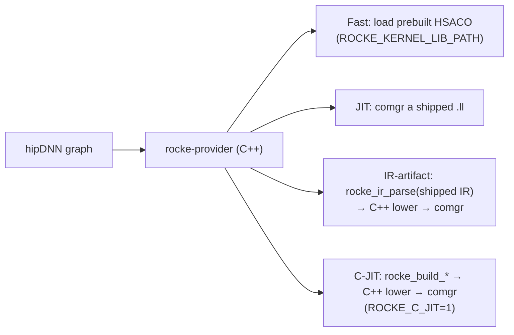

# Engines & Switching

rocke has **two engines**, each with a **front end** (the *builder*: spec → IR)
and a **back end** (the *lowerer*: IR → AMDGPU LLVM IR text). They are kept
byte-identical and are interchangeable. This page is the map: what the pieces are,
how to switch between them, and every interconnect.

| | Front end (builder: spec → IR) | Back end (lowerer: IR → `.ll`) |
|---|---|---|
| **Python** | `rocke.instances.*` (e.g. `build_universal_gemm`) via `IRBuilder` | `rocke.core.lower_llvm.lower_kernel_to_llvm` |
| **C++** | `Cpp` `rocke_build_*` | `Cpp` `rocke_lower_kernel_to_llvm` |

- **Python** is the authoring front end (the crown jewel) and the differential **oracle**.
- **C++** is a first-class runtime engine — it can build *and* lower with **no Python present** (what the hipDNN provider ships).
- Both back ends emit **byte-identical** LLVM IR for the same kernel; CI enforces it.

## Data flow & interconnects

**The seams (interconnect points):**
1. **`ROCKE_BACKEND` / `resolve_backend()`** — picks which back end lowers a *Python-authored* kernel (`rocke/core/backend.py`).
2. **The `rocke_engine` pybind module** — exposes the C++ engine to Python: the generic `lower_serialized_ir(ir_text, arch)`, the per-family `<fam>_lower_llvm` / `_serialize_ir` / `_verify`, and `build_id()` / `engine_version()`.
3. **The IR seam** — `serialize(KernelDef)` (Python) → `rocke_ir_parse` (C++): a Python-built kernel reaches the C++ lowerer as serialized `ck.dsl.ir/v1` text (the C++ engine can't take a Python object directly). This is the path the `cpp` backend uses for arbitrary kernels.
4. **The byte-identity gate** — `tools/check_byte_identity.py` / `run_diff`; `both` mode asserts it at runtime. Keeps the two back ends equal (see [`engine_parity.md`](../development/engine_parity.md)).
5. **The hipDNN provider** — the pure-C++ runtime that links the C++ engine (below).

## Switching the lowering back end (Python-authored kernels)

How to choose, in precedence order:
- **Per call:** `compile_kernel(kernel, backend="python"|"cpp"|"both")` (also `lower_kernel_to_llvm(..., backend=)`).
- **Per process:** `export ROCKE_BACKEND=cpp|python|both`.
- **Default:** `cpp` (the C++ engine), which **auto-falls back to the Python lowerer** if `rocke_engine` isn't built — set `ROCKE_CPP_STRICT=1` to turn that fallback into an error.
- `both` runs both and raises on any divergence — the in-process differential check.
- `python` selects the native lowerer (and is the differential oracle).

> Match the **LLVM flavor** to your `comgr`: `ROCKE_LLVM_FLAVOR=llvm22` for ROCm 7.2 (else it's auto-detected). See [`../development/setup_guide.md`](../development/setup_guide.md) and [`../reference/env_flags.md`](../reference/env_flags.md).

## The C++ runtime path (hipDNN provider)

At runtime the provider is pure C++ — **no Python**. It serves a kernel one of four ways:

- **Fast** — load a prebuilt HSACO bundle (offline-generated; any engine).
- **JIT-from-`.ll`** — `comgr`-compile a shipped `.ll`.
- **IR-artifact** — parse shipped serialized IR, then the C++ lowerer + `comgr` (no C++ builder needed).
- **C-JIT** — the C++ builder *and* lowerer at runtime (`ROCKE_C_JIT=1`); fully Python-free.

Provider flags (`ROCKE_C_JIT`, `ROCKE_KERNEL_LIB_PATH`, `HIPDNN_PLUGIN_PATH`, `ROCKE_ALLOW_ENGINE_MISMATCH`) are in [`../reference/env_flags.md`](../reference/env_flags.md); build details in `BUILD.md`.

## Rule of thumb

- **Authoring / iterating** → Python front end, `backend=python` is easiest to debug; `both` to check the C++ engine agrees.
- **Shipping / serving** → the C++ engine (default `cpp`, or the provider's C-JIT / IR-artifact / Fast modes).
- **Adding or tuning a kernel** → change *both* engines and keep them byte-identical — see [`../development/engine_parity.md`](../development/engine_parity.md) and [`../development/engine_contributing.md`](../development/engine_contributing.md).
