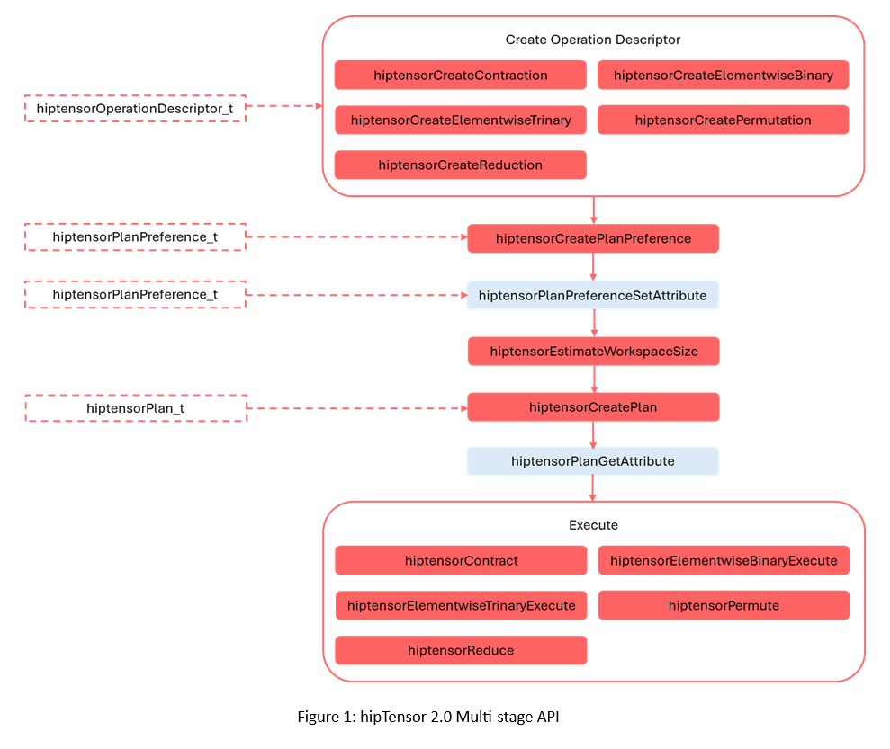

.. meta::
   :description: A high-performance HIP library for tensor primitives
   :keywords: hipTensor, cuTensor, ROCm, library, API, tool

.. _Transition to hipTensor 2.0:

=============================
Transition to hipTensor 2.0
=============================

hipTensor 2.0 brings significant enhancements and benefits over its predecessor. This guide provides an overview of the structure and main features of the new and improved API, outlines the key differences between the old and the new API, and demonstates how to migrate existing code to the new API.

--------------------------------
Overview
--------------------------------

hipTensor 2.0 is designed to deliver higher performance, more functionality, and easier integration for your projects. We introduce a multi-stage API for all supported operations; Figure 1 illustrates the key stages (optional stages are grey): Creating an operation descriptor, restricting the kernel space, planning (i.e., selecting a kernel), and execution.

This structure allows us to reduce our API footprint by consolidating all supported operations (contractions, reductions, elementwise, and permutation) into a single hiptensorOperationDescriptor_t object and share the same steps to reach execution. Additionally the new API supports querying the plan to determine the exact workspace size that is required by the operation (via hiptensorPlanGetAttribute()), thus reducing the memory requirements for applications to the bare minimum.

--------------------------------
Differences at a glance
--------------------------------

The key differences between the old and the new API are listed below:

* ``hipDataType`` -> `hiptensorDataType_t <../api-reference/api-reference.html#hiptensordatatype-t>`_ (e.g., HIP_R_32F -> HIPTENSOR_R_32F)
* ``hiptensorComputeType_t`` -> `hiptensorComputeDescriptor_t <../api-reference/api-reference.html#hiptensorcomputedescriptor-t>`_ (e.g., HIPTENSOR_COMPUTE_32F -> HIPTENSOR_COMPUTE_DESC_32F)

   * The previously deprecated compute types ``HIPTENSOR_R_MIN``... and ``HIPTENSOR_C_MIN``... have been removed.

* ``hiptensorInitTensorDescriptor`` -> `hiptensorCreateTensorDescriptor() <../api-reference/api-reference.html#hiptensorcreatetensordescriptor>`_
* ``hiptensorContractionDescriptor_t`` -> `hiptensorOperationDescriptor_t <../api-reference/api-reference.html#hiptensoroperationdescriptor>`_
* ``hiptensorInitContractionDescriptor`` -> `hiptensorCreateContraction() <../api-reference/api-reference.html#hiptensorcreatecontraction>`_
* ``hiptensorInitContractionFind`` -> `hiptensorCreatePlanPreference() <../api-reference/api-reference.html#hiptensorcreateplanpreference>`_
* ``hiptensorContractionGetWorkspaceSize`` -> `hiptensorEstimateWorkspaceSize() <../api-reference/api-reference.html#hiptensorestimateworkspacesize>`_
* ``hiptensorInitContractionPlan`` -> `hiptensorCreatePlan() <../api-reference/api-reference.html#hiptensorcreateplan>`_
* ``hiptensorContraction`` -> `hiptensorContract() <../api-reference/api-reference.html#hiptensorcontract>`_
* ``hiptensorElementwiseBinary`` -> `hiptensorElementwiseBinaryExecute() <../api-reference/api-reference.html#hiptensorelementwisebinaryexecute>`_
* ``hiptensorElementwiseTrinary`` -> `hiptensorElementwiseTrinaryExecute() <../api-reference/api-reference.html#hiptensorelementwisetrinaryexecute>`_
* ``hiptensorPermutation`` -> `hiptensorPermute() <../api-reference/api-reference.html#hiptensorpermute>`_
* ``hiptensorReduction`` -> `hiptensorReduce() <../api-reference/api-reference.html#hiptensorreduce>`_
* “Init” functions have become “Create/Destroy” pairs:

   * ``hiptensorInit`` -> `hiptensorCreate() <../api-reference/api-reference.html#hiptensorcreate>`_ and `hiptensorDestroy() <../api-reference/api-reference.html#hiptensordestroy>`_
   * ``hiptensorInitTensorDescriptor`` -> `hiptensorCreateTensorDescriptor() <../api-reference/api-reference.html#hiptensorcreatetensordescriptor>`_ and `hiptensorDestroyTensorDescriptor() <../api-reference/api-reference.html#hiptensordestroytensordescriptor>`_
   * ``hiptensorInitContractionDescriptor`` -> `hiptensorCreateContraction() <../api-reference/api-reference.html#hiptensorcreatecontraction>`_ and `hiptensorDestroyOperationDescriptor() <../api-reference/api-reference.html#hiptensordestroyoperationdescriptor>`_
   * ``hiptensorInitContractionFind`` -> `hiptensorCreatePlanPreference() <../api-reference/api-reference.html#hiptensorcreateplanpreference>`_ and `hiptensorDestroyPlanPreference() <../api-reference/api-reference.html#hiptensordestroyplanpreference>`_
   * ``hiptensorInitContractionPlan`` -> `hiptensorCreatePlan() <../api-reference/api-reference.html#hiptensorcreateplan>`_ and `hiptensorDestroyPlan() <../api-reference/api-reference.html#hiptensordestroyplan>`_

* The `hiptensorOperator_t <../api-reference/api-reference.html#hiptensoroperator-t>`_ (e.g., ``HIPTENSOR_OP_IDENTITY``) is no longer part of the `hiptensorTensorDescriptor_t <../api-reference/api-reference.html#hiptensortensordescriptor>`_ and has moved to creation of each operation (e.g., `hiptensorCreateContraction() <../api-reference/api-reference.html#hiptensorcreatecontraction>`_)
* Similarly, the alignment is no longer part of each operation but has moved to `hiptensorCreateTensorDescriptor() <../api-reference/api-reference.html#hiptensorcreatetensordescriptor>`_, with the intention being that a `hiptensorTensorDescriptor_t <../api-reference/api-reference.html#hiptensortensordescriptor>`_ object describes all aspects related to the physical layout of the tensor in memory.

~~~~~~~~~~~~~~~~~~~~~~~~~~~~~~~~~~~~~~~~~~~~~~~~~~~~~~
Example 1: Migrating a contraction from 1.x to 2.0
~~~~~~~~~~~~~~~~~~~~~~~~~~~~~~~~~~~~~~~~~~~~~~~~~~~~~~

DataType names have to be adjusted, since their prefix has been changed from ``HIP_`` to ``HIPTENSOR_`` (e.g., ``HIP_R_32F`` to ``HIPTENSOR_R_32F``)

hipTensor 1.x
^^^^^^^^^^^^^^
::

   hipDataType_t typeA = HIP_R_32F;
   hipDataType_t typeB = HIP_R_32F;
   hipDataType_t typeC = HIP_R_32F;

hipTensor 2.0
^^^^^^^^^^^^^^
::

   hiptensorDataType_t typeA = HIPTENSOR_R_32F;
   hiptensorDataType_t typeB = HIPTENSOR_R_32F;
   hiptensorDataType_t typeC = HIPTENSOR_R_32F;

Since our initialization functions have been replaced by Create/Destroy pairs, it is no longer necessary to use pointers to hipTensor objects; users can now directly allocate the structure using `hiptensorCreate() <../api-reference/api-reference.html#hiptensorcreate>`_. Any memory allocated by `hiptensorCreate() <../api-reference/api-reference.html#hiptensorcreate>`_ can be safely released using `hiptensorDestroy() <../api-reference/api-reference.html#hiptensordestroy>`_.

hipTensor 1.x
^^^^^^^^^^^^^^
::

   hiptensorHandle_t* handle; 

hipTensor 2.0
^^^^^^^^^^^^^^   
::

   hiptensorHandle_t handle;

hiptensorInitTensorDescriptor is replaced by `hiptensorCreateTensorDescriptor() <../api-reference/api-reference.html#hiptensorcreatetensordescriptor>`_. This is not just a name change; the last argument has been changed. Specifically, instead of specifying the `hiptensorOperator_t <../api-reference/api-reference.html#hiptensoroperator-t>`_ (which is now part of the operation descriptor), the user specifies the alignment of the tensor pointer in bytes.

hipTensor 1.x
^^^^^^^^^^^^^^
::

   hiptensorTensorDescriptor_t descA;
   hiptensorInitTensorDescriptor(handle,
                                 &descA,
                                 nmodeA,
                                 extentA.data(),
                                 NULL,/*stride*/
                                 typeA, HIPTENSOR_OP_IDENTITY);      

hipTensor 2.0
^^^^^^^^^^^^^^
::

   hiptensorTensorDescriptor_t descA;
   hiptensorCreateTensorDescriptor(handle,
                                   &descA,
                                   nmodeA,
                                   extentA.data(),
                                   NULL,/*stride*/
                                   typeA, kAlignment);
   
In the new API, a contraction is represented by a `hiptensorOperationDescriptor_t <../api-reference/api-reference.html#hiptensoroperationdescriptor>`_ initialized using `hiptensorCreateContraction() <../api-reference/api-reference.html#hiptensorcreatecontraction>`_.

hipTensor 1.x
^^^^^^^^^^^^^^
::

   hiptensorContractionDescriptor_t desc;
   hiptensorInitContractionDescriptor(handle,
                                      &desc,
                                      &descA, modeA.data(), alignmentRequirementA,
                                      &descB, modeB.data(), alignmentRequirementB,
                                      &descC, modeC.data(), alignmentRequirementC,
                                      &descC, modeC.data(), alignmentRequirementC,
                                      typeCompute);

hipTensor 2.0
^^^^^^^^^^^^^^
::

   hiptensorOperationDescriptor_t desc;
   hiptensorCreateContraction(handle,
                              &desc,
                              descA, modeA.data(), HIPTENSOR_OP_IDENTITY,
                              descB, modeB.data(), HIPTENSOR_OP_IDENTITY,
                              descC, modeC.data(), HIPTENSOR_OP_IDENTITY,
                              descC, modeC.data(), 
                              descCompute);                             

``hiptensorContractionFind_t`` has been renamed to `hiptensorPlanPreference_t <../api-reference/api-reference.html#hiptensorplanpreference>`_ to indicate that it is not only limited to contractions but to all operations instead. Essentially, its functionality remains the same: It configures how `hiptensorCreatePlan() <../api-reference/api-reference.html#hiptensorcreateplan>`_ is going to function.

hipTensor 1.x
^^^^^^^^^^^^^^
::

   hiptensorContractionFind_t find;
   hiptensorInitContractionFind(handle,
                                &find,
                                HIPTENSOR_ALGO_DEFAULT); 

hipTensor 2.0
^^^^^^^^^^^^^^
::

   hiptensorPlanPreference_t planPref;
   hiptensorCreatePlanPreference(handle,
                                 &planPref,
                                 HIPTENSOR_ALGO_DEFAULT,
                                 HIPTENSOR_JIT_MODE_NONE);

``hiptensorContractionGetWorkspaceSize`` has been renamed to `hiptensorEstimateWorkspaceSize() <../api-reference/api-reference.html#hiptensorestimateworkspacesize>`_. Three values of `hiptensorWorksizePreference_t <../api-reference/api-reference.html#hiptensorworksizepreference-t>`_ are available; note that ``HIPTENSOR_WORKSPACE_RECOMMENDED`` has been renamed to ``HIPTENSOR_WORKSPACE_DEFAULT``.

hipTensor 1.x
^^^^^^^^^^^^^^
::

   uint64_t worksize = 0;
   hiptensorContractionGetWorkspaceSize(handle,
                                        &desc,
                                        &find,
                                        HIPTENSOR_WORKSPACE_RECOMMENDED,
                                        &worksize);

hipTensor 2.0
^^^^^^^^^^^^^^
::

   uint64_t workspaceSizeEstimate = 0;
   hiptensorEstimateWorkspaceSize(handle,
                                  desc,
                                  planPref,
                                  HIPTENSOR_WORKSPACE_DEFAULT,
                                  &workspaceSizeEstimate);

``hiptensorInitContractionPlan`` has been renamed to `hiptensorCreatePlan() <../api-reference/api-reference.html#hiptensorcreateplan>`_.

hipTensor 1.x
^^^^^^^^^^^^^^
::

   hiptensorContractionPlan_t plan;
   hiptensorInitContractionPlan(handle,
                                &plan,
                                &desc,
                                &find,
                                worksize);

hipTensor 2.0
^^^^^^^^^^^^^^
::

   hiptensorPlan_t plan;
   hiptensorCreatePlan(handle,
                       &plan,
                       desc,
                       planPref,
                       workspaceSizeEstimate);

After planning, users can query the created plan to find the actual workspace required to execute the operation. The ``actualWorkspaceSize`` is guarranteed to be smaller or equal to the ``workspaceSizeEstimate`` used above to create the plan.

hipTensor 1.x
^^^^^^^^^^^^^^
::

   void *work = nullptr;
   if (worksize > 0)
      if (hipSuccess != hipMalloc(\&work, worksize))
      {
         work = nullptr;
         worksize = 0;
      }

hipTensor 2.0
^^^^^^^^^^^^^^
::

   uint64_t actualWorkspaceSize = 0;
   hiptensorPlanGetAttribute(handle,
                             plan,
                             HIPTENSOR_PLAN_REQUIRED_WORKSPACE,
                             &actualWorkspaceSize,
                             sizeof(actualWorkspaceSize));
                             
   void *work = nullptr;
   if (actualWorkspaceSize > 0)
   CHECK_HIP_ERROR(hipMalloc(&work, actualWorkspaceSize));

``hiptensorContraction`` has been renamed to `hiptensorContract() <../api-reference/api-reference.html#hiptensorcontract>`_.

hipTensor 1.x
^^^^^^^^^^^^^^
::

   hiptensorContraction(handle,
                        &plan,
                        (void*) &alpha, A_d, B_d,
                        (void*) &beta,  C_d, C_d,
                        work, worksize, 0 /* stream */);

hipTensor 2.0
^^^^^^^^^^^^^^
::

   hipStream_t stream;
   CHECK_HIP_ERROR(hipStreamCreate(\&stream));
   
   hiptensorContract(handle,
                     plan,
                     (void*) &alpha, A_d, B_d,
                     (void*) &beta,  C_d, C_d,
                     work, actualWorkspaceSize, stream);

~~~~~~~~~~~~~~~~~~~~~~~~~~~~~~~~~~~~~~~~~~~~~~~~~~~~~~~~~~~~
Example 2: Migrating a reduction operation from 1.x to 2.0
~~~~~~~~~~~~~~~~~~~~~~~~~~~~~~~~~~~~~~~~~~~~~~~~~~~~~~~~~~~~

Reductions (along with permutations and elementwise operations, see Example 3: Migrating a permutation/elementwise operation from 1.x to 2.0) were previously only exposed through an execution function (i.e., single-stage API); on the contrary, with hipTensor 2.0, reductions utilize same multi-stage API that applies to all other operations as well. The steps necessary to compute a reduction using the new API are very similar to Example 1: Migrating a contraction from 1.x to 2.0 and are illustrated below.

hipTensor 1.x
^^^^^^^^^^^^^^
::

   uint64_t worksize = 0;
   hiptensorReductionGetWorkspaceSize(handle,
                                      A_d, &descA, modeA.data(),
                                      C_d, &descC, modeC.data(),
                                      C_d, &descC, modeC.data(),
                                      opReduce, typeCompute, &worksize);
   void *work = nullptr;
   if (worksize > 0) 
   {
      hipMalloc(&work, worksize); 
   }

hipTensor 2.0
^^^^^^^^^^^^^^
::

   const hiptensorOperator_t opReduce = HIPTENSOR_OP_ADD;
   hiptensorOperationDescriptor_t desc;
   hiptensorCreateReduction(handle, &desc,
                           descA, modeA.data(), HIPTENSOR_OP_IDENTITY,
                           descC, modeC.data(), HIPTENSOR_OP_IDENTITY,
                           descC, modeC.data(), opReduce,
                           descCompute);
   
   const hiptensorAlgo_t algo = HIPTENSOR_ALGO_DEFAULT;
   
   hiptensorPlanPreference_t planPref;
   hiptensorCreatePlanPreference(handle,
                                &planPref,
                                algo,
                                HIPTENSOR_JIT_MODE_NONE);
   
   uint64_t workspaceSizeEstimate = 0;
   const hiptensorWorksizePreference_t workspacePref = HIPTENSOR_WORKSPACE_DEFAULT;
   hiptensorEstimateWorkspaceSize(handle,
                                 desc,
                                 planPref,
                                 workspacePref,
                                 &workspaceSizeEstimate);
   
   hiptensorPlan_t plan;
   hiptensorCreatePlan(handle,
                      &plan,
                      desc,
                      planPref,
                      workspaceSizeEstimate);
   
   uint64_t actualWorkspaceSize = 0;
   hiptensorPlanGetAttribute(handle,
                            plan,
                            HIPTENSOR_PLAN_REQUIRED_WORKSPACE,
                            &actualWorkspaceSize,
                            sizeof(actualWorkspaceSize));
   
   void *work = nullptr;
   if (actualWorkspaceSize > 0)
   {
       hipMalloc(&work, actualWorkspaceSize);
   }

hipTensor 1.x
^^^^^^^^^^^^^^
::

   const hiptensorOperator_t opReduce = HIPTENSOR_OP_ADD;
   hiptensorReduction(handle,
                     (const void*)&alpha, A_d, &descA, modeA.data(),
                     (const void*)&beta,  C_d, &descC, modeC.data(),
                     C_d, &descC, modeC.data(),
                     opReduce, typeCompute, work, worksize, 0 /* stream */);

hipTensor 2.0
^^^^^^^^^^^^^^
::

   hiptensorReduce(handle, plan,
                  (const void*)&alpha, A_d,
                  (const void*)&beta,  C_d,
                  C_d, work, actualWorkspaceSize, stream);

~~~~~~~~~~~~~~~~~~~~~~~~~~~~~~~~~~~~~~~~~~~~~~~~~~~~~~~~~~~~~~~~~~~~~~~~
Example 3: Migrating a permutation/elementwise operation from 1.x to 2.0
~~~~~~~~~~~~~~~~~~~~~~~~~~~~~~~~~~~~~~~~~~~~~~~~~~~~~~~~~~~~~~~~~~~~~~~~

In the new API, permutations and elementwise operations also utilize the same multi-stage API. The steps necessary to compute an elementwise binary operation using the new API are illustrated below.

hipTensor 1.x
^^^^^^^^^^^^^^
::
       

hipTensor 2.0
^^^^^^^^^^^^^^
::

   hiptensorOperationDescriptor_t  desc;
   hiptensorCreateElementwiseBinary(handle,
                                   &desc,
                                   descA, modeA.data(), HIPTENSOR_OP_IDENTITY,
                                   descC, modeC.data(), HIPTENSOR_OP_IDENTITY,
                                   descC, modeC.data(), HIPTENSOR_OP_ADD,
                                   descCompute);
   
   const hiptensorAlgo_t algo = HIPTENSOR_ALGO_DEFAULT;
   
   hiptensorPlanPreference_t  planPref;
   hiptensorCreatePlanPreference(handle,
                                &planPref,
                                algo,
                                HIPTENSOR_JIT_MODE_NONE);
   
   hiptensorPlan_t  plan;
   hiptensorCreatePlan(handle,
                      &plan,
                      desc,
                      planPref,
                      0 /* workspaceSizeLimit */);

hipTensor 1.x
^^^^^^^^^^^^^^
::

   hiptensorElementwiseBinary(handle,
                             (void*)&alpha, A_d, &descA, modeA.data(),
                             (void*)&gamma, C_d, &descC, modeC.data(),
                             C_d, &descC, modeC.data(),
                             HIPTENSOR_OP_ADD, 
                             typeCompute, 0 /* stream */);

hipTensor 2.0
^^^^^^^^^^^^^^
::
   
   hiptensorElementwiseBinaryExecute(handle,
                                     plan,
                                     (void*)&alpha, A_d,
                                     (void*)&gamma, C_d,
                                     C_d, 0 /* stream */));

We omit an example w.r.t. `hiptensorPermute() <../api-reference/api-reference.html#hiptensorpermute>`_ since it is akin to the example above.
