.. _ck_tile_adaptors:

Tensor Adaptors - Chaining Transformations
==========================================

Overview
--------

While individual :ref:`transforms <ck_tile_transforms>` are effective, TensorAdaptors enable the chaining of multiple transforms together to create complex coordinate transformations. Adaptors can be thought of as transformation pipelines that can reshape, reorder, and restructure tensors in advanced ways.

TensorAdaptors serve as the bridge between individual transforms and the high-level tensor operations used in applications. They provide a composable abstraction that allows developers to build complex data access patterns from simple building blocks.

TensorAdaptor Basics
--------------------

A TensorAdaptor encapsulates a sequence of :ref:`coordinate transformations <ck_tile_coordinate_systems>`, managing the flow of coordinates through multiple transform stages:

.. 
   Original mermaid diagram (edit here, then run update_diagrams.py)
   
.. 
   Original mermaid diagram (edit here, then run update_diagrams.py)
   
      .. mermaid::
      
         graph LR
             subgraph "Adaptor Composition"
                 subgraph "Single Transform"
                     direction TB
                     I1["Input Coords [0,1,2]"]
                     T1["Transform (e.g., Transpose)"]
                     O1["Output Coords [2,0,1]"]
                     I1 --> T1 --> O1
                 end
      
                 subgraph "Chained Transforms"
                     direction TB
                     I2["Input 2D"]
                     T2A["Transform A (e.g., Merge)"]
                     M2["Intermediate 1D"]
                     T2B["Transform B (e.g., Pad)"]
                     O2["Output 1D Padded"]
                     I2 --> T2A --> M2 --> T2B --> O2
                 end
             end
      
             style T1 fill:#e3f2fd,stroke:#1976d2,stroke-width:2px
             style T2A fill:#fff3e0,stroke:#f57c00,stroke-width:2px
             style T2B fill:#fff3e0,stroke:#f57c00,stroke-width:2px
      
      
   
   

Core Components

~~~~~~~~~~~~~~~

Each TensorAdaptor contains:

- **transforms**: List of individual :ref:`transforms <ck_tile_transforms>` to apply
- **lower_dimension_hidden_idss**: Mappings between transform stages
- **upper_dimension_hidden_idss**: Hidden dimension mappings for internal stages
- **bottom_dimension_hidden_ids**: Input dimension identifiers
- **top_dimension_hidden_ids**: Output dimension identifiers

The most important method of a TensorAdaptor is ``calculate_bottom_index``, which calculates the lower index from the upper index by applying transforms in reverse order.

Transpose Adaptor: Dimension Reordering
---------------------------------------

The transpose adaptor reorders tensor dimensions according to a permutation pattern. This operation forms the basis for many tensor manipulations in GPU kernels.

.. code-block:: cpp

   // Create transpose adaptor: [0, 1, 2] → [2, 0, 1]
   auto transpose_adaptor = make_identity_tensor_adaptor<3>();  // Start with identity
   
   // Apply transpose using transform_tensor_adaptor
   auto transposed_desc = transform_tensor_descriptor(
       original_desc,
       make_tuple(make_pass_through_transform(original_desc.get_length(2)),
                  make_pass_through_transform(original_desc.get_length(0)),
                  make_pass_through_transform(original_desc.get_length(1))),
       make_tuple(sequence<2>{}, sequence<0>{}, sequence<1>{}),  // old dims
       make_tuple(sequence<0>{}, sequence<1>{}, sequence<2>{})   // new dims
   );
   
   // Alternative: Direct coordinate transformation
   multi_index<3> top_coord{0, 1, 2};
   // After transpose [2, 0, 1]: coord becomes [2, 0, 1]

Single-Stage Adaptors: Custom Transform Chains
----------------------------------------------

Custom adaptors can be created by specifying which transforms to use and how they connect. This provides fine-grained control over the transformation pipeline:

.. code-block:: cpp

   // Create a descriptor that merges 2x3 dimensions into single dimension
   auto base_desc = make_naive_tensor_descriptor_packed(make_tuple(2, 3));
   
   // Apply merge transform
   auto merged_desc = transform_tensor_descriptor(
       base_desc,
       make_tuple(make_merge_transform(make_tuple(2, 3))),
       make_tuple(sequence<0, 1>{}),  // merge dims 0,1
       make_tuple(sequence<0>{})      // to single dim 0
   );
   
   // The adaptor is embedded in the :ref:`descriptor <ck_tile_descriptors>`
   // To use it:
   multi_index<1> top_coord{5};  // 1D coordinate
   // This internally calculates: row = 5/3 = 1, col = 5%3 = 2

Chaining Adaptors: Building Complex Transformations
---------------------------------------------------

The real power of adaptors comes from chaining multiple transformations together to create advanced data access patterns:

.. 
   Original mermaid diagram (edit here, then run update_diagrams.py)
   
.. 
   Original mermaid diagram (edit here, then run update_diagrams.py)
   
      .. mermaid::
      
         graph LR
             subgraph "Adaptor Chaining Flow"
                 subgraph "Adaptor 1"
                     A1I["Bottom Dims [0,1]"]
                     A1T["Transform: Merge[2,3]"]
                     A1O["Top Dims [0]"]
                 end
                 
                 subgraph "Adaptor 2"
                     A2I["Bottom Dims [0]"]
                     A2T["Transform: Unmerge[2,3]"]
                     A2O["Top Dims [0,1]"]
                 end
                 
                 subgraph "Chained Result"
                     CI["Input 2D Bottom[0,1]"]
                     CO["Output 2D Top[0,1]"]
                 end
             end
             
             A1I --> A1T
             A1T --> A1O
             A1O --> A2I
             A2I --> A2T
             A2T --> A2O
             
             CI --> A1I
             A2O --> CO
             
             style A1T fill:#e3f2fd,stroke:#1976d2,stroke-width:2px
             style A2T fill:#fff3e0,stroke:#f57c00,stroke-width:2px
             style CI fill:#e8f5e9,stroke:#388e3c,stroke-width:2px
             style CO fill:#e8f5e9,stroke:#388e3c,stroke-width:2px
      
      
   
   

.. code-block:: cpp

   // Start with a 2D descriptor
   auto desc1 = make_naive_tensor_descriptor_packed(make_tuple(2, 3));
   
   // First transformation: merge 2D to 1D
   auto merged_desc = transform_tensor_descriptor(
       desc1,
       make_tuple(make_merge_transform(make_tuple(2, 3))),
       make_tuple(sequence<0, 1>{}),  // merge dims 0,1
       make_tuple(sequence<0>{})      // to dim 0
   );
   
   // Second transformation: unmerge 1D back to 2D
   auto final_desc = transform_tensor_descriptor(
       merged_desc,
       make_tuple(make_unmerge_transform(make_tuple(2, 3))),
       make_tuple(sequence<0>{}),     // from dim 0
       make_tuple(sequence<0, 1>{})   // to dims 0,1
   );
   
   // The chained transformation is embedded in final_desc
   // Result should be identity transformation

Transform Addition: Extending Existing Adaptors
-----------------------------------------------

Existing adaptors can be extended with new transforms using ``transform_tensor_adaptor``. This pattern is useful for adding padding or other modifications to existing transformation pipelines:

.. code-block:: cpp

   // Start with transposed descriptor
   auto base_desc = make_naive_tensor_descriptor(
       make_tuple(3, 4),
       make_tuple(1, 3)   // transposed strides
   );
   
   // Add padding to both dimensions
   auto padded_desc = transform_tensor_descriptor(
       base_desc,
       make_tuple(make_pad_transform(3, 1, 1),   // pad dim 0: 3 → 5
                  make_pad_transform(4, 0, 0)),   // keep dim 1: 4 → 4
       make_tuple(sequence<0>{}, sequence<1>{}),  // input dims
       make_tuple(sequence<0>{}, sequence<1>{})   // output dims (keep 2D)
   );
   
   // Access pattern
   multi_index<2> padded_coord{1, 2};  // In padded space
   // Internally calculates: unpadded = [1-1, 2] = [0, 2]
   // Then applies transpose strides

Advanced Patterns
-----------------

Complex Nested Transforms
~~~~~~~~~~~~~~~~~~~~~~~~~

CK Tile supports complex nested transform patterns that enable advanced data layouts:

.. code-block:: cpp

   // Example: 4D tensor with complex transformations
   // Shape: [A, B, C, D] with various transforms
   
   // 1. Create base descriptor
   auto base_desc = make_naive_tensor_descriptor_packed(
       make_tuple(A, B, C, D)
   );
   
   // 2. Apply multiple transformations
   // First: merge first 3 dimensions
   auto step1_desc = transform_tensor_descriptor(
       base_desc,
       make_tuple(make_merge_transform(make_tuple(A, B, C)),
                  make_pass_through_transform(D)),
       make_tuple(sequence<0, 1, 2>{}, sequence<3>{}),  // input mapping
       make_tuple(sequence<0>{}, sequence<1>{})         // output: 2D
   );
   
   // 3. Then unmerge back but with different grouping
   auto step2_desc = transform_tensor_descriptor(
       step1_desc,
       make_tuple(make_unmerge_transform(make_tuple(A*B, C)),
                  make_pass_through_transform(D)),
       make_tuple(sequence<0>{}, sequence<1>{}),        // from 2D
       make_tuple(sequence<0, 1>{}, sequence<2>{})      // to 3D
   );
   
   // The adaptor chain is embedded in the descriptors
   // CK optimizes these at compile time

GPU Memory Layout Example
~~~~~~~~~~~~~~~~~~~~~~~~~

A practical example showing how adaptors create efficient :ref:`GPU memory access patterns <ck_tile_gpu_basics>`:

.. code-block:: cpp

   // Create descriptor for thread block tile: 64x64
   // With 8x8 vector loads per thread
   constexpr auto BlockM = 64;
   constexpr auto BlockN = 64;
   constexpr auto VectorM = 8;
   constexpr auto VectorN = 8;
   
   // Thread arrangement: 8x8 threads
   constexpr auto ThreadM = BlockM / VectorM;  // 8
   constexpr auto ThreadN = BlockN / VectorN;  // 8
   
   // Create block descriptor with proper layout
   auto block_desc = transform_tensor_descriptor(
       make_naive_tensor_descriptor_packed(
           make_tuple(number<BlockM>{}, number<BlockN>{})
       ),
       make_tuple(
           make_unmerge_transform(make_tuple(
               number<ThreadM>{}, number<VectorM>{}
           )),
           make_unmerge_transform(make_tuple(
               number<ThreadN>{}, number<VectorN>{}
           ))
       ),
       make_tuple(sequence<0>{}, sequence<1>{}),           // from 2D
       make_tuple(sequence<0, 2>{}, sequence<1, 3>{})     // to 4D: [TM,TN,VM,VN]
   );
   
   // This creates the layout:
   // - Dimension 0,1: Thread indices
   // - Dimension 2,3: Vector indices within thread
   // Enables coalesced memory access on GPU
   // See :ref:`ck_tile_thread_mapping` for thread mapping details

Common Transform Chains
-----------------------

CK Tile provides several common transform chain patterns used throughout GPU kernels:

**Padding for Convolution**

.. code-block:: cpp

   auto padded = transform_tensor_descriptor(
       input, 
       make_tuple(make_pad_transform(H, pad_h, pad_h),
                  make_pad_transform(W, pad_w, pad_w)),
       make_tuple(sequence<0>{}, sequence<1>{}),
       make_tuple(sequence<0>{}, sequence<1>{})
   );

**Dimension Merging for GEMM**

.. code-block:: cpp

   auto merged = transform_tensor_descriptor(
       input,
       make_tuple(make_merge_transform(make_tuple(M, K))),
       make_tuple(sequence<0, 1>{}),
       make_tuple(sequence<0>{})
   );

For complete GEMM optimization strategies, see :ref:`ck_tile_gemm_optimization`.

**Broadcasting for Elementwise Operations**

.. code-block:: cpp

   auto broadcast = transform_tensor_descriptor(
       scalar,
       make_tuple(make_replicate_transform(make_tuple(M, N))),
       make_tuple(sequence<>{}),
       make_tuple(sequence<0, 1>{})
   );

Key Concepts Summary
--------------------

TensorAdaptors are the coordination layer that makes complex tensor operations possible:

- **Identity Adaptor**: Starting point for building transformations
- **Transpose Adaptor**: Dimension reordering with permutation patterns
- **Single-Stage Adaptors**: Custom transform chains with precise control
- **Chained Adaptors**: Complex multi-stage transformation pipelines
- **Transform Addition**: Extending existing adaptors with new transforms

Core concepts to remember:

- **Bottom/Top Dimensions**: Input and output coordinate spaces
- **Hidden Dimensions**: Internal coordinate mappings between transforms
- **Transform Chains**: Sequential application of multiple transforms
- **Coordinate Transformation**: Bidirectional mapping between coordinate spaces
- **Nested Transforms**: Complex multi-level transformation hierarchies

Key C++ Patterns in Composable Kernel
--------------------------------------

1. **Descriptor-Based Adaptors**: In CK, adaptors are typically embedded within :ref:`tensor descriptors <ck_tile_descriptors>` rather than created separately
2. **Compile-Time Optimization**: All transformations are resolved at compile time for zero overhead
3. **Type Safety**: Template metaprogramming ensures coordinate transformations are type-safe
4. **GPU Optimization**: Transform chains are designed for efficient GPU memory access patterns. See :ref:`ck_tile_lds_bank_conflicts` for LDS optimization.

TensorAdaptors bridge the gap between low-level transforms and high-level tensor operations, providing the flexibility to create advanced data layouts and access patterns that are essential for efficient GPU computing. They build upon the foundation of :ref:`BufferViews <ck_tile_buffer_views>` and :ref:`TensorViews <ck_tile_tensor_views>` to provide complex transformation capabilities.

Next Steps
----------

- :ref:`ck_tile_descriptors` - How adaptors combine with element space to form complete tensor descriptors
- :ref:`ck_tile_transforms` - Individual transform types and their properties
- :ref:`ck_tile_tile_window` - How adaptors enable efficient data loading patterns
- :ref:`ck_tile_space_filling_curve` - Advanced coordinate mapping techniques for cache optimization
- :ref:`ck_tile_static_distributed_tensor` - How adaptors help manage distributed tensor storage
