.. meta::
  :description: Composable Kernel CK Tile buffer views
  :keywords: composable kernel, CK, CK Tile, ROCm, API, buffer view, raw memory

.. _ck_tile_buffer_views:

CK Tile buffer view
=======================

Buffer view is an abstraction that provides structured access to memory. The ``buffer_view`` class is exposed in ``include/ck_tile/core/tensor/buffer_view.hpp``.

Buffer view serves as the foundation for :ref:`ck_tile_tensor_views`. BufferView handles memory addressing and type safety, while TensorView builds upon this to add multi-dimensional coordinates (shape and strides).

Buffer view provides the following advantages:

* A unified interface across global, shared, and register memory
* Address spaces encoded in types, taking advantage of compile-time type checking
* Configurable handling of invalid values, out-of-bounds operations, and conditional access patterns
* Atomic operations for parallel algorithms
* AMD GPU-specific optimizations 
* Automatic application of appropriate memory ordering constraints and cache control directives based on the target address space and operation type

[TO DO: do we want to say more about these items? There wasn't a lot of detail in the original text, so I put them in a list for now]

Address Space Usage Patterns
----------------------------

[TO DO: explain in words what the diagram shows]
.. 
   Original mermaid diagram (edit here, then run update_diagrams.py)
   
      .. mermaid::
      
         flowchart TB
             subgraph CF ["Compute Flow"]
                 direction LR
                 GM1["Global Memory Input Data"] --> LDS["LDS Tile Cache"]
                 LDS --> VGPR["VGPR Working Set"]
                 VGPR --> Compute["Compute Operations"]
                 Compute --> VGPR
                 VGPR --> LDS2["LDS Reduction"]
                 LDS2 --> GM2["Global Memory Output Data"]
             end
   
             subgraph UP ["Usage Pattern"]
                 direction LR
                 P1["1. Load tile from Global → LDS"]
                 P2["2. Load working set LDS → VGPR"]
                 P3["3. Compute in VGPR"]
                 P4["4. Store results VGPR → LDS"]
                 P5["5. Reduce in LDS"]
                 P6["6. Write final LDS → Global"]
   
                 P1 --> P2 --> P3 --> P4 --> P5 --> P6
             end
   
             CF ~~~ UP
   
             style GM1 fill:#fee2e2,stroke:#ef4444,stroke-width:2px
             style LDS fill:#fed7aa,stroke:#f59e0b,stroke-width:2px
             style VGPR fill:#d1fae5,stroke:#10b981,stroke-width:2px
             style Compute fill:#e0e7ff,stroke:#4338ca,stroke-width:2px
      
      

Basic Creation
~~~~~~~~~~~~~~

[TO DO: remove "modern C++ template metaprogramming" and "zero-overhead abstraction"]

[TO DO: might want to move the implementation details to a separate section under "reference"]

.. code-block:: cpp

   #include <ck_tile/core/tensor/buffer_view.hpp>
   #include <ck_tile/core/numeric/integral_constant.hpp>

   // Create buffer view in C++
   __device__ void example_buffer_creation()
   {
       // Static array in global memory
       float data[8] = {1.0f, 2.0f, 3.0f, 4.0f, 5.0f, 6.0f, 7.0f, 8.0f};
       constexpr index_t buffer_size = 8;

   // Create buffer view for global memory
   // Template parameters: <AddressSpace>
   auto buffer_view = make_buffer_view<address_space_enum::global>(
       data,        // pointer to data
       buffer_size  // number of elements
   );
   
   
   // Implementation detail: The actual C++ template is:
   // template <address_space_enum BufferAddressSpace,
   //           typename T,
   //           typename BufferSizeType,
   //           bool InvalidElementUseNumericalZeroValue = true,
   //           amd_buffer_coherence_enum Coherence = amd_buffer_coherence_enum::coherence_default>
   // struct buffer_view

       // Alternative: Create with explicit type
       using buffer_t = buffer_view<float*, address_space_enum::global>;
       buffer_t explicit_buffer{data, number<buffer_size>{}};

       // Access properties at compile time
       constexpr auto size = buffer_view.get_buffer_size();
       constexpr auto space = buffer_view.get_address_space();

       // The buffer_view type encodes:
       // - Data type (float)
       // - Address space (global memory)
       // - Size (known at compile time for optimization)
       static_assert(size == 8, "Buffer size should be 8");
       static_assert(space == address_space_enum::global, "Should be global memory");
   }

[TO DO: add details and remove unnecessary comments; the "implementation detail" comment can be moved out and either placed outside and explained further, or just removed, depending on what we want to do]

[TO DO: might want to put this implementation detail in the reference section]

Buffer view uses two modes, zero value mode and custom value mode, that can prevent serialization during bounds checking.

Zero value mode returns zero without branching when an access falls outside the valid buffer range. This is useful in convolutions where out-of-bounds accesses correspond to zero-padding. 

Custom value mode returns a custom value without branching when an access falls outside the valid buffer range. Custom value mode accommodates algorithms that require specific values for boundary conditions. 

[TO DO: there were two examples of custom value mode that I removed. I removed them because unlike for zero value mode where the example was convolution, the example was vague in custom value. Is there a more specific example of where custom value would be used?]

.. code-block:: cpp

   // Basic buffer view creation with automatic zero for invalid elements
   void basic_creation_example() {
       // Create data array
       constexpr size_t buffer_size = 8;
       float data[buffer_size] = {1.0f, 2.0f, 3.0f, 4.0f, 5.0f, 6.0f, 7.0f, 8.0f};
       
       // Create global memory buffer view
       auto buffer_view = make_buffer_view<address_space_enum::global>(data, buffer_size);
   }

   // Custom invalid value mode
   void custom_invalid_value_example() {
       constexpr size_t buffer_size = 8;
       float data[buffer_size] = {1.0f, 2.0f, 3.0f, 4.0f, 5.0f, 6.0f, 7.0f, 8.0f};
       float custom_invalid = 13.0f;
       
       // Create buffer view with custom invalid value
       auto buffer_view = make_buffer_view<address_space_enum::global>(
           data, buffer_size, custom_invalid);
   }

When ``InvalidElementUseNumericalZeroValue`` is set to true, the system uses zero value mode for out of bounds checking. When ``InvalidElementUseNumericalZeroValue`` is set to false, custom value mode is used. Zero value mode is used by default.

.. note:: 
    
    Zero or custom invalid value is only returned for complete invalid values or out of bound access, for example when the first address of the vector is invalid. Partial out of bounds access during vector reads will not return useful results. 

.. code-block:: cpp

    // Create data array
    constexpr size_t buffer_size = 8;
    float data[buffer_size] = {1.0f, 2.0f, 3.0f, 4.0f, 5.0f, 6.0f, 7.0f, 8.0f};
    float custom_invalid = 13.0f;
       
    // Create global memory buffer view with zero invalid value mode (default)
    auto buffer_view = make_buffer_view<address_space_enum::global>(data, buffer_size, custom_invalid);
       
    // Invalid element access with is_valid_element=false
    // Returns custom_invalid due to custom invalid value mode
    auto invalid_value = buffer_view.template get<float>(0, 0, false);
    printf("Invalid element: %.1f\n", invalid_value.get(0));
       
    // Out of bounds access - AMD buffer addressing handles bounds checking
    // Will return custom_invalid when accessing beyond buffer_size
    auto oob_value = buffer_view.template get<float>(0, 100, true);
    printf("Out of bounds: %.1f\n", oob_value.get(0));
   

   

Get Operations
--------------

[TO DO: might want to put this implementation detail in the reference section]

The signature for the ``buffer_view`` ``get()`` takes four parameters:

``i``: the primary offset into the buffer expressed in terms of elements of type T rather than raw bytes. 

``linear_offset``: [TO DO: what is this?]

``is_valid_element``: [TO DO: what is this?]

[TO DO: the last param, that's the out of bounds handling, yes?
.. code:: cpp

    get(index_t i,
        index_t linear_offset,
        bool is_valid_element,
        bool_constant<oob_conditional_check> = {})

[TO DO: need some context around the code]

[TO DO: code chunks need to have detail and explanation so that the reader can see what they're trying to demonstrate.]

.. code-block:: cpp

    // Create buffer view
    float data[8] = {1.0f, 2.0f, 3.0f, 4.0f, 5.0f, 6.0f, 7.0f, 8.0f};
    auto buffer_view = make_buffer_view<address_space_enum::global>(data, 8);

    // Simple get - compile-time bounds checking when possible
    auto value_buf = buffer_view.template get<float>(0,1,true); //get the buffer from the buffer view
    float value = value_buf.get(0); //get the value from the buffer

       // Get with valid flag - branchless conditional access
       bool valid_flag = false;
       value_buf = buffer_view.template get<float>(0,1,valid_flag);
       value = value_buf.get(0);
       // Returns 0 valid_flag is false

       // vectorized get
       using float2 = ext_vector_t<float, 2>;
       auto vector_buf = buffer_view.template get<float2>(0, 0, true);
       // Loads 2 floats in a single instruction
       float val1 = vector_buf.get(0);
       float val2 = vector_buf.get(1);
   }

``ext_vector_t<float, N>`` enables compile-time selection of optimal load and store instructions that can transfer multiple data elements in a single memory transaction. 

[TO DO: what is it actually doing? When does one use scalars vs vectors? Is it application specific or are there ]

.. 
   Original mermaid diagram (edit here, then run update_diagrams.py)
   
      .. mermaid::
      
         graph LR
             subgraph "Scalar Access (4 instructions)"
                 S1["Load float[0]"] --> R1["Register 1"]
                 S2["Load float[1]"] --> R2["Register 2"]
                 S3["Load float[2]"] --> R3["Register 3"]
                 S4["Load float[3]"] --> R4["Register 4"]
             end
   
             subgraph "Vectorized Access (1 instruction)"
                 V1["Load float4[0]"] --> VR["Vector Register (4 floats)"]
             end
   
             subgraph "Performance Impact"
                 Perf["4x fewer instructions Better memory bandwidth Reduced latency"]
             end
   
             R1 & R2 & R3 & R4 --> Perf
             VR --> Perf
   
             style S1 fill:#fee2e2,stroke:#ef4444,stroke-width:2px
             style S2 fill:#fee2e2,stroke:#ef4444,stroke-width:2px
             style S3 fill:#fee2e2,stroke:#ef4444,stroke-width:2px
             style S4 fill:#fee2e2,stroke:#ef4444,stroke-width:2px
             style V1 fill:#d1fae5,stroke:#10b981,stroke-width:2px
             style Perf fill:#fef3c7,stroke:#f59e0b,stroke-width:2px
      
      
   
   
   

Understanding BufferView Indexing
~~~~~~~~~~~~~~~~~~~~~~~~~~~~~~~~~

[TO DO: an explanation of the diagram is needed]

.. 
   Original mermaid diagram (edit here, then run update_diagrams.py)
   
      .. mermaid::
      
         flowchart LR
             subgraph "Input Parameters"
                 Offset["Offset (e.g., 5)"]
                 ValidFlag["Valid Flag (optional)"]
             end
   
             subgraph "Processing"
                 BoundsCheck{{"Bounds Check offset < buffer_size?"}}
                 FlagCheck{{"Flag Check valid_flag == True?"}}
                 Access["Access Memory buffer[offset]"]
             end
   
             subgraph "Output"
                 ValidResult["Valid Result Return value"]
                 Invalid["Invalid Result Return 0 or default"]
             end
   
             Offset --> BoundsCheck
             ValidFlag --> FlagCheck
   
             BoundsCheck -->|Yes| FlagCheck
             BoundsCheck -->|No| Invalid
   
             FlagCheck -->|Yes| Access
             FlagCheck -->|No| Invalid
   
             Access --> ValidResult
   
             style Offset fill:#e0e7ff,stroke:#4338ca,stroke-width:2px
             style ValidFlag fill:#e0e7ff,stroke:#4338ca,stroke-width:2px
             style ValidResult fill:#d1fae5,stroke:#10b981,stroke-width:2px
             style Invalid fill:#fee2e2,stroke:#ef4444,stroke-width:2px
      
      
   
   
   

   
   

Update Operations
-----------------

Update operations modify the buffer content. The ``set()`` method writes a value to a specific location.

.. code-block:: cpp

   void scalar_set_operations_example() {
           
       // Create data array
       constexpr size_t buffer_size = 8;
       float data[buffer_size] = {1.0f, 2.0f, 3.0f, 4.0f, 5.0f, 6.0f, 7.0f, 8.0f};
       
       // Create global memory buffer view
       auto buffer_view = make_buffer_view<address_space_enum::global>(data, buffer_size);
       
       // Basic set: set<T>(i, linear_offset, is_valid_element, value)
       // Sets element at position i + linear_offset = 0 + 2 = 2
       buffer_view.template set<float>(0, 2, true, 99.0f);
       
       // Invalid write with is_valid_element=false (ignored)
       buffer_view.template set<float>(0, 3, false, 777.0f);
       
       // Out of bounds write - handled safely by AMD buffer addressing
       buffer_view.template set<float>(0, 100, true, 555.0f);

       // Vector set
       using float2 = ext_vector_t<float, 2>;
       float2 pair_values{100.0f, 200.0f};
       buffer_view.template set<float2>(0, 5, true, pair_values);
   }

Atomic Operations
-----------------

[TO DO: this needs information]

Atomic vs Non-Atomic Operations
~~~~~~~~~~~~~~~~~~~~~~~~~~~~~~~

.. 
   Original mermaid diagram (edit here, then run update_diagrams.py)
   
.. 
   Original mermaid diagram (edit here, then run update_diagrams.py)
   
      .. mermaid::
      
         graph TB
             subgraph "Non-Atomic Operation (Race Condition)"
                 NA1["Thread 1: Read value (10)"] --> NA2["Thread 1: Add 5 (15)"]
                 NA3["Thread 2: Read value (10)"] --> NA4["Thread 2: Add 3 (13)"]
                 NA2 --> NA5["Thread 1: Write 15"]
                 NA4 --> NA6["Thread 2: Write 13"]
                 NA5 & NA6 --> NA7["Final value: 13 ❌ (Lost update from Thread 1)"]
             end
   
             subgraph "Atomic Operation (Thread-Safe)"
                 A1["Thread 1: atomic_add(5)"] --> A2["Hardware ensures serialization"]
                 A3["Thread 2: atomic_add(3)"] --> A2
                 A2 --> A4["Final value: 18 ✓ (Both updates applied)"]
             end
   
             style NA7 fill:#fee2e2,stroke:#ef4444,stroke-width:2px
             style A4 fill:#d1fae5,stroke:#10b981,stroke-width:2px
      
      
   
   
   

C++ Atomic Operations
~~~~~~~~~~~~~~~~~~~~~

.. code-block:: cpp

   __device__ void example_atomic_operations()
   {
       // Shared memory for workgroup-level reductions
       __shared__ float shared_sum[256];
       auto shared_buffer_view = make_buffer_view<address_space_enum::lds>(
           shared_sum, 256
       );

       // Initialize shared memory
       if (threadIdx.x < 256) {
           shared_buffer_view.template set<float>(threadIdx.x, 0.0f, true);
       }
       __syncthreads();

       // Each thread atomically adds to shared memory
       auto my_value = static_cast<float>(threadIdx.x);
       shared_buffer_view.template update<memory_operation_enum::atomic_add, float>(0,0,true,my_value);
       
       // Atomic max for finding maximum value
       shared_buffer_view.template update<memory_operation_enum::atomic_max, float>(0,1,true,my_value);
       
       __syncthreads();
   }
