.. meta::
   :description: CK Tile convolution implementation example
   :keywords: CK Tile, convolution, im2col, tensor descriptors, GPU optimization

.. _ck_tile_convolution_example:

*****************************************
Convolution Implementation with CK Tile
*****************************************

Overview
========

This section covers how CK Tile's :ref:`tensor descriptor <ck_tile_descriptors>` system enables efficient convolution implementations on GPUs. Convolution operations are fundamental in deep learning, and understanding their optimization reveals how high-performance libraries achieve their efficiency. This section progresses from a naive implementation to an optimized approach using tensor descriptors, showing how they enable efficient memory access patterns for GPU acceleration.

The key insight is that convolution can be transformed from a complex nested loop operation into a highly parallel matrix multiplication through the image to column (im2col) transformation. CK Tile's tensor descriptors provide the perfect abstraction for implementing this transformation efficiently without data duplication.

.. 
   Original mermaid diagram (edit here, then run update_diagrams.py)
   
.. 
   Original mermaid diagram (edit here, then run update_diagrams.py)
   
      .. mermaid::
      
         graph TB
             subgraph "Convolution Process"
                 I["Input Image 6×6"]
                 K["Kernel 3×3"]
                 SW["Sliding Window Extract 3×3 patches"]
                 DP["Dot Product Element-wise multiply & sum"]
                 O["Output 4×4"]
             end
             
             subgraph "Im2col Optimization"
                 W["Windows Matrix 16×9 (all patches)"]
                 KF["Kernel Flattened 9×1"]
                 MM["Matrix Multiply W @ K"]
                 OF["Output Flattened 16×1"]
             end
             
             I --> SW
             K --> DP
             SW --> DP
             DP --> O
             
             SW --> W
             K --> KF
             W --> MM
             KF --> MM
             MM --> OF
             OF --> O
             
             style I fill:#e3f2fd,stroke:#1976d2,stroke-width:2px
             style O fill:#e8f5e9,stroke:#388e3c,stroke-width:2px
             style MM fill:#fff3e0,stroke:#f57c00,stroke-width:2px
      
      
   
   

Understanding Sliding Windows
=============================

Before diving into convolution, it's crucial to understand how sliding windows work. In convolution, overlapping patches need to be extracted from the input image. Traditional approaches would copy these patches, but CK Tile uses :ref:`tensor descriptors <ck_tile_descriptors>` to create efficient :ref:`views <ck_tile_tensor_views>` without data duplication.

Simple Tiling Example
---------------------

Non-overlapping tiles:

.. code-block:: cpp

    // Create a 6x6 matrix tiled into 2x2 blocks
    template<typename DataType>
    struct SimpleTiling {
        static constexpr index_t kMatrixSize = 6;
        static constexpr index_t kTileSize = 2;
        static constexpr index_t kNumTiles = kMatrixSize / kTileSize;
        
        // Original matrix: shape=(6, 6), strides=(6, 1)
        // Tiled view: shape=(3, 3, 2, 2), strides=(12, 2, 6, 1)
        // See :ref:`ck_tile_descriptors` for descriptor details
        using TileDescriptor = TensorDescriptor<
            Sequence<kNumTiles, kNumTiles, kTileSize, kTileSize>,
            Sequence<12, 2, 6, 1>
        >;
        
        __device__ void demonstrate() {
            // To move to next tile row: skip 2 matrix rows = 6 × 2 = 12
            // To move to next tile col: skip 2 matrix cols = 1 × 2 = 2
            // Within tile: use original strides (6, 1)
        }
    };

The key insight is understanding **strides**, the number of elements to skip to move to the next element in each dimension. For non-overlapping tiles, we skip by ``tile_size`` in the outer dimensions.

Overlapping Windows for Convolution
------------------------------------

For convolution, overlapping windows that slide by one element are needed:

.. code-block:: cpp

    // Extract 3x3 overlapping windows from a 6x6 image
    template<typename DataType>
    struct ConvolutionWindows {
        static constexpr index_t H = 6;      // Image height
        static constexpr index_t W = 6;      // Image width
        static constexpr index_t K = 3;      // Kernel size
        static constexpr index_t OutH = H - K + 1;  // Output height = 4
        static constexpr index_t OutW = W - K + 1;  // Output width = 4
        
        // Windows descriptor: shape=(4, 4, 3, 3), strides=(6, 1, 6, 1)
        using WindowDescriptor = TensorDescriptor<
            Sequence<OutH, OutW, K, K>,
            Sequence<W, 1, W, 1>  // Key: stride by 1 for overlap!
        >;
        
        __device__ DataType extract_window(const DataType* image, 
                                           index_t out_i, index_t out_j,
                                           index_t k_i, index_t k_j) {
            WindowDescriptor desc;
            index_t offset = desc.calculate_offset({out_i, out_j, k_i, k_j});
            return image[offset];
        }
    };

The stride pattern ``[W, 1, W, 1]`` creates sliding windows:

- Moving one step in output row: jump ``W`` elements (one image row)
- Moving one step in output col: jump ``1`` element (one image column)
- Within each window: same strides to access the 3×3 patch

Naive Convolution Implementation
================================

A straightforward implementation for reference:

.. code-block:: cpp

    template<typename DataType>
    __global__ void naive_convolution_kernel(
        const DataType* __restrict__ input,
        const DataType* __restrict__ kernel,
        DataType* __restrict__ output,
        index_t H, index_t W, index_t K)
    {
        index_t out_h = H - K + 1;
        index_t out_w = W - K + 1;
        
        // Each thread computes one output element
        index_t out_i = blockIdx.y * blockDim.y + threadIdx.y;
        index_t out_j = blockIdx.x * blockDim.x + threadIdx.x;
        
        if (out_i < out_h && out_j < out_w) {
            DataType sum = 0;
            
            // Extract window and apply convolution
            for (index_t ki = 0; ki < K; ++ki) {
                for (index_t kj = 0; kj < K; ++kj) {
                    index_t in_i = out_i + ki;
                    index_t in_j = out_j + kj;
                    sum += input[in_i * W + in_j] * kernel[ki * K + kj];
                }
            }
            
            output[out_i * out_w + out_j] = sum;
        }
    }

This implementation directly follows the mathematical definition but has poor memory access patterns and limited parallelism within each output computation.

Window Extraction with Tensor Descriptors
=========================================

CK Tile's tensor descriptors provide an clean way to extract convolution windows:

.. code-block:: cpp

    template<typename DataType, index_t H, index_t W, index_t K>
    struct ConvolutionWindowExtractor {
        static constexpr index_t OutH = H - K + 1;
        static constexpr index_t OutW = W - K + 1;
        
        // Create tensor descriptor for all windows
        using WindowsDescriptor = TensorDescriptor<
            Sequence<OutH, OutW, K, K>,
            Sequence<W, 1, W, 1>
        >;
        
        __device__ void extract_all_windows(
            const DataType* input,
            DataType* windows_buffer)
        {
            WindowsDescriptor desc;
            
            // Extract all windows in parallel
            index_t tid = threadIdx.x + blockIdx.x * blockDim.x;
            index_t total_elements = OutH * OutW * K * K;
            
            for (index_t i = tid; i < total_elements; i += gridDim.x * blockDim.x) {
                // Convert linear index to 4D coordinates
                index_t tmp = i;
                index_t kj = tmp % K; tmp /= K;
                index_t ki = tmp % K; tmp /= K;
                index_t out_j = tmp % OutW; tmp /= OutW;
                index_t out_i = tmp;
                
                // Calculate source offset using descriptor
                index_t src_offset = desc.calculate_offset({out_i, out_j, ki, kj});
                windows_buffer[i] = input[src_offset];
            }
        }
    };

The tensor descriptor automatically handles the complex indexing required for overlapping windows, making the code cleaner and less error-prone.

Im2col Transformation
=====================

The im2col transformation converts the 4D windows tensor into a 2D matrix suitable for matrix multiplication. This is where CK Tile's :ref:`transformation system <ck_tile_transforms>` shines:

.. code-block:: cpp

    template<typename DataType, index_t OutH, index_t OutW, index_t K>
    struct Im2colTransformer {
        static constexpr index_t NumWindows = OutH * OutW;
        static constexpr index_t PatchSize = K * K;
        
        // Step 1: Create 4D windows descriptor
        using WindowsDescriptor = TensorDescriptor<
            Sequence<OutH, OutW, K, K>,
            Sequence<W, 1, W, 1>
        >;
        
        // Step 2: Apply merge transforms to create 2D im2col layout
        // See :ref:`ck_tile_transforms` for transform operations
        using Im2colDescriptor = decltype(
            transform_tensor_descriptor(
                WindowsDescriptor{},
                make_tuple(
                    make_merge_transform(Sequence<OutH, OutW>{}),  // Merge spatial dims
                    make_merge_transform(Sequence<K, K>{})         // Merge kernel dims
                ),
                Sequence<0, 1>{},  // Merge dimensions 0,1
                Sequence<2, 3>{}   // Merge dimensions 2,3
            )
        );
        
        __device__ void create_im2col_matrix(
            const DataType* input,
            DataType* im2col_matrix)
        {
            Im2colDescriptor desc;
            
            // Each thread handles multiple elements
            index_t tid = threadIdx.x + blockIdx.x * blockDim.x;
            index_t total_elements = NumWindows * PatchSize;
            
            for (index_t i = tid; i < total_elements; i += gridDim.x * blockDim.x) {
                index_t window_idx = i / PatchSize;
                index_t patch_idx = i % PatchSize;
                
                // Calculate source offset using merged descriptor
                index_t src_offset = desc.calculate_offset({window_idx, patch_idx});
                im2col_matrix[i] = input[src_offset];
            }
        }
    };

The transformation pipeline:
1. Start with 4D tensor ``[OutH, OutW, K, K]``
2. Merge spatial dimensions: ``[OutH, OutW] → NumWindows``
3. Merge kernel dimensions: ``[K, K] → PatchSize``
4. Result: 2D matrix ``[NumWindows, PatchSize]``

Optimized Convolution Kernel
============================

Combining all components into an optimized convolution implementation:

.. code-block:: cpp

    template<typename DataType, 
             index_t TileM, index_t TileN, index_t TileK,
             index_t BlockM, index_t BlockN>
    __global__ void optimized_convolution_kernel(
        const DataType* __restrict__ input,
        const DataType* __restrict__ kernel,
        DataType* __restrict__ output,
        index_t H, index_t W, index_t K)
    {
        constexpr index_t WarpSize = 32;
        const index_t OutH = H - K + 1;
        const index_t OutW = W - K + 1;
        const index_t NumWindows = OutH * OutW;
        const index_t PatchSize = K * K;
        
        // Create im2col descriptor for this image size
        using Im2colDesc = TensorDescriptor<
            Sequence<NumWindows, PatchSize>,
            DynamicStrides  // Computed based on H, W, K
        >;
        
        // Tile distribution for matrix multiplication
        // See :ref:`ck_tile_tile_distribution` for details
        using ATileDist = TileDistribution<
            Sequence<TileM, TileK>,
            Sequence<BlockM, 1>
        >;
        using BTileDist = TileDistribution<
            Sequence<TileK, TileN>,
            Sequence<1, BlockN>
        >;
        using CTileDist = TileDistribution<
            Sequence<TileM, TileN>,
            Sequence<BlockM, BlockN>
        >;
        
        // Thread-local accumulator
        // See :ref:`ck_tile_static_distributed_tensor`
        StaticDistributedTensor<DataType, CTileDist> c_accumulator;
        
        // Initialize accumulator
        #pragma unroll
        for (index_t i = 0; i < c_accumulator.size(); ++i) {
            c_accumulator[i] = 0;
        }
        
        // Main GEMM loop over K dimension
        for (index_t k_tile = 0; k_tile < PatchSize; k_tile += TileK) {
            // Create tile windows for im2col matrix and kernel
            // See :ref:`ck_tile_tile_window` for window operations
            auto a_window = make_tile_window<ATileDist>(
                input, Im2colDesc{H, W, K},
                {blockIdx.y * TileM, k_tile}
            );
            
            auto b_window = make_tile_window<BTileDist>(
                kernel, TensorDescriptor<Sequence<PatchSize, 1>>{},
                {k_tile, 0}
            );
            
            // Load tiles - see :ref:`ck_tile_load_store_traits` for optimization
            auto a_tile = a_window.load();
            auto b_tile = b_window.load();
            
            // Synchronize after loads
            __syncthreads();
            
            // Local matrix multiplication
            #pragma unroll
            for (index_t m = 0; m < TileM/BlockM; ++m) {
                #pragma unroll
                for (index_t n = 0; n < TileN/BlockN; ++n) {
                    #pragma unroll
                    for (index_t k = 0; k < TileK; ++k) {
                        c_accumulator.at(m, n) += 
                            a_tile.at(m, k) * b_tile.at(k, n);
                    }
                }
            }
        }
        
        // Store results back to global memory
        auto c_window = make_tile_window<CTileDist>(
            output, TensorDescriptor<Sequence<OutH, OutW>>{OutW, 1},
            {blockIdx.y * TileM, blockIdx.x * TileN}
        );
        c_window.store(c_accumulator);
    }

Multi-Channel Convolution
=========================

Real-world convolutions involve multiple input and output channels. CK Tile handles this cleanly:

.. code-block:: cpp

    template<typename DataType,
             index_t H, index_t W, 
             index_t CIn, index_t COut,
             index_t K>
    struct MultiChannelConvolution {
        static constexpr index_t OutH = H - K + 1;
        static constexpr index_t OutW = W - K + 1;
        static constexpr index_t NumWindows = OutH * OutW;
        static constexpr index_t PatchSize = K * K * CIn;
        
        // 5D windows descriptor [OutH, OutW, K, K, CIn]
        using Windows5D = TensorDescriptor<
            Sequence<OutH, OutW, K, K, CIn>,
            Sequence<W*CIn, CIn, W*CIn, CIn, 1>
        >;
        
        // Im2col: [NumWindows, PatchSize]
        using Im2colDesc = decltype(
            transform_tensor_descriptor(
                Windows5D{},
                make_tuple(
                    make_merge_transform(Sequence<OutH, OutW>{}),
                    make_merge_transform(Sequence<K, K, CIn>{})
                ),
                Sequence<0, 1>{},
                Sequence<2, 3, 4>{}
            )
        );
        
        // Filter layout: [K*K*CIn, COut]
        using FilterDesc = TensorDescriptor<
            Sequence<PatchSize, COut>,
            Sequence<COut, 1>
        >;
        
        __device__ void compute(
            const DataType* input,    // [H, W, CIn]
            const DataType* filters,  // [K, K, CIn, COut]
            DataType* output)         // [OutH, OutW, COut]
        {
            // The convolution becomes a matrix multiplication:
            // [NumWindows, PatchSize] @ [PatchSize, COut] = [NumWindows, COut]
            // Then reshape to [OutH, OutW, COut]
        }
    };

The multi-channel extension naturally follows from the single-channel case:

- Input: ``[H, W, CIn]``
- Filters: ``[K, K, CIn, COut]``
- Im2col matrix: ``[NumWindows, K×K×CIn]``
- Output: ``[OutH, OutW, COut]``

Performance Optimizations
=========================

CK Tile enables several optimizations for convolution:

**1. Memory Coalescing**

.. code-block:: cpp

    // Coalesced access pattern for im2col
    template<index_t VectorSize>
    __device__ void load_im2col_vectorized(
        const float* input,
        float* im2col_tile,
        const Im2colDescriptor& desc)
    {
        using VectorType = vector_type_t<float, VectorSize>;
        
        // Load multiple elements per thread
        index_t tid = threadIdx.x;
        index_t stride = blockDim.x;
        
        for (index_t i = tid; i < NumElements; i += stride * VectorSize) {
            VectorType vec = *reinterpret_cast<const VectorType*>(&input[i]);
            *reinterpret_cast<VectorType*>(&im2col_tile[i]) = vec;
        }
    }

**2. Shared Memory Tiling**

.. code-block:: cpp

    // Use shared memory for frequently accessed data
    __shared__ float smem_a[TileM][TileK];
    __shared__ float smem_b[TileK][TileN];
    
    // Collaborative loading with proper bank conflict avoidance
    // See :ref:`ck_tile_lds_bank_conflicts` for optimization
    auto load_tile_to_smem = [&](auto& window, float smem[][TileK]) {
        #pragma unroll
        for (index_t i = threadIdx.y; i < TileM; i += blockDim.y) {
            #pragma unroll
            for (index_t j = threadIdx.x; j < TileK; j += blockDim.x) {
                smem[i][j] = window.at(i, j);
            }
        }
    };

**3. Register Blocking**

.. code-block:: cpp

    // Each thread computes multiple output elements
    template<index_t RegM, index_t RegN>
    struct RegisterBlock {
        float c_reg[RegM][RegN];
        
        __device__ void compute(const float* a_smem, const float* b_smem) {
            #pragma unroll
            for (index_t k = 0; k < TileK; ++k) {
                #pragma unroll
                for (index_t m = 0; m < RegM; ++m) {
                    #pragma unroll
                    for (index_t n = 0; n < RegN; ++n) {
                        c_reg[m][n] += a_smem[m] * b_smem[n];
                    }
                }
            }
        }
    };

Performance Characteristics
===========================

The tensor descriptor approach provides optimal performance characteristics:

.. list-table:: Method Comparison
   :header-rows: 1
   :widths: 25 20 20 20 15

   * - Method
     - Memory Usage
     - Parallelization
     - GPU Efficiency
     - Flexibility
   * - Naive loops
     - Low
     - Poor
     - Poor
     - High
   * - Direct im2col copy
     - High
     - Excellent
     - Good
     - Medium
   * - Tensor descriptors
     - Medium
     - Excellent
     - Excellent
     - High
   * - CK Tile optimized
     - Low
     - Excellent
     - Excellent
     - High

Key advantages of the CK Tile approach:

1. **Zero-copy views**: Tensor descriptors create logical views without data duplication
2. **Compile-time optimization**: All indexing calculations resolve at compile time
3. **Hardware-aware**: Automatic alignment and vectorization based on :ref:`architecture <ck_tile_gpu_basics>`
4. **Composability**: Complex access patterns built from simple :ref:`transformations <ck_tile_transforms>`
5. **Performance portability**: Same code optimizes differently for different GPUs

Summary
=======

This example demonstrates how CK Tile transforms convolution from a memory-bound operation with poor parallelism into a compute-bound operation that utilizes GPU resources. The key insights are:

- **Sliding windows** can be efficiently represented using tensor descriptors with appropriate strides
- **Im2col transformation** converts convolution to matrix multiplication without data copies  
- **Tile distribution** enables optimal work distribution across GPU threads (see :ref:`ck_tile_tile_distribution`)
- **Multi-channel support** extends naturally through higher-dimensional descriptors
- **Performance optimizations** like vectorization and shared memory are seamlessly integrated (see :ref:`ck_tile_gemm_optimization` for similar techniques)

The tensor descriptor system provides a unified framework for these transformations, enabling automatic generation of efficient kernels for various convolution configurations and hardware architectures. This approach forms the foundation for production deep learning frameworks' convolution implementations.
