.. meta::
   :description: CK Tile advanced coordinate operations documentation
   :keywords: CK Tile, coordinate movement, tensor coordinates, GPU programming

.. _ck_tile_coordinate_movement:

****************************
Advanced Coordinate Movement
****************************

Overview
========

Advanced coordinate operations form the bridge between mathematical transformations and practical tensor manipulation in CK Tile. These operations enable efficient navigation through complex tensor layouts without recalculating entire transformation chains. Understanding coordinate movement is essential for implementing high-performance GPU kernels that traverse multi-dimensional data structures.

The coordinate movement system provides two key abstractions: TensorCoordinate for descriptor-aware navigation and TensorAdaptorCoordinate for tracking positions through transformation chains. Together with movement functions, they enable advanced access patterns while maintaining optimal performance through incremental updates rather than full recalculation.

For the mathematical foundations of coordinate systems, see :ref:`ck_tile_coordinate_systems`. For simpler coordinate concepts, see :ref:`ck_tile_tensor_coordinates`.

.. 
   Original mermaid diagram (edit here, then run update_diagrams.py)
   
.. 
   Original mermaid diagram (edit here, then run update_diagrams.py)
   
      .. mermaid::
      
         graph TB
             subgraph "Coordinate Movement System"
                 TC["TensorCoordinate Position + Descriptor Context"]
                 TAC["TensorAdaptorCoordinate Position + Transform Context"]
                 MC["move_coordinate() Efficient Navigation"]
             end
             
             subgraph "Movement Example"
                 S["Start: [1,1] Offset: 5"]
                 M1["Move [0,1] → [1,2] Offset: 6"]
                 M2["Move [1,0] → [2,2] Offset: 10"]
                 M3["Move [1,1] → [3,3] Offset: 15"]
             end
             
             TC --> MC
             TAC --> MC
             
             S --> M1
             M1 --> M2
             M2 --> M3
             
             style TC fill:#e3f2fd,stroke:#1976d2,stroke-width:2px
             style TAC fill:#fff3e0,stroke:#f57c00,stroke-width:2px
             style MC fill:#e8f5e9,stroke:#388e3c,stroke-width:2px
      
      
      
   
   

TensorCoordinate: Descriptor-Aware Navigation
=============================================

TensorCoordinate combines a multi-dimensional position with descriptor context to provide efficient offset calculation and validation. It caches transformation results to avoid redundant computations during navigation. This builds on the :ref:`ck_tile_descriptors` concepts for tensor specifications.

Basic Structure
---------------

.. code-block:: cpp

    template<typename TensorDescriptor>
    class TensorCoordinate {
    private:
        MultiIndex top_index_;      // Position in top dimensions
        MultiIndex hidden_index_;   // Cached transformation results
        index_t offset_;           // Cached linear offset
        
    public:
        // Create coordinate from descriptor and position
        __host__ __device__ TensorCoordinate(
            const TensorDescriptor& desc,
            const MultiIndex& top_index)
        {
            top_index_ = top_index;
            // Apply descriptor transforms to compute hidden indices
            hidden_index_ = desc.calculate_bottom_index(top_index);
            offset_ = desc.calculate_offset(top_index);
        }
        
        // Access methods
        __host__ __device__ const MultiIndex& get_index() const { 
            return top_index_; 
        }
        
        __host__ __device__ index_t get_offset() const { 
            return offset_; 
        }
        
        __host__ __device__ index_t ndim_hidden() const {
            return hidden_index_.size();
        }
    };

Creating and Using TensorCoordinate
-----------------------------------

.. code-block:: cpp

    // Example: Navigate a 4x3 matrix with custom strides
    template<typename DataType>
    __device__ void demonstrate_tensor_coordinate() {
        // Create descriptor for 4x3 matrix, row-major layout
        using Desc = TensorDescriptor<
            Sequence<4, 3>,    // Shape
            Sequence<3, 1>     // Strides
        >;
        Desc desc;
        
        // Create coordinate at position [2, 1]
        auto coord = make_tensor_coordinate(desc, make_multi_index(2, 1));
        
        // Access coordinate information
        auto position = coord.get_index();        // [2, 1]
        auto offset = coord.get_offset();         // 2*3 + 1 = 7
        auto hidden_dims = coord.ndim_hidden();  // 0 (no hidden dims)
        
        // Use offset for memory access
        DataType* tensor_data = ...;
        DataType value = tensor_data[offset];
    }

Key Benefits
------------

1. **Context Preservation**: The coordinate maintains descriptor context for validation
2. **Cached Calculations**: Transformation results are cached for efficiency
3. **Type Safety**: Compile-time checking ensures coordinate-descriptor compatibility
4. **Zero Overhead**: All operations resolve at compile time when possible

TensorAdaptorCoordinate: Transform-Aware Tracking
==================================================

TensorAdaptorCoordinate extends the concept to track coordinates through transformation chains, maintaining both input (top) and output (bottom) positions. This leverages :ref:`ck_tile_adaptors` and :ref:`ck_tile_transforms` for complex coordinate mappings.

Structure and Implementation
----------------------------

.. code-block:: cpp

    template<typename TensorAdaptor>
    class TensorAdaptorCoordinate {
    private:
        MultiIndex top_index_;      // Input position
        MultiIndex bottom_index_;   // Output after transformations
        MultiIndex hidden_index_;   // Intermediate results
        
    public:
        // Create from adaptor and position
        __host__ __device__ TensorAdaptorCoordinate(
            const TensorAdaptor& adaptor,
            const MultiIndex& top_index)
        {
            top_index_ = top_index;
            // Apply adaptor transforms
            bottom_index_ = adaptor.calculate_bottom_index(top_index);
            // Cache intermediate results
            hidden_index_ = adaptor.get_hidden_index(top_index);
        }
        
        // Access transformed coordinates
        __host__ __device__ const MultiIndex& get_top_index() const {
            return top_index_;
        }
        
        __host__ __device__ const MultiIndex& get_bottom_index() const {
            return bottom_index_;
        }
    };

Tracking Through Transformations
--------------------------------

.. code-block:: cpp

    // Example: Track coordinates through transpose
    template<typename DataType>
    __device__ void demonstrate_adaptor_coordinate() {
        // Create transpose adaptor (swap dimensions)
        auto adaptor = make_transpose_adaptor<2>(Sequence<1, 0>{});
        
        // Create coordinate at [2, 3]
        auto coord = make_tensor_adaptor_coordinate(
            adaptor, 
            make_multi_index(2, 3)
        );
        
        // Track transformation
        auto input_pos = coord.get_top_index();     // [2, 3]
        auto output_pos = coord.get_bottom_index();  // [3, 2] (swapped)
        
        // Use for complex access patterns
        DataType* src_data = ...;
        DataType* dst_data = ...;
        
        // Read from transposed position
        index_t src_offset = calculate_offset(output_pos);
        DataType value = src_data[src_offset];
    }

Efficient Coordinate Movement
=============================

The ``move_tensor_coordinate`` function provides efficient navigation by updating coordinates incrementally rather than recreating them.

Basic Movement Operations
-------------------------

.. code-block:: cpp

    // Move tensor coordinate through descriptor
    template<typename TensorDescriptor>
    __host__ __device__ void move_tensor_coordinate(
        const TensorDescriptor& desc,
        TensorCoordinate<TensorDescriptor>& coord,
        const MultiIndex& step)
    {
        // Update top index
        coord.top_index_ += step;
        
        // Incrementally update cached values
        // Only recalculate affected transformations
        if (transformation_affects_movement(desc, step)) {
            coord.hidden_index_ = desc.calculate_bottom_index(coord.top_index_);
            coord.offset_ = desc.calculate_offset(coord.top_index_);
        } else {
            // Fast path: simple offset update
            coord.offset_ += calculate_step_offset(desc, step);
        }
    }

Practical Movement Patterns
---------------------------

.. code-block:: cpp

    // Example: Efficient matrix traversal
    template<typename DataType>
    __global__ void matrix_traversal_kernel(
        const DataType* input,
        DataType* output,
        index_t rows, index_t cols)
    {
        // Create descriptor for matrix
        using Desc = TensorDescriptor<DynamicSequence, DynamicSequence>;
        Desc desc(make_tuple(rows, cols), make_tuple(cols, 1));
        
        // Start at thread's assigned position
        index_t start_row = blockIdx.y * blockDim.y + threadIdx.y;
        index_t start_col = blockIdx.x * blockDim.x + threadIdx.x;
        
        auto coord = make_tensor_coordinate(
            desc, 
            make_multi_index(start_row, start_col)
        );
        
        // Row-wise traversal pattern
        for (index_t i = 0; i < 4; ++i) {
            if (coord.get_index()[0] < rows) {
                // Process current position
                output[coord.get_offset()] = 
                    process_value(input[coord.get_offset()]);
                
                // Move to next column
                move_tensor_coordinate(desc, coord, make_multi_index(0, 1));
                
                // Wrap to next row if needed
                if (coord.get_index()[1] >= cols) {
                    move_tensor_coordinate(
                        desc, coord, 
                        make_multi_index(1, -cols)
                    );
                }
            }
        }
    }

Movement Through Adaptors
-------------------------

.. code-block:: cpp

    // Move through adaptor transformations
    template<typename TensorAdaptor>
    __host__ __device__ MultiIndex move_tensor_adaptor_coordinate(
        const TensorAdaptor& adaptor,
        TensorAdaptorCoordinate<TensorAdaptor>& coord,
        const MultiIndex& step)
    {
        // Update top index
        MultiIndex old_top = coord.top_index_;
        coord.top_index_ += step;
        
        // Calculate new bottom index
        MultiIndex old_bottom = coord.bottom_index_;
        coord.bottom_index_ = adaptor.calculate_bottom_index(coord.top_index_);
        
        // Return the change in bottom coordinates
        return coord.bottom_index_ - old_bottom;
    }

Advanced Movement Patterns
==========================

Real-world applications use advanced movement patterns for optimal memory access. These patterns often relate to :ref:`ck_tile_tile_window` operations and :ref:`ck_tile_tile_distribution` concepts:

Tiled Access Pattern
--------------------

.. code-block:: cpp

    template<index_t TileM, index_t TileN>
    __device__ void tiled_movement_pattern(
        const float* input,
        float* output,
        index_t M, index_t N)
    {
        // Descriptor for full matrix
        using MatrixDesc = TensorDescriptor<
            DynamicSequence,
            DynamicSequence
        >;
        MatrixDesc desc(make_tuple(M, N), make_tuple(N, 1));
        
        // Start at tile corner
        index_t tile_row = blockIdx.y * TileM;
        index_t tile_col = blockIdx.x * TileN;
        
        auto coord = make_tensor_coordinate(
            desc,
            make_multi_index(tile_row, tile_col)
        );
        
        // Process tile with efficient movement
        #pragma unroll
        for (index_t i = 0; i < TileM; ++i) {
            #pragma unroll
            for (index_t j = 0; j < TileN; ++j) {
                if (i == 0 && j == 0) {
                    // First element - already positioned
                } else if (j == 0) {
                    // New row - move down and back to start column
                    move_tensor_coordinate(
                        desc, coord,
                        make_multi_index(1, -(TileN-1))
                    );
                } else {
                    // Same row - move right
                    move_tensor_coordinate(
                        desc, coord,
                        make_multi_index(0, 1)
                    );
                }
                
                // Process element
                output[coord.get_offset()] = 
                    compute_value(input[coord.get_offset()]);
            }
        }
    }

Space-Filling Curve Movement
----------------------------

For more details on space-filling curves and their benefits, see :ref:`ck_tile_space_filling_curve`.

.. code-block:: cpp

    // Snake pattern for optimal cache usage
    template<index_t BlockSize>
    __device__ void snake_pattern_movement(
        const float* input,
        float* output,
        index_t M, index_t N)
    {
        using Desc = TensorDescriptor<DynamicSequence, DynamicSequence>;
        Desc desc(make_tuple(M, N), make_tuple(N, 1));
        
        auto coord = make_tensor_coordinate(
            desc,
            make_multi_index(threadIdx.y, threadIdx.x)
        );
        
        // Snake through block
        for (index_t row = 0; row < BlockSize; ++row) {
            for (index_t col = 0; col < BlockSize; ++col) {
                // Process current position
                process_element(input, output, coord.get_offset());
                
                // Snake movement pattern
                if (row % 2 == 0) {
                    // Even rows: move right
                    if (col < BlockSize - 1) {
                        move_tensor_coordinate(
                            desc, coord, make_multi_index(0, 1)
                        );
                    }
                } else {
                    // Odd rows: move left
                    if (col < BlockSize - 1) {
                        move_tensor_coordinate(
                            desc, coord, make_multi_index(0, -1)
                        );
                    }
                }
            }
            
            // Move to next row
            if (row < BlockSize - 1) {
                move_tensor_coordinate(
                    desc, coord, make_multi_index(1, 0)
                );
            }
        }
    }

Performance Considerations
=================================== 

Efficient coordinate movement is critical for GPU performance. See :ref:`ck_tile_gpu_basics` for hardware details.

**1. Incremental Updates**

.. code-block:: cpp

    // Inefficient: recreate coordinate
    for (index_t i = 0; i < N; ++i) {
        auto coord = make_tensor_coordinate(desc, make_multi_index(i, j));
        process(data[coord.get_offset()]);
    }
    
    // Efficient: incremental movement
    auto coord = make_tensor_coordinate(desc, make_multi_index(0, j));
    for (index_t i = 0; i < N; ++i) {
        process(data[coord.get_offset()]);
        move_tensor_coordinate(desc, coord, make_multi_index(1, 0));
    }

**2. Movement Caching**

.. code-block:: cpp

    // Cache frequently used movements
    template<typename Desc>
    struct MovementCache {
        MultiIndex row_step = make_multi_index(1, 0);
        MultiIndex col_step = make_multi_index(0, 1);
        MultiIndex diag_step = make_multi_index(1, 1);
        
        __device__ void move_row(auto& coord) {
            move_tensor_coordinate(Desc{}, coord, row_step);
        }
    };

**3. Vectorized Movement**

.. code-block:: cpp

    // Move multiple coordinates simultaneously
    template<index_t NumCoords>
    __device__ void vectorized_movement(
        TensorCoordinate<Desc> coords[NumCoords],
        const MultiIndex& step)
    {
        #pragma unroll
        for (index_t i = 0; i < NumCoords; ++i) {
            move_tensor_coordinate(Desc{}, coords[i], step);
        }
    }

Integration with CK Tile Components
===================================

Coordinate movement integrates seamlessly with other CK Tile components:

.. code-block:: cpp

    // Example: Tile window with coordinate movement
    template<typename TileWindow>
    __device__ void process_tile_with_movement(
        TileWindow& window,
        index_t tile_size)
    {
        // Create coordinate for tile traversal
        auto coord = window.get_tile_coordinate();
        
        // Process tile elements with movement
        for (index_t i = 0; i < tile_size; ++i) {
            for (index_t j = 0; j < tile_size; ++j) {
                // Load using coordinate
                auto value = window.load_at(coord);
                
                // Process value
                auto result = compute(value);
                
                // Store result
                window.store_at(coord, result);
                
                // Move to next element
                window.move_coordinate(coord, {0, 1});
            }
            // Move to next row
            window.move_coordinate(coord, {1, -tile_size});
        }
    }

Advanced coordinate operations provide the foundation for efficient tensor navigation in CK Tile:

- **TensorCoordinate**: Combines position with descriptor context for validated navigation
- **TensorAdaptorCoordinate**: Tracks coordinates through transformation chains
- **move_tensor_coordinate**: Enables efficient incremental updates without recalculation
- **Movement Patterns**: Support advanced access patterns like tiling and space-filling curves
- **Performance**: Incremental updates are orders of magnitude faster than coordinate recreation
- **Integration**: Seamlessly works with tile windows, distributions, and other CK Tile components

These operations are essential for implementing high-performance GPU kernels that can navigate complex tensor layouts efficiently. By understanding and utilizing coordinate movement, kernels can be created that achieve optimal memory access patterns while maintaining code clarity and correctness.
