.. _ck_tile_coordinate_systems:

Coordinate Systems - The Mathematical Foundation
================================================

Overview
--------

At the heart of the Composable Kernel framework lies a mathematical foundation based on coordinate transformations. This foundation enables the automatic generation of optimal memory access patterns while maintaining a clear separation between algorithmic intent and hardware implementation details. The coordinate system framework transforms the task of GPU work distribution into a series of well-defined mathematical transformations.

These coordinate systems provide the mathematical machinery that maps abstract thread identities to concrete memory addresses, ensuring that every memory access is optimized for the underlying hardware. This systematic approach eliminates the error-prone manual calculations that plague traditional GPU programming while enabling optimizations that would be impractical to implement by hand.

The Five Coordinate Spaces
--------------------------

The CK framework employs five interconnected coordinate spaces, each serving a specific purpose in the journey from thread identification to memory access. These spaces work together to solve the fundamental challenge of GPU programming: efficiently distributing work across thousands of parallel threads while maintaining optimal memory access patterns.

.. 
   Original mermaid diagram (edit here, then run update_diagrams.py)
   
.. 
   Original mermaid diagram (edit here, then run update_diagrams.py)
   
      .. mermaid::
      
         graph TB
             subgraph "Coordinate Spaces Overview"
                 P["P-space Thread Identification Which thread am I?"]
                 Y["Y-space Logical Tile Which element in my tile?"]
                 X["X-space Physical Tensor Where in the tensor?"]
                 R["R-space Replication Data sharing pattern"]
                 D["D-space Linear Storage Memory address"]
             end
   
             subgraph "Transformations"
                 T1["P + Y → X Thread + Element → Position"]
                 T2["X → D Position → Address"]
             end
   
             P --> T1
             Y --> T1
             T1 --> X
             X --> T2
             T2 --> D
   
             R -.-> P
             R -.-> Y
   
             style P fill:#e3f2fd,stroke:#1976d2,stroke-width:2px
             style Y fill:#fff3e0,stroke:#f57c00,stroke-width:2px
             style X fill:#e8f5e9,stroke:#388e3c,stroke-width:2px
             style R fill:#fce4ec,stroke:#c2185b,stroke-width:2px
             style D fill:#f3e5f5,stroke:#7b1fa2,stroke-width:2px
      
      
   
   
   

The Challenge and Solution
~~~~~~~~~~~~~~~~~~~~~~~~~~

Consider a fundamental scenario: an 8×8 matrix and 4 GPU threads. Each thread needs to answer several critical questions:

1. **Which thread am I?** (Thread identification)
2. **What work should I do?** (Work assignment)
3. **Where is my data in the tensor?** (Physical location)
4. **How do I share data with other threads?** (Cooperation)
5. **What's the memory address?** (Hardware access)

The coordinate system framework provides a systematic solution through five specialized spaces that transform from logical concepts to physical reality. Each space captures a different aspect of the computation, and the transformations between them encode the distribution strategy.

Thread Identification
------------------------------

Partition Space (P-space) represents the foundation of the coordinate system hierarchy. This space captures the identity of each processing element within the GPU's execution model, providing a structured way to identify threads across the complex hierarchy of warps, blocks, and grids.

GPU Thread Hierarchy
~~~~~~~~~~~~~~~~~~~~

.. 
   Original mermaid diagram (edit here, then run update_diagrams.py)
   
.. 
   Original mermaid diagram (edit here, then run update_diagrams.py)
   
      .. mermaid::
      
         graph TB
             subgraph "GPU Thread Hierarchy"
                 subgraph "Block"
                     subgraph "Warp 0"
                         T0["Thread 0 P=[0,0]"]
                         T1["Thread 1 P=[0,1]"]
                         T2["Thread 2 P=[0,2]"]
                         T31["..."]
                         T3["Thread 31 P=[0,31]"]
                     end
                     subgraph "Warp 1"
                         T32["Thread 32 P=[1,0]"]
                         T33["Thread 33 P=[1,1]"]
                         T34["..."]
                         T63["Thread 63 P=[1,31]"]
                     end
                     W2["Warp 2..."]
                     W7["Warp 7"]
                 end
             end
   
             subgraph "P-space Mapping"
                 PM["P-coordinates = [warp_id, lane_id] or P-coordinates = [block_x, block_y, thread_x, thread_y]"]
             end
   
             T0 --> PM
             T32 --> PM
   
             style T0 fill:#e3f2fd,stroke:#1976d2,stroke-width:2px
             style T32 fill:#e3f2fd,stroke:#1976d2,stroke-width:2px
      
      
   
   
   

The structure of P-space directly reflects the :ref:`hardware organization <ck_tile_gpu_basics>` of GPUs. Each thread receives a unique P-coordinate that encodes its position within the execution hierarchy. For simple distributions, P-space might be one-dimensional, containing only a thread ID. For complex hierarchical distributions, P-space can have multiple dimensions representing different levels of the GPU's thread organization.

C++ Implementation
~~~~~~~~~~~~~~~~~~

**File**: ``include/ck_tile/core/container/multi_index.hpp``

.. code-block:: cpp

   #include <ck_tile/core/container/multi_index.hpp>
   #include <ck_tile/core/utility/thread_id.hpp>

   template <typename TileDistribution>
   __device__ void example_p_space_calculation()
   {
       // Get P-coordinates from hardware thread IDs
       const index_t thread_id = get_thread_local_1d_id();
       const index_t warp_id = get_warp_local_1d_id();
       const index_t lane_id = get_lane_id();
       
       // Convert to multi-dimensional P-coordinates
       auto p_coord_2d = make_multi_index(warp_id, lane_id);
       
       // Using tile distribution (preferred method)
       constexpr auto tile_distribution = TileDistribution{};
       const auto p_coord = tile_distribution.calculate_p_coord();
       
       // P-coordinates determine:
       // 1. Work distribution - which data this thread processes
       // 2. Memory coalescing - ensuring optimal access patterns
       // 3. Thread cooperation - coordinating shared memory usage
   }

The P-space abstraction enables CK to handle different GPU architectures transparently. Whether running on GPUs with 32-thread warps or 64-thread wavefronts, the P-space coordinates provide a consistent interface while the underlying implementation adapts to the hardware.

Logical Work Organization
----------------------------------

Yield Space (Y-space) represents the logical organization of work within each thread's assigned tile. While P-space identifies which thread is executing, Y-space defines what that thread does with its assigned work. This abstraction enables the expression of complex access patterns in a hardware-independent manner.

Work Assignment Structure
~~~~~~~~~~~~~~~~~~~~~~~~~

.. 
   Original mermaid diagram (edit here, then run update_diagrams.py)
   
.. 
   Original mermaid diagram (edit here, then run update_diagrams.py)
   
      .. mermaid::
      
         graph TB
             subgraph "Thread's Tile (2x2 elements)"
                 Y00["Y=[0,0] Element 0"]
                 Y01["Y=[0,1] Element 1"]
                 Y10["Y=[1,0] Element 2"]
                 Y11["Y=[1,1] Element 3"]
             end
   
             subgraph "Y-space Structure"
                 YS["Each thread processes the same Y-space pattern but at different X locations"]
             end
   
             subgraph "Example: 4 Threads"
                 T0["Thread 0 P=[0,0]"]
                 T1["Thread 1 P=[0,1]"]
                 T2["Thread 2 P=[1,0]"]
                 T3["Thread 3 P=[1,1]"]
             end
   
             Y00 --> YS
             Y01 --> YS
             Y10 --> YS
             Y11 --> YS
   
             T0 --> YS
             T1 --> YS
             T2 --> YS
             T3 --> YS
   
             style Y00 fill:#fff3e0,stroke:#f57c00,stroke-width:2px
             style Y01 fill:#fff3e0,stroke:#f57c00,stroke-width:2px
             style Y10 fill:#fff3e0,stroke:#f57c00,stroke-width:2px
             style Y11 fill:#fff3e0,stroke:#f57c00,stroke-width:2px
      
      
   
   
   

The power of Y-space lies in its ability to express different iteration patterns without changing the underlying distribution logic. A thread might traverse its Y-space in row-major order for one algorithm, column-major for another, or even use :ref:`space-filling curves <ck_tile_space_filling_curve>` for optimal cache utilization. This flexibility enables algorithm-specific optimizations while maintaining a consistent framework.

Hierarchical Y-Space
~~~~~~~~~~~~~~~~~~~~

For complex kernels, Y-space can have a hierarchical structure that mirrors the hierarchical nature of GPU architectures:

.. code-block:: cpp

   // Hierarchical Y-space for complex kernels
   template <typename TileDistribution>
   __device__ void example_hierarchical_y_space()
   {
       constexpr auto tile_distribution = TileDistribution{};
       
       // 4D Y-space: [repeat, warp, thread, vector]
       constexpr auto y_hierarchical = make_tuple(
           number<4>{},   // Repeat dimension
           number<2>{},   // Warp dimension  
           number<8>{},   // Thread dimension
           number<4>{}    // Vector dimension
       );
       
       // Each dimension serves different purpose:
       // - Repeat: Algorithm repetition (e.g., attention heads)
       // - Warp: Inter-warp cooperation patterns
       // - Thread: Per-thread work items
       // - Vector: SIMD vectorization
       
       // Sweep through Y-space with compile-time unrolling
       sweep_tile(distributed_tensor, [&](auto y_coord) {
           // y_coord is compile-time multi_index
           // All iterations unrolled at compile time
           auto value = distributed_tensor(y_coord);
           // Process value...
       });
   }

Physical Tensor Coordinates
------------------------------------

X-space represents the ground truth of data organization: the actual coordinates within the global tensor. This space directly corresponds to how users conceptualize their data: row and column indices for matrices, spatial coordinates for images, or multi-dimensional indices for general tensors.

Memory Layout Mapping
~~~~~~~~~~~~~~~~~~~~~

The relationship between X-space and physical memory involves considerations of data layout, padding, and alignment:

.. code-block:: cpp

   template <typename TensorDescriptor>
   __device__ void example_x_space_operations()
   {
       constexpr auto tensor_desc = TensorDescriptor{};
       
       // X-space properties
       constexpr auto x_lengths = tensor_desc.get_lengths();
       constexpr auto x_strides = tensor_desc.get_strides();
       
       // Direct X-coordinate specification
       constexpr auto x_coord = make_multi_index(number<3>{}, number<4>{});
       
       // Convert to linear offset
       constexpr auto linear_offset = tensor_desc.calculate_offset(x_coord);
       
       // X-coordinates from P+Y transformation
       const auto x_from_py = tile_dist.calculate_index(p_coord, y_coord);
       
       // Bounds checking
       const bool valid = is_valid_x_coord(x_coord, x_lengths);
   }

The Core Transformation: P + Y → X
----------------------------------

The transformation from P and Y coordinates to X coordinates represents the heart of tile distribution. This transformation encodes the entire distribution strategy, determining how logical thread work maps to physical tensor locations.

Transformation Pipeline
~~~~~~~~~~~~~~~~~~~~~~~

.. 
   Original mermaid diagram (edit here, then run update_diagrams.py)
   
.. 
   Original mermaid diagram (edit here, then run update_diagrams.py)
   
      .. mermaid::
      
         graph LR
             subgraph "Input"
                 P["P-coordinates Thread identity P=[1,0]"]
                 Y["Y-coordinates Element in tile Y=[0,1]"]
             end
   
             subgraph "Transformation"
                 T["P + Y → X Base position + Offset"]
             end
   
             subgraph "Output"
                 X["X-coordinates Tensor position X=[2,1]"]
             end
   
             subgraph "Example"
                 E["Thread P=[1,0] at base (2,0) Element Y=[0,1] adds offset (0,1) Result X=[2,1] in tensor"]
             end
   
             P --> T
             Y --> T
             T --> X
             X --> E
   
             style P fill:#e3f2fd,stroke:#1976d2,stroke-width:2px
             style Y fill:#fff3e0,stroke:#f57c00,stroke-width:2px
             style X fill:#e8f5e9,stroke:#388e3c,stroke-width:2px
      
      
   
   
   

Mathematical Foundation
~~~~~~~~~~~~~~~~~~~~~~~

The P+Y→X transformation can be expressed mathematically as a composition of functions:

.. math::

   X = f(P, Y) = BasePosition(P) + LocalOffset(Y)

Where:
- BasePosition(P) determines where in the tensor this thread's tile begins
- LocalOffset(Y) specifies the offset within the tile

This transformation is highly configurable through the distribution encoding, enabling different strategies for different algorithms while maintaining the same mathematical framework.

Replication and Cooperation
------------------------------------

Replication Space (R-space) introduces a mechanism for expressing data sharing and cooperation patterns between threads. Unlike the other coordinate spaces which map to unique data elements, R-space enables multiple processing elements to work on the same data, facilitating communication and reduction operations.

Replication Patterns
~~~~~~~~~~~~~~~~~~~~

.. code-block:: cpp

   template <typename TileDistribution>
   __device__ void example_r_space_operations()
   {
       constexpr auto tile_distribution = TileDistribution{};
       constexpr auto r_lengths = tile_distribution.get_r_lengths();
       
       // Broadcasting with R-space
       template <typename DataType>
       __device__ auto broadcast_across_r_space(DataType value)
       {
           const auto r_coord = tile_distribution.calculate_r_coord();
           __shared__ DataType shared_value;
           
           if (r_coord == make_multi_index(0, 0)) {
               shared_value = value;  // Source thread
           }
           __syncthreads();
           
           return shared_value;  // All threads get the value
       }
       
       // Reduction across R-space
       template <typename DataType>
       __device__ auto reduce_across_r_space(DataType local_value)
       {
           // Use hardware-accelerated reduction
           return block_reduce_sum(local_value);
       }
   }

R-space enables cooperation patterns that would be difficult to express otherwise. By providing a systematic way to identify which threads share data, it enables automatic generation of communication patterns.

Memory Linearization
-----------------------------

D-space represents the final transformation in the coordinate pipeline: converting multi-dimensional coordinates to linear memory addresses. This transformation incorporates all the low-level details of memory layout, including stride patterns, padding, and alignment requirements.

Linearization Strategies
~~~~~~~~~~~~~~~~~~~~~~~~

.. 
   Original mermaid diagram (edit here, then run update_diagrams.py)
   
.. 
   Original mermaid diagram (edit here, then run update_diagrams.py)
   
      .. mermaid::
      
         graph LR
             subgraph "X-coordinates"
                 X["X = [2, 3] 2D Position"]
             end
   
             subgraph "Layout Options"
                 RM["Row-Major D = 2×width + 3"]
                 CM["Column-Major D = 3×height + 2"]
                 BL["Blocked Complex pattern"]
             end
   
             subgraph "D-coordinate"
                 D["D = 11 Linear Address"]
             end
   
             X --> RM
             X --> CM
             X --> BL
             RM --> D
   
             style X fill:#e8f5e9,stroke:#388e3c,stroke-width:2px
             style D fill:#f3e5f5,stroke:#7b1fa2,stroke-width:2px
      
      
   
   
   

The linearization process must consider multiple factors:

.. code-block:: cpp

   template <typename TensorDescriptor>
   __device__ void example_d_space_linearization()
   {
       // Standard linearization
       template <typename XCoord>
       __device__ constexpr auto calculate_linear_offset(const XCoord& x_coord)
       {
           index_t offset = 0;
           static_for<0, ndim, 1>{}([&](auto dim) {
               offset += x_coord.at(dim) * strides.at(dim);
           });
           return offset;
       }
       
       // Specialized patterns for optimization
       // Row-major: offset = x0 * N + x1
       // Column-major: offset = x1 * M + x0
       // Blocked: Complex pattern for cache efficiency
   }

Complete Pipeline Example
-------------------------

The following is a complete example showing how all coordinate spaces work together:

.. 
   Original mermaid diagram (edit here, then run update_diagrams.py)
   
.. 
   Original mermaid diagram (edit here, then run update_diagrams.py)
   
      .. mermaid::
      
         graph TB
             subgraph "Step 1: Thread Identification"
                 TID["Thread ID = 5"]
                 P["P-coordinates P = [0, 5] (warp 0, lane 5)"]
             end
   
             subgraph "Step 2: Work Assignment"
                 Y["Y-coordinates Y = [1, 0] (element in tile)"]
             end
   
             subgraph "Step 3: P+Y Transformation"
                 TRANS["P + Y → X Thread position + Element offset"]
                 X["X-coordinates X = [1, 5] (tensor position)"]
             end
   
             subgraph "Step 4: Linearization"
                 LIN["X → D Row-major: D = x₀ × width + x₁"]
                 D["D-coordinate D = 13 (memory address)"]
             end
   
             subgraph "Step 5: Memory Access"
                 MEM["Hardware accesses memory[13]"]
             end
   
             TID --> P
             P --> TRANS
             Y --> TRANS
             TRANS --> X
             X --> LIN
             LIN --> D
             D --> MEM
   
             style P fill:#e3f2fd,stroke:#1976d2,stroke-width:3px
             style Y fill:#fff3e0,stroke:#f57c00,stroke-width:3px
             style X fill:#e8f5e9,stroke:#388e3c,stroke-width:3px
             style D fill:#f3e5f5,stroke:#7b1fa2,stroke-width:3px
             style MEM fill:#ffebee,stroke:#c62828,stroke-width:3px
      
      

Real-World Example: Matrix Multiplication
-----------------------------------------

:ref:`matrix multiplication <ck_tile_gemm_optimization>` demonstrates how coordinate systems work in practice/

.. code-block:: cpp

   template<typename AType, typename BType, typename CType>
   __global__ void gemm_kernel_with_coordinates(
       const AType* a_ptr, const BType* b_ptr, CType* c_ptr,
       index_t M, index_t N, index_t K)
   {
       // Define distribution encoding
       using Encoding = tile_distribution_encoding<
           sequence<>,                              // R: no replication
           tuple<sequence<4, 2, 8, 4>,             // H for M dimension
                 sequence<4, 2, 8, 4>>,            // H for N dimension
           tuple<sequence<1, 2>, sequence<1, 2>>,  // P mappings
           tuple<sequence<1, 1>, sequence<2, 2>>,  // P minor
           sequence<1, 1, 2, 2>,                   // Y major
           sequence<0, 3, 0, 3>                    // Y minor
       >;
       
       constexpr auto distribution = make_static_tile_distribution(Encoding{});
       
       // Step 1: Get P-coordinates (thread identity)
       const auto p_coord = distribution.calculate_p_coord();
       
       // Step 2: Iterate through Y-space (work assignment)
       sweep_tile(c_tile, [&](auto y_coord) {
           // Step 3: P+Y→X transformation
           const auto x_coord = distribution.calculate_index(p_coord, y_coord);
           
           // Step 4: X→D transformation (handled by tensor view)
           // Step 5: Actual computation at these coordinates
           c_tile(y_coord) = compute_element(x_coord);
       });
   }

Performance Implications
------------------------

The coordinate system framework enables several critical optimizations:

**Memory Coalescing**: By carefully structuring the P+Y→X transformation, consecutive threads access consecutive memory locations, achieving optimal memory bandwidth utilization.

**Cache Efficiency**: The Y-space traversal order can be designed to maximize cache reuse, keeping frequently accessed data in fast memory.

**Register Optimization**: The Y→D transformation enables optimal register allocation, minimizing register pressure while maximizing reuse.

**Vectorization**: The coordinate transformations naturally align with vector operations, enabling efficient use of SIMD instructions.

Summary
-------

The coordinate system framework represents the mathematical foundation that enables CK's high performance and productivity benefits. Through the systematic transformation from thread identity (P-space) through logical work organization (Y-space) to physical tensor coordinates (X-space) and finally to linear memory addresses (D-space), this framework solves the fundamental challenges of GPU programming.

Key insights from the coordinate system framework:

**Separation of Concerns**: Each coordinate space captures a different aspect of the computation, enabling independent optimization of each aspect while maintaining a coherent whole.

**Mathematical Rigor**: The transformations between coordinate spaces are well-defined mathematical functions, enabling formal analysis and verification of distribution strategies.

**Hardware Abstraction**: The framework abstracts hardware details while enabling hardware-specific optimizations, achieving both portability and performance.

**Automatic Optimization**: By encoding distribution strategies as coordinate transformations, the framework enables automatic generation of optimal access patterns that would be impractical to implement manually.

**Composability**: Different distribution strategies can be expressed by composing different transformations, enabling rapid experimentation and optimization.

These coordinate systems provide the conceptual framework for reasoning about GPU computation and the practical tools for achieving optimal performance. As GPU architectures continue to evolve, this mathematical foundation ensures that CK programs can adapt and continue to achieve high performance.

Next Steps
----------

With a solid understanding of the coordinate system framework, the next sections explore how these concepts are applied in practice. Return to :ref:`ck_tile_index` to see the structure of the complete CK Tile documentation.
