.. _ck_tile_descriptors:

Tensor Descriptors - Complete Tensor Specifications
===================================================

Overview
--------

A TensorDescriptor is the complete blueprint for a tensor. It combines a shape, stride information, and a series of :ref:`transformations <ck_tile_transforms>` into a single object that defines exactly how a tensor's data is laid out in memory. This specification enables CK Tile to create complex tensor views without any data movement.

In CK Tile, TensorDescriptors serve as the foundation for all tensor operations, providing:

- **Memory Layout Specification**: How data is arranged in physical memory
- **Logical View Definition**: How the tensor appears to the programmer
- **Transformation Pipeline**: A series of :ref:`coordinate transformations <ck_tile_coordinate_systems>`
- **Zero-Copy Views**: Different logical representations of the same data, building on :ref:`BufferViews <ck_tile_buffer_views>` and :ref:`TensorViews <ck_tile_tensor_views>`

Creating Basic Tensor Layouts
-----------------------------

CK Tile provides several ways to create tensor descriptors for common memory layouts.

Custom Strides
~~~~~~~~~~~~~~

The most fundamental way to define a tensor is with custom strides. This provides full control over how many elements to "jump" in memory to move to the next item along each dimension. This is particularly useful for creating padded layouts required by GPU algorithms.

.. code-block:: cpp

   using namespace ck_tile;
   
   // Create a 3x4 tensor, but make each row take up 8 elements in memory 
   // (4 for data, 4 for padding)
   constexpr auto M = 3;
   constexpr auto N = 4;
   constexpr auto RowStride = 8;  // Padded stride
   
   auto descriptor = make_naive_tensor_descriptor(
       make_tuple(M, N),           // Shape: [3, 4]
       make_tuple(RowStride, 1)    // Strides: [8, 1]
   );
   
   // The total memory needed is 3 rows * 8 elements/row = 24
   constexpr auto element_space_size = M * RowStride;
   
   // Calculate offset of the element at [row=1, col=2]
   multi_index<2> coord{1, 2};
   auto offset = descriptor.calculate_offset(coord);
   // offset = 1*8 + 2*1 = 10

Packed Row-Major Layout
~~~~~~~~~~~~~~~~~~~~~~~~~

For most cases, a tightly packed, row-major layout is sufficient. The strides are calculated automatically, leaving no unused space between elements.

.. code-block:: cpp

   using namespace ck_tile;
   
   // Create a packed 3x4 tensor
   auto descriptor_packed = make_naive_tensor_descriptor_packed(
       make_tuple(3, 4)
   );
   
   // Total memory is 3 * 4 = 12 elements
   // Strides are automatically [4, 1] for row-major layout
   
   // Calculate offset of the element at [row=1, col=2]
   multi_index<2> coord{1, 2};
   auto offset = descriptor_packed.calculate_offset(coord);
   // offset = 1*4 + 2*1 = 6

Aligned Layout
~~~~~~~~~~~~~~

For GPU performance, memory layouts often need to be aligned. This function creates a row-major layout but ensures that each row's starting address is a multiple of a given alignment value, adding padding if necessary.

.. code-block:: cpp

   using namespace ck_tile;
   
   // Create a 4x5 tensor with 8-element alignment
   constexpr auto align = 8;  // Align each row to 8-element boundary
   
   auto descriptor_aligned = make_naive_tensor_descriptor_aligned(
       make_tuple(4, 5),
       align
   );
   
   // Without alignment, size would be 4*5=20
   // With alignment, the row stride becomes 8 (smallest multiple of 8 >= 5)
   // Total size = 4 rows * 8 elements/row = 32

The Pipeline Concept
--------------------

Every TensorDescriptor in CK Tile can be thought of as a **transformation pipeline**. The functions above create the *first stage* of this pipeline, defining the initial :ref:`transformation <ck_tile_transforms>` that takes a simple, one-dimensional block of memory and presents it as a logical, multi-dimensional tensor view.

.. 
   Original mermaid diagram (edit here, then run update_diagrams.py)
   
      .. mermaid::
      
         graph LR
             subgraph "Pipeline Stages"
                 S1["Stage 1 Base Layout [M, N]"] 
                 S2["Stage 2 Transform Unmerge"]
                 S3["Stage 3 New View [M1, M2, N]"]
                 S4["Stage N Final View [...]"]
             end
             
             subgraph "Same Data"
                 D["Physical Memory No data movement"]
             end
             
             S1 --> S2
             S2 --> S3
             S3 --> S4
             
             S1 -.-> D
             S2 -.-> D
             S3 -.-> D
             S4 -.-> D
             
             style D fill:#ffebee,stroke:#d32f2f,stroke-width:2px
             style S1 fill:#e3f2fd,stroke:#1976d2,stroke-width:2px
             style S3 fill:#e8f5e9,stroke:#388e3c,stroke-width:2px
      
      
   
   

The Initial Pipeline Stage
~~~~~~~~~~~~~~~~~~~~~~~~~~

A simple packed descriptor sets up a pipeline with a single transform:

- **Input**: The raw, one-dimensional memory buffer (hidden dimension ID 0)
- **Output**: The logical dimensions that you interact with (hidden dimension IDs 1, 2, ...)

This initial stage converts linear memory addresses into multi-dimensional coordinates. See :ref:`ck_tile_adaptors` for how transforms chain together.

Advanced Layouts: Step-by-Step Transformation
---------------------------------------------

The ``transform_tensor_descriptor`` function adds new stages to an existing descriptor's pipeline using :ref:`transforms <ck_tile_transforms>`. 

Transform a [2, 6] Tensor into a [2, 2, 3] View
~~~~~~~~~~~~~~~~~~~~~~~~~~~~~~~~~~~~~~~~~~~~~~~~~~~~~~

This example reinterprets a 2D tensor with shape [2, 6] as a 3D tensor with shape [2, 2, 3], without changing the underlying 12-element memory buffer.

**Step 1: Define the Base Descriptor**

.. code-block:: cpp

   using namespace ck_tile;
   
   // Create the [2, 6] base descriptor
   auto base_descriptor = make_naive_tensor_descriptor_packed(
       make_tuple(2, 6)
   );
   
   // This creates an initial pipeline stage that:
   // - Takes the raw buffer (hidden ID 0) as input
   // - Produces two outputs (hidden IDs 1 and 2)
   // - These outputs become logical dimensions 0 and 1

**Step 2: Define the New Transformation Stage**

To get from [2, 6] to [2, 2, 3], we need:

- **For logical dimension 0 (length 2)**: Preserve it with PassThroughTransform
- **For logical dimension 1 (length 6)**: Split it with UnmergeTransform([2, 3])

**Step 3: Apply Transformation**

.. code-block:: cpp

   // Create the transformed descriptor
   auto transformed_descriptor = transform_tensor_descriptor(
       base_descriptor,
       make_tuple(
           make_pass_through_transform(2),      // For dim 0
           make_unmerge_transform(make_tuple(2, 3))  // For dim 1
       ),
       make_tuple(sequence<0>{}, sequence<1>{}),     // Input mapping
       make_tuple(sequence<0>{}, sequence<1, 2>{})   // Output mapping
   );
   
   // Result: A [2, 2, 3] view of the same data

Analysis of the Final Pipeline
~~~~~~~~~~~~~~~~~~~~~~~~~~~~~~

.. 
   Original mermaid diagram (edit here, then run update_diagrams.py)
   
      .. mermaid::
      
         graph TB
             subgraph "Transform Pipeline"
                 T0["Transform 0 Base Unmerge Input: [0] Output: [1,2]"]
                 T1["Transform 1 PassThrough Input: [1] Output: [3]"]
                 T2["Transform 2 Unmerge Input: [2] Output: [4,5]"]
             end
             
             subgraph "Hidden Dimensions"
                 H0["Hidden ID 0 Raw Buffer"]
                 H1["Hidden ID 1 Dim 0 (size 2)"]
                 H2["Hidden ID 2 Dim 1 (size 6)"]
                 H3["Hidden ID 3 Final Dim 0"]
                 H4["Hidden ID 4 Final Dim 1"]
                 H5["Hidden ID 5 Final Dim 2"]
             end
             
             H0 --> T0
             T0 --> H1
             T0 --> H2
             H1 --> T1
             H2 --> T2
             T1 --> H3
             T2 --> H4
             T2 --> H5
             
             style H0 fill:#ffebee,stroke:#d32f2f,stroke-width:2px
             style H3 fill:#e8f5e9,stroke:#388e3c,stroke-width:2px
             style H4 fill:#e8f5e9,stroke:#388e3c,stroke-width:2px
             style H5 fill:#e8f5e9,stroke:#388e3c,stroke-width:2px
      
      
   
   

The pipeline now has three stages:

1. **Base UnmergeTransform**: Converts raw buffer to [2, 6] layout
2. **PassThroughTransform**: Preserves the first dimension
3. **UnmergeTransform**: Splits the second dimension into [2, 3]

5D to 3D Block Transformation
-----------------------------------------------------

These concepts are critical in :ref:`GPU programming <ck_tile_gpu_basics>`. This example transforms a 5D tensor representing a GPU thread block's workload into a simpler 3D view using MergeTransform. See :ref:`ck_tile_thread_mapping` for thread distribution details.

.. code-block:: cpp

   using namespace ck_tile;
   
   // Define parameters (typical for a GPU block)
   constexpr auto Block_M = 256;
   constexpr auto NumWarps = 8;
   constexpr auto WarpSize = 64;
   constexpr auto KVector = 4;
   constexpr auto wavesPerK = 2;
   constexpr auto wavesPerM = NumWarps / wavesPerK;
   constexpr auto NumIssues = Block_M / wavesPerM;
   
   // Create the base 5D descriptor
   auto base_descriptor = make_naive_tensor_descriptor_packed(
       make_tuple(NumIssues, wavesPerM, wavesPerK, WarpSize, KVector)
   );
   
   // Transform to 3D by merging dimensions
   auto transformed_descriptor = transform_tensor_descriptor(
       base_descriptor,
       make_tuple(
           make_pass_through_transform(NumIssues),
           make_merge_transform(make_tuple(wavesPerM, wavesPerK)),
           make_merge_transform(make_tuple(WarpSize, KVector))
       ),
       make_tuple(sequence<0>{}, sequence<1, 2>{}, sequence<3, 4>{}),
       make_tuple(sequence<0>{}, sequence<1>{}, sequence<2>{})
   );
   
   // Result: [NumIssues, wavesPerM*wavesPerK, WarpSize*KVector]
   // This simplifies thread block management while preserving data layout

Common Descriptor Patterns
--------------------------

Matrix Transposition
~~~~~~~~~~~~~~~~~~~~

.. code-block:: cpp

   // Create a transposed view of a matrix
   auto transposed = transform_tensor_descriptor(
       original_matrix,
       make_tuple(
           make_pass_through_transform(N),
           make_pass_through_transform(M)
       ),
       make_tuple(sequence<1>{}, sequence<0>{}),  // Swap dimensions
       make_tuple(sequence<0>{}, sequence<1>{})
   );

Padding for Convolution
~~~~~~~~~~~~~~~~~~~~~~~

.. code-block:: cpp

// Add padding to spatial dimensions
   auto padded = transform_tensor_descriptor(
       input_tensor,
       make_tuple(
           make_pass_through_transform(N),    // Batch
           make_pass_through_transform(C),    // Channel
           make_pad_transform(H, pad_h, pad_h),  // Height
           make_pad_transform(W, pad_w, pad_w)   // Width
       ),
       make_tuple(sequence<0>{}, sequence<1>{}, sequence<2>{}, sequence<3>{}),
       make_tuple(sequence<0>{}, sequence<1>{}, sequence<2>{}, sequence<3>{})
   );

For a complete convolution example, see :ref:`ck_tile_convolution_example`.

Tensor Slicing
~~~~~~~~~~~~~~

.. code-block:: cpp

   // Extract a sub-tensor
   auto slice = transform_tensor_descriptor(
       full_tensor,
       make_tuple(
           make_slice_transform(M, start_m, end_m),
           make_slice_transform(N, start_n, end_n)
       ),
       make_tuple(sequence<0>{}, sequence<1>{}),
       make_tuple(sequence<0>{}, sequence<1>{})
   );

Key Concepts Summary
--------------------

TensorDescriptors provide a key abstraction for tensor manipulation:

- **Pipeline Architecture**: Each descriptor is a transformation pipeline
- **Zero-Copy Views**: All transformations are logical, no data movement
- **Composability**: Complex layouts built from simple transforms
- **GPU Optimization**: Designed for efficient GPU memory access patterns

Important principles:

1. **Always Handle All Dimensions**: When transforming, provide a transform for each input dimension
2. **Hidden Dimension IDs**: Track the flow of data through the pipeline
3. **Compile-Time Resolution**: All transformations resolved at compile time
4. **Type Safety**: Template metaprogramming ensures correctness

Performance Considerations
--------------------------

When designing tensor descriptors for GPU kernels:

1. **Memory Coalescing**: Ensure contiguous threads access contiguous memory
2. **Bank Conflicts**: Avoid patterns that cause :ref:`shared memory conflicts <ck_tile_lds_bank_conflicts>`
3. **Alignment**: Use aligned layouts for better memory throughput
4. **Padding**: Strategic padding can improve access patterns. Ssee :ref:`ck_tile_lds_index_swapping` for advanced techniques.

Next Steps
----------

- :ref:`ck_tile_tile_window` - Using descriptors for efficient data loading
- :ref:`ck_tile_tile_distribution` - How descriptors enable automatic work distribution
- :ref:`ck_tile_convolution_example` - Real-world application of complex descriptors
- :ref:`ck_tile_static_distributed_tensor` - Managing distributed tensors with descriptors
- :ref:`ck_tile_gemm_optimization` - GEMM kernels using descriptor transformations
