.. meta::
   :description: CK Tile encoding internals documentation
   :keywords: CK Tile, encoding, tile distribution, GPU programming, compile-time computation

.. _ck_tile_encoding_internals:

******************
Encoding Internals
******************

Overview
========

The tile distribution encoding system represents the core mathematical framework that transforms high-level tensor distribution specifications into concrete, optimized GPU kernel implementations. This advanced compile-time machinery bridges the gap between abstract mathematical descriptions and executable coordinate transformations, enabling the Composable Kernel framework to generate highly efficient code for complex tensor operations.

At its heart, the encoding system defines how multi-dimensional tensor data is distributed across GPU processing elements through a hierarchical decomposition scheme. By specifying relationships between different coordinate spaces of replication (R), hierarchical (H), partition (P), and yield (Y) dimension, the encoding provides a complete blueprint for data layout and access patterns that can be resolved entirely at compile time. This is the internal mechanism behind :ref:`ck_tile_tile_distribution`. See :ref:`ck_tile_coordinate_systems` for more information about coordinate spaces.

.. 
   Original mermaid diagram (edit here, then run update_diagrams.py)
   
   .. mermaid::
   
      graph TB
          subgraph "Encoding Components"
              RS["R-space Lengths Replication dimensions"]
              HS["H-space Lengths Hierarchical decomposition [[2,2],[2,2]]"]
              P2RH["P→RH Mappings Thread to hierarchy Major/Minor"]
              Y2RH["Y→RH Mappings Element to hierarchy Major/Minor"]
          end
          
          subgraph "Generated Components"
              ADAPTOR["ps_ys_to_xs_adaptor Coordinate transformer"]
              DESC["ys_to_d_descriptor Memory linearizer"]
              ENC["Encoding Original specification"]
          end
          
          subgraph "Transformation Chain"
              T1["Replicate Transform"]
              T2["Unmerge Transform"]
              T3["Merge Transform"]
          end
          
          RS --> T1
          HS --> T2
          P2RH --> ADAPTOR
          Y2RH --> ADAPTOR
          
          T1 --> T2
          T2 --> T3
          T3 --> ADAPTOR
          
          HS --> DESC
          Y2RH --> DESC
          
          style RS fill:#fce4ec,stroke:#c2185b,stroke-width:2px
          style HS fill:#e8f5e9,stroke:#388e3c,stroke-width:2px
          style ADAPTOR fill:#e3f2fd,stroke:#1976d2,stroke-width:3px
          style DESC fill:#fff3e0,stroke:#f57c00,stroke-width:3px
   
   

Encoding Structure
==================

The tile distribution encoding employs a template-based type system that captures the complete specification of tensor distribution patterns at compile time:

.. code-block:: cpp

    template <typename RsLengths_,      // Replication dimension lengths
              typename HsLengthss_,     // Hierarchical dimension lengths
              typename Ps2RHssMajor_,   // P to RH mapping (major)
              typename Ps2RHssMinor_,   // P to RH mapping (minor)
              typename Ys2RHsMajor_,    // Y to RH mapping (major)
              typename Ys2RHsMinor_>    // Y to RH mapping (minor)
    struct tile_distribution_encoding
    {
        // All computations resolved at compile time
        static constexpr index_t NDimX = HsLengthss::size();
        static constexpr index_t NDimP = Ps2RHssMajor::size();
        static constexpr index_t NDimY = Ys2RHsMajor::size();
        static constexpr index_t NDimR = RsLengths::size();
        
        // Static member functions for compile-time access
        __host__ __device__ static constexpr auto get_rs_lengths() {
            return RsLengths_{};
        }
        
        __host__ __device__ static constexpr auto get_hs_lengthss() {
            return HsLengthss_{};
        }
        
        // Nested detail struct performs complex compile-time calculations
        struct detail {
            // Precomputed mappings and transformations
            static constexpr auto get_h_dim_lengths_prefix_sum();
            static constexpr auto get_uniformed_idx_y_to_h();
            // ... compile-time computation ...
        };
    };

Key Template Features
---------------------

1. **Template Metaprogramming**: All parameters are types, not values, enabling compile-time optimization
2. **Constexpr Functions**: Everything is computed at compile time
3. **Type Aliases**: Clean access to template parameters
4. **Static Member Functions**: No runtime overhead

Parameter Breakdown
===================

R-Dimensions: Replication Specification
---------------------------------------

The ``RsLengths`` parameter defines dimensions that are replicated across processing units, enabling data sharing patterns essential for many tensor operations:

.. code-block:: cpp

    // Example: GEMM with warp-level replication
    using RsLengths = Sequence<NWarpPerBlock, MWarpPerBlock>;
    
    // This creates replication pattern:
    // - NWarpPerBlock warps share the same A data
    // - MWarpPerBlock warps share the same B data

Replication serves several purposes:

- **Data Reuse**: Same input data needed by multiple output computations
- **Reduction Operations**: Multiple threads collaborate on single result
- **Memory Efficiency**: Reduces global memory bandwidth requirements

H-Dimensions: Hierarchical Decomposition
----------------------------------------

The ``HsLengthss`` parameter represents hierarchical decomposition of tensor dimensions:

.. code-block:: cpp

    // Example: Block-level GEMM decomposition
    using HsLengthss = Tuple<
        Sequence<MRepeat, MWarp, MThread, MVec>,  // M-dimension
        Sequence<NRepeat, NWarp, NThread, NVec>   // N-dimension
    >;
    
    // This creates hierarchy:
    // - MRepeat: iterations per thread in M
    // - MWarp: warps assigned to M
    // - MThread: threads per warp for M
    // - MVec: vector size for M

The decomposition enables:

- **Memory Coalescing**: Aligning with warp/thread organization
- **Register Blocking**: Tile sizes that fit in register file
- **Shared Memory Utilization**: Tiles that exploit data reuse

P-Dimensions: Partition Mapping
-------------------------------

The ``Ps2RHssMajor`` and ``Ps2RHssMinor`` parameters define work assignment:

.. code-block:: cpp

    // Example: 2D thread block mapping
    // P0 = warp_id, P1 = lane_id
    using Ps2RHssMajor = Tuple<
        Sequence<1>,  // P0 maps to H1 (warp dimension)
        Sequence<2>   // P1 maps to H2 (thread dimension)
    >;
    using Ps2RHssMinor = Tuple<
        Sequence<1>,  // Use second component of H1
        Sequence<2>   // Use third component of H2
    >;

The mapping mechanism:

- **Major Index**: Which RH-dimension group (0=R, 1-N=H)
- **Minor Index**: Component within that group

Y-Dimensions: Logical View Mapping
----------------------------------

The ``Ys2RHsMajor`` and ``Ys2RHsMinor`` define the user-facing interface:

.. code-block:: cpp

    // Example: 2D tile access pattern
    using Ys2RHsMajor = Sequence<1, 1, 2, 2>;  // Y→H mapping
    using Ys2RHsMinor = Sequence<0, 1, 0, 1>;  // Component selection
    
    // Creates 2x2 logical view:
    // Y[0,0] → H1[0], H2[0]
    // Y[0,1] → H1[1], H2[0]
    // Y[1,0] → H1[0], H2[1]
    // Y[1,1] → H1[1], H2[1]

Transformation Pipeline
=======================

The encoding generates a transformation pipeline that converts coordinates using the concepts from :ref:`ck_tile_transforms` and :ref:`ck_tile_adaptors`:

.. 
   Original mermaid diagram (edit here, then run update_diagrams.py)
   
   .. mermaid::
   
      flowchart LR
          subgraph "Input Coordinates"
              P["P-coordinates [warp_id, lane_id]"]
              Y["Y-coordinates [y0, y1, y2, y3]"]
          end
          
          subgraph "Transformation Pipeline"
              C1["Combine P+Y"]
              T1["Replicate Transform (if R-dims exist)"]
              T2["Unmerge Transform (break into H-dims)"]
              T3["Merge Transform (combine to X-dims)"]
          end
          
          subgraph "Output"
              X["X-coordinates [x0, x1] Tensor position"]
          end
          
          P --> C1
          Y --> C1
          C1 --> T1
          T1 --> T2
          T2 --> T3
          T3 --> X
          
          style P fill:#e3f2fd,stroke:#1976d2,stroke-width:2px
          style Y fill:#fff3e0,stroke:#f57c00,stroke-width:2px
          style X fill:#e8f5e9,stroke:#388e3c,stroke-width:2px
   
   

Building the Transformation Chain
---------------------------------

.. code-block:: cpp

    template <typename Encoding>
    __host__ __device__ auto make_ps_ys_to_xs_adaptor(const Encoding& encoding)
    {
        // Step 1: Create individual transforms
        constexpr auto replicate_transform = make_replicate_transform(
            encoding.get_rs_lengths());
        
        constexpr auto unmerge_transform = make_unmerge_transform(
            encoding.get_hs_lengthss());
        
        constexpr auto merge_transform = make_merge_transform(
            encoding.get_rhs_to_xs_mapping());
        
        // Step 2: Chain transforms together
        constexpr auto transform_chain = chain_transforms(
            replicate_transform,
            unmerge_transform, 
            merge_transform);
        
        // Step 3: Create adaptor with the chain
        return make_tile_adaptor(
            transform_chain,
            encoding.get_lower_dimension_hidden_idss());
    }

Transform Implementation Example
--------------------------------

.. code-block:: cpp

    // Replicate transform implementation
    template <typename Lengths>
    struct replicate_transform
    {
        static constexpr index_t num_of_upper_dimension = size(Lengths{});
        static constexpr index_t num_of_lower_dimension = 2 * num_of_upper_dimension;
        
        template <typename UpperIndex>
        __host__ __device__ constexpr auto 
        calculate_lower_index(const UpperIndex& idx_upper) const
        {
            // Replicate each coordinate: [a,b] -> [a,b,0,0]
            auto idx_lower = make_zero_multi_index<num_of_lower_dimension>();
            
            static_for<0, num_of_upper_dimension, 1>{}([&](auto i) {
                idx_lower(i) = idx_upper[i];
                idx_lower(i + num_of_upper_dimension) = 0;
            });
            
            return idx_lower;
        }
    };

Y to D Linearization
====================

The Y→D descriptor handles memory layout within each thread, building on :ref:`ck_tile_descriptors` concepts:

.. code-block:: cpp

    template <typename YLengths, typename YStrides>
    struct ys_to_d_descriptor
    {
        static constexpr index_t num_of_dimension = size(YLengths{});
        
        // Calculate linear offset from Y coordinates
        template <typename YIndex>
        __host__ __device__ constexpr index_t 
        calculate_offset(const YIndex& idx_y) const
        {
            index_t offset = 0;
            
            static_for<0, num_of_dimension, 1>{}([&](auto i) {
                offset += idx_y[i] * YStrides{}[i];
            });
            
            return offset;
        }
        
        // Get element space size (total elements per thread)
        __host__ __device__ static constexpr index_t 
        get_element_space_size()
        {
            return reduce_on_sequence(
                YLengths{}, 
                multiplies{}, 
                number<1>{});
        }
    };

Memory Layout Optimization
--------------------------

.. code-block:: cpp

    // Optimized layout for vector operations
    template <index_t M, index_t N, index_t VectorSize>
    struct make_ys_to_d_descriptor_for_gemm
    {
        // Layout: [M/VectorSize][N][VectorSize]
        // This ensures vector loads are contiguous in memory
        using type = tile_descriptor<
            Sequence<M/VectorSize, N, VectorSize>,
            Sequence<N * VectorSize, VectorSize, 1>>;
    };

Integration in Distributed Tensor
---------------------------------

This shows how the encoding integrates with :ref:`ck_tile_static_distributed_tensor`:

.. code-block:: cpp

    template <typename TileDistribution>
    struct static_distributed_tensor
    {
        using ys_to_d_descriptor = typename TileDistribution::ys_to_d_descriptor;
        
        // Thread-local storage
        static constexpr index_t thread_buffer_size = 
            ys_to_d_descriptor::get_element_space_size();
        
        DataType thread_buffer_[thread_buffer_size];
        
        // Access element at Y coordinate
        template <typename YIndex>
        __host__ __device__ DataType& at(const YIndex& idx_y)
        {
            const index_t offset = ys_to_d_descriptor{}.calculate_offset(idx_y);
            return thread_buffer_[offset];
        }
    };

Practical Examples
==================

Example 1: Simple 2x2 Distribution
----------------------------------

.. code-block:: cpp

    // No replication, simple hierarchy
    using SimpleEncoding = tile_distribution_encoding<
        Sequence<>,           // rs_lengths: no replication
        Tuple<                // hs_lengthss: 2x2 hierarchy
            Sequence<2>,
            Sequence<2>
        >,
        Tuple<Sequence<>, Sequence<>>,  // ps_to_rhss_major
        Tuple<Sequence<>, Sequence<>>,  // ps_to_rhss_minor
        Sequence<1, 2>,                 // ys_to_rhs_major
        Sequence<0, 0>                  // ys_to_rhs_minor
    >;

Example 2: GEMM Distribution
----------------------------

.. code-block:: cpp

    // Complex GEMM distribution with replication
    template<index_t MPerBlock, index_t NPerBlock, index_t KPerBlock,
             index_t MPerWarp, index_t NPerWarp,
             index_t MRepeat, index_t NRepeat>
    using GemmBlockEncoding = tile_distribution_encoding<
        Sequence<>,  // No block-level replication
        Tuple<       // Hierarchical decomposition
            Sequence<MRepeat, MPerBlock/MPerWarp/MRepeat>,  // M
            Sequence<NRepeat, NPerBlock/NPerWarp/NRepeat>   // N
        >,
        Tuple<       // Warp assignment
            Sequence<1, 2>,  // [warp_m, warp_n]
            Sequence<>
        >,
        Tuple<
            Sequence<1, 0>,  // Major indices
            Sequence<>
        >,
        Sequence<1, 1, 2, 2>,  // Y mapping
        Sequence<0, 1, 0, 1>   // Y components
    >;

Performance Implications
========================

The encoding system is designed for maximum GPU performance. See :ref:`ck_tile_gpu_basics` for hardware fundamentals.

Memory Access Patterns
----------------------

- **Coalescing**: Hierarchical decomposition ensures adjacent threads access adjacent memory
- **Bank Conflicts**: Careful dimension ordering prevents shared memory conflicts. See :ref:`ck_tile_lds_bank_conflicts` for more information.
- **Vectorization**: Natural support for vector loads and stores. See :ref:`ck_tile_load_store_traits` for more information.

Register Efficiency
-------------------

- **Optimal Allocation**: Y→D linearization minimizes register usage
- **Spill Avoidance**: Compile-time sizing prevents register spills
- **Reuse Patterns**: Encoding enables efficient register reuse

Compile-Time Optimization
-------------------------

.. code-block:: cpp

    // All encoding operations resolve at compile time
    template<typename Encoding>
    struct encoding_optimizer {
        // Compute all derived values at compile time
        static constexpr auto total_elements = /* computed */;
        static constexpr auto access_pattern = /* computed */;
        static constexpr auto memory_layout = /* computed */;
        
        // Generate optimized code paths
        template<typename Func>
        __device__ void apply_optimized(Func&& f) {
            if constexpr (is_simple_pattern) {
                // Direct access path
            } else if constexpr (is_strided_pattern) {
                // Strided access path
            } else {
                // General access path
            }
        }
    };

Summary
=======

The tile distribution encoding system demonstrates compile-time computation:

- **Mathematical Foundation**: Complete specification through dimensional relationships
- **Zero Overhead**: All computations resolve at compile time
- **Composable Design**: Individual transforms compose into complex mappings
- **Hardware Alignment**: Natural mapping to GPU execution hierarchy
- **Performance Focus**: Every design decision optimizes for GPU efficiency

The encoding internals show how CK Tile achieves practical performance. By leveraging C++ template metaprogramming and careful architectural design, the framework generates code that rivals hand-optimized implementations while maintaining clarity and composability.

For practical examples of how the encoding system is used, see :ref:`ck_tile_thread_mapping`. For coordinate operations that build on these encodings, see :ref:`ck_tile_coordinate_movement`.
