.. _ck_tile_introduction:

Introduction and Motivation - Why Tile Distribution Matters
===========================================================

Overview
--------

The evolution of GPU computing has brought unprecedented computational power to modern applications, yet harnessing this power efficiently remains one of the most challenging aspects of high-performance computing. At the heart of this challenge lies a fundamental mismatch between how developers conceptualize algorithms and how GPU hardware executes them. While developers think in terms of mathematical operations on multi-dimensional data structures, GPUs operate through thousands of threads accessing memory in complex patterns that must satisfy stringent hardware constraints.

This conceptual gap manifests most acutely in memory access patterns. Modern GPUs achieve their high performance through massive parallelism, with thousands of threads executing simultaneously. However, this parallelism comes with a critical constraint: memory bandwidth. Despite continuous improvements in computational throughput, memory bandwidth has not scaled proportionally, creating what is often called the "memory wall." The efficiency with which threads access memory determines whether a GPU kernel achieves a few percent or near 100% of the hardware's theoretical performance.

The Composable Kernel (CK) framework addresses this challenge through its tile distribution system, a compile-time abstraction that automatically generates optimal memory access patterns while preserving the natural expression of algorithms. This documentation explores the mathematical foundations and practical implementation of tile distribution, demonstrating how it bridges the gap between algorithmic intent and hardware reality.

In this introduction, we establish the fundamental problems that tile distribution solves, explore why these problems are critical for GPU performance, and provide the conceptual framework necessary to understand the compile-time coordinate transformation system that powers CK's approach to efficient GPU computation.

The GPU Memory Problem
----------------------

.. 
   Original mermaid diagram (edit here, then run update_diagrams.py)
   
   .. mermaid::
   
      graph TB
      subgraph "Random Access Pattern (Inefficient)"
          subgraph "Threads"
              T0_R["Thread 0"]
              T1_R["Thread 1"] 
              T2_R["Thread 2"]
              T3_R["Thread 3"]
          end

          subgraph "Memory"
              M0["Mem[0]"]
              M7["Mem[7]"]
              M15["Mem[15]"]
              M23["Mem[23]"]
              M31["Mem[31]"]
              M39["Mem[39]"]
              M47["Mem[47]"]
              M55["Mem[55]"]
          end

          T0_R -.-> M23
          T1_R -.-> M7
          T2_R -.-> M47
          T3_R -.-> M15
      end

      subgraph "Tile Distribution Pattern (Efficient)"
          subgraph "Threads_TD"
              T0_TD["Thread 0"]
              T1_TD["Thread 1"]
              T2_TD["Thread 2"]
              T3_TD["Thread 3"]
          end

          subgraph "Memory_TD"
              M0_TD["Mem[0]"]
              M1_TD["Mem[1]"]
              M2_TD["Mem[2]"]
              M3_TD["Mem[3]"]
              M4_TD["Mem[4]"]
              M5_TD["Mem[5]"]
              M6_TD["Mem[6]"]
              M7_TD["Mem[7]"]
          end

          T0_TD --> M0_TD
          T0_TD --> M1_TD
          T1_TD --> M2_TD
          T1_TD --> M3_TD
          T2_TD --> M4_TD
          T2_TD --> M5_TD
          T3_TD --> M6_TD
          T3_TD --> M7_TD
      end

      style T0_R fill:#fee2e2,stroke:#ef4444,stroke-width:2px
      style T1_R fill:#fee2e2,stroke:#ef4444,stroke-width:2px
      style T2_R fill:#fee2e2,stroke:#ef4444,stroke-width:2px
      style T3_R fill:#fee2e2,stroke:#ef4444,stroke-width:2px

      style T0_TD fill:#d1fae5,stroke:#10b981,stroke-width:2px
      style T1_TD fill:#d1fae5,stroke:#10b981,stroke-width:2px
      style T2_TD fill:#d1fae5,stroke:#10b981,stroke-width:2px
      style T3_TD fill:#d1fae5,stroke:#10b981,stroke-width:2px
   
   

Why Random Memory Access is Slow
~~~~~~~~~~~~~~~~~~~~~~~~~~~~~~~~~

The architecture of modern GPUs represents a study in trade-offs. While these devices can execute thousands of threads simultaneously and perform trillions of floating-point operations per second, they remain fundamentally constrained by the physics of memory access. Understanding this constraint is crucial to appreciating why tile distribution is not merely an optimization technique but an essential component of high-performance GPU computing.

GPU memory systems are designed around the assumption of regular, predictable access patterns. The memory controller can service requests from 32 threads (a warp on AMD GPUs) in a single transaction when these threads access consecutive memory locations. This optimization, known as memory coalescing, can improve effective memory bandwidth by up to 32x compared to random access patterns. However, when threads within a warp access memory locations that are scattered throughout the address space, each access requires a separate memory transaction, reducing the effective bandwidth to a fraction of the theoretical maximum.

The impact extends beyond raw bandwidth. Modern GPUs employ cache hierarchies to reduce memory latency, but these caches are effective only when access patterns exhibit spatial or temporal locality. Random access patterns defeat these optimizations, causing frequent cache misses that expose the full latency of global memory access, which can be hundreds of cycles. During these stalls, the computational units sit idle, unable to hide the latency even with the GPU's massive thread count.

Furthermore, the GPU's Single Instruction, Multiple Thread (SIMT) execution model requires that all threads in a warp execute the same instruction at the same time. When threads access memory in unpredictable patterns, the memory controller cannot optimize the requests, leading to serialization of what should be parallel operations. This serialization effect compounds with each level of the memory hierarchy, from L1 cache through L2 cache to global memory, multiplying the performance impact.

The Thread Cooperation Challenge
~~~~~~~~~~~~~~~~~~~~~~~~~~~~~~~~

The challenge of efficient thread cooperation becomes particularly evident when examining a fundamental operation like matrix multiplication. Consider a scenario where 256 threads must cooperate to multiply two matrices. The naive approach, where each thread computes one element of the output matrix, illustrates precisely why GPU programming requires compile-time abstractions.

.. code-block:: cpp

   // Inefficient: Random access pattern
   __device__ void naive_matrix_multiply()
   {
       int thread_id = threadIdx.x + blockIdx.x * blockDim.x;
       
       // Get this thread's output position
       int row = thread_id / MATRIX_WIDTH;
       int col = thread_id % MATRIX_WIDTH;
       
       // Each thread computes one element of C = A * B
       float result = 0.0f;
       for (int k = 0; k < MATRIX_WIDTH; k++)
       {
           // Random access pattern - threads in a warp access non-contiguous memory
           // Thread 0: A[0,0], A[0,1], A[0,2]...
           // Thread 1: A[1,0], A[1,1], A[1,2]...
           // These are far apart in memory!
           float a_element = global_memory_A[row * MATRIX_WIDTH + k];
           
           // Even worse for B - accessing column-wise causes strided access
           // Thread 0: B[0,0], B[1,0], B[2,0]...
           // Thread 1: B[0,1], B[1,1], B[2,1]...
           // Massive stride between accesses!
           float b_element = global_memory_B[k * MATRIX_WIDTH + col];
           
           result += a_element * b_element;
       }
       
       // Write result - adjacent threads write to adjacent locations (at least this is good)
       global_memory_C[row * MATRIX_WIDTH + col] = result;
   }

This seemingly straightforward implementation suffers from fundamental inefficiencies that stem from the mismatch between the algorithm's logical structure and the hardware's physical constraints. The memory access pattern is essentially random from the hardware's perspective, as adjacent threads access memory locations separated by large strides. This pattern prevents the memory controller from coalescing accesses, forcing it to issue separate transactions for each thread.

The lack of coordination between threads exacerbates the problem. While all threads in a warp execute the same instruction, they operate on completely different data with no sharing or reuse. This independence, which might seem desirable in traditional parallel programming, actually works against GPU architecture. The hardware cannot exploit any commonality in the access patterns, leading to severe underutilization of memory bandwidth.

Cache utilization suffers dramatically under this access pattern. Each thread traces a unique path through memory, with no overlap between threads' working sets. The L1 and L2 caches, designed to capture and exploit locality, instead thrash continuously as each thread's accesses evict data needed by others. The effective cache capacity approaches zero, exposing every memory access to the full latency of global memory.

Perhaps most critically, this approach fails to utilize the available memory bandwidth efficiently. Modern GPUs can achieve memory bandwidths exceeding 1 TB/s, but only when accesses are properly structured. The random access pattern of the naive implementation might achieve less than 10% of this theoretical maximum, effectively reducing a high-performance GPU to the performance level of a much simpler processor.

The Tile Distribution Solution
------------------------------

Structured Mapping from Logical to Physical Coordinates
~~~~~~~~~~~~~~~~~~~~~~~~~~~~~~~~~~~~~~~~~~~~~~~~~~~~~~~

The fundamental innovation of tile distribution lies in its approach to the memory access problem. Rather than attempting to optimize the naive access patterns after the fact, tile distribution provides a mathematical framework that generates optimized patterns from the outset. This framework establishes a structured mapping between logical coordinates and physical coordinates that respect hardware constraints.

The essence of tile distribution is the recognition that efficient GPU computation requires a careful choreography of thread cooperation. Instead of each thread operating independently, threads are organized into hierarchical groups that work together on tiles of data. This organization ensures that when threads access memory, they do so in patterns that the hardware can optimize.

.. code-block:: cpp

   // Efficient: Tile-based distribution using CK Tile
   template<typename AType, typename BType, typename CType>
   __device__ void tile_distributed_matrix_multiply()
   {
       // 1. Define tile distribution encoding at compile time
       using Encoding = tile_distribution_encoding<
           sequence<>,                                    // No replication
           tuple<sequence<4, 2, 8, 4>,                   // M dimension hierarchy
                 sequence<4, 2, 8, 4>>,                  // N dimension hierarchy
           tuple<sequence<1, 2>, sequence<1, 2>>,        // P to RH major
           tuple<sequence<1, 1>, sequence<2, 2>>,        // P to RH minor
           sequence<1, 1, 2, 2>,                         // Y to RH major
           sequence<0, 3, 0, 3>                          // Y to RH minor
       >;
       
       // 2. Create the distribution
       constexpr auto distribution = make_static_tile_distribution(Encoding{});
       
       // 3. Create tile window for efficient memory access
       auto tile_window = make_tile_window(
           tensor_view, 
           window_lengths, 
           origin, 
           distribution
       );
       
       // 4. Load data with coalesced access pattern
       auto loaded_tensor = tile_window.load();
       
       // 5. Process tile data efficiently
       sweep_tile(loaded_tensor,  {
           auto value = loaded_tensor(y_indices);
           // ... efficient computation
       });
   }

The transformation from inefficient to efficient memory access is profound. Where the naive implementation scattered memory requests across the address space, tile distribution ensures that adjacent threads access adjacent memory locations. This transformation happens through an advanced encoding system that captures the hierarchical nature of both the computation and the hardware.

The encoding shown above demonstrates the multi-level hierarchy that tile distribution employs. The sequence<4, 2, 8, 4> represents a four-level decomposition: four repetitions per thread, two warps per block, eight threads per warp, and four elements per vector operation. This hierarchical structure maps directly to the GPU's hardware organization, ensuring that each level of the hierarchy operates at maximum efficiency.

Memory access patterns become predictable and regular under tile distribution. The hardware's memory coalescing logic can now combine the requests from all threads in a warp into a single transaction, achieving the full memory bandwidth. The predictability extends beyond individual accesses to entire access sequences, enabling the hardware's prefetching mechanisms to anticipate and prepare data before it's needed.

Thread cooperation emerges naturally from the tile distribution structure. Threads within a warp work on adjacent data, enabling efficient data sharing through register shuffle operations. Warps within a block coordinate through shared memory, with access patterns that avoid bank conflicts. This cooperation transforms what was a collection of independent computations into a unified, efficient operation.

Cache utilization improves as well. The structured access patterns ensure that data loaded into cache by one thread is likely to be used by neighboring threads. Temporal locality emerges from the tile-based processing, where all operations on a tile complete before moving to the next tile. This locality transforms the cache from a liability into a high performance accelerator.

The scalability of tile distribution across different GPU architectures represents one of its most key features. The same high-level code can achieve near-optimal performance on GPUs with different numbers of compute units, different cache sizes, and different memory bandwidths. The compile-time nature of the encoding allows the compiler to generate architecture-specific optimizations while maintaining portable source code.

The Coordinate Mapping Insight
------------------------------

At the heart of tile distribution lies a profound mathematical insight: efficient GPU computation requires a systematic framework for mapping between different coordinate spaces. This framework transforms the complex problem of thread-to-data assignment into a series of well-defined mathematical transformations, each serving a specific purpose in the journey from abstract algorithm to concrete hardware execution.

.. 
   Original mermaid diagram (edit here, then run update_diagrams.py)
   
   .. mermaid::
   
      graph LR
          subgraph "Coordinate Spaces"
              P["P-space Thread Position (thread_x, thread_y, warp_id, block_id)"]
              Y["Y-space Local Data (y0, y1, y2, y3)"]
              X["X-space Global Position (x0, x1)"]
              D["D-space Memory Address (linearized)"]
          end

          subgraph "Transformations"
              T1["P + Y → X Thread data mapping"]
              T2["X → D Memory linearization"]
          end

          P --> T1
          Y --> T1
          T1 --> X
          X --> T2
          T2 --> D

          style P fill:#e3f2fd,stroke:#1976d2,stroke-width:2px
          style Y fill:#fff3e0,stroke:#f57c00,stroke-width:2px
          style X fill:#e8f5e9,stroke:#388e3c,stroke-width:2px
          style D fill:#f3e5f5,stroke:#7b1fa2,stroke-width:2px
          style T1 fill:#fef3c7,stroke:#f59e0b,stroke-width:2px
          style T2 fill:#fef3c7,stroke:#f59e0b,stroke-width:2px
   
   

The elegance of this approach emerges from its separation of concerns. Each coordinate space represents a distinct aspect of the computation, and the transformations between them encapsulate specific optimization strategies. This separation allows developers to reason about their algorithms in natural terms while the framework handles the complex mapping to efficient hardware execution patterns.

**Thread Position Space (P-space)** represents the physical organization of threads on the GPU. This space captures the hierarchical nature of GPU execution, from individual threads identified by their x and y coordinates within a block, to warps that execute in lockstep, to thread blocks that share resources. The coordinates in P-space—thread_x, thread_y, warp_id, and block_id—directly correspond to the hardware's execution model. Understanding P-space is crucial because it determines which threads can cooperate efficiently through shared memory and which threads will execute their memory accesses simultaneously.

**Local Data Space (Y-space)** embodies the algorithm's perspective on data organization. In this space, each thread reasons about its local portion of work using coordinates like y0, y1, y2, and y3. These coordinates are algorithm-specific and represent the natural way to index the data being processed. For matrix multiplication, Y-space might represent the local tile coordinates within a larger matrix. For convolution, it might represent the spatial dimensions and channels of a local receptive field. The beauty of Y-space is that it allows algorithms to be expressed in their most natural form, without concern for hardware-specific optimizations.

**Global Position Space (X-space)** serves as the bridge between algorithmic intent and physical reality. This space represents the actual global coordinates of data in the problem domain, such as the row and column indices in a matrix or the spatial coordinates in an image. X-space is where the distributed nature of the computation becomes explicit, as each thread's local Y-space coordinates combine with its position in P-space to determine which global data elements it accesses.

**Memory Address Space (D-space)** represents the final destination: linearized memory addresses that the hardware actually uses. This space accounts for the fact that multi-dimensional data structures must ultimately be stored in linear memory. The transformation to D-space incorporates layout optimizations such as padding for alignment, interleaving for better cache utilization, and address space considerations for different memory types (global, shared, or constant memory).

The transformative power of tile distribution emerges from the composition of these mappings. The **P + Y → X** transformation combines a thread's position with its local data coordinates to determine global data positions. This transformation encodes the distribution strategy, determining how work is partitioned across threads. The subsequent **X → D** transformation converts these logical positions into physical memory addresses, incorporating layout optimizations that ensure efficient memory access patterns.

The mathematical rigor of this framework enables critical optimizations. Because each transformation is well-defined and composable, the compiler can analyze the complete transformation chain and generate optimal code. The framework can automatically ensure memory coalescing by structuring the P + Y → X transformation appropriately. It can minimize bank conflicts in shared memory by carefully designing the X → D mapping. Most importantly, it can adapt these optimizations to different hardware architectures by adjusting the transformation parameters while keeping the high-level algorithm description unchanged.

What's Coming Next
------------------

Having established the fundamental motivation for tile distribution and its coordinate mapping framework, this documentation now embarks on a systematic journey through the complete CK Tile system. This journey is carefully structured to build understanding layer by layer, starting from the most basic abstractions and progressing to advanced optimization techniques.

The foundation of the exploration begins with raw memory access through :ref:`ck_tile_buffer_views`, the fundamental abstraction that provides type-safe, address-space-aware access to GPU memory. Understanding BufferView is crucial because it establishes the patterns and principles that permeate the entire CK Tile system. From there, it progresses to :ref:`ck_tile_tensor_views`, which adds multi-dimensional structure to raw memory, enabling natural expression of algorithms while maintaining the efficiency of the underlying buffer operations.

With these foundational concepts established, the documentation delves into the :ref:`ck_tile_coordinate_systems` that powers tile distribution. This engine implements the mathematical framework that have been introduced, providing compile-time transformations between P-space, Y-space, X-space, and D-space. Understanding these transformations at a deep level enables developers to reason about performance implications and design custom distribution strategies for novel algorithms. The :ref:`ck_tile_transforms` and :ref:`ck_tile_adaptors` provide the building blocks for these transformations.

The high-level :ref:`ck_tile_distribution` APIs represent the culmination of these lower-level abstractions. These APIs provide an accessible interface for common patterns while exposing enough flexibility for advanced optimizations. Through concrete examples and detailed explanations, the documentation will demonstrate how to leverage these APIs to achieve near-optimal performance across a variety of computational patterns. The :ref:`ck_tile_window` abstraction provides the gateway for efficient data access.

The exploration of coordinate systems goes beyond the basic P, Y, X, D framework to encompass advanced topics such as multi-level tiling, replication strategies, and specialized coordinate systems for specific algorithm classes. The :ref:`ck_tile_encoding_internals` reveals the mathematical foundations, while :ref:`ck_tile_thread_mapping` shows how these abstractions map to hardware. This comprehensive treatment ensures that developers can handle not just common cases but also novel algorithms that require custom distribution strategies.

The implementation details reveal the template metaprogramming techniques that enable CK Tile's zero-overhead abstractions. Topics like :ref:`ck_tile_descriptors`, :ref:`ck_tile_load_store_traits`, and :ref:`ck_tile_static_distributed_tensor` show how these abstractions achieve zero overhead. By understanding these implementation strategies, advanced developers can extend the framework, contribute optimizations, and debug performance issues at the deepest level.

The connection between abstract coordinate transformations and concrete hardware thread mapping represents a critical piece of the puzzle. The documentation will examine how logical thread organizations map to physical GPU resources, how to avoid common pitfalls like bank conflicts (see :ref:`ck_tile_lds_bank_conflicts` and :ref:`ck_tile_lds_index_swapping`) and divergent execution, and how to structure computations for maximum hardware utilization. The :ref:`ck_tile_hardware` section provides deep dives into architecture-specific optimizations.

Finally, the advanced topics section explores cutting-edge optimization techniques, including :ref:`ck_tile_space_filling_curve` for optimal memory traversal, :ref:`ck_tile_sweep_tile` for clean iteration patterns, and practical examples like :ref:`ck_tile_convolution_example` and :ref:`ck_tile_gemm_optimization`. These topics prepare developers to push the boundaries of GPU performance and contribute to the ongoing evolution of high-performance computing.

Summary
-------

The journey through this introduction has revealed tile distribution as a fundamental paradigm shift in how GPU programming is approached. By establishing a mathematical framework for coordinate transformation, tile distribution bridges the gap between algorithmic elegance and hardware efficiency.

The significance of this approach extends beyond mere performance optimization. Tile distribution enables developers to express algorithms in their natural mathematical form while achieving performance that approaches the theoretical limits of the hardware. This reconciliation of abstraction and efficiency has been a goal of high-performance computing, and tile distribution provides a step towards this goal.

The structured, predictable mappings between logical and physical coordinates that tile distribution provides yield multiple benefits. Efficient memory access emerges naturally from the framework, with coalesced access patterns and cache-friendly layouts arising from the mathematical structure rather than manual optimization. Thread cooperation becomes an inherent property of the system, with the distribution encoding automatically organizing threads into efficient collaborative patterns. The scalability across different hardware architectures demonstrates the power of abstraction—the same high-level code achieves near-optimal performance whether running on a small mobile GPU or a massive datacenter accelerator.

Perhaps most importantly, tile distribution provides a predictable optimization framework grounded in mathematical principles. Performance characteristics can be analyzed and predicted based on the transformation structure, enabling systematic optimization rather than trial-and-error tuning. This predictability transforms GPU optimization from an art practiced by a few experts into a science accessible to a broader community of developers.

The systematic mapping through P-space, Y-space, X-space, and D-space provides a mental model that clarifies the entire GPU computation process. This model enables developers to reason about their code at multiple levels of abstraction simultaneously, understanding both the high-level algorithmic behavior and the low-level hardware execution patterns.

As the documentation dives deeper into the implementation details, starting with the foundational BufferView abstraction, it is important to remember that each component serves the larger purpose of enabling efficient, scalable GPU computation. The journey from raw memory to advanced tile distributions mirrors the evolution of GPU programming itself, from low-level, hardware-specific optimizations to high-level, portable abstractions that preserve efficiency.

By providing a framework for achieving optimal memory access patterns, tile distribution enables developers to take advantage of the computing power of GPUs without having to know the details of the underlying architecture. 

Next Steps
----------

Continue to :ref:`ck_tile_buffer_views` to start building your understanding from the ground up.
