.. meta::
   :description: CK Tile LDS index swapping documentation
   :keywords: CK Tile, LDS, index swapping, XOR preshuffle, bank conflicts, GPU optimization

.. _ck_tile_lds_index_swapping:

********************************
Load Datat Share Index Swapping
********************************

Overview
========

Local Data Share (LDS) index swapping, also known as XOR preshuffle, is a critical optimization technique in CK Tile for resolving bank conflicts in shared memory. Bank conflicts occur when multiple threads in a warp attempt to access different addresses within the same memory bank simultaneously, causing serialization and performance degradation. CK Tile generalizes the XOR preshuffle technique through a compile-time coordinate transformation system that automatically handles complex access patterns.

The key insight is that transforming the logical 2D coordinates used to access LDS into a different 2D coordinate space ensures that threads accessing data simultaneously access different memory banks. This transformation is implemented through CK Tile's composable transform system, making it both flexible and efficient. See :ref:`ck_tile_transforms` and :ref:`ck_tile_coordinate_systems` for more information about the composable transform system.

Coordinate Transformation Pipeline
==================================

CK Tile performs coordinate transformations to bring LDS access from the original 2D position (M, K dimensions) into transformed (M', K') coordinates:

Step 1: XOR Transform
---------------------

The original K coordinate is split into K0 and K1, where K1 represents the thread vector size along the K dimension (KPack) and K0 is KPerBlock/KPack.

.. 
   Original mermaid diagram (edit here, then run update_diagrams.py)
   
      .. mermaid::
      
         graph TB
             subgraph "3D LDS coordinate [K0, M, K1]"
                 K0["KPerBlock/KPack * MLdsLayer K0"]
                 M["MPerBlock/MLdsLayer M"]
                 K1["KPack K1"]
             end
         
             subgraph "XOR Transform"
                 XT["make_xor_transform"]
             end
         
             subgraph "Update K0 with XOR transformation"
                 K01["KPerBlock/KPack * MLdsLayer K0'"]
                 M1["MPerBlock/MLdsLayer M"]
                 K11["KPack K1"]
             end
         
             K0 --> XT
             M --> XT
             K1 --> K11
         
             XT --> K01
             XT --> M1
             
             style K0 fill:#e3f2fd,stroke:#1976d2,stroke-width:2px
             style K01 fill:#e3f2fd,stroke:#1976d2,stroke-width:2px
             style M fill:#e3f2fd,stroke:#1976d2,stroke-width:2px
             style M1 fill:#e3f2fd,stroke:#1976d2,stroke-width:2px
         
             style K1 fill:#fff3e0,stroke:#f57c00,stroke-width:2px
             style K11 fill:#fff3e0,stroke:#f57c00,stroke-width:2px
      
      

The XOR transformation updates the K0 coordinate using the formula:

.. code-block:: cpp

    K0' = K0 ^ (M % (KPerBlock / KPack * MLdsLayer))

This XOR operation redistributes accesses across memory banks by mixing bits from the M and K dimensions.

Step 2: Unmerge Transform
-------------------------

The transformed K0' is split into L and K0'' components, creating an intermediate 4D coordinate space. This is necessary when MLdsLayer > 1, allowing multiple rows to share the same set of memory banks for better utilization with smaller tile sizes.

   
.. 
   Original mermaid diagram (edit here, then run update_diagrams.py)
   
      .. mermaid::
      
         graph TB
             subgraph "3D LDS coordinate [K0', M, K1]"
                 K0["KPerBlock/KPack * MLdsLayer K0'"]
                 M["MPerBlock/MLdsLayer M"]
                 K1["KPack K1"]
             end
         
             subgraph "Unmerge into 2 components"
                 UM["make_unmerge_transform"]
             end
         
             subgraph "4D intermediate transformation space"
                 L["MLdsLayer L"]
                 M1["MPerBlock/MLdsLayer M"]
                 K01["KPerBlock/KPack K0''"]
                 K11["KPack K1"]
             end
         
             K0 --> UM
             M --> M1
             K1 --> K11
         
             UM --> L
             UM --> K01
             
             style K0 fill:#e3f2fd,stroke:#1976d2,stroke-width:2px
             style L fill:#e3f2fd,stroke:#1976d2,stroke-width:2px
             style K01 fill:#e3f2fd,stroke:#1976d2,stroke-width:2px
         
             style M fill:#e8f5e9,stroke:#388e3c,stroke-width:2px
             style M1 fill:#e8f5e9,stroke:#388e3c,stroke-width:2px
         
             style K1 fill:#fff3e0,stroke:#f57c00,stroke-width:2px
             style K11 fill:#fff3e0,stroke:#f57c00,stroke-width:2px
      
      
   
   

The unmerge operation:

.. code-block:: cpp

    L = K0' / (KPerBlock/KPack)
    K0'' = K0' % (KPerBlock/KPack)

When MLdsLayer == 1, this simplifies to L=0 and K0''=K0'.

Step 3: Merge Transform
-----------------------

The final step merges the 4D coordinates back into 2D transformed coordinates (M', K').

   
.. 
   Original mermaid diagram (edit here, then run update_diagrams.py)
   
      .. mermaid::
      
         graph TB
             subgraph "4D LDS Coordinates [L, M, K0'', K1]"
                 L["MLdsLayer L"]
                 M1["MPerBlock/MLdsLayer M"]
                 K0["KPerBlock/KPack K0''"]
                 K1["KPack K1"]
             end
         
             subgraph "Merge into 1 component"
                 ME0["make_merge_transform"]
             end
         
             subgraph "Merge into 1 component"
                 ME1["make_merge_transform"]
             end
         
             subgraph "Transformed 2D coordinates [M', K']"
                 M11["MPerBlock M'"]
                 K01["KPerBlock K'"]
             end
         
             L --> ME0
             M1 --> ME0
         
             K0 --> ME1
             K1 --> ME1
         
             ME0 --> M11
             ME1 --> K01    
         
             style K0 fill:#e3f2fd,stroke:#1976d2,stroke-width:2px
             style K1 fill:#e3f2fd,stroke:#1976d2,stroke-width:2px
             style K01 fill:#e3f2fd,stroke:#1976d2,stroke-width:2px
         
             style M1 fill:#e8f5e9,stroke:#388e3c,stroke-width:2px
             style L fill:#e8f5e9,stroke:#388e3c,stroke-width:2px
             style M11 fill:#e8f5e9,stroke:#388e3c,stroke-width:2px
      
      

C++ Implementation
==================

Here's how the complete transformation chain is implemented in CK Tile using :ref:`ck_tile_descriptors` and transforms:

.. code-block:: cpp

    template<index_t KPerBlock, 
             index_t KPack, 
             index_t MLdsLayer, 
             index_t MPerBlock>
    struct LdsIndexSwapping {
        static constexpr index_t KPerBlock_over_KPack = KPerBlock / KPack;
        static constexpr index_t MPerBlock_over_MLdsLayer = MPerBlock / MLdsLayer;
        
        // Step 1: Create base descriptor
        using BaseLengths = Sequence<
            KPerBlock_over_KPack * MLdsLayer,
            MPerBlock_over_MLdsLayer,
            KPack
        >;
        using BaseStrides = Sequence<
            KPack,
            KPerBlock * MLdsLayer,
            1
        >;
        
        using BaseDescriptor = TensorDescriptor<BaseLengths, BaseStrides>;
        
        // Step 2: Apply XOR transform
        using PermutedDescriptor = decltype(
            transform_tensor_descriptor(
                BaseDescriptor{},
                make_tuple(
                    make_xor_transform(
                        Sequence<MPerBlock_over_MLdsLayer, 
                                KPerBlock_over_KPack * MLdsLayer>{}
                    ),
                    make_pass_through_transform(Number<KPack>{})
                ),
                Sequence<1, 0>{},  // XOR on dims [1,0]
                Sequence<2>{}      // Pass through dim 2
            )
        );
        
        // Step 3: Apply unmerge and final transforms
        using FinalDescriptor = decltype(
            transform_tensor_descriptor(
                PermutedDescriptor{},
                make_tuple(
                    make_unmerge_transform(
                        Sequence<MLdsLayer, KPerBlock_over_KPack>{}
                    ),
                    make_pass_through_transform(Number<MPerBlock_over_MLdsLayer>{}),
                    make_pass_through_transform(Number<KPack>{})
                ),
                Sequence<0>{},      // Unmerge dim 0
                Sequence<1>{},      // Pass through dim 1
                Sequence<2>{},      // Pass through dim 2
                Sequence<0, 2>{},   // Output dims from unmerge
                Sequence<1>{},      // Output dim 1
                Sequence<3>{}       // Output dim 3
            )
        );
    };

Practical Usage in GEMM
==========================

Here's how LDS index swapping is used in a real GEMM kernel. See :ref:`ck_tile_gemm_optimization` for more information about GEMM optimization.

.. code-block:: cpp

    template<typename DataType,
             index_t BlockM, index_t BlockN, index_t BlockK,
             index_t KPack>
    __global__ void gemm_kernel_with_lds_swapping(
        const DataType* __restrict__ a_global,
        const DataType* __restrict__ b_global,
        DataType* __restrict__ c_global,
        index_t M, index_t N, index_t K)
    {
        // Shared memory allocation
        __shared__ DataType a_lds[BlockM * BlockK];
        __shared__ DataType b_lds[BlockK * BlockN];
        
        // Create LDS descriptor with index swapping
        constexpr index_t MLdsLayer = 2;  // Typical value for bank conflict avoidance
        
        using ALdsDesc = typename LdsIndexSwapping<
            BlockK, KPack, MLdsLayer, BlockM
        >::FinalDescriptor;
        
        // Load from global to LDS with swapped indices
        auto load_a_to_lds = [&](index_t k_offset) {
            // Each thread loads its portion
            index_t tid = threadIdx.x;
            constexpr index_t NumThreads = blockDim.x;
            constexpr index_t ElementsPerThread = (BlockM * BlockK) / NumThreads;
            
            #pragma unroll
            for (index_t i = 0; i < ElementsPerThread; ++i) {
                index_t linear_idx = tid * ElementsPerThread + i;
                
                // Convert linear index to 2D coordinates
                index_t m_idx = linear_idx / BlockK;
                index_t k_idx = linear_idx % BlockK;
                
                // Load from global memory
                DataType value = a_global[
                    (blockIdx.y * BlockM + m_idx) * K + k_offset + k_idx
                ];
                
                // Store to LDS using swapped coordinates
                ALdsDesc desc;
                index_t lds_offset = desc.calculate_offset({
                    0,                    // L component (for this example)
                    m_idx / MLdsLayer,    // M component
                    k_idx / KPack,        // K0 component
                    k_idx % KPack         // K1 component
                });
                
                a_lds[lds_offset] = value;
            }
        };
        
        // Main GEMM computation loop
        for (index_t k = 0; k < K; k += BlockK) {
            // Load tiles to LDS with index swapping
            load_a_to_lds(k);
            __syncthreads();
            
            // Compute using swapped LDS layout
            // ... (matrix multiplication using transformed coordinates)
        }
    }

Bank Conflict Analysis
======================

The effectiveness of index swapping can be analyzed by examining access patterns:

.. code-block:: cpp

    template<index_t WarpSize = 32>
    struct BankConflictAnalyzer {
        static constexpr index_t NumBanks = 32;
        static constexpr index_t BankWidth = 4;  // 4 bytes per bank
        
        template<typename LdsDescriptor>
        static void analyze_access_pattern() {
            // Simulate warp access pattern
            index_t bank_access[NumBanks] = {0};
            
            // Each thread in warp accesses one element
            for (index_t tid = 0; tid < WarpSize; ++tid) {
                // Calculate coordinates for this thread
                index_t m_coord = tid / 8;  // Example mapping
                index_t k_coord = tid % 8;
                
                // Get LDS offset using descriptor
                LdsDescriptor desc;
                index_t offset = desc.calculate_offset({m_coord, k_coord});
                
                // Determine bank
                index_t bank = (offset * sizeof(float) / BankWidth) % NumBanks;
                bank_access[bank]++;
            }
            
            // Check for conflicts
            index_t max_conflict = 0;
            for (index_t bank = 0; bank < NumBanks; ++bank) {
                max_conflict = max(max_conflict, bank_access[bank]);
            }
            
            printf("Max bank conflict: %d-way\n", max_conflict);
        }
    };

Performance Benefits
====================

LDS index swapping provides several key benefits:

1. **Conflict-Free Access**: Eliminates or significantly reduces bank conflicts
2. **Higher Throughput**: Enables full memory bandwidth utilization
3. **Automatic Optimization**: Transformation parameters can be tuned per architecture
4. **Composability**: Integrates seamlessly with other CK Tile transformations

Advanced Configurations
=======================

Different configurations can be used based on tile sizes and data types:

.. code-block:: cpp

    // Configuration for different scenarios
    template<typename DataType, index_t TileSize>
    struct LdsSwappingConfig {
        // Smaller tiles may need different MLdsLayer
        static constexpr index_t MLdsLayer = 
            (TileSize <= 32) ? 1 :
            (TileSize <= 64) ? 2 : 4;
        
        // Adjust KPack based on data type
        static constexpr index_t KPack = 
            sizeof(DataType) == 2 ? 8 :    // FP16/BF16
            sizeof(DataType) == 4 ? 4 : 2;  // FP32
        
        // Validate configuration
        static_assert(TileSize % (MLdsLayer * KPack) == 0,
                      "Tile size must be divisible by MLdsLayer * KPack");
    };

Integration with Tile Distribution
==================================

LDS index swapping works seamlessly with CK Tile's distribution system. See :ref:`ck_tile_tile_distribution` for more information about CK Tile's distribution system.

.. code-block:: cpp

    template<typename TileDistribution>
    struct DistributedLdsAccess {
        using LdsDesc = typename LdsIndexSwapping<...>::FinalDescriptor;
        
        __device__ void load_from_lds(
            const float* lds_ptr,
            StaticDistributedTensor<float, TileDistribution>& reg_tensor)
        {
            // Each thread loads its distributed portion
            auto coord = make_tensor_coordinate(LdsDesc{}, {0, 0, 0, 0});
            
            #pragma unroll
            for (index_t i = 0; i < reg_tensor.size(); ++i) {
                // Calculate swapped LDS coordinates for this element
                auto [m, k] = TileDistribution::get_local_tile_index(i);
                
                // Move to correct position
                move_tensor_coordinate(LdsDesc{}, coord, {0, m, k/4, k%4});
                
                // Load with transformed coordinates
                reg_tensor[i] = lds_ptr[coord.get_offset()];
            }
        }
    };

Summary
=======

LDS index swapping in CK Tile provides a effective and flexible solution to the bank conflict problem:

- **Generalized XOR Preshuffle**: Extends the basic XOR technique through composable transforms
- **Multi-Step Pipeline**: Coordinates flow through XOR → Unmerge → Merge transformations
- **Automatic Optimization**: Parameters like MLdsLayer adapt to tile sizes and data types
- **Zero Overhead**: All transformations resolve at compile time
- **Seamless Integration**: Works naturally with other CK Tile components

By understanding and utilizing LDS index swapping, kernels can achieve maximum shared memory bandwidth, which is often the limiting factor in GPU kernel performance. The transformation-based approach makes it easy to experiment with different swapping strategies while maintaining code clarity.

For practical examples of how index swapping is used in complete kernels, see :ref:`ck_tile_swizzling_example`. For more on coordinate operations used here, see :ref:`ck_tile_coordinate_movement` and :ref:`ck_tile_tensor_coordinates`.
