.. _ck_tile_load_store_traits:

LoadStoreTraits - Memory Access Optimization Engine
===================================================

Overview
--------

LoadStoreTraits is a critical optimization component that analyzes :ref:`tile distributions <ck_tile_tile_distribution>` to determine the most efficient memory access patterns. It serves as the engine behind :ref:`TileWindow's <ck_tile_tile_window>` high-performance data movement, automatically identifying the best dimension for vectorization and creating optimized access sequences using :ref:`space-filling curves <ck_tile_space_filling_curve>`.

At compile time, LoadStoreTraits performs compile-time analysis of the distribution pattern to extract key information about memory access opportunities. This analysis determines how many elements can be loaded or stored in a single instruction, which dimension provides the best vectorization opportunity, and what traversal order maximizes cache utilization. The result is a set of compile-time constants and methods that guide the runtime execution of load and store operations.

Key Concepts
------------

Vectorization Selection
~~~~~~~~~~~~~~~~~~~~~~~

LoadStoreTraits analyzes tensor dimensions to find the optimal one for vectorized loads and stores, prioritizing:

- **Contiguous memory access** (stride = 1)
- **Maximum vector length** based on data type and :ref:`hardware capabilities <ck_tile_gpu_basics>`
- **Alignment requirements** for efficient memory transactions

Space-Filling Curve Integration
~~~~~~~~~~~~~~~~~~~~~~~~~~~~~~~

The system automatically creates a :ref:`space-filling curve <ck_tile_space_filling_curve>` that maximizes cache utilization while respecting vectorization constraints. This ensures that consecutive memory accesses are spatially close, reducing cache misses and improving memory bandwidth utilization.

Access Pattern Optimization
~~~~~~~~~~~~~~~~~~~~~~~~~~~

LoadStoreTraits manages the trade-off between vector size and number of memory accesses, finding a solution that minimizes total memory transactions while maximizing bandwidth utilization.

C++ Implementation
------------------

The LoadStoreTraits class analyzes distribution patterns at compile time:

.. code-block:: cpp

   template <typename Distribution, typename DataType>
   struct load_store_traits
   {
       // Compile-time analysis results
       static constexpr index_t ndim_y = Distribution::ndim_y;
       static constexpr index_t ndim_x = Distribution::ndim_x;
       
       // Find which Y dimension has stride 1 (best for vectorization)
       static constexpr index_t vector_dim_y =  {
           // Complex compile-time analysis to find optimal dimension
           const auto strides = Distribution::calculate_y_strides();
           for (index_t i = 0; i < ndim_y; ++i) {
               if (strides[i] == 1) return i;
           }
           return ndim_y - 1;  // Default to last dimension
       }();
       
       // Calculate how many scalars fit in a vector
       static constexpr index_t scalar_per_vector =  {
           // Determine based on data type and hardware capabilities
           if constexpr (sizeof(DataType) == 4) {  // float32
               return min(Distribution::get_y_length(vector_dim_y), 4);
           } else if constexpr (sizeof(DataType) == 2) {  // float16
               return min(Distribution::get_y_length(vector_dim_y), 8);
           }
           return 1;
       }();
       
       // Total scalars accessed per memory operation
       static constexpr index_t scalars_per_access = scalar_per_vector;
       
       // Space-filling curve for optimal traversal
       // See :ref:`ck_tile_space_filling_curve` for details
       using sfc_type = space_filling_curve<ndim_y>;
       static constexpr sfc_type sfc_ys = make_space_filling_curve<Distribution>();
       
       // Total number of accesses needed
       static constexpr index_t num_access = 
           Distribution::get_num_of_element_y() / scalars_per_access;
       
       // Get Y indices for a given access
       CK_TILE_DEVICE constexpr auto get_y_indices(index_t i_access) const
       {
           return sfc_ys.get_index(i_access);
       }
       
       // Get detailed vectorized access information
       CK_TILE_DEVICE constexpr auto get_vectorized_access_info(index_t i_access) const
       {
           const auto base_indices = get_y_indices(i_access);
           // Return structure with base indices, vector dimension, and size
           return vectorized_access_info{
               base_indices,
               vector_dim_y,
               scalar_per_vector
           };
       }
   };

Vectorization Selection Algorithm
---------------------------------

LoadStoreTraits employs an advanced algorithm to select the best dimension for vectorization:
   
.. 
   Original mermaid diagram (edit here, then run update_diagrams.py)
   
      .. mermaid::
      
         graph TD
             A[Analyze Distribution] --> B{Check Each Dimension}
             B --> C[Calculate Stride]
             C --> D{Stride == 1?}
             D -->|Yes| E[Candidate for Vectorization]
             D -->|No| F[Skip Dimension]
             E --> G[Check Alignment]
             G --> H[Check Vector Size]
             H --> I[Score Dimension]
             F --> B
             I --> J[Select Best Dimension]
             J --> K[Configure Vector Access]
             
             style A fill:#e3f2fd,stroke:#1976d2,stroke-width:2px
             style J fill:#e8f5e9,stroke:#388e3c,stroke-width:2px
             style K fill:#fff3e0,stroke:#f57c00,stroke-width:2px
      
      
   

**Example: Comparing Different Memory Layouts**

.. code-block:: cpp

   // Row-major layout [4×16]
   using RowMajorDist = tile_distribution_encoding<
       sequence<>,                              // No replication
       tuple<sequence<2, 2>, sequence<4, 4>>,  // 4x16 total
       tuple<sequence<1>, sequence<1>>,        // Thread mapping
       tuple<sequence<0>, sequence<0>>,        // Minor indices
       sequence<2, 4>,                         // Y-space per thread
       sequence<1, 1>                          // Y-space minor
   >;
   
   // Column-major layout [16×4]
   using ColMajorDist = tile_distribution_encoding<
       sequence<>,                              // No replication
       tuple<sequence<4, 4>, sequence<2, 2>>,  // 16x4 total
       tuple<sequence<1>, sequence<1>>,        // Thread mapping
       tuple<sequence<0>, sequence<0>>,        // Minor indices
       sequence<4, 2>,                         // Y-space per thread
       sequence<1, 1>                          // Y-space minor
   >;
   
   // LoadStoreTraits analysis
   using RowTraits = load_store_traits<RowMajorDist, float>;
   using ColTraits = load_store_traits<ColMajorDist, float>;
   
   // Row-major: vectorizes dimension 1 (4 elements)
   static_assert(RowTraits::vector_dim_y == 1);
   static_assert(RowTraits::scalar_per_vector == 4);
   
   // Column-major: vectorizes dimension 1 (2 elements)
   static_assert(ColTraits::vector_dim_y == 1);
   static_assert(ColTraits::scalar_per_vector == 2);

Memory Access Patterns
----------------------

LoadStoreTraits creates efficient access patterns using space-filling curves:

.. 
   Original mermaid diagram (edit here, then run update_diagrams.py)
   
      .. mermaid::
      
         graph LR
             subgraph "Linear Traversal"
                 L1["0→1→2→3"]
                 L2["4→5→6→7"]
                 L3["Cache miss"]
                 L4["8→9→10→11"]
             end
             
             subgraph "Snake Pattern"
                 S1["0→1→2→3"]
                 S2["7←6←5←4"]
                 S3["Cache hit!"]
                 S4["8→9→10→11"]
             end
             
             L1 --> L2
             L2 --> L3
             L3 --> L4
             
             S1 --> S2
             S2 --> S3
             S3 --> S4
             
             style L3 fill:#fee2e2,stroke:#ef4444,stroke-width:2px
             style S3 fill:#d1fae5,stroke:#10b981,stroke-width:2px
      
      
   

**C++ Access Pattern Example:**

.. code-block:: cpp

   // Create a 6x8 tile distribution
   using TileDist = tile_distribution_encoding<
       sequence<>,
       tuple<sequence<2, 3>, sequence<2, 4>>,  // 6x8 tile
       tuple<sequence<1>, sequence<1>>,
       tuple<sequence<0>, sequence<0>>,
       sequence<3, 4>,                         // 3x4 per thread
       sequence<1, 1>
   >;
   
   using Traits = load_store_traits<TileDist, float>;
   
   // Access pattern visualization
   template <typename Traits>
   CK_TILE_DEVICE void visualize_access_pattern()
   {
       printf("Tile: %dx%d\n", TileDist::get_tile_m(), TileDist::get_tile_n());
       printf("Vector dimension: %d\n", Traits::vector_dim_y);
       printf("Scalars per access: %d\n", Traits::scalars_per_access);
       printf("\nAccess sequence:\n");
       
       // Show first few accesses
       static_for<0, min(6, Traits::num_access), 1>{}( {
           const auto indices = Traits::get_y_indices(i);
           const auto info = Traits::get_vectorized_access_info(i);
           
           printf("Access %d: Base=[%d,%d], Vector size=%d\n",
                  i, indices[0], indices[1], info.vector_size);
       });
   }

Performance Analysis
--------------------

Memory Access Efficiency
~~~~~~~~~~~~~~~~~~~~~~~~

LoadStoreTraits optimizes for several performance metrics:

.. code-block:: cpp

   template <typename Distribution>
   struct memory_access_analyzer
   {
       using Traits = load_store_traits<Distribution, float>;
       
       // Calculate memory bandwidth utilization
       static constexpr float bandwidth_utilization()
       {
           constexpr index_t bytes_per_access = Traits::scalar_per_vector * sizeof(float);
           constexpr index_t cache_line_size = 64;  // bytes
           return static_cast<float>(bytes_per_access) / cache_line_size * 100.0f;
       }
       
       // Calculate total memory transactions
       static constexpr index_t total_transactions()
       {
           return Traits::num_access;
       }
       
       // Check coalescing efficiency (see :ref:`ck_tile_gpu_basics`)
       static constexpr bool is_perfectly_coalesced()
       {
           // Perfect coalescing when adjacent threads access adjacent memory
           return Traits::vector_dim_y == Distribution::ndim_y - 1 &&
                  Traits::scalar_per_vector >= 4;
       }
   };

Comparing Different Configurations
~~~~~~~~~~~~~~~~~~~~~~~~~~~~~~~~~~

.. code-block:: cpp

   // Configuration 1: Simple 8x8 tile
   using Simple8x8 = tile_distribution_encoding<
       sequence<>,
       tuple<sequence<2, 4>, sequence<2, 4>>,
       tuple<sequence<1>, sequence<1>>,
       tuple<sequence<0>, sequence<0>>,
       sequence<4, 4>,
       sequence<1, 1>
   >;
   
   // Configuration 2: Optimized for vectorization
   using OptimizedVector = tile_distribution_encoding<
       sequence<>,
       tuple<sequence<4, 2>, sequence<2, 8>>,
       tuple<sequence<1>, sequence<1>>,
       tuple<sequence<0>, sequence<0>>,
       sequence<2, 8>,  // 2x8 per thread for better vectorization
       sequence<1, 1>
   >;
   
   // Analysis
   using SimpleAnalyzer = memory_access_analyzer<Simple8x8>;
   using OptimizedAnalyzer = memory_access_analyzer<OptimizedVector>;
   
   static_assert(SimpleAnalyzer::bandwidth_utilization() == 25.0f);  // 4*4/64
   static_assert(OptimizedAnalyzer::bandwidth_utilization() == 50.0f);  // 8*4/64
   
   // Better bandwidth utilization leads to improved performance
   // See :ref:`ck_tile_gemm_optimization` for real-world examples

Integration with Space-Filling Curves
-------------------------------------

LoadStoreTraits automatically configures space-filling curves for optimal access:

.. code-block:: cpp

   template <typename Distribution>
   struct space_filling_curve_optimizer
   {
       using Traits = load_store_traits<Distribution, float>;
       
       static constexpr auto create_optimized_curve()
       {
           // Move vector dimension to end of access order
           array<index_t, Distribution::ndim_y> dim_order;
           
           // Fill non-vector dimensions first
           index_t pos = 0;
           for (index_t i = 0; i < Distribution::ndim_y; ++i) {
               if (i != Traits::vector_dim_y) {
                   dim_order[pos++] = i;
               }
           }
           
           // Vector dimension last for contiguous access
           dim_order[pos] = Traits::vector_dim_y;
           
           // Create space-filling curve with optimized order
           return space_filling_curve<Distribution::ndim_y>{
               Distribution::get_y_lengths(),
               dim_order,
               Traits::scalar_per_vector,
               true  // Enable snake pattern
           };
       }
   };

Advanced Optimizations
----------------------

Multi-Level Vectorization
~~~~~~~~~~~~~~~~~~~~~~~~~

For complex :ref:`distributions <ck_tile_tile_distribution>`, LoadStoreTraits can identify multiple levels of vectorization:

.. code-block:: cpp

   template <typename Distribution>
   struct multi_level_vectorization
   {
       // Primary vector dimension (innermost, stride 1)
       static constexpr index_t primary_vector_dim = 
           load_store_traits<Distribution, float>::vector_dim_y;
       
       // Secondary vector dimension (next best option)
       static constexpr index_t secondary_vector_dim =  {
           const auto strides = Distribution::calculate_y_strides();
           for (index_t i = 0; i < Distribution::ndim_y; ++i) {
               if (i != primary_vector_dim && 
                   strides[i] <= 4) {  // Small stride
                   return i;
               }
           }
           return -1;
       }();
       
       // Can use 2D vectorization?
       static constexpr bool supports_2d_vector = secondary_vector_dim >= 0;
   };

Adaptive Vector Size Selection
~~~~~~~~~~~~~~~~~~~~~~~~~~~~~~

LoadStoreTraits adapts vector size based on multiple factors:

.. code-block:: cpp

   template <typename Distribution, typename DataType>
   struct adaptive_vector_size
   {
       static constexpr index_t calculate_optimal_vector_size()
       {
           constexpr index_t dim_length = 
               Distribution::get_y_length(load_store_traits<Distribution, DataType>::vector_dim_y);
           
           // Hardware-specific vector sizes
           constexpr array<index_t, 4> valid_sizes = {8, 4, 2, 1};
           
           // Find largest valid size that divides dimension length
           for (auto size : valid_sizes) {
               if (dim_length % size == 0 && 
                   size * sizeof(DataType) <= 32) {  // Max vector register size
                   return size;
               }
           }
           return 1;
       }
   };

Best Practices
--------------

1. **Design Distributions for Vectorization**

   .. code-block:: cpp

      // Good: Inner dimension is power of 2
      using GoodDist = tile_distribution_encoding<
          sequence<>,
          tuple<sequence<4, 2>, sequence<2, 8>>,  // Inner dim = 16
          tuple<sequence<1>, sequence<1>>,
          tuple<sequence<0>, sequence<0>>,
          sequence<2, 8>,  // 8 elements for vectorization
          sequence<1, 1>
      >;

2. **Consider Data Type Size**

   .. code-block:: cpp

      // Adjust distribution based on data type
      template <typename DataType>
      using AdaptiveDist = std::conditional_t<
          sizeof(DataType) == 2,  // FP16
          tile_distribution_encoding<...>,  // 8-wide vectors
          tile_distribution_encoding<...>   // 4-wide vectors for FP32
      >;

3. **Align for Cache Lines**

   .. code-block:: cpp

      // Ensure tile dimensions align with cache lines
      static_assert(TileDist::get_tile_n() * sizeof(float) % 64 == 0,
                    "Tile width should align to cache lines");
      
   For more optimization techniques, see :ref:`ck_tile_lds_bank_conflicts` and :ref:`ck_tile_lds_index_swapping`.

Summary
-------

LoadStoreTraits provides:

- **Automatic vectorization analysis**: Identifies optimal dimensions and vector sizes
- **Space-filling curve optimization**: Creates cache-friendly access patterns. See :ref:`ck_tile_space_filling_curve` for more information.
- **Compile-time optimization**: All analysis done at compile time for zero overhead
- **Hardware adaptation**: Adjusts to different data types and :ref:`architectures <ck_tile_gpu_basics>`
- **Performance transparency**: Clear metrics for memory efficiency

The compile-time analysis performed by LoadStoreTraits ensures that every memory operation in CK Tile achieves near-optimal performance, making it a critical component in the high-performance computing stack.

Next Steps
----------

- :ref:`ck_tile_space_filling_curve` - Deep dive into traversal patterns
- :ref:`ck_tile_tile_window` - How LoadStoreTraits enables efficient data access
- :ref:`ck_tile_static_distributed_tensor` - The target of optimized loads/stores
- :ref:`ck_tile_coordinate_systems` - Understanding the coordinate transformations
- :ref:`ck_tile_gemm_optimization` - Real-world application of LoadStoreTraits
