.. _ck_tile_space_filling_curve:

Space-Filling Curves - Optimal Memory Traversal
===============================================

Overview
--------

The SpaceFillingCurve (SFC) class provides a systematic way to traverse multi-dimensional tensors, supporting both scalar and vectorized access patterns. This is particularly important for optimizing memory access patterns in :ref:`GPU kernels <ck_tile_gpu_basics>`, where the order of memory accesses can dramatically impact performance through cache utilization, memory coalescing, and prefetching effectiveness.

A space-filling curve is a continuous curve that visits every point in a multi-dimensional space exactly once. In the context of CK Tile, it defines a mapping from a 1D access index to multi-dimensional :ref:`tensor coordinates <ck_tile_coordinate_systems>`, enabling efficient traversal patterns that maximize hardware utilization.

Key Concepts
------------

Tensor Traversal
~~~~~~~~~~~~~~~~

The space-filling curve defines a mapping from a 1D access index to multi-dimensional tensor coordinates. This abstraction allows complex multi-dimensional access patterns to be expressed as simple linear iterations, while maintaining optimal memory access characteristics.

Vectorized Access
~~~~~~~~~~~~~~~~~

:ref:`GPUs <ck_tile_gpu_basics>` support vector load and store instructions that can access multiple consecutive elements in a single operation. SpaceFillingCurve supports this by allowing specification of how many elements to access per dimension (``scalars_per_access``), enabling efficient utilization of these hardware features.

Dimension Ordering
~~~~~~~~~~~~~~~~~~

The order in which dimensions are traversed impacts  memory access patterns. Row-major vs column-major ordering, for example, can mean the difference between the preferred sequential memory access and strided access which can potentially cause cache thrashing.

Snake Patterns
~~~~~~~~~~~~~~

Snake, or serpentine, patterns reverse the traversal direction on alternate rows and planes, keeping consecutive accesses spatially close. This pattern is particularly effective for maintaining cache locality when moving between rows or higher-dimensional boundaries.

Usage
~~~~~

SFC mainly uses Tile Transpose, Tile shuffling iteration, and CShuffle to access the tile data in the discrete way the application requires and have the best cache memory coherent hit.

C++ Implementation
------------------

The C++ template class provides compile-time optimization of traversal patterns:

.. code-block:: cpp

   template<index_t NDimSFC,
            typename SFCLengths,
            typename DimAccessOrder,
            typename ScalarsPerAccess,
            bool IsSnakeCurved = false>
   struct space_filling_curve
   {
       static constexpr index_t ndim = NDimSFC;
       static constexpr auto tensor_lengths = SFCLengths{};
       static constexpr auto dim_access_order = DimAccessOrder{};
       static constexpr auto scalars_per_access = ScalarsPerAccess{};
       static constexpr bool snake_curved = IsSnakeCurved;
       
       // Calculate access dimensions (with ceiling division)
       static constexpr auto access_lengths =  {
           array<index_t, ndim> lengths;
           for (index_t i = 0; i < ndim; ++i) {
               lengths[i] = (tensor_lengths[i] + scalars_per_access[i] - 1) 
                          / scalars_per_access[i];
           }
           return lengths;
       }();
       
       // Total number of accesses needed
       static constexpr index_t get_num_of_access()
       {
           index_t total = 1;
           for (index_t i = 0; i < ndim; ++i) {
               total *= access_lengths[i];
           }
           return total;
       }
       
       // Convert 1D access index to N-D coordinates
       CK_TILE_DEVICE constexpr auto get_index(index_t i_access) const
       {
           array<index_t, ndim> indices;
           
           // Calculate indices in access space
           index_t remaining = i_access;
           for (index_t i = ndim - 1; i >= 0; --i) {
               const index_t dim = dim_access_order[i];
               indices[dim] = remaining % access_lengths[dim];
               remaining /= access_lengths[dim];
           }
           
           // Apply snake pattern if enabled
           if constexpr (snake_curved) {
               apply_snake_pattern(indices);
           }
           
           // Scale by scalars_per_access
           for (index_t i = 0; i < ndim; ++i) {
               indices[i] *= scalars_per_access[i];
           }
           
           return indices;
       }
       
       // Calculate step between two accesses
       CK_TILE_DEVICE constexpr auto get_step_between(
           index_t start, index_t end) const
       {
           const auto start_idx = get_index(start);
           const auto end_idx = get_index(end);
           
           array<index_t, ndim> step;
           for (index_t i = 0; i < ndim; ++i) {
               step[i] = end_idx[i] - start_idx[i];
           }
           return step;
       }
   };

Basic Usage Examples
--------------------

Scalar Access Patterns
~~~~~~~~~~~~~~~~~~~~~~

.. code-block:: cpp

   // Row-major traversal of 4x6 matrix
   using RowMajorCurve = space_filling_curve<
       2,                    // 2D
       sequence<4, 6>,      // Shape: 4x6
       sequence<0, 1>,      // Dimension order: row then column
       sequence<1, 1>,      // Scalar access
       false                // No snake pattern
   >;
   
   // Total accesses needed
   constexpr index_t num_access = RowMajorCurve::get_num_of_access();  // 24
   
   // Access pattern (first 10)
   static_for<0, 10, 1>{}( {
       constexpr auto indices = RowMajorCurve{}.get_index(i);
       printf("Access %d: [%d, %d]\n", i, indices[0], indices[1]);
   });
   // Output: [0,0], [0,1], [0,2], [0,3], [0,4], [0,5], [1,0], [1,1], ...

Vectorized Access Patterns
~~~~~~~~~~~~~~~~~~~~~~~~~~

.. code-block:: cpp

   // Vector-4 access on dimension 1
   using VectorizedCurve = space_filling_curve<
       2,                    // 2D
       sequence<4, 8>,      // Shape: 4x8
       sequence<0, 1>,      // Row-major
       sequence<1, 4>,      // Vector-4 on dimension 1
       false
   >;
   
   // Access pattern visualization
   static_for<0, VectorizedCurve::get_num_of_access(), 1>{}( {
       constexpr auto indices = VectorizedCurve{}.get_index(i);
       printf("Access %d: row %d, cols [%d:%d]\n", 
              i, indices[0], indices[1], indices[1] + 3);
   });
   // Output: row 0, cols [0:3], row 0, cols [4:7], row 1, cols [0:3], ...

Column-Major vs Row-Major
~~~~~~~~~~~~~~~~~~~~~~~~~

.. code-block:: cpp

   // Compare access patterns
   using RowMajor = space_filling_curve<2, sequence<4, 6>, 
                                       sequence<0, 1>, sequence<1, 1>, false>;
   using ColMajor = space_filling_curve<2, sequence<4, 6>, 
                                       sequence<1, 0>, sequence<1, 1>, false>;
   
   // Row-major: [0,0], [0,1], [0,2], ... (traverse rows)
   // Col-major: [0,0], [1,0], [2,0], ... (traverse columns)

Advanced Patterns
-----------------

Snake Pattern for Cache Optimization
~~~~~~~~~~~~~~~~~~~~~~~~~~~~~~~~~~~~

The snake pattern reverses traversal direction on alternate rows, minimizing the distance between consecutive accesses:
   
.. 
   Original mermaid diagram (edit here, then run update_diagrams.py)
   
      .. mermaid::
      
         graph LR
             subgraph "Linear Pattern"
                 L1["Row 0: →"]
                 L2["Row 1: →"]
                 L3["Jump back"]
                 L4["Row 2: →"]
             end
             
             subgraph "Snake Pattern"
                 S1["Row 0: →"]
                 S2["Row 1: ←"]
                 S3["Continue"]
                 S4["Row 2: →"]
             end
             
             L1 --> L3
             L3 --> L2
             L2 --> L3
             L3 --> L4
             
             S1 --> S2
             S2 --> S4
             
             style L3 fill:#fee2e2,stroke:#ef4444,stroke-width:2px
             style S3 fill:#d1fae5,stroke:#10b981,stroke-width:2px
      
      
   
   

.. code-block:: cpp

   using SnakeCurve = space_filling_curve<
       2, 
       sequence<4, 8>,
       sequence<0, 1>,
       sequence<1, 1>,
       true  // Enable snake pattern
   >;
   
   // Access pattern with snake:
   // Row 0: [0,0], [0,1], [0,2], ..., [0,7]
   // Row 1: [1,7], [1,6], [1,5], ..., [1,0]  (reversed!)
   // Row 2: [2,0], [2,1], [2,2], ..., [2,7]
   // Row 3: [3,7], [3,6], [3,5], ..., [3,0]  (reversed!)

GEMM Tile Access Pattern
~~~~~~~~~~~~~~~~~~~~~~~~

For :ref:`matrix multiplication <ck_tile_gemm_optimization>`, optimal access patterns are crucial:

.. code-block:: cpp

   // GEMM tile: 16x32 with vector-8 loads
   // Column-major for coalesced access in GEMM
   // See :ref:`ck_tile_gemm_optimization` for complete example
   using GemmTileCurve = space_filling_curve<
       2,
       sequence<16, 32>,    // Tile size
       sequence<1, 0>,      // Column-major
       sequence<1, 8>,      // Vector-8 loads
       false
   >;
   
   // This creates a pattern where:
   // - Each access loads 8 consecutive elements
   // - Accesses proceed down columns (coalesced for column-major storage)
   // - Total accesses: 16 * (32/8) = 64

3D Tensor Patterns
~~~~~~~~~~~~~~~~~~

.. code-block:: cpp

   // 3D tensor with mixed vectorization
   using Tensor3D = space_filling_curve<
       3,
       sequence<4, 8, 16>,  // 4x8x16 tensor
       sequence<0, 1, 2>,   // Access order
       sequence<1, 2, 4>,   // Different vector sizes per dimension
       false
   >;
   
   // Access pattern:
   // - Dimension 0: scalar access
   // - Dimension 1: vector-2 access
   // - Dimension 2: vector-4 access
   // Total accesses: 4 * (8/2) * (16/4) = 64

Performance Analysis
--------------------

Step Analysis for Memory Patterns
~~~~~~~~~~~~~~~~~~~~~~~~~~~~~~~~~

Understanding step patterns between accesses is crucial for performance:

.. code-block:: cpp

   template <typename SFC>
   struct access_pattern_analyzer
   {
       static constexpr void analyze_locality()
       {
           index_t sequential_steps = 0;
           index_t cache_line_jumps = 0;
           index_t large_jumps = 0;
           
           constexpr SFC sfc{};
           
           for (index_t i = 0; i < SFC::get_num_of_access() - 1; ++i) {
               const auto step = sfc.get_step_between(i, i + 1);
               
               // Calculate Manhattan distance
               index_t distance = 0;
               for (index_t d = 0; d < SFC::ndim; ++d) {
                   distance += abs(step[d]);
               }
               
               if (distance <= 1) {
                   sequential_steps++;
               } else if (distance <= 16) {  // Within cache line
                   cache_line_jumps++;
               } else {
                   large_jumps++;
               }
           }
           
           // Report statistics...
       }
   };

Optimizing for Hardware
~~~~~~~~~~~~~~~~~~~~~~~

.. code-block:: cpp

   // Optimize for GPU memory coalescing (see :ref:`ck_tile_gpu_basics`)
   template <typename DataType, index_t WarpSize = 32>
   struct coalesced_access_pattern
   {
       // For coalescing, adjacent threads should access adjacent memory
       static constexpr index_t vector_size = sizeof(float4) / sizeof(DataType);
       
       using OptimalPattern = space_filling_curve<
           2,
           sequence<BlockM, BlockN>,
           sequence<1, 0>,              // Column-major for coalescing
           sequence<1, vector_size>,    // Vectorized on fast-changing dimension
           false
       >;
   };

Handling Edge Cases
-------------------

Non-Divisible Dimensions
~~~~~~~~~~~~~~~~~~~~~~~~

When tensor dimensions aren't evenly divisible by vector size:

.. code-block:: cpp

   // 5x7 tensor with 2x3 access pattern
   using EdgeCaseCurve = space_filling_curve<
       2,
       sequence<5, 7>,
       sequence<0, 1>,
       sequence<2, 3>,
       false
   >;
   
   // Access lengths use ceiling division: ceil(5/2) x ceil(7/3) = 3x3
   static_assert(EdgeCaseCurve::access_lengths[0] == 3);
   static_assert(EdgeCaseCurve::access_lengths[1] == 3);
   
   // Boundary handling needed for accesses that exceed tensor bounds
   template <typename SFC>
   CK_TILE_DEVICE void safe_access(index_t i_access)
   {
       const auto indices = SFC{}.get_index(i_access);
       
       // Check bounds for each dimension
       bool in_bounds = true;
       for (index_t d = 0; d < SFC::ndim; ++d) {
           if (indices[d] + SFC::scalars_per_access[d] > SFC::tensor_lengths[d]) {
               in_bounds = false;
               break;
           }
       }
       
       if (in_bounds) {
           // Full vector access
       } else {
           // Partial access with masking
       }
   }

Integration with CK Tile
------------------------

LoadStoreTraits Integration
~~~~~~~~~~~~~~~~~~~~~~~~~~~

:ref:`LoadStoreTraits <ck_tile_load_store_traits>` uses space-filling curves to optimize memory access:

.. code-block:: cpp

   template <typename Distribution>
   struct load_store_traits
   {
       // Create optimized space-filling curve
       // See :ref:`ck_tile_tile_distribution` for Distribution details
       using sfc_type = space_filling_curve<
           Distribution::ndim_y,
           typename Distribution::y_lengths,
           optimized_dim_order<Distribution>,     // Computed order
           optimized_scalars_per_access<Distribution>,
           true  // Enable snake for cache optimization
       >;
       
       static constexpr sfc_type sfc_ys{};
   };

TileWindow Usage
~~~~~~~~~~~~~~~~

:ref:`TileWindow <ck_tile_tile_window>` leverages space-filling curves for systematic tile traversal:

.. code-block:: cpp

   template <typename TileWindow>
   CK_TILE_DEVICE void process_tile(const TileWindow& window)
   {
       using Traits = typename TileWindow::traits_type;
       constexpr auto sfc = Traits::sfc_ys;
       
       // Traverse tile using space-filling curve
       static_for<0, sfc.get_num_of_access(), 1>{}([&](auto i) {
           const auto indices = sfc.get_index(i);
           // Process element at indices...
       });
   }

Best Practices
--------------

1. **Choose Appropriate Dimension Order**

   .. code-block:: cpp

      // For row-major storage, use row-major traversal
      using RowMajorSFC = space_filling_curve<2, Shape, sequence<0, 1>, ...>;
      
      // For column-major storage, use column-major traversal
      using ColMajorSFC = space_filling_curve<2, Shape, sequence<1, 0>, ...>;

2. **Optimize Vector Size**

   .. code-block:: cpp

      // Match vector size to cache line for optimal bandwidth
      // See :ref:`ck_tile_lds_bank_conflicts` for cache optimization
      constexpr index_t optimal_vector = min(
          tensor_length_fast_dim,
          cache_line_size / sizeof(DataType)
      );

3. **Enable Snake Pattern for Large Tensors**

   .. code-block:: cpp

      // Snake pattern helps when jumping between rows/planes
      using CacheFriendlySFC = space_filling_curve<
          NDim, Lengths, Order, Scalars, 
          true  // Enable snake
      >;

4. **Consider Memory Layout**

   .. code-block:: cpp

      // Align access patterns with physical memory layout
      static_assert(
          SFC::scalars_per_access[fastest_dim] * sizeof(DataType) 
          % cache_line_size == 0,
          "Vector access should align with cache lines"
      );

Summary
-------

Space-filling curves provide:

- **Systematic traversal**: Convert N-D access to 1D iteration
- **Vectorization support**: Efficient use of vector load and store instructions
- **Cache optimization**: Snake patterns and dimension ordering for locality
- **Flexibility**: Adaptable to different :ref:`tensor shapes <ck_tile_descriptors>` and access patterns
- **Performance**: Compile-time optimization with zero runtime overhead

The advanced traversal patterns enabled by space-filling curves are fundamental to achieving high performance in GPU kernels, ensuring that memory access patterns align with :ref:`hardware capabilities <ck_tile_gpu_basics>`.

Next Steps
----------

- :ref:`ck_tile_load_store_traits` - How curves optimize memory access
- :ref:`ck_tile_sweep_tile` - Traversing distributed tensors
- :ref:`ck_tile_static_distributed_tensor` - The data structures being traversed
- :ref:`ck_tile_tile_window` - Integration with data loading
- :ref:`ck_tile_gemm_optimization` - Real-world application example
