.. meta::
   :description: CK Tile static distributed tensor documentation
   :keywords: CK Tile, static distributed tensor, thread-local storage, GPU programming, ROCM

.. _ck_tile_static_distributed_tensor:

*************************
Static Distributed Tensor
*************************

Overview
========

Static distributed tensors represent the thread-local data containers in CK Tile's programming model. Unlike traditional GPU programming where developers manually manage thread-local arrays and coordinate access patterns, static distributed tensors provide a high-level abstraction that automatically handles data distribution across threads while maintaining the performance characteristics of register-based storage.

Each thread in a workgroup owns a portion of the overall tensor data, stored in its registers or local memory. The distribution pattern follows the :ref:`tile distribution <ck_tile_tile_distribution>` rules, ensuring that collective operations across all threads reconstruct the complete logical tensor while individual threads operate only on their local portions.

This design enables three critical optimizations:

    * It maximizes register utilization by keeping frequently accessed data in the fastest memory hierarchy. 
    * It eliminates redundant memory accesses since each thread maintains its own working set. 
    * It provides a clean abstraction for complex algorithms like matrix multiplication where each thread accumulates partial results that eventually combine into the final output.

Thread-Local Storage Model
==========================

The static distributed tensor implements an advanced storage model that maps multi-dimensional tensor data to thread-local arrays:

.. code-block:: cpp

    template<typename DataType, 
             typename TileDistribution,
             typename... Lengths>
    struct StaticDistributedTensor {
        // Each thread stores its portion of the tensor
        static constexpr index_t kNumElements = 
            TileDistribution::GetNumElementsPerThread();
        
        // Thread-local storage - typically maps to registers
        DataType data_[kNumElements];
        
        // Access using Y-space coordinates (see :ref:`ck_tile_coordinate_systems`)
        __device__ DataType& operator()(const YIndex& idx) {
            // Convert Y coordinate to local buffer offset
            index_t offset = TileDistribution::YToLocalOffset(idx);
            return data_[offset];
        }
    };

The storage layout follows these principles:

1. **Contiguous Storage**: Each thread's data is stored in a contiguous array, optimizing register allocation and enabling vectorized operations.

2. **Deterministic Mapping**: The Y-coordinate to buffer offset mapping is computed at compile time, eliminating runtime overhead.

3. **Alignment Guarantees**: The storage layout respects hardware alignment requirements for efficient memory operations.

Memory Layout and Access Patterns
=================================

Understanding how static distributed tensors organize memory is important for performance optimization. Consider a 2D tensor distributed across a 2D thread block:

.. code-block:: cpp

    // Define a 64x64 tensor distributed across 16x16 threads
    using TileDist = TileDistribution<
        Sequence<64, 64>,      // Tensor dimensions
        Sequence<16, 16>       // Thread block dimensions
    >;
    
    // Each thread owns a 4x4 subtensor
    using MyTensor = StaticDistributedTensor<float, TileDist>;
    
    __device__ void example_kernel() {
        MyTensor accumulator;
        
        // Initialize thread-local data
        for(index_t i = 0; i < 4; ++i) {
            for(index_t j = 0; j < 4; ++j) {
                // Y-space coordinates for this thread's elements
                YIndex y_idx = make_tuple(
                    threadIdx.y * 4 + i,
                    threadIdx.x * 4 + j
                );
                accumulator(y_idx) = 0.0f;
            }
        }
    }

The memory layout follows a hierarchical pattern:

.. 
   Original mermaid diagram (edit here, then run update_diagrams.py)
   
      .. mermaid::
      
         graph TD
             A[Global Tensor 64x64] --> B[Thread Block 16x16]
             B --> C[Thread 0,0 Elements 0:3,0:3]
             B --> D[Thread 0,1 Elements 0:3,4:7]
             B --> E[Thread 1,0 Elements 4:7,0:3]
             B --> F[...]
             
             C --> G[Local Array 16 elements]
             D --> H[Local Array 16 elements]
             E --> I[Local Array 16 elements]
      
      
   
   

Element Access and Indexing
===========================

Static distributed tensors provide multiple indexing modes to support different access patterns:

.. code-block:: cpp

    template<typename DataType, typename TileDistribution>
    class StaticDistributedTensor {
    public:
        // Y-space indexing (most common) - see :ref:`ck_tile_coordinate_systems`
        __device__ DataType& operator()(const YIndex& y_idx) {
            return data_[YToOffset(y_idx)];
        }
        
        // Direct buffer indexing (for vectorized operations)
        __device__ DataType& operator {
            return data_[offset];
        }
        
        // Structured access for multi-dimensional patterns
        template<typename... Coords>
        __device__ DataType& at(Coords... coords) {
            YIndex y_idx = make_tuple(coords...);
            return (*this)(y_idx);
        }
        
        // Vectorized access for performance
        template<index_t VectorSize>
        __device__ auto get_vector(index_t offset) {
            using VectorType = vector_type_t<DataType, VectorSize>;
            return *reinterpret_cast<VectorType*>(&data_[offset]);
        }
    };

The indexing system supports several optimization strategies:

1. **Compile-Time Resolution**: When indices are known at compile time, the compiler can optimize away all indexing calculations.

2. **Vectorized Access**: Accessing multiple elements as vectors enables efficient register-to-register transfers.

3. **Boundary Checking**: Debug builds include automatic boundary checking to catch indexing errors early.

Thread Coordination and Synchronization
=======================================

Static distributed tensors excel at patterns where threads cooperate to process larger data structures:

.. code-block:: cpp

    // Matrix multiplication accumulator pattern
    // See :ref:`ck_tile_gemm_optimization` for complete example
    template<typename AType, typename BType, typename CType>
    __device__ void gemm_accumulate(
        const TileWindow<AType>& a_window,
        const TileWindow<BType>& b_window,
        StaticDistributedTensor<CType>& c_accumulator)
    {
        // Each thread accumulates its portion
        constexpr index_t kInnerTiles = 8;
        
        for(index_t k = 0; k < kInnerTiles; ++k) {
            // Load tiles from global memory
            auto a_tile = a_window.load(k);
            auto b_tile = b_window.load(k);
            
            // Synchronize to ensure all loads complete
            __syncthreads();
            
            // Local accumulation (no synchronization needed)
            for(index_t i = 0; i < 4; ++i) {
                for(index_t j = 0; j < 4; ++j) {
                    CType sum = 0;
                    for(index_t kk = 0; kk < 4; ++kk) {
                        sum += a_tile(i, kk) * b_tile(kk, j);
                    }
                    c_accumulator.at(i, j) += sum;
                }
            }
        }
    }

Key coordination patterns include:

1. **Accumulation**: Each thread maintains partial results that combine to form the final answer.

2. **Scatter/Gather**: Threads can efficiently reorganize data through coordinated read/write patterns.

3. **Reduction**: Tree-based reduction algorithms naturally map to the distributed storage model.

Practical Usage Patterns
========================

Static distributed tensors are useful in many common GPU programming patterns:

**1. Register Blocking for Matrix Operations**

.. code-block:: cpp

    // Optimize register usage for small matrix tiles
    template<index_t M, index_t N>
    struct RegisterTile {
        using Distribution = TileDistribution<
            Sequence<M, N>,
            Sequence<1, 1>  // Single thread owns entire tile
        >;
        using Tensor = StaticDistributedTensor<float, Distribution>;
        
        __device__ void compute() {
            Tensor tile;
            // All M*N elements in registers of one thread
            // Enables aggressive unrolling and scheduling
        }
    };

**2. Warp-Level Primitives**

.. code-block:: cpp

    // Distribute across warp for collaborative operations
    template<typename T>
    struct WarpDistributedVector {
        using Distribution = TileDistribution<
            Sequence<32>,    // 32 elements
            Sequence<32>     // 32 threads in warp
        >;
        using Tensor = StaticDistributedTensor<T, Distribution>;
        
        __device__ T warp_reduce_sum() {
            Tensor data;
            // Each thread has one element
            // Use warp shuffle for reduction
            T value = data[0];
            for(int offset = 16; offset > 0; offset /= 2) {
                value += __shfl_down_sync(0xffffffff, value, offset);
            }
            return value;
        }
    };

**3. Shared Memory Staging**

.. code-block:: cpp

    // Combine with shared memory for complex patterns
    // See :ref:`ck_tile_lds_bank_conflicts` for LDS optimization
    template<typename T>
    struct StagedComputation {
        using RegTensor = StaticDistributedTensor<T, RegDistribution>;
        using LdsTensor = StaticDistributedTensor<T, LdsDistribution>;
        
        __device__ void process() {
            RegTensor reg_data;
            __shared__ T shared_buffer[1024];
            
            // Stage 1: Compute in registers
            compute_local(reg_data);
            
            // Stage 2: Exchange through shared memory
            store_to_lds(reg_data, shared_buffer);
            __syncthreads();
            
            // Stage 3: Load different pattern
            LdsTensor lds_data;
            load_from_lds(shared_buffer, lds_data);
        }
    };

Performance Considerations
==========================

Optimizing static distributed tensor usage requires understanding several :ref:`performance factors <ck_tile_gpu_basics>`:

**Register Pressure**: Each thread's local storage typically maps to registers. Excessive storage requirements can cause register spilling:

.. code-block:: cpp

    // Monitor register usage
    template<typename T, index_t Size>
    struct RegisterAnalysis {
        static constexpr index_t kRegistersPerElement = sizeof(T) / 4;
        static constexpr index_t kTotalRegisters = Size * kRegistersPerElement;
        
        static_assert(kTotalRegisters <= 64, 
                      "Exceeds typical register budget");
    };

**Memory Coalescing**: When loading/storing distributed tensors, ensure access patterns promote coalescing. See :ref:`ck_tile_gpu_basics` for more information about coalescing.

.. code-block:: cpp

    // Good: Coalesced access pattern
    template<typename Tensor>
    __device__ void coalesced_store(Tensor& tensor, float* global_ptr) {
        index_t tid = threadIdx.x + blockIdx.x * blockDim.x;
        #pragma unroll
        for(index_t i = 0; i < Tensor::kNumElements; ++i) {
            global_ptr[tid + i * gridDim.x * blockDim.x] = tensor[i];
        }
    }

**Instruction Scheduling**: Organize operations to maximize instruction-level parallelism:

.. code-block:: cpp

    // Interleave independent operations
    template<typename Tensor>
    __device__ void optimized_accumulate(Tensor& acc, 
                                         const Tensor& a, 
                                         const Tensor& b) {
        #pragma unroll
        for(index_t i = 0; i < Tensor::kNumElements; i += 4) {
            // Group independent operations
            float tmp0 = a[i+0] * b[i+0];
            float tmp1 = a[i+1] * b[i+1];
            float tmp2 = a[i+2] * b[i+2];
            float tmp3 = a[i+3] * b[i+3];
            
            // Accumulate after multiplies complete
            acc[i+0] += tmp0;
            acc[i+1] += tmp1;
            acc[i+2] += tmp2;
            acc[i+3] += tmp3;
        }
    }

Integration with CK Tile Ecosystem
==================================

Static distributed tensors integrate seamlessly with other CK Tile components:

.. code-block:: cpp

    // Complete example: Distributed GEMM kernel
    template<typename ALayout, typename BLayout, typename CLayout>
    __global__ void distributed_gemm_kernel(
        const float* __restrict__ a_ptr,
        const float* __restrict__ b_ptr,
        float* __restrict__ c_ptr,
        index_t M, index_t N, index_t K)
    {
        // Define distributions
        constexpr index_t kTileM = 128;
        constexpr index_t kTileN = 128;
        constexpr index_t kTileK = 32;
        
        using ATileDist = TileDistribution<
            Sequence<kTileM, kTileK>,
            Sequence<32, 8>
        >;
        using BTileDist = TileDistribution<
            Sequence<kTileK, kTileN>,
            Sequence<8, 32>
        >;
        using CTileDist = TileDistribution<
            Sequence<kTileM, kTileN>,
            Sequence<32, 32>
        >;
        
        // Create distributed accumulator
        StaticDistributedTensor<float, CTileDist> c_accumulator;
        
        // Initialize to zero
        #pragma unroll
        for(index_t i = 0; i < c_accumulator.kNumElements; ++i) {
            c_accumulator[i] = 0.0f;
        }
        
        // Main GEMM loop
        for(index_t k_tile = 0; k_tile < K; k_tile += kTileK) {
        // Create tile windows for this iteration
        // See :ref:`ck_tile_tile_window` for details
        auto a_window = make_tile_window(
            a_ptr, ALayout{M, K}, 
            ATileDist{}, 
            {blockIdx.y * kTileM, k_tile}
        );
            
            auto b_window = make_tile_window(
                b_ptr, BLayout{K, N},
                BTileDist{},
                {k_tile, blockIdx.x * kTileN}
            );
            
            // Load tiles to distributed tensors
            // See :ref:`ck_tile_load_store_traits` for optimized loading
            auto a_tile = a_window.load();
            auto b_tile = b_window.load();
            
            // Distributed matrix multiply
            distributed_gemm_accumulate(a_tile, b_tile, c_accumulator);
        }
        
        // Store results
        auto c_window = make_tile_window(
            c_ptr, CLayout{M, N},
            CTileDist{},
            {blockIdx.y * kTileM, blockIdx.x * kTileN}
        );
        c_window.store(c_accumulator);
    }

Summary
=======

Static distributed tensors provide the foundation for high-performance thread-local computation in CK Tile. By abstracting the complexities of register allocation, thread coordination, and memory access patterns, they enable developers to write clear, maintainable code that achieves hardware efficiency. The key benefits include:

- **Automatic Distribution**: The :ref:`tile distribution <ck_tile_tile_distribution>` system handles all thread-to-data mapping
- **Register Efficiency**: Thread-local storage maps directly to registers when possible
- **Zero-Overhead Abstraction**: All distribution logic resolves at compile time
- **Seamless Integration**: Works naturally with :ref:`tile windows <ck_tile_tile_window>`, :ref:`descriptors <ck_tile_descriptors>`, and other CK Tile components
- **Performance Transparency**: The storage model makes performance characteristics clear and predictable

When combined with the broader CK Tile ecosystem, static distributed tensors enable the construction of complex GPU kernels that match hand-tuned assembly performance while maintaining the clarity of high-level mathematical expressions.
