.. meta::
   :description: CK Tile sweep operations documentation
   :keywords: CK Tile, sweep operations, tile iteration, GPU programming

.. _ck_tile_sweep_tile:

**********
Sweep Tile
**********

Overview
========

Sweep operations are the clean way to iterate over distributed data in CK Tile. They complete the tile distribution workflow by providing clean, efficient iteration patterns that automatically handle all the complex indexing details. Sweep operations are similar to ``forEach()`` operation. Sweep operations call a function for every data element.

Sweep operations use the "load once, use many times" pattern. Load X data once into registers, then sweep through Y positions while keeping X in fast memory. This maximizes data reuse and minimizes memory bandwidth requirements.

.. 
   Original mermaid diagram (edit here, then run update_diagrams.py)
   
.. 
   Original mermaid diagram (edit here, then run update_diagrams.py)
   
      .. mermaid::
      
         flowchart LR
             subgraph "X-Tile (Reused)"
                 XT["X data loaded once Stays in registers"]
             end
             
             subgraph "Y-Sweep"
                 Y1["Y position 0"]
                 Y2["Y position 1"]
                 Y3["Y position 2"]
                 YN["Y position N"]
             end
             
             subgraph "Computation"
                 C["Process(X, Y)"]
             end
             
             XT --> C
             Y1 --> C
             Y2 --> C
             Y3 --> C
             YN --> C
             
             style XT fill:#e8f5e9,stroke:#388e3c,stroke-width:2px
             style C fill:#e0e7ff,stroke:#4338ca,stroke-width:2px
      
      
   
   

   
The Complete GPU Workflow
=========================

Sweep operations are the final piece of the distributed computing puzzle:

1. **TileDistribution**: "Here's how to divide work"
2. **TileWindow**: "Here's the data, loaded efficiently"
3. **Sweep Operations**: "Here's how to process every element"
4. **User code**: "Thanks! *does computation*"

Without sweep operations, manual nested loops and complex index calculations are required, increasing the risk of missing elements or double-processing. Sweep operations provide lambda-based iteration with automatic handling of all elements.

See :ref:`ck_tile_coordinate_systems` for more information about coordinate systems.

Basic Sweep Implementation
==========================

The fundamental sweep pattern in C++:

.. code-block:: cpp

    template<typename DistributedTensor, typename Func>
    __device__ void sweep_tile(
        const DistributedTensor& tensor,
        Func&& func)
    {
        // Get Y-space dimensions
        constexpr auto y_lengths = tensor.get_tile_distribution()
                                         .get_y_vector_lengths();
        
        // Generate nested loops at compile time
        static_for<0, y_lengths.size(), 1>{}([&](auto i) {
            sweep_tile_impl<i.value>(tensor, func, make_tuple());
        });
    }
    
    // Recursive implementation for arbitrary dimensions
    template<index_t Dim, typename DistributedTensor, typename Func, typename... Indices>
    __device__ void sweep_tile_impl(
        const DistributedTensor& tensor,
        Func&& func,
        tuple<Indices...> indices)
    {
        constexpr auto y_lengths = tensor.get_tile_distribution()
                                         .get_y_vector_lengths();
        
        if constexpr (Dim == y_lengths.size()) {
            // Base case: call function with complete indices
            func(make_multi_index(indices...));
        } else {
            // Recursive case: iterate this dimension
            static_for<0, y_lengths[Dim], 1>{}([&](auto i) {
                sweep_tile_impl<Dim + 1>(
                    tensor, func, 
                    tuple_cat(indices, make_tuple(i))
                );
            });
        }
    }

Memory Efficiency Pattern
=========================

The sweep pattern provides significant memory efficiency benefits. This is particularly important for GPU architectures (see :ref:`ck_tile_gpu_basics`) where memory bandwidth is often the limiting factor:

.. 
   Original mermaid diagram (edit here, then run update_diagrams.py)
   
      .. mermaid::
      
         graph TB
             subgraph "Traditional Approach"
                 T1["Load X[0]"] --> P1["Process"]
                 T2["Load Y[0]"] --> P1
                 T3["Load X[0]"] --> P2["Process"]
                 T4["Load Y[1]"] --> P2
                 T5["Load X[0]"] --> P3["Process"]
                 T6["Load Y[2]"] --> P3
                 Note1["X loaded 3 times!"]
             end
             
             subgraph "Sweep Approach"
                 S1["Load X[0]"] --> SP["Process with Y[0], Y[1], Y[2]"]
                 S2["Load Y[0,1,2]"] --> SP
                 Note2["X loaded once!"]
             end
             
             style Note1 fill:#fee2e2,stroke:#ef4444,stroke-width:2px
             style Note2 fill:#d1fae5,stroke:#10b981,stroke-width:2px
      
      
   
   

Practical Sweep Patterns
========================

Pattern 1: Simple Element Processing
------------------------------------

This pattern demonstrates the basic usage with :ref:`ck_tile_static_distributed_tensor`:

.. code-block:: cpp

    template<typename DataType>
    __device__ void simple_sweep_example(
        StaticDistributedTensor<DataType, Distribution>& input,
        StaticDistributedTensor<DataType, Distribution>& output)
    {
        // Process each element
        sweep_tile(input, [&](auto y_indices) {
            DataType value = input.get_element(y_indices);
            DataType result = compute_function(value);
            output.set_element(y_indices, result);
        });
    }

Pattern 2: Accumulation
-----------------------

.. code-block:: cpp

    template<typename DataType, typename Distribution>
    __device__ DataType sweep_accumulate(
        const StaticDistributedTensor<DataType, Distribution>& tensor)
    {
        DataType sum = 0;
        
        sweep_tile(tensor, [&](auto y_indices) {
            sum += tensor.get_element(y_indices);
        });
        
        return sum;
    }

Pattern 3: Conditional Processing
---------------------------------

.. code-block:: cpp

    template<typename DataType, typename Distribution>
    __device__ void conditional_sweep(
        StaticDistributedTensor<DataType, Distribution>& tensor,
        DataType threshold)
    {
        sweep_tile(tensor, [&](auto y_indices) {
            DataType value = tensor.get_element(y_indices);
            if (value > threshold) {
                // Process only values above threshold
                tensor.set_element(y_indices, process_large_value(value));
            }
        });
    }

GEMM Sweep Pattern
==================

The sweep pattern is fundamental to high-performance matrix multiplication. See :ref:`ck_tile_gemm_optimization` for more information about GEMM optimization details.

.. code-block:: cpp

    template<typename ADataType, typename BDataType, typename CDataType,
             typename ADistribution, typename BDistribution, typename CDistribution>
    __device__ void gemm_sweep_tile(
        const TileWindow<ADataType>& a_window,
        const TileWindow<BDataType>& b_window,
        TileWindow<CDataType>& c_window)
    {
        // Phase 1: Load A tile into registers (X dimension)
        auto a_tile = make_static_distributed_tensor<ADataType, ADistribution>();
        a_window.load(a_tile);  // Load once, reuse many times
        
        // Phase 2: Create C accumulator
        auto c_accumulator = make_static_distributed_tensor<CDataType, CDistribution>();
        
        // Initialize accumulator
        sweep_tile(c_accumulator, [&](auto y_indices) {
            c_accumulator.set_element(y_indices, 0);
        });
        
        // Phase 3: Sweep through B positions (Y dimension)
        constexpr index_t k_per_block = BDistribution::get_lengths()[1];
        
        for (index_t k = 0; k < k_per_block; ++k) {
            // Load current B slice
            auto b_slice = make_static_distributed_tensor<BDataType, BDistribution>();
            b_window.load_slice(b_slice, k);
            
            // Compute C += A * B for this slice
            sweep_tile(c_accumulator, [&](auto c_indices) {
                CDataType sum = c_accumulator.get_element(c_indices);
                
                // Inner product for this C element
                constexpr index_t inner_dim = ADistribution::get_lengths()[1];
                for (index_t i = 0; i < inner_dim; ++i) {
                    auto a_indices = make_multi_index(c_indices[0], i);
                    auto b_indices = make_multi_index(i, c_indices[1]);
                    
                    sum += a_tile.get_element(a_indices) * 
                           b_slice.get_element(b_indices);
                }
                
                c_accumulator.set_element(c_indices, sum);
            });
        }
        
        // Phase 4: Store result
        c_window.store(c_accumulator);
    }

Advanced Sweep Patterns
=======================

Multi-Dimensional Sweep
-----------------------

.. code-block:: cpp

    template<typename DataType, index_t D0, index_t D1, index_t D2>
    __device__ void tensor_3d_sweep(
        StaticDistributedTensor<DataType, Distribution3D>& tensor)
    {
        // Sweep through 3D tensor with nested structure
        sweep_tile(tensor, [&](auto indices) {
            // indices is MultiIndex<3> with [d0, d1, d2]
            index_t d0 = indices[0];
            index_t d1 = indices[1];
            index_t d2 = indices[2];
            
            // Process based on 3D position
            DataType value = tensor.get_element(indices);
            
            // Example: Different processing for different planes
            if (d2 == 0) {
                // First plane: special processing
                value = special_process(value);
            } else {
                // Other planes: normal processing
                value = normal_process(value);
            }
            
            tensor.set_element(indices, value);
        });
    }

Strided Sweep
-------------

.. code-block:: cpp

    template<typename DistributedTensor, typename Func, index_t Stride>
    __device__ void strided_sweep(
        const DistributedTensor& tensor,
        Func&& func)
    {
        constexpr auto y_lengths = tensor.get_tile_distribution()
                                         .get_y_vector_lengths();
        
        // Sweep with stride in first dimension
        static_for<0, y_lengths[0], Stride>{}([&](auto i) {
            // Create indices for this strided position
            auto indices = make_multi_index(i);
            
            // Complete remaining dimensions normally
            sweep_remaining_dims<1>(tensor, func, indices);
        });
    }

Block Sweep for Cache Optimization
----------------------------------

This pattern leverages shared memory to avoid :ref:`ck_tile_lds_bank_conflicts`:

.. code-block:: cpp

    template<typename DataType, typename Distribution, index_t BlockSize>
    __device__ void block_sweep_pattern(
        StaticDistributedTensor<DataType, Distribution>& tensor)
    {
        constexpr auto y_lengths = tensor.get_tile_distribution()
                                         .get_y_vector_lengths();
        constexpr index_t num_blocks = (y_lengths[0] + BlockSize - 1) / BlockSize;
        
        // Process in blocks for better cache utilization
        static_for<0, num_blocks, 1>{}([&](auto block_id) {
            constexpr index_t block_start = block_id * BlockSize;
            constexpr index_t block_end = min(block_start + BlockSize, y_lengths[0]);
            
            // Load block data into shared memory
            __shared__ DataType block_cache[BlockSize][y_lengths[1]];
            
            // Cooperative load
            static_for<block_start, block_end, 1>{}([&](auto i) {
                static_for<0, y_lengths[1], 1>{}([&](auto j) {
                    auto indices = make_multi_index(i, j);
                    block_cache[i - block_start][j] = tensor.get_element(indices);
                });
            });
            
            __syncthreads();
            
            // Process from cache
            static_for<0, block_end - block_start, 1>{}([&](auto i) {
                static_for<0, y_lengths[1], 1>{}([&](auto j) {
                    DataType value = block_cache[i][j];
                    value = complex_process(value);
                    
                    auto indices = make_multi_index(block_start + i, j);
                    tensor.set_element(indices, value);
                });
            });
        });
    }

Performance Characteristics
===========================

Sweep operations provide several performance benefits:

.. 
   Original mermaid diagram (edit here, then run update_diagrams.py)
   
      .. mermaid::
      
         graph TB
             subgraph "Sweep Performance Benefits"
                 B1["Zero runtime overhead Compile-time unrolling"]
                 B2["Perfect memory coalescing Sequential access patterns"]
                 B3["Automatic vectorization Compiler optimizations"]
                 B4["Register reuse X data stays in VGPR"]
             end
             
             subgraph "Use Cases"
                 U1["Matrix Multiplication Reuse A columns"]
                 U2["Convolution Reuse filter weights"]
                 U3["Reduction Accumulate over Y"]
                 U4["Broadcast Apply X to all Y"]
             end
             
             B1 --> Performance["High Performance"]
             B2 --> Performance
             B3 --> Performance
             B4 --> Performance
             
             Performance --> U1
             Performance --> U2
             Performance --> U3
             Performance --> U4
             
             style Performance fill:#d1fae5,stroke:#10b981,stroke-width:3px
      
      
   
   

Compiler Optimizations
----------------------

Using :ref:`ck_tile_load_store_traits` and :ref:`ck_tile_space_filling_curve` enables optimal memory access patterns:

.. code-block:: cpp

    // The compiler can optimize sweep patterns effectively
    template<typename DataType>
    __device__ void optimized_sweep_example(
        StaticDistributedTensor<DataType, Distribution>& tensor)
    {
        // This sweep pattern:
        sweep_tile(tensor, [&](auto indices) {
            tensor.set_element(indices, tensor.get_element(indices) * 2.0f);
        });
        
        // Compiles to something like:
        // #pragma unroll
        // for (index_t i = 0; i < tensor.size(); ++i) {
        //     tensor[i] *= 2.0f;
        // }
        
        // With:
        // - Complete unrolling for small tensors
        // - Vectorized loads/stores
        // - No function call overhead
        // - Perfect instruction scheduling
    }

Integration with CK Tile Components
===================================

Complete workflow example:

.. 
   Original mermaid diagram (edit here, then run update_diagrams.py)
   
.. 
   Original mermaid diagram (edit here, then run update_diagrams.py)
   
      .. mermaid::
      
         flowchart TB
             subgraph "Complete Workflow"
                 TD["TileDistribution Define data layout"]
                 TW["TileWindow Create view"]
                 DT["DistributedTensor Load X data"]
                 ST["SweepTile Iterate Y positions"]
                 R["Results Store outputs"]
             end
             
             TD --> TW
             TW --> DT
             DT --> ST
             ST --> R
             
             style TD fill:#e3f2fd,stroke:#1976d2,stroke-width:2px
             style ST fill:#fff3e0,stroke:#f57c00,stroke-width:3px
             style R fill:#e8f5e9,stroke:#388e3c,stroke-width:2px
      
      
   
   

.. code-block:: cpp

    template<typename DataType>
    __global__ void complete_tile_kernel(
        const DataType* input,
        DataType* output,
        index_t M, index_t N)
    {
        // 1. Define distribution
        constexpr index_t BlockM = 64;
        constexpr index_t BlockN = 64;
        
        using Distribution = TileDistribution<
            Sequence<BlockM, BlockN>,
            Sequence<16, 16>
        >;
        
        // 2. Create tile windows
        auto input_window = make_tile_window(
            input, make_tuple(M, N),
            make_tuple(blockIdx.y * BlockM, blockIdx.x * BlockN),
            Distribution{}
        );
        
        auto output_window = make_tile_window(
            output, make_tuple(M, N),
            make_tuple(blockIdx.y * BlockM, blockIdx.x * BlockN),
            Distribution{}
        );
        
        // 3. Load input tile
        auto input_tile = make_static_distributed_tensor<DataType, Distribution>();
        input_window.load(input_tile);
        
        // 4. Create output tile
        auto output_tile = make_static_distributed_tensor<DataType, Distribution>();
        
        // 5. Process with sweep
        sweep_tile(input_tile, [&](auto indices) {
            DataType value = input_tile.get_element(indices);
            DataType result = complex_computation(value);
            output_tile.set_element(indices, result);
        });
        
        // 6. Store results
        output_window.store(output_tile);
    }

Summary
=======

SweepTile provides clean and efficient iteration over distributed data:

- **Efficiency**: Load once, use many times pattern
- **Simplicity**: Clean lambda-based iteration abstraction
- **Performance**: Zero overhead with perfect access patterns
- **Flexibility**: Various sweep patterns for different algorithms

Key benefits:

1. **Memory Bandwidth**: Optimal reuse of loaded data
2. **Register Pressure**: Keep hot data in fastest memory
3. **Code Clarity**: Express algorithms naturally
4. **Compiler Optimization**: Enable aggressive optimizations

The sweep pattern is fundamental to high-performance GPU kernels, turning complex iteration patterns into simple, efficient operations. Combined with TileDistribution and TileWindow, sweep operations complete the toolkit for clean and performant GPU computing.
