.. meta::
   :description: CK Tile tensor coordinates and MultiIndex documentation
   :keywords: CK Tile, MultiIndex, tensor coordinates, GPU programming

.. _ck_tile_tensor_coordinates:

*******************
Tensor Coordinates
*******************

Overview
========

Before diving into transforms and adaptors (see :ref:`ck_tile_transforms` and :ref:`ck_tile_adaptors`), it's essential to understand the basic coordinate system in CK Tile. MultiIndex is a container that extends the C++ array with additional operations for multi-dimensional indexing. It is the fundamental building block used throughout the system.

MultiIndex serves as the common currency between different coordinate spaces (see :ref:`ck_tile_coordinate_systems`), enabling seamless transformation and navigation through complex tensor layouts. Every transform, adaptor, and descriptor in CK Tile operates on these coordinate containers.

.. 
   Original mermaid diagram (edit here, then run update_diagrams.py)
   
   .. mermaid::
   
      graph TB
          subgraph "MultiIndex Structure"
              MI["MultiIndex Container for N integers"]
              D0["Dimension 0"]
              D1["Dimension 1"]
              D2["Dimension 2"]
              DN["Dimension N-1"]
          end
      
          subgraph "Usage Context"
              T["Transforms "]
              A["Adaptors "]
              TV["Tensors "]
          end
      
          MI --> D0
          MI --> D1
          MI --> D2
          MI --> DN
      
          T --> MI
          A --> MI
          TV --> MI
      
          style MI fill:#f3e5f5,stroke:#7b1fa2,stroke-width:3px
          style D0 fill:#e3f2fd,stroke:#1976d2,stroke-width:2px
          style D1 fill:#e3f2fd,stroke:#1976d2,stroke-width:2px
          style D2 fill:#e3f2fd,stroke:#1976d2,stroke-width:2px
          style DN fill:#e3f2fd,stroke:#1976d2,stroke-width:2px
          style T fill:#e8f5e9,stroke:#388e3c,stroke-width:2px
          style A fill:#fff3e0,stroke:#f57c00,stroke-width:2px
          style TV fill:#ffebee,stroke:#d32f2f,stroke-width:2px
   
   

MultiIndex Implementation
=========================

The C++ implementation provides both compile-time and runtime flexibility:

.. code-block:: cpp

    // Basic MultiIndex structure
    template<index_t NDim>
    struct MultiIndex {
        static constexpr index_t kNDim = NDim;
        
        // Storage for coordinate values
        array<index_t, NDim> data_;
        
        // Constructors
        __host__ __device__ constexpr MultiIndex() : data_{} {}
        
        __host__ __device__ constexpr MultiIndex(
            const array<index_t, NDim>& values) : data_(values) {}
        
        // Element access
        __host__ __device__ constexpr index_t& operator {
            return data_[i];
        }
        
        __host__ __device__ constexpr const index_t& operator const {
            return data_[i];
        }
        
        // Size query
        __host__ __device__ static constexpr index_t size() {
            return NDim;
        }
    };

Creating and Using MultiIndex
=============================

CK Tile provides convenient factory functions for creating MultiIndex objects:

.. code-block:: cpp

    #include <ck_tile/core/container/multi_index.hpp>
    
    __device__ void example_multiindex_usage() {
        // Create 3D coordinate with runtime values
        auto coord = make_multi_index(1, 2, 3);
        
        // Access dimensions
        auto x = coord[0];  // Returns 1
        auto y = coord[1];  // Returns 2
        auto z = coord[2];  // Returns 3
        
        // For compile-time coordinates, use number<>
        auto coord_static = make_multi_index(
            number<1>{}, number<2>{}, number<3>{}
        );
        
        // Create from tuple
        auto shape = make_tuple(128, 256, 64);
        auto coord2 = to_multi_index(shape);
        
        // Modify coordinate
        auto new_coord = coord;
        new_coord[0] = 5;  // Set X to 5
        
        // Use in tensor access
        auto tensor = make_naive_tensor_view<address_space_enum::global>(
            data_ptr, shape, strides
        );
        
        // Create tensor coordinate for access
        auto tensor_coord = make_tensor_coordinate(
            tensor.get_tensor_descriptor(), coord
        );
    }

For more advanced coordinate operations and movement patterns, see :ref:`ck_tile_coordinate_movement`.

Compile-Time Optimization
-------------------------

CK Tile leverages C++ templates for zero-overhead abstractions:

.. code-block:: cpp

    // Compile-time MultiIndex operations
    template<index_t... Is>
    __host__ __device__ constexpr auto make_static_multi_index() {
        return MultiIndex<sizeof...(Is)>{array{Is...}};
    }
    
    // Example: Matrix access pattern
    template<index_t M, index_t N>
    __device__ void optimized_matrix_access(float* matrix) {
        // Compile-time coordinates
        constexpr auto origin = make_static_multi_index<0, 0>();
        constexpr auto corner = make_static_multi_index<M-1, N-1>();
        
        // Loop unrolling with compile-time indices
        #pragma unroll
        for (index_t i = 0; i < M; ++i) {
            #pragma unroll
            for (index_t j = 0; j < N; ++j) {
                auto coord = make_multi_index(i, j);
                // Compiler can optimize based on known bounds
                process_element(matrix[i * N + j]);
            }
        }
    }

MultiIndex in Coordinate Flow
=============================

MultiIndex serves as the interface between user code and the transformation pipeline:

.. 
   Original mermaid diagram (edit here, then run update_diagrams.py)
   
   .. mermaid::
   
      flowchart TB
          subgraph CF ["Coordinate Flow"]
              direction LR
              UI["User Input [1, 2, 3]"] --> MI["MultiIndex Storage"]
              MI --> TR["Transform Processing"]
              TR --> MO["MultiIndex Output"]
              MO --> TA["Tensor Access element(coord)"]
          end
      
          subgraph EX ["Example: 3D Tensor Access"]
              direction LR
              T3D["3D Tensor shape=[4,5,6]"] --> COORD["MultiIndex(3, [1,2,3])"]
              COORD --> ELEM["Element at position [1,2,3]"]
          end
      
          style UI fill:#e0e7ff,stroke:#4338ca,stroke-width:2px
          style MI fill:#f3e5f5,stroke:#7b1fa2,stroke-width:2px
          style MO fill:#f3e5f5,stroke:#7b1fa2,stroke-width:2px
          style COORD fill:#fff3e0,stroke:#f57c00,stroke-width:2px
   
   

Common Usage Patterns
=====================

Pattern 1: Tensor Iteration
---------------------------

.. code-block:: cpp

    template<typename DataType, index_t M, index_t N>
    __device__ void iterate_2d_tensor(DataType* tensor) {
        // Iterate through tensor using MultiIndex
        for (index_t i = 0; i < M; ++i) {
            for (index_t j = 0; j < N; ++j) {
                auto coord = make_multi_index(i, j);
                
                // Use coordinate for structured access
                DataType& element = tensor[coord[0] * N + coord[1]];
                
                // Process element
                element = process_value(element);
            }
        }
    }

Pattern 2: Boundary Checking
----------------------------

.. code-block:: cpp

    template<index_t NDim>
    __device__ bool is_valid_coordinate(
        const MultiIndex<NDim>& coord,
        const MultiIndex<NDim>& shape) 
    {
        for (index_t i = 0; i < NDim; ++i) {
            if (coord[i] < 0 || coord[i] >= shape[i]) {
                return false;
            }
        }
        return true;
    }
    
    // Usage in kernel
    __global__ void safe_tensor_kernel(float* tensor, index_t H, index_t W) {
        auto coord = make_multi_index(
            blockIdx.y * blockDim.y + threadIdx.y,
            blockIdx.x * blockDim.x + threadIdx.x
        );
        
        auto shape = make_multi_index(H, W);
        
        if (is_valid_coordinate(coord, shape)) {
            tensor[coord[0] * W + coord[1]] = compute_value(coord);
        }
    }

Pattern 3: Transform Chaining
-----------------------------

.. code-block:: cpp

    // Apply multiple transformations to coordinates
    template<typename Transform1, typename Transform2>
    __device__ auto apply_transform_chain(
        const MultiIndex<2>& input_coord,
        const Transform1& t1,
        const Transform2& t2)
    {
        // First transformation
        auto intermediate = t1.calculate_bottom_index(input_coord);
        
        // Second transformation
        auto final = t2.calculate_bottom_index(intermediate);
        
        return final;
    }

Advanced MultiIndex Operations
==============================

Arithmetic Operations
---------------------

.. code-block:: cpp

    template<index_t NDim>
    struct MultiIndexOps {
        // Element-wise addition
        __device__ static MultiIndex<NDim> add(
            const MultiIndex<NDim>& a,
            const MultiIndex<NDim>& b)
        {
            MultiIndex<NDim> result;
            #pragma unroll
            for (index_t i = 0; i < NDim; ++i) {
                result[i] = a[i] + b[i];
            }
            return result;
        }
        
        // Scalar multiplication
        __device__ static MultiIndex<NDim> scale(
            const MultiIndex<NDim>& coord,
            index_t factor)
        {
            MultiIndex<NDim> result;
            #pragma unroll
            for (index_t i = 0; i < NDim; ++i) {
                result[i] = coord[i] * factor;
            }
            return result;
        }
        
        // Dot product (for linear indexing)
        __device__ static index_t dot(
            const MultiIndex<NDim>& coord,
            const MultiIndex<NDim>& strides)
        {
            index_t result = 0;
            #pragma unroll
            for (index_t i = 0; i < NDim; ++i) {
                result += coord[i] * strides[i];
            }
            return result;
        }
    };

Specialized Coordinates
-----------------------

.. code-block:: cpp

    // Thread coordinate helper
    struct ThreadCoordinate {
        __device__ static auto get_thread_coord_1d() {
            return make_multi_index(
                blockIdx.x * blockDim.x + threadIdx.x
            );
        }
        
        __device__ static auto get_thread_coord_2d() {
            return make_multi_index(
                blockIdx.y * blockDim.y + threadIdx.y,
                blockIdx.x * blockDim.x + threadIdx.x
            );
        }
        
        __device__ static auto get_thread_coord_3d() {
            return make_multi_index(
                blockIdx.z * blockDim.z + threadIdx.z,
                blockIdx.y * blockDim.y + threadIdx.y,
                blockIdx.x * blockDim.x + threadIdx.x
            );
        }
    };

Integration with Tensor Operations
==================================

MultiIndex is the foundation for all tensor operations in CK Tile (see :ref:`ck_tile_tensor_views` and :ref:`ck_tile_buffer_views` for tensor abstractions):

.. code-block:: cpp

    template<typename TensorView>
    __device__ void tensor_operation_example(TensorView& tensor) {
        // Get tensor shape as MultiIndex
        auto shape = tensor.get_tensor_descriptor().get_lengths();
        
        // Create coordinate for center element
        MultiIndex<TensorView::kNDim> center;
        #pragma unroll
        for (index_t i = 0; i < TensorView::kNDim; ++i) {
            center[i] = shape[i] / 2;
        }
        
        // Access center element
        auto center_value = tensor(center);
        
        // Create stencil pattern using MultiIndex
        constexpr auto offsets = make_tuple(
            make_multi_index(-1,  0),  // North
            make_multi_index( 1,  0),  // South
            make_multi_index( 0, -1),  // West
            make_multi_index( 0,  1)   // East
        );
        
        // Apply stencil
        auto sum = center_value;
        static_for<0, 4, 1>{}([&](auto i) {
            auto neighbor = MultiIndexOps<2>::add(center, get<i>(offsets));
            if (is_valid_coordinate(neighbor, shape)) {
                sum += tensor(neighbor);
            }
        });
    }

Performance Considerations
==========================

MultiIndex is designed for zero-overhead abstraction (see :ref:`ck_tile_gpu_basics` for GPU performance fundamentals):

1. **Compile-Time Resolution**: When dimensions are known at compile time, all operations are inlined
2. **Register Allocation**: Small fixed-size arrays typically stay in registers
3. **Vectorization**: Compiler can vectorize operations on MultiIndex arrays
4. **Memory Layout**: Contiguous storage enables efficient cache usage

.. code-block:: cpp

    // Performance-optimized coordinate operations
    template<index_t NDim>
    struct OptimizedCoordOps {
        // Fused multiply-add for linear indexing
        __device__ __forceinline__ static index_t 
        compute_offset(const MultiIndex<NDim>& coord,
                      const MultiIndex<NDim>& strides) 
        {
            index_t offset = 0;
            
            // Unroll for small dimensions
            if constexpr (NDim <= 4) {
                #pragma unroll
                for (index_t i = 0; i < NDim; ++i) {
                    offset = __fma_rn(coord[i], strides[i], offset);
                }
            } else {
                // Partial unrolling for larger dimensions
                #pragma unroll 4
                for (index_t i = 0; i < NDim; ++i) {
                    offset += coord[i] * strides[i];
                }
            }
            
            return offset;
        }
    };

Summary
=======

MultiIndex is the foundation of CK Tile's coordinate system:

- **Simple Abstraction**: Container for N integers representing position
- **Universal Usage**: Every transform and adaptor operates on MultiIndex
- **Type-Safe**: Compile-time size and bounds checking in C++
- **Zero-Overhead**: Template metaprogramming ensures no runtime cost
- **Flexible**: Supports both compile-time and runtime coordinates

Understanding MultiIndex is crucial before moving to transforms and adaptors, as they all build upon this fundamental coordinate representation. MultiIndex is the common language that allows all CK Tile components to work together seamlessly.

For the complete picture of how MultiIndex fits into the CK Tile coordinate system, see :ref:`ck_tile_coordinate_systems`. For practical usage in tile distribution, see :ref:`ck_tile_tile_distribution`.
