.. _ck_tile_tensor_views:

Tensor Views - Multi-Dimensional Structure
==========================================

Overview
--------

While :ref:`BufferView <ck_tile_buffer_views>` provides the foundation for raw memory access, TensorView adds multi-dimensional structure to flat memory regions. This abstraction bridges the gap between how developers conceptualize data and how that data is physically stored in linear memory. TensorView enables coordinate-based access patterns that match the natural structure of algorithms while maintaining the performance characteristics necessary for efficient GPU computation.

TensorView presents different logical views of the same underlying memory without copying data. A single memory region can be viewed as a row-major matrix, a column-major matrix, or a transposed matrix, using different TensorView configurations. This zero-copy abstraction enables flexible transformations and access patterns while maintaining optimal memory bandwidth utilization.

TensorView Architecture
-----------------------

.. 
   Original mermaid diagram (edit here, then run update_diagrams.py)
   
.. 
   Original mermaid diagram (edit here, then run update_diagrams.py)
   
      .. mermaid::
      
         graph TB
             subgraph "Memory Foundation"
                 Memory["Flat Memory Array 0 1 2 3 4 5 6 7 8 9 10 11"]
             end
   
             subgraph "Access Layer"
                 BufferView["BufferView Linear Memory Access"]
                 Descriptor["TensorDescriptor Shape & Stride Info"]
             end
   
             subgraph "Tensor Layer"
                 TensorView["TensorView Multi-dimensional Access"]
             end
   
             subgraph "Logical View"
                 Matrix["2D Matrix View [3×4] [[0,1,2,3] [4,5,6,7] [8,9,10,11]]"]
             end
   
             Memory --> BufferView
             Memory --> Descriptor
             BufferView --> TensorView
             Descriptor --> TensorView
             TensorView --> Matrix
   
             style Memory fill:#d1fae5,stroke:#10b981,stroke-width:2px
             style BufferView fill:#dbeafe,stroke:#3b82f6,stroke-width:2px
             style Descriptor fill:#fed7aa,stroke:#f59e0b,stroke-width:2px
             style TensorView fill:#fce7f3,stroke:#ec4899,stroke-width:2px
             style Matrix fill:#e9d5ff,stroke:#9333ea,stroke-width:2px
      
      
   
   
   

The Foundation: BufferView and TensorDescriptor
------------------------------------------------

TensorView builds upon two fundamental components that work in concert to provide structured access to memory. The :ref:`BufferView <ck_tile_buffer_views>` component handles the low-level memory access, providing type-safe operations with address space awareness. The :ref:`TensorDescriptor <ck_tile_descriptors>` component encodes the multi-dimensional structure, including shape information and stride patterns that determine how coordinates map to memory offsets.

This separation of concerns enables optimizations. The BufferView can optimize for the specific memory space while the TensorDescriptor can encode complex access patterns without concern for the underlying memory type. Together, they provide a complete abstraction for multi-dimensional data access.

C++ Implementation
------------------

**File**: ``include/ck_tile/core/tensor/tensor_view.hpp``

Creating TensorViews
~~~~~~~~~~~~~~~~~~~~

The creation of a TensorView involves combining a BufferView with a TensorDescriptor. This process can be done explicitly for maximum control or through convenience functions for common patterns:

.. code-block:: cpp

   #include <ck_tile/core/tensor/tensor_view.hpp>
   #include <ck_tile/core/tensor/tensor_descriptor.hpp>
   #include <ck_tile/core/numeric/tuple.hpp>

   // The actual C++ template signature from tensor_view.hpp:
   // template <typename BufferView_,
   //           typename TensorDesc_,
   //           memory_operation_enum DstInMemOp_ = memory_operation_enum::set>
   // struct tensor_view

   __device__ void example_tensor_creation()
   {
       // Create a 3x4 matrix in global memory
       float data[12] = {0,1,2,3,4,5,6,7,8,9,10,11};
       
       // Method 1: Create buffer and descriptor separately
       auto buffer = make_buffer_view<address_space_enum::global>(data, 12);
       auto desc = make_tensor_descriptor(
           make_tuple(3, 4),    // shape: 3 rows, 4 columns
           make_tuple(4, 1)     // strides: row stride=4, col stride=1
       );
       
       // Create tensor view
       auto tensor = make_tensor_view<address_space_enum::global>(buffer, desc);
       
       // Method 2: Use convenience function for packed layout
       auto tensor2 = make_naive_tensor_view_packed<address_space_enum::global>(
           data,                // pointer
           make_tuple(3, 4)     // shape (strides calculated automatically)
       );
       
       // Access element at (1, 2)
       float value = tensor(make_tuple(1, 2));  // Returns 6
       
       // Update element
       tensor(make_tuple(2, 1)) = 99.0f;
   }

Coordinate-Based Access
~~~~~~~~~~~~~~~~~~~~~~~

The fundamental operation of TensorView is translating multi-dimensional coordinates into memory accesses. This translation happens through an advanced pipeline that maintains efficiency while providing flexibility:

.. 
   Original mermaid diagram (edit here, then run update_diagrams.py)
   
.. 
   Original mermaid diagram (edit here, then run update_diagrams.py)
   
      .. mermaid::
      
         flowchart LR
             subgraph "User Input"
                 Coord["Coordinate (1, 2)"]
             end
   
             subgraph "TensorView Processing"
                 Shape["Shape Check row < 3? col < 4?"]
                 Stride["Apply Strides offset = 1×4 + 2×1"]
                 Buffer["BufferView Access buffer[6]"]
             end
   
             subgraph "Result"
                 Value["Value: 6"]
             end
   
             Coord --> Shape
             Shape -->|Valid| Stride
             Stride --> Buffer
             Buffer --> Value
   
             style Coord fill:#e0e7ff,stroke:#4338ca,stroke-width:2px
             style Shape fill:#fef3c7,stroke:#f59e0b,stroke-width:2px
             style Stride fill:#dcfce7,stroke:#10b981,stroke-width:2px
             style Buffer fill:#dbeafe,stroke:#3b82f6,stroke-width:2px
             style Value fill:#d1fae5,stroke:#10b981,stroke-width:2px
      
      
   
   
   

Memory Layouts and Strides
--------------------------

A key feature of TensorView is its ability to represent different memory layouts through stride manipulation. This capability enables zero-copy transformations that would otherwise require expensive memory operations:

.. 
   Original mermaid diagram (edit here, then run update_diagrams.py)
   
.. 
   Original mermaid diagram (edit here, then run update_diagrams.py)
   
      .. mermaid::
      
         graph TB
             subgraph "Row-Major Layout (C-style)"
                 RM["Memory: [0,1,2,3,4,5,6,7,8,9,10,11] Shape: (3,4) Strides: (4,1)"]
                 RMMatrix["[[0, 1, 2, 3]  [4, 5, 6, 7]  [8, 9, 10, 11]]"]
                 RM --> RMMatrix
             end
   
             subgraph "Column-Major Layout (Fortran-style)"
                 CM["Memory: [0,3,6,9,1,4,7,10,2,5,8,11] Shape: (3,4) Strides: (1,3)"]
                 CMMatrix["[[0, 1, 2, 3]  [4, 5, 6, 7]  [8, 9, 10, 11]]"]
                 CM --> CMMatrix
             end
   
             subgraph "Custom Stride (Transposed View)"
                 TV["Memory: [0,1,2,3,4,5,6,7,8,9,10,11] Shape: (4,3) Strides: (1,4)"]
                 TVMatrix["[[0, 4, 8]  [1, 5, 9]  [2, 6, 10]  [3, 7, 11]]"]
                 TV --> TVMatrix
             end
   
             style RM fill:#e0f2fe,stroke:#0284c7,stroke-width:2px
             style CM fill:#fef3c7,stroke:#f59e0b,stroke-width:2px
             style TV fill:#f3e8ff,stroke:#9333ea,stroke-width:2px
      
      
   
   
   

   
Row-Major vs Column-Major Layouts
~~~~~~~~~~~~~~~~~~~~~~~~~~~~~~~~~

The choice of memory layout has profound implications for performance. Row-major layout, where consecutive elements in a row are stored contiguously, optimizes for row-wise traversal. Column-major layout optimizes for column-wise traversal. CK's TensorView abstraction allows algorithms to work with their natural access patterns regardless of the underlying storage:

.. code-block:: cpp

   __device__ void example_memory_layouts()
   {
       float data[12] = {0,1,2,3,4,5,6,7,8,9,10,11};
       
       // Row-major layout (default)
       auto row_major = make_naive_tensor_view_packed<address_space_enum::global>(
           data, make_tuple(3, 4)
       );
       // Strides: (4, 1) - moving one row advances by 4 elements
       
       // Column-major layout through custom strides
       auto col_major = make_tensor_view<address_space_enum::global>(
           make_buffer_view<address_space_enum::global>(data, 12),
           make_tensor_descriptor(
               make_tuple(3, 4),    // shape
               make_tuple(1, 3)     // strides: row stride=1, col stride=3
           )
       );
       
       // Transposed view (no data copy!)
       auto transposed = make_tensor_view<address_space_enum::global>(
           make_buffer_view<address_space_enum::global>(data, 12),
           make_tensor_descriptor(
               make_tuple(4, 3),    // transposed shape
               make_tuple(1, 4)     // transposed strides
           )
       );
       
       // All three views access the same memory, just differently
       // row_major(1,2) == col_major(2,1) == transposed(2,1)
   }

Advanced Operations
-------------------

Slicing and Subviews
~~~~~~~~~~~~~~~~~~~~

TensorView supports advanced slicing operations that create new views of subsets of the data. These operations are essential for algorithms that process data in blocks or tiles. See :ref:`ck_tile_tile_window` for production use.

.. code-block:: cpp

   __device__ void example_slicing_operations()
   {
       // Create a larger tensor
       float data[100];
       auto tensor = make_naive_tensor_view_packed<address_space_enum::global>(
           data, make_tuple(10, 10)
       );
       
       // Create a subview using transforms
       // This would typically be done with tile_window in production code
       auto subview = make_tensor_view<address_space_enum::global>(
           tensor.get_buffer_view(),
           transform_tensor_descriptor(
               tensor.get_tensor_descriptor(),
               make_tuple(
                   make_pass_through_transform(number<5>{}),  // 5 rows
                   make_pass_through_transform(number<5>{})   // 5 columns
               ),
               make_tuple(number<2>{}, number<3>{})  // offset (2,3)
           )
       );
       
       // subview now represents a 5x5 region starting at (2,3)
   }

Vectorized Access
~~~~~~~~~~~~~~~~~

GPUs achieve maximum memory bandwidth through vectorized operations. TensorView provides native support for vector loads and stores. See :ref:`ck_tile_load_store_traits` for more details.

.. code-block:: cpp

   __device__ void example_vectorized_access()
   {
       float data[256];
       auto tensor = make_naive_tensor_view_packed<address_space_enum::global>(
           data, make_tuple(16, 16)
       );
       
       // Create coordinate for vectorized access
       auto coord = make_tensor_coordinate(
           tensor.get_tensor_descriptor(),
           make_tuple(4, 0)  // row 4, starting at column 0
       );
       
       // Load 4 consecutive elements as float4
       using float4 = vector_type<float, 4>::type;
       auto vec4 = tensor.get_vectorized_elements<float4>(coord, 0);
       
       // Process vector data
       vec4.x *= 2.0f;
       vec4.y *= 2.0f;
       vec4.z *= 2.0f;
       vec4.w *= 2.0f;
       
       // Store back
       tensor.set_vectorized_elements<float4>(coord, 0, vec4);
   }

Performance Considerations
--------------------------

Memory Access Patterns
~~~~~~~~~~~~~~~~~~~~~~

The efficiency of TensorView operations depends on memory access patterns. Understanding these patterns is important for achieving optimal performance. See :ref:`ck_tile_gpu_basics` for hardware considerations.

.. 
   Original mermaid diagram (edit here, then run update_diagrams.py)
   
.. 
   Original mermaid diagram (edit here, then run update_diagrams.py)
   
      .. mermaid::
      
         graph LR
             subgraph "Memory Access Patterns"
                 Seq["Sequential Access (Good cache usage)"]
                 Stride["Strided Access (May cause cache misses)"]
                 Random["Random Access (Poor cache usage)"]
             end
   
             subgraph "Optimization Strategies"
                 Opt1["Use row-major for row iteration"]
                 Opt2["Use col-major for column iteration"]
                 Opt3["Minimize stride between accesses"]
                 Opt4["Vectorize when possible"]
             end
   
             Seq --> Opt1
             Stride --> Opt2
             Stride --> Opt3
             Random --> Opt4
   
             style Seq fill:#d1fae5,stroke:#10b981,stroke-width:2px
             style Stride fill:#fef3c7,stroke:#f59e0b,stroke-width:2px
             style Random fill:#fee2e2,stroke:#ef4444,stroke-width:2px
      
      
   
   
   

Compile-Time Optimization
~~~~~~~~~~~~~~~~~~~~~~~~~

CK's TensorView leverages compile-time optimization to achieve zero-overhead abstraction. When tensor dimensions and strides are known at compile time, the entire coordinate-to-offset calculation can be resolved during compilation:

.. code-block:: cpp

   // Compile-time known dimensions enable optimization
   constexpr auto shape = make_tuple(number<256>{}, number<256>{});
   constexpr auto strides = make_tuple(number<256>{}, number<1>{});
   
   auto tensor = make_tensor_view<address_space_enum::global>(
       buffer,
       make_tensor_descriptor(shape, strides)
   );
   
   // This access compiles to a single memory instruction
   constexpr auto coord = make_tuple(number<5>{}, number<10>{});
   auto value = tensor(coord);  // Offset calculated at compile time

TensorView vs BufferView
------------------------

Understanding when to use TensorView versus BufferView is crucial for writing efficient code:

.. 
   Original mermaid diagram (edit here, then run update_diagrams.py)
   
.. 
   Original mermaid diagram (edit here, then run update_diagrams.py)
   
      .. mermaid::
      
         graph TB
             subgraph "BufferView"
                 BV1["Linear indexing only"]
                 BV2["buffer[5]"]
                 BV3["No shape information"]
                 BV4["Direct memory access"]
             end
   
             subgraph "TensorView"
                 TV1["Multi-dimensional indexing"]
                 TV2["tensor(1, 2)"]
                 TV3["Shape-aware operations"]
                 TV4["Coordinate transformations"]
             end
   
             subgraph "Use Cases"
                 UC1["BufferView: Low-level memory ops"]
                 UC2["TensorView: Matrix/tensor algorithms"]
             end
   
             BV1 --> UC1
             TV1 --> UC2
   
             style BV1 fill:#dbeafe,stroke:#3b82f6,stroke-width:2px
             style TV1 fill:#fce7f3,stroke:#ec4899,stroke-width:2px
      
      
   
   
   

BufferView excels at raw memory operations where linear access is natural or where the overhead of coordinate calculation would be prohibitive. TensorView is best suited for algorithms that operate in terms of multi-dimensional coordinates, such as matrix operations, image processing, or tensor contractions.

Integration with Tile Distribution
----------------------------------

TensorView serves as the foundation for :ref:`tile distribution's <ck_tile_tile_distribution>` higher-level abstractions. When combined with :ref:`tile windows <ck_tile_tile_window>` and distribution patterns, TensorView enables the automatic generation of efficient access patterns:

.. code-block:: cpp

   // TensorView provides the base abstraction
   auto tensor_view = make_naive_tensor_view_packed<address_space_enum::global>(
       global_memory, make_tuple(M, N)
   );
   
   // Tile window builds on TensorView for distributed access
   auto tile_window = make_tile_window(
       tensor_view,
       tile_shape,
       origin,
       distribution
   );
   
   // The distribution automatically generates optimal access patterns
   auto distributed_tensor = tile_window.load();

Summary
-------

TensorView bridges the gap between logical multi-dimensional data structures and physical memory layout. Through its advanced design, TensorView provides:

**Multi-dimensional Indexing**: Natural coordinate-based access to data, matching how algorithms conceptualize their operations. This abstraction eliminates error-prone manual index calculations while maintaining performance.

**Flexible Memory Layouts**: Support for row-major, column-major, and custom stride patterns enables algorithms to work with data in its most natural form. Zero-copy transformations like transposition become stride manipulations.

**Zero-Copy Views**: The ability to create different logical views of the same physical memory enables flexible transformations without the overhead of data movement. This capability is essential for efficient GPU programming where memory bandwidth is often the limiting factor.

**Type Safety**: Dimensions and memory spaces are encoded in the type system, catching errors at compile time rather than runtime. This safety comes without performance overhead thanks to template metaprogramming.

**Seamless Integration**: TensorView works harmoniously with :ref:`BufferView <ck_tile_buffer_views>` for low-level access and serves as the foundation for higher-level abstractions like :ref:`tile windows <ck_tile_tile_window>` and :ref:`distributed tensors <ck_tile_static_distributed_tensor>`.

The abstraction enables writing dimension-agnostic algorithms while maintaining high performance through compile-time optimizations.

Next Steps
----------

Continue to :ref:`ck_tile_coordinate_systems` to understand the mathematical foundation of coordinate transformations in CK Tile.
