.. meta::
   :description: CK Tile thread mapping - connecting mathematical abstractions to GPU hardware
   :keywords: CDNA, RDNA, ROCm, CK, Composable Kernel, thread mapping, GPU programming

.. _ck_tile_thread_mapping:

********************************************************************
Thread Mapping - Connecting to Hardware
********************************************************************

This section explains how threads get their unique IDs and how those map to specific data, and connecting mathematical abstractions to physical hardware.

Thread mapping is the bridge between the mathematical abstraction and the physical hardware that executes the code. Thread mapping works closely with :ref:`ck_tile_tile_distribution` to ensure optimal performance.

Thread Identification and Partition Indices
===========================================

Before threads can process data, they need to know who they are and what work they're responsible for.

Hardware Thread Identification
------------------------------

In GPU hardware, threads are organized hierarchically:

.. code-block:: cpp

    // CUDA/HIP thread identification
    __device__ void get_thread_coordinates()
    {
        // Grid-level coordinates (which block)
        int block_x = blockIdx.x;
        int block_y = blockIdx.y;
        int block_z = blockIdx.z;
        
        // Block-level coordinates (which thread in block)
        int thread_x = threadIdx.x;
        int thread_y = threadIdx.y;
        int thread_z = threadIdx.z;
        
        // Warp identification
        int warp_id = threadIdx.x / 32;  // 32 threads per warp
        int lane_id = threadIdx.x % 32;  // Position within warp
        
        // Global thread ID calculation
        int global_thread_id = blockIdx.x * blockDim.x + threadIdx.x;
    }

C++ Thread Mapping in CK
------------------------

Composable Kernel abstracts thread identification into partition indices, building on the :ref:`ck_tile_coordinate_systems` foundation:

.. code-block:: cpp

    // From tile_partition.hpp
    template <typename ThreadLayout>
    struct tile_partition
    {
        CK_TILE_DEVICE static constexpr index_t get_thread_idx()
        {
            return threadIdx.x;
        }
        
        CK_TILE_DEVICE static constexpr index_t get_block_idx()
        {
            return blockIdx.x;
        }
        
        // Convert to multi-dimensional partition index
        template <index_t NumDim>
        CK_TILE_DEVICE static constexpr auto get_partition_index()
        {
            constexpr auto thread_layout = ThreadLayout{};
            
            // Convert linear thread ID to multi-dimensional index
            return thread_layout.template get_index<NumDim>(get_thread_idx());
        }
    };

   
.. 
   Original mermaid diagram (edit here, then run update_diagrams.py)
   
      .. mermaid::
      
          graph TB
              subgraph "GPU Device"
                  subgraph "Thread Block"
                      subgraph "Warp 0"
                          T0["Thread 0 lane_id=0"]
                          T1["Thread 1 lane_id=1"]
                          T2["..."]
                          T31["Thread 31 lane_id=31"]
                      end
                      
                      subgraph "Warp 1"
                          T32["Thread 32 lane_id=0"]
                          T33["Thread 33 lane_id=1"]
                          T34["..."]
                          T63["Thread 63 lane_id=31"]
                      end
                      
                      W2["Warp 2"]
                      W3["..."]
                      W7["Warp 7"]
                  end
              end
              
              subgraph "Thread Identification"
                  TID["Thread ID = blockIdx.x * blockDim.x + threadIdx.x"]
                  WID["Warp ID = threadIdx.x / 32"]
                  LID["Lane ID = threadIdx.x % 32"]
              end
              
              subgraph "P-space Mapping"
                  P["P-coordinates NDimP=1: [thread_id] NDimP=2: [warp_id, lane_id]"]
              end
              
              T0 --> TID
              TID --> WID
              TID --> LID
              WID --> P
              LID --> P
              
              style T0 fill:#e3f2fd,stroke:#1976d2,stroke-width:2px
              style T32 fill:#e3f2fd,stroke:#1976d2,stroke-width:2px
              style P fill:#fff3e0,stroke:#f57c00,stroke-width:3px
      
      
   
   

Thread Hierarchy Structure
--------------------------

The hardware organizes threads in a specific hierarchy. See :ref:`ck_tile_gpu_basics` for hardware details.

**Block Level**: Groups of warps working together

- Warps per block defined by encoding, for example, 2×2 warps
- Shared memory and synchronization scope
- Block-level coordination possible

**Warp Level**: Groups of threads executing in lockstep

- Threads per warp defined by encoding, for example, 8×8 threads
- SIMD execution (all threads execute same instruction)
- Warp-level primitives (shuffle, vote, etc.)

**Thread Level**: Individual execution units

- Vector size per thread, for example, 4×4 elements
- Independent register space
- Vector operations on multiple elements

Thread ID Mapping
-----------------

Each thread gets a unique ID that maps to its position in the hierarchy. For example, in an RMSNorm configuration:

- **Repeat (M, N)**: (4, 4) - Number of iterations
- **Warps per block (M, N)**: (2, 2) - 4 warps total
- **Threads per warp (M, N)**: (8, 8) - 64 threads per warp
- **Vector size (M, N)**: (4, 4) - 16 elements per thread

This gives us:

- **Threads per block**: 256 (4 warps × 64 threads/warp)
- **Elements per thread**: 16 (4×4 vector)
- **Total elements**: 4096 per block

Thread-to-Data Mapping
======================

Once threads know their IDs, they need to map those IDs to specific data elements.

.. 
   Original mermaid diagram (edit here, then run update_diagrams.py)
   
      .. mermaid::
      
          graph TB
              subgraph "Thread to Data Mapping"
                  subgraph "Thread Grid"
                      T00["Thread[0,0] Warp 0"]
                      T01["Thread[0,1] Warp 0"]
                      T10["Thread[1,0] Warp 1"]
                      T11["Thread[1,1] Warp 1"]
                  end
                  
                  subgraph "Data Tiles"
                      D00["Data[0:4, 0:4] 16 elements"]
                      D01["Data[0:4, 4:8] 16 elements"]
                      D10["Data[4:8, 0:4] 16 elements"]
                      D11["Data[4:8, 4:8] 16 elements"]
                  end
                  
                  subgraph "Memory Access"
                      MA["Coalesced Access Adjacent threads → Adjacent memory"]
                  end
              end
              
              T00 --> D00
              T01 --> D01
              T10 --> D10
              T11 --> D11
              
              D00 --> MA
              D01 --> MA
              
              style T00 fill:#e3f2fd,stroke:#1976d2,stroke-width:2px
              style D00 fill:#e8f5e9,stroke:#388e3c,stroke-width:2px
              style MA fill:#fff3e0,stroke:#f57c00,stroke-width:2px
      
      
   
   

Data Distribution Pattern
-------------------------

The RMSNorm operation distributes tensor data across threads in a structured pattern:

**Hierarchical Data Distribution:**

- **Block Level**: Multiple iterations (repeat factor)
- **Warp Level**: Warps process different regions
- **Thread Level**: Threads within warp handle adjacent data
- **Vector Level**: Each thread processes multiple elements

Thread Work Assignment
----------------------

Each thread is assigned a specific rectangular region of the tensor. For example:

- Thread in Warp[0,0] Thread[0,0] might process:
  
  - Data region (M): [0:4)
  - Data region (N): [0:4)
  - Total elements: 16

- Thread in Warp[0,0] Thread[0,1] might process:
  
  - Data region (M): [0:4)
  - Data region (N): [4:8)
  - Total elements: 16

This pattern ensures adjacent threads access adjacent memory for optimal coalescing. The :ref:`ck_tile_load_store_traits` system further optimizes these access patterns.

Thread Cooperation Patterns
===========================

Threads don't work in isolation. Threads cooperate at different levels to achieve optimal performance.

Warp-Level Cooperation
----------------------

Threads within a warp execute in lockstep (SIMD):

- **Synchronization**: Automatic SIMD execution
- **Data sharing**: Warp shuffle instructions
- **Collective ops**: Warp-level reductions
- **Memory access**: Coalesced patterns

Block-Level Cooperation
-----------------------

Threads within a block can share data and synchronize:

- **Shared memory**: All threads in block can access (see :ref:`ck_tile_lds_bank_conflicts` for optimization)
- **Synchronization**: ``__syncthreads()`` barriers
- **Data exchange**: Through shared memory
- **Collective operations**: Block-wide reductions

Vector-Level Processing
-----------------------

Each thread processes multiple elements:

- **Register efficiency**: Multiple elements in registers
- **Memory coalescing**: Vectorized loads/stores
- **Instruction efficiency**: SIMD operations on vectors
- **Bandwidth utilization**: Maximum memory throughput

Memory Access Patterns
======================

The thread mapping directly affects memory access.

C++ Implementation of Memory Access
-----------------------------------

Here's how CK implements memory access patterns:

.. code-block:: cpp

    // Coalesced memory access pattern
    template <typename DataType, index_t VectorSize>
    __device__ void coalesced_load(const DataType* __restrict__ src,
                                   DataType* __restrict__ dst,
                                   index_t tid)
    {
        // Each thread loads VectorSize elements
        // Adjacent threads access adjacent memory
        constexpr index_t stride = blockDim.x;
        
        // Vectorized load for efficiency
        using vector_t = vector_type_t<DataType, VectorSize>;
        
        // Calculate aligned address
        const vector_t* src_vec = reinterpret_cast<const vector_t*>(
            src + tid * VectorSize);
        
        // Single vectorized load instruction
        vector_t data = *src_vec;
        
        // Store to registers
        reinterpret_cast<vector_t*>(dst)[0] = data;
    }

    // CK's distributed tensor load implementation
    template <typename DistributedTensor>
    __device__ void load_tile_window(DistributedTensor& dist_tensor,
                                    const auto& tile_window)
    {
        // Get thread's partition index
        constexpr auto partition = tile_partition::get_partition_index();
        
        // Each thread loads its assigned data
        tile_window.load(dist_tensor, partition);
        
        // Hardware automatically coalesces adjacent thread accesses
    }

Memory Access Optimization Techniques
-------------------------------------

CK uses several techniques to optimize memory access:

.. code-block:: cpp

    // 1. Vector loads for maximum bandwidth
    template <index_t N>
    using vector_load_t = conditional_t<N == 1, float,
                         conditional_t<N == 2, float2,
                         conditional_t<N == 4, float4,
                                               float>>>;

    // 2. Swizzling to avoid bank conflicts
    // See :ref:`ck_tile_lds_index_swapping` and :ref:`ck_tile_swizzling_example`
    template <index_t BankSize = 32>
    __device__ index_t swizzle_offset(index_t tid, index_t offset)
    {
        // Rotate access pattern to avoid conflicts
        return (offset + (tid / BankSize)) % BankSize;
    }

    // 3. Prefetching for latency hiding
    __device__ void prefetch_next_tile(const float* src, index_t offset)
    {
        // Prefetch to L2 cache
        __builtin_prefetch(src + offset, 0, 3);
    }

Memory Efficiency Benefits
--------------------------

The structured thread mapping provides several memory efficiency benefits:

**Memory Coalescing Benefits:**

- **Adjacent access**: Threads in same warp access adjacent memory locations
- **Cache efficiency**: Related data loaded together into cache lines
- **Bandwidth utilization**: Maximum memory bandwidth achieved
- **Reduced latency**: Fewer memory transactions needed

**Performance Characteristics:**

- **Predictable patterns**: Access patterns known at compile time
- **Vectorization**: Hardware can optimize vector operations
- **Reduced overhead**: No complex address calculations at runtime
- **Scalability**: Pattern scales efficiently with thread count

Practical Thread Mapping Example
================================

Complete C++ Kernel Example
---------------------------

The following example shows how thread mapping works in a CK kernel:

.. code-block:: cpp

    // RMSNorm kernel using CK's thread mapping
    template <typename DataType,
              typename ComputeType,
              index_t BlockSize,
              index_t VectorSize>
    __global__ void rmsnorm_kernel(const DataType* __restrict__ x,
                                  DataType* __restrict__ y,
                                  const DataType* __restrict__ weight,
                                  ComputeType epsilon,
                                  index_t hidden_size)
    {
        // 1. Thread identification
        const index_t tid = threadIdx.x;
        const index_t bid = blockIdx.x;
        
        // 2. Create tile distribution encoding
        // This would be defined based on your specific RMSNorm pattern
        using Encoding = tile_distribution_encoding<
            sequence<>,                          // No replication
            tuple<sequence<4, 2>, sequence<4, 2>>, // H dimensions
            tuple<sequence<1>, sequence<2>>,     // P to RH major
            tuple<sequence<0>, sequence<0>>,     // P to RH minor
            sequence<1, 2>,                      // Y to RH major
            sequence<0, 0>                       // Y to RH minor
        >;
        constexpr auto tile_dist = make_static_tile_distribution(Encoding{});
        
        // 3. Get thread's partition index from distribution
        const auto partition_idx = tile_dist._get_partition_index();
        
        // 4. Shared memory for reduction
        __shared__ ComputeType shared_sum[BlockSize];
        
        // 5. Create tensor view and tile window
        // See :ref:`ck_tile_tensor_views` and :ref:`ck_tile_tile_window`
        auto x_view = make_naive_tensor_view<address_space_enum::global>(
            x + bid * hidden_size,
            make_tuple(hidden_size),
            make_tuple(number<1>{})
        );
        
        auto x_window = make_tile_window(
            x_view,
            make_tuple(hidden_size),
            make_tuple(number<0>{}),
            tile_dist);
        
        // 6. Each thread processes its assigned elements
        ComputeType thread_sum = 0;
        static_for<0, VectorSize, 1>{}([&](auto i) {
            // Access pattern would depend on your tile window setup
            // This is conceptual - actual implementation varies
            thread_sum += val * val;
        });
        
        // 7. Warp-level reduction
        thread_sum = warp_reduce_sum<WarpSize>(thread_sum);
        
        // 8. Block-level reduction
        if (tid % WarpSize == 0) {
            shared_sum[tid / WarpSize] = thread_sum;
        }
        __syncthreads();
        
        // 9. Final reduction by first warp
        if (tid < BlockSize / WarpSize) {
            thread_sum = shared_sum[tid];
            thread_sum = warp_reduce_sum<BlockSize / WarpSize>(thread_sum);
        }
        
        // 10. Compute RMS and normalize
        if (tid == 0) {
            shared_sum[0] = rsqrt(thread_sum / hidden_size + epsilon);
        }
        __syncthreads();
        
        const ComputeType rms_recip = shared_sum[0];
        
        // 11. Write normalized output
        auto y_window = make_tile_window(
            make_tensor_view<address_space_enum::global>(y + bid * hidden_size),
            tile_dist);
        
        static_for<0, VectorSize, 1>{}([&](auto i) {
            auto idx = tile_dist.get_tensor_coordinate(partition_idx, i);
            ComputeType val = static_cast<ComputeType>(x_window.get(idx));
            ComputeType w = static_cast<ComputeType>(weight[idx[1]]);
            y_window.set(idx, static_cast<DataType>(val * rms_recip * w));
        });
    }

Key Thread Mapping Concepts in Action
-------------------------------------

1. **Thread-to-Data Assignment**: Each thread gets a unique ``partition_idx``
2. **Vectorized Access**: Each thread processes ``VectorSize`` elements
3. **Warp Cooperation**: Threads within a warp perform reductions
4. **Block Synchronization**: All threads synchronize for final result
5. **Coalesced Memory**: Adjacent threads access adjacent memory

Key Takeaways
=============

Thread mapping is the bridge between mathematical abstractions and physical hardware execution:

**Thread Identification:**

1. **Hierarchical Organization**: Threads organized in blocks → warps → threads → vectors
   
   - Each level has specific cooperation capabilities
   - Hardware provides efficient primitives at each level
   - Thread IDs map directly to data regions
   - Predictable and efficient execution patterns

2. **Data Assignment**: Each thread gets a specific rectangular region
   
   - Work distributed evenly across threads
   - Memory access patterns optimized for coalescing
   - Vector operations maximize throughput
   - Scalable across different hardware configurations

3. **Cooperation Patterns**: Threads cooperate at multiple levels
   
   - Warp-level SIMD execution for efficiency
   - Block-level shared memory and synchronization
   - Vector-level processing for maximum throughput
   - Hierarchical coordination for complex operations

**Performance Benefits:**

- **Memory Coalescing**: Adjacent threads access adjacent memory for optimal bandwidth
- **Cache Efficiency**: Related data loaded together, reducing memory latency
- **Vectorization**: Hardware can optimize multiple operations per thread
- **Predictable Patterns**: Compile-time optimization of access patterns

**Why This Matters:**

Thread mapping connects encodings, transformations, and distributions to hardware execution. 

The RMSNorm example shows how a real operation uses these concepts to achieve optimal performance on GPU hardware. Every thread knows exactly what data to process, how to access it efficiently, and how to cooperate with other threads.

Related Topics

- :ref:`ck_tile_descriptors` - Complete tensor specifications that thread mapping uses
- :ref:`ck_tile_coordinate_movement` - Advanced coordinate operations for thread navigation
- :ref:`ck_tile_sweep_tile` - How threads iterate over distributed data
- :ref:`ck_tile_gemm_optimization` - Real-world application of thread mapping in GEMM kernels
- :ref:`ck_tile_space_filling_curve` - Optimal traversal patterns for thread access
