.. _ck_tile_distribution:

Tile Distribution - The Core API
================================

Overview
--------

At the heart of Composable Kernel's approach to efficient GPU computation lies TileDistribution, a compile-time abstraction that transforms how developers approach parallel programming on GPUs. Rather than requiring programmers to manually manage thread coordination, memory access patterns, and data distribution, TileDistribution provides an mathematical framework that automatically maps logical computational coordinates to physical execution resources. 

The architectural foundation of tile distribution in CK rests upon the :ref:`coordinate transformation system <ck_tile_coordinate_systems>` that bridges multiple abstract spaces. This system manages the interaction between four primary coordinate dimensions, each serving a distinct purpose in the overall computation model. The X dimensions represent the physical tensor coordinates, capturing the actual layout of data in memory. The Y dimensions encode the tile access patterns, defining how threads traverse their assigned data. The P dimensions map to processing elements, representing the hierarchical organization of threads, warps, and blocks in the :ref:`GPU's execution model <ck_tile_gpu_basics>`. Additionally, the optional R dimensions enable replication strategies for algorithms that benefit from redundant computation to reduce communication overhead.

This multi-dimensional mapping framework enables CK to express arbitrarily complex data access patterns through a mathematically formalism. The power of this approach becomes evident when considering how traditional GPU programming requires developers to manually calculate memory addresses, ensure coalescing constraints, :ref:`avoid bank conflicts <ck_tile_lds_bank_conflicts>`, and manage thread cooperation. TileDistribution handles all these concerns within a unified abstraction that can be analyzed, optimized, and verified at compile time.

The ``tile_distribution`` template class integrates three essential components that work together to deliver optimal performance. The ``PsYs2XsAdaptor`` component performs :ref:`coordinate transformations <ck_tile_transforms>` from processing and pattern dimensions to physical tensor coordinates, implementing the mathematical mappings that ensure efficient memory access. The ``Ys2DDescriptor`` component handles the linearization of Y dimensions, transforming multi-dimensional tile patterns into register allocation schemes that maximize register reuse and minimize register pressure. The ``StaticTileDistributionEncoding`` captures the hierarchical decomposition of work across the GPU's compute resources, encoding decisions about how work is partitioned across thread blocks, warps, and individual threads.

This design adapts to diverse computational scenarios without manual intervention. The same high-level code can execute on GPUs with different numbers of streaming multiprocessors, varying warp sizes, or distinct memory hierarchies. The compile-time nature of the abstraction ensures that all coordination logic is resolved during compilation, resulting in machine code that is comparable hand-optimized implementations. This adaptability enables a single implementation to achieve improved performance across a wide range of tensor sizes, shapes, and computational patterns without the combinatorial explosion of specialized kernels.

Complete Tile Distribution System Overview
------------------------------------------

.. 
   Original mermaid diagram (edit here, then run update_diagrams.py)
   
      .. mermaid::
      
         graph TB
             subgraph "Logical View"
                 T["Tensor Multi-dimensional data"]
                 TD["TileDistribution Work assignment"]
                 TW["TileWindow Data view"]
             end
   
             subgraph "Coordinate Spaces"
                 X["X: Physical tensor coords"]
                 Y["Y: Tile pattern coords"]
                 P["P: Processing element coords"]
                 R["R: Replication coords (optional)"]
             end
   
             subgraph "GPU Execution"
                 W["Warps 32 threads each"]
                 L["Lanes Thread within warp"]
                 REG["Registers Thread-local storage"]
             end
   
             T --> TD
             TD --> TW
   
             TD --> X
             TD --> Y
             TD --> P
             TD --> R
   
             P --> W
             P --> L
             TW --> REG
   
             style TD fill:#e3f2fd,stroke:#1976d2,stroke-width:3px
             style P fill:#fff3e0,stroke:#f57c00,stroke-width:2px
             style REG fill:#e8f5e9,stroke:#388e3c,stroke-width:2px
      
      
   
   
   

Coordinate System Architecture
------------------------------

.. 
   Original mermaid diagram (edit here, then run update_diagrams.py)
   
      .. mermaid::
      
         flowchart LR
             subgraph "Input"
                 TC["Thread Coordinates (warpId, laneId)"]
             end
   
             subgraph "Transformation Pipeline"
                 P2Y["P → Y Thread to pattern"]
                 Y2X["Y → X Pattern to physical"]
                 Y2D["Y → D Pattern to register"]
             end
   
             subgraph "Output"
                 MC["Memory Coordinates Global addresses"]
                 RI["Register Indices Local storage"]
             end
   
             TC --> P2Y
             P2Y --> Y2X
             P2Y --> Y2D
             Y2X --> MC
             Y2D --> RI
   
             style TC fill:#e0e7ff,stroke:#4338ca,stroke-width:2px
             style MC fill:#d1fae5,stroke:#10b981,stroke-width:2px
             style RI fill:#fef3c7,stroke:#f59e0b,stroke-width:2px
      
      
   
   
   

What is Tile Distribution?
--------------------------

In GPU programming, distributing work across thousands of parallel threads is an important challenge. Consider a 256×256 matrix multiplication operation and 64 GPU threads organized in warps. The question becomes how to divide this computational work in a way that maximizes memory bandwidth utilization, minimizes bank conflicts, and ensures coalesced memory accesses.

The traditional approach without a tile distribution framework requires programmers to manually calculate global memory addresses for each thread, implement complex index arithmetic that accounts for thread hierarchy (threads within warps, warps within blocks), handle edge cases for non-divisible matrix dimensions, and create different implementations for various matrix sizes. This manual approach is not only error-prone but also fails to adapt to different GPU architectures and their specific memory access patterns.

TileDistribution solves these challenges through a systematic approach to work distribution. It automatically assigns work to threads based on a hierarchical decomposition of the problem space, generates memory access patterns that respect GPU hardware constraints, provides a uniform interface that works across different tensor sizes and shapes, and ensures optimal thread cooperation by automatically managing data movement to thread-local registers.

TileDistribution abstracts the mapping between logical problem coordinates and physical execution resources. Given a thread's position in the GPU's execution hierarchy (specified by warp ID and lane ID within the warp), TileDistribution computes two critical pieces of information: the global memory addresses that this thread should access, and the specific access pattern that ensures efficient memory transactions. This abstraction is implemented in C++ through the following core structure:

.. code-block:: cpp

   template <typename PsYs2XsAdaptor_,
             typename Ys2DDescriptor_,
             typename StaticTileDistributionEncoding_,
             typename TileDistributionDetail_>
   struct tile_distribution
   {
       // Core functionality: map thread coordinates to data
       CK_TILE_HOST_DEVICE static auto _get_partition_index()
       {
           if constexpr(NDimP == 1)
               return array<index_t, 1>{get_lane_id()};
           else if constexpr(NDimP == 2)
               return array<index_t, 2>{get_warp_id(), get_lane_id()};
       }
       
       // Calculate which tensor elements this thread accesses
       template <typename PartitionIndex>
       CK_TILE_HOST_DEVICE static auto calculate_tile_Ys_index(const PartitionIndex& ps_idx)
       {
           return detail::calculate_tile_Ys_index(
               StaticTileDistributionEncoding{}, ps_idx);
       }
   };

Problem Space Mapping
---------------------

.. 
   Original mermaid diagram (edit here, then run update_diagrams.py)
   
      .. mermaid::
      
   
         graph TB
             subgraph "Problem Space (256×256 Matrix)"
                 M["Full Matrix 65,536 elements"]
                 T1["Tile 1 32×32"]
                 T2["Tile 2 32×32"]
                 TN["Tile N 32×32"]
             end
   
             subgraph "Thread Assignment"
                 W0["Warp 0 32 threads"]
                 W1["Warp 1 32 threads"]
                 L0["Lane 0-31 Individual threads"]
             end
   
             subgraph "Memory Pattern"
                 MP["Coalesced Access Sequential addresses No bank conflicts"]
             end
   
             M --> T1
             M --> T2
             M --> TN
   
             T1 --> W0
             T1 --> W1
             W0 --> L0
             L0 --> MP
   
             style M fill:#fee2e2,stroke:#ef4444,stroke-width:2px
             style MP fill:#d1fae5,stroke:#10b981,stroke-width:2px
      
      
   
   
   

Creating a TileDistribution
---------------------------

Creating and using a TileDistribution:

.. code-block:: cpp

   // SPDX-License-Identifier: MIT
   // Copyright (c) Advanced Micro Devices, Inc. All rights reserved.

   #include "ck_tile/host.hpp"
   #include "ck_tile/core.hpp"
   #include <cstring>
   #include <iostream>
   #include <vector>

   namespace ck_tile {

   struct TileDistributionExample
   {
       CK_TILE_DEVICE void operator()(float* global_data,
                                      ck_tile::index_t global_shape_0,
                                      ck_tile::index_t global_shape_1) const
       {
           if(threadIdx.x == 0 && blockIdx.x == 0) {
               printf("\n=== Tile Distribution Example (Device Kernel) ===\n");
           }
           block_sync_lds();
           
           // Create a tile distribution encoding
           // This defines how a tensor is distributed across threads
           auto encoding = tile_distribution_encoding<
               sequence<>,                     // rs_lengths=[] - No replication dimensions
               tuple<
                   sequence<2, 2>,             // hs_lengthss=[[2, 2], [2, 2]] - Hierarchical lengths for each X dimension
                   sequence<2, 2>>,
               tuple<sequence<1>, sequence<2>>, // ps_to_rhss_major=[[1], [2]] - P to RH major mappings
               tuple<sequence<0>, sequence<0>>, // ps_to_rhss_minor=[[0], [0]] - P to RH minor mappings
               sequence<1, 2>,                  // ys_to_rhs_major=[1, 2] - Y to RH major mappings
               sequence<1, 1>>{};               // ys_to_rhs_minor=[1, 1] - Y to RH minor mappings
           
           // Create the tile distribution from the encoding
           auto distribution = make_static_tile_distribution(encoding);

           // Calculate sizes from the distribution encoding
           // x0_size = np.prod(distribution.encoding.hs_lengthss[0])
           constexpr auto hs_lengths_0 = encoding.hs_lengthss_[number<0>{}];  // sequence<2, 2>
           constexpr auto hs_lengths_1 = encoding.hs_lengthss_[number<1>{}];  // sequence<2, 2>
           
           constexpr index_t x0_size = reduce_on_sequence(hs_lengths_0, multiplies{}, number<1>{});
           constexpr index_t x1_size = reduce_on_sequence(hs_lengths_1, multiplies{}, number<1>{});

           // Print distribution info (only from thread 0)
           if(threadIdx.x == 0 && blockIdx.x == 0) {
               printf("\n- Tile distribution created:\n");
               printf("  X dimensions: %d\n", distribution.get_num_of_dimension_x());
               printf("  Y dimensions: %d\n", distribution.get_num_of_dimension_y()); 
               printf("  P dimensions: %d\n", distribution.get_num_of_dimension_p());
               printf("  X lengths: [%d, %d]\n", x0_size, x1_size);
           }
           block_sync_lds();

       // Create packed tensor view (contiguous row-major) using helper
       auto global_view = make_naive_tensor_view_packed<address_space_enum::global>(
           global_data,
           make_tuple(global_shape_0, global_shape_1));
           
           // Window configuration
           auto window_lengths = make_tuple(x0_size, x1_size);
           
           // Get current thread's warp and thread indices  
           index_t warp_id = threadIdx.x / get_warp_size();
           index_t thread_id = threadIdx.x % get_warp_size();
           
           // Window origin - small offset from origin
           auto window_origin = make_tuple(1, 3);  // Small offset from origin
           
       // Create tile window
       auto tile_window = make_tile_window(
           global_view,
           window_lengths,
           {1, 3},  // Window origin as initializer list
           distribution
       );

       // Load distributed tensor
       auto distributed_tensor = tile_window.load();
           
           // Collect values by sweeping through the distributed tensor
           constexpr index_t max_elements = x0_size*x1_size;
           float collected_values[max_elements];
           index_t value_count = 0;
           
           // Sweep through the distributed tensor and collect values using sweep_tile API
           sweep_tile(distributed_tensor, [&](auto idx) {
               if(value_count<max_elements) {
                   collected_values[value_count] = distributed_tensor(idx);
                   value_count++;
               }
           });
           
           // Serialize printing in a fixed order for selected threads only.
           static constexpr int print_thread_ids[] = {0, 1, 64, 65};
           for(int sel : print_thread_ids) {
               block_sync_lds();
               if(static_cast<int>(threadIdx.x) == sel) {
                   printf("Partition index: (warp=%d, thread=%d)\n", static_cast<int>(warp_id), static_cast<int>(thread_id));
                   printf("Collected values: ");
                   for(index_t i = 0; i < value_count; i++) {
                       printf("%.0f", collected_values[i]);
                       if(i < value_count - 1) printf(", ");
                   }
                   printf("\n\n");
               }
               block_sync_lds();
           }
       }
   };
   }

   int main()
   {
       // Host-side allocation & initialization of pattern data
       // Reproduce the compile-time sizes used in the kernel: hs_lengths = [2,2] => x sizes=4; global = 4+5 = 9
       constexpr ck_tile::index_t global_shape_0 = 9; // x0_size(4) + 5
       constexpr ck_tile::index_t global_shape_1 = 9; // x1_size(4) + 5
       constexpr ck_tile::index_t total_elems    = global_shape_0 * global_shape_1; // 81

       std::vector<float> h_global_data(total_elems);
       for(ck_tile::index_t i = 0; i < global_shape_0; ++i) {
           for(ck_tile::index_t j = 0; j < global_shape_1; ++j) {
               h_global_data[i * global_shape_1 + j] = static_cast<float>(i * 100 + j);
           }
       }

       ck_tile::DeviceMem d_global_data(sizeof(float) * total_elems);
       d_global_data.ToDevice(h_global_data.data());

       std::cout << "\nGlobal data (host print, to be used by device) shape=("
                 << static_cast<int>(global_shape_0) << "," << static_cast<int>(global_shape_1) << ")\n\n";
       for(ck_tile::index_t i = 0; i < global_shape_0; ++i) {
           for(ck_tile::index_t j = 0; j < global_shape_1; ++j) {
               std::cout << h_global_data[i * global_shape_1 + j];
               if(j + 1 < global_shape_1) std::cout << "\t";
           }
           std::cout << '\n';
       }
       std::cout << '\n';

       constexpr ck_tile::index_t kBlockSize  = 128;
       constexpr ck_tile::index_t kBlockPerCu = 1;
       constexpr ck_tile::index_t kGridSize = 1;

       using Kernel = ck_tile::TileDistributionExample;
       float ave_time = launch_kernel(ck_tile::stream_config{nullptr, true, 0, 0, 1},
                                      ck_tile::make_kernel<kBlockSize, kBlockPerCu>(
                                          Kernel{},
                                          kGridSize,
                                          kBlockSize,
                                          0,
                                          static_cast<float*>(d_global_data.GetDeviceBuffer()),
                                          global_shape_0,
                                          global_shape_1));
       
       std::cout << "Kernel execution completed. Average time: " << ave_time << " ms" << std::endl;

       return 0;
   }

Hierarchical Decomposition
--------------------------

.. 
   Original mermaid diagram (edit here, then run update_diagrams.py)
   
      .. mermaid::
      
         graph TB
             subgraph "Level 1: Block Distribution"
                 B["Thread Block 256 threads"]
                 BT1["Block Tile 1 64×64"]
                 BT2["Block Tile 2 64×64"]
             end
   
             subgraph "Level 2: Warp Distribution"
                 W["Warp 32 threads"]
                 WT1["Warp Tile 1 16×16"]
                 WT2["Warp Tile 2 16×16"]
             end
   
             subgraph "Level 3: Thread Distribution"
                 T["Thread"]
                 TT["Thread Tile 2×2"]
             end
   
             B --> BT1
             BT1 --> W
             W --> WT1
             WT1 --> T
             T --> TT
   
             style B fill:#e3f2fd,stroke:#1976d2,stroke-width:2px
             style W fill:#fff3e0,stroke:#f57c00,stroke-width:2px
             style T fill:#e8f5e9,stroke:#388e3c,stroke-width:2px
      
      
   
   
   

Advanced Example: Matrix Multiplication Distribution
----------------------------------------------------

.. code-block:: cpp

   // Real GEMM kernel pattern using TileDistribution
   template<typename AType, typename BType, typename CType>
   __global__ void gemm_kernel(
       const AType* __restrict__ a_ptr,
       const BType* __restrict__ b_ptr,
       CType* __restrict__ c_ptr,
       index_t M, index_t N, index_t K)
   {
       // Define the tile distribution encoding at compile time
       using Encoding = tile_distribution_encoding<
           sequence<>,                                    // R: no replication
           tuple<sequence<4, 2, 8, 4>,                   // H for M dimension
                 sequence<4, 2, 8, 4>>,                  // H for N dimension
           tuple<sequence<1, 2>, sequence<1, 2>>,        // P to RH major
           tuple<sequence<1, 1>, sequence<2, 2>>,        // P to RH minor
           sequence<1, 1, 2, 2>,                         // Y to RH major
           sequence<0, 3, 0, 3>                          // Y to RH minor
       >;
       
       // Create the distribution
       constexpr auto distribution = make_static_tile_distribution(Encoding{});
       
       // Create tensor views
       auto a_view = make_tensor_view<const AType>(
           a_ptr, 
           make_naive_tensor_descriptor_packed(make_tuple(M, K)));
       
       // Create tile window for this thread block
       auto a_window = make_tile_window(
           a_view,
           make_tuple(number<256>{}, number<64>{}),  // window size
           {blockIdx.x * 256, 0},                    // origin
           distribution);
       
       // Load data to distributed tensor (registers)
       auto a_reg = make_static_distributed_tensor<AType>(distribution);
       
       a_window.load(a_reg);
       
       // Computation happens in registers
       // Results written back through another window
   }

Work Distribution Pattern
-------------------------

.. 
   Original mermaid diagram (edit here, then run update_diagrams.py)
   
      .. mermaid::
      
         flowchart TB
             subgraph "Matrix C (128×128)"
                 C["16,384 elements"]
             end
   
             subgraph "Thread Grid (32×32)"
                 TG["1,024 threads"]
             end
   
             subgraph "Per Thread"
                 PT["4×4 tile 16 elements"]
             end
   
             subgraph "Memory Access"
                 MA["Coalesced reads Efficient writes No conflicts"]
             end
   
             C --> TG
             TG --> PT
             PT --> MA
   
             style C fill:#fee2e2,stroke:#ef4444,stroke-width:2px
             style TG fill:#e3f2fd,stroke:#1976d2,stroke-width:2px
             style PT fill:#e8f5e9,stroke:#388e3c,stroke-width:2px
             style MA fill:#d1fae5,stroke:#10b981,stroke-width:2px
      
      
   
   
   

Memory Access Patterns
----------------------

One of the key benefits of TileDistribution is generating optimal memory access patterns. The encoding parameters control how threads access memory:

- **H-dimensions**: Define hierarchical decomposition (Repeat, WarpPerBlock, ThreadPerWarp, Vector)
- **P-to-RH mappings**: Control how thread IDs map to the hierarchy
- **Y-to-RH mappings**: Define the access pattern within each thread's tile

Transformation Pipeline
-----------------------

.. 
   Original mermaid diagram (edit here, then run update_diagrams.py)
   
      .. mermaid::
      
         graph LR
             subgraph "Input"
                 TID["Thread ID (0-1023)"]
             end
   
             subgraph "Stage 1"
                 P["P-coordinates (warp, lane)"]
             end
   
             subgraph "Stage 2"
                 Y["Y-coordinates (tile position)"]
             end
   
             subgraph "Stage 3"
                 X["X-coordinates (tensor indices)"]
             end
   
             subgraph "Output"
                 ADDR["Memory addresses Register indices"]
             end
   
             TID --> P
             P --> Y
             Y --> X
             X --> ADDR
   
             style TID fill:#e0e7ff,stroke:#4338ca,stroke-width:2px
             style ADDR fill:#d1fae5,stroke:#10b981,stroke-width:2px
      
      
   

Performance Comparison
----------------------

.. 
   Original mermaid diagram (edit here, then run update_diagrams.py)
   
      .. mermaid::
      
         graph TB
             subgraph "Manual Implementation"
                 M1["Calculate indices manually"]
                 M2["Handle boundary conditions"]
                 M3["Ensure coalescing"]
                 M4["Manage bank conflicts"]
                 M5["~200 lines of code"]
             end
   
             subgraph "With TileDistribution"
                 T1["make_tile_distribution()"]
                 T2["Automatic optimization"]
                 T3["~10 lines of code"]
             end
   
             subgraph "Performance"
                 P1["Same performance"]
                 P2["Fewer bugs"]
                 P3["Portable across GPUs"]
             end
   
             M1 --> M5
             T1 --> T3
   
             M5 --> P1
             T3 --> P1
             P1 --> P2
             P2 --> P3
   
             style M5 fill:#fee2e2,stroke:#ef4444,stroke-width:2px
             style T3 fill:#d1fae5,stroke:#10b981,stroke-width:2px
             style P3 fill:#fef3c7,stroke:#f59e0b,stroke-width:2px
      
      
   
   
   

Summary
-------

The automatic work distribution capabilities of TileDistribution eliminate one of the most error-prone aspects of GPU programming. TileDistribution's mathematical framework ensures that every thread knows which data elements it should process and automatically handles complex index arithmetic.

Memory access pattern optimization is a performance benefit of the TileDistribution approach.  GPUs achieve their computational throughput only when memory accesses follow specific patterns that enable hardware optimizations such as coalescing and broadcast. TileDistribution automatically generates these patterns, such that threads within a warp access contiguous memory locations, that bank conflicts in shared memory are reduced, and that the memory subsystem operates efficiently. This optimization happens transparently, without manual memory pattern analysis.

By encoding the natural hierarchy of threads, warps, and blocks directly into the distribution strategy, the framework ensures that each level of the hierarchy operates optimally. This hierarchical approach enables tiling strategies that would be impractical to implement manually, such as multi-level tiling that simultaneously optimizes for L1 cache, L2 cache, and register file usage.

The zero-overhead nature of TileDistribution, achieved through use of C++ template metaprogramming and compile-time computation, ensures that the abstraction's benefits come without runtime cost. Every aspect of the distribution strategy is resolved at compile time, resulting in machine code that is comparable to hand-written implementations. The compiler's ability to see through the abstraction enables optimizations that aren't typically available to runtime-based approaches.

The same source code can execute efficiently on GPUs with different warp sizes, different numbers of registers per thread, or different shared memory capacities. This portability includes performance portability, with the framework adapting its strategies to match the characteristics of the target architecture.

TileDistribution provides a solid foundation for the CK ecosystem. This abstraction provides a programming model that insulates developers from the complexity of the underlying hardware while enabling them to use hardware capabilities.

Next Steps
----------

See :ref:`ck_tile_terminology` for a glossary of key concepts and terminology used in CK Tile.
