.. _ck_tile_tile_window:

Tile Window - Data Access Gateway
=================================

Overview
--------

While :ref:`TileDistribution <ck_tile_tile_distribution>` determines the mapping between threads and tensor coordinates, TileWindow provides the mechanism for loading and storing data with memory access patterns. This abstraction encapsulates coalesced memory accesses, vectorization, and boundary handling into an interface.

TileWindow implements a distribution-aware windowing mechanism that views a subset of a larger tensor through the lens of a tile distribution. This windowing is a distribution-aware view that automatically generates memory access patterns for the underlying hardware. The system combines knowledge of the :ref:`tensor's layout <ck_tile_descriptors>`, the distribution pattern, and the :ref:`GPU's memory subsystem <ck_tile_gpu_basics>` characteristics to generate optimized load and store operations.

TileWindow Architecture
-----------------------

.. 
   Original mermaid diagram (edit here, then run update_diagrams.py)
   
   .. mermaid::
   
      graph TB
          subgraph "Components"
              TV["TensorView Data source"]
              TD["TileDistribution Thread mapping"]
              TW["TileWindow Access gateway"]
              LT["LoadStoreTraits Access optimizer"]
              DT["DistributedTensor Register storage"]
          end
          
          subgraph "Operations"
              Load["Load Global → Registers"]
              Compute["Compute In registers"]
              Store["Store Registers → Global"]
          end
          
          subgraph "Optimizations"
              Coal["Coalescing Adjacent access"]
              Vec["Vectorization Multi-element ops"]
              Bank["Bank conflict avoidance"]
              SFC["Space-filling curve traversal"]
          end
          
          TV --> TW
          TD --> TW
          TW --> LT
          LT --> DT
          
          TW --> Load
          Load --> Compute
          Compute --> Store
          
          Load --> Coal
          Load --> Vec
          Load --> SFC
          Store --> Bank
          
          style TW fill:#e3f2fd,stroke:#1976d2,stroke-width:3px
          style LT fill:#fff3e0,stroke:#f57c00,stroke-width:2px
          style DT fill:#e8f5e9,stroke:#388e3c,stroke-width:2px
   
   

What is a TileWindow?
---------------------

The challenge in GPU programming lies in the gap between logical tensor operations and the physical realities of memory access. While :ref:`TileDistribution <ck_tile_tile_distribution>` solves the problem of work assignment by mapping threads to :ref:`tensor coordinates <ck_tile_coordinate_systems>`, it does not address how threads access the data at those coordinates. TileWindow serves as the critical bridge between logical work assignment and physical memory operations.

TileWindow implements a distribution-aware windowing mechanism that transforms abstract coordinate mappings into concrete memory access patterns. The abstraction takes into account the data elements each thread needs and also how to access them in a way that maximizes memory bandwidth utilization. This involves optimized techniques such as memory coalescing, where adjacent threads access adjacent memory locations, and vectorization, where multiple elements are loaded or stored in a single transaction.

**C++ Implementation Overview:**

.. code-block:: cpp

   // From ck_tile/core/tensor/tile_window.hpp
   #include <ck_tile/core/tensor/tile_window.hpp>
   #include <ck_tile/core/tensor/static_distributed_tensor.hpp>
   #include <ck_tile/core/algorithm/coordinate_transform.hpp>
   
   template <typename TensorView_, 
             typename WindowLengths_, 
             typename TileDistribution_>
   struct tile_window_with_static_distribution
   {
       using TensorView = remove_cvref_t<TensorView_>;
       using Distribution = remove_cvref_t<TileDistribution_>;
       using DataType = typename TensorView::DataType;
       
       // Core components that define the window
       TensorView tensor_view_;      // View into the underlying tensor
       Distribution distribution_;    // How to distribute data across threads
       array<index_t, TensorView::get_num_of_dimension()> origin_;
       
       // Window-specific information
       static constexpr auto window_lengths = WindowLengths{};
       static constexpr index_t num_of_dimension = TensorView::get_num_of_dimension();
       
       // Constructor
       CK_TILE_HOST_DEVICE constexpr tile_window_with_static_distribution(
           const TensorView& tensor_view,
           const WindowLengths& /*window_lengths*/,
           const array<index_t, num_of_dimension>& origin,
           const Distribution& distribution)
           : tensor_view_{tensor_view},
             distribution_{distribution},
             origin_{origin}
       {}
       
       // Load operation with automatic coalescing
       template <typename DistributedTensor>
       CK_TILE_DEVICE void load(DistributedTensor& dst_tensor) const
       {
           // Sophisticated load implementation that:
           // 1. Calculates optimal access pattern
           // 2. Handles vectorization automatically
           // 3. Ensures coalesced memory access
           // 4. Manages boundary conditions
       }
   };

LoadStoreTraits - The Access Pattern Engine
-------------------------------------------

Behind every TileWindow operation lies :ref:`LoadStoreTraits <ck_tile_load_store_traits>`, a compile-time analysis engine that determines an optimized way to access memory. This component bridges the gap between the logical distribution pattern and the physical memory subsystem, analyzing the distribution to find opportunities for vectorization and coalescing.

LoadStoreTraits performs several analyses:

- **Vector dimension identification**: Finds which Y dimension has stride 1 for optimal vectorization
- **Access pattern calculation**: Determines the number and order of memory operations
- **Space-filling curve construction**: Creates an optimal traversal order for cache efficiency

**C++ LoadStoreTraits Analysis:**

.. code-block:: cpp

   // LoadStoreTraits analyzes the distribution pattern
   template <typename Distribution>
   struct load_store_traits
   {
       static constexpr index_t ndim_y = Distribution::ndim_y;
       
       // Analyze which Y dimension has stride 1 (best for vectorization)
       static constexpr index_t vector_dim_y =  {
           // Complex compile-time analysis to find optimal dimension
           return find_vector_dimension<Distribution>();
       }();
       
       // Calculate vectorization potential
       static constexpr index_t scalar_per_vector =  {
           // Determine how many elements can be loaded in one instruction
           return calculate_vector_size<Distribution, DataType>();
       }();
       
       // Space-filling curve for optimal traversal
       using sfc_type = space_filling_curve<ndim_y>;
       static constexpr sfc_type sfc_ys = make_space_filling_curve<Distribution>();
       
       // Get Y indices for a given access
       CK_TILE_DEVICE constexpr auto get_y_indices(index_t i_access) const
       {
           return sfc_ys.get_index(i_access);
       }
   };

Space-Filling Curves for Memory Access
--------------------------------------

TileWindow uses :ref:`space-filling curves <ck_tile_space_filling_curve>` to determine the order in which memory is accessed. Space-filling curves provide cache-friendly traversal patterns that help maximize hardware utilization. The "snake" pattern minimizes the distance between consecutive accesses, keeping data in cache longer.

.. 
   Original mermaid diagram (edit here, then run update_diagrams.py)
   
   .. mermaid::
   
      graph LR
          subgraph "Linear Access Pattern"
              L1["0,1,2,3"]
              L2["4,5,6,7"]
              L3["8,9,10,11"]
              L4["12,13,14,15"]
          end
          
          subgraph "Snake Access Pattern"
              S1["0,1,2,3"]
              S2["7,6,5,4"]
              S3["8,9,10,11"]
              S4["15,14,13,12"]
          end
          
          L1 --> L2
          L2 --> L3
          L3 --> L4
          
          S1 --> S2
          S2 --> S3
          S3 --> S4
          
          style S1 fill:#e8f5e9,stroke:#388e3c,stroke-width:2px
          style S2 fill:#e8f5e9,stroke:#388e3c,stroke-width:2px
   
   

**C++ Space-Filling Curve Implementation:**

.. code-block:: cpp

   // Space-filling curve for optimal memory traversal
   template <index_t NDim>
   struct space_filling_curve
   {
       array<index_t, NDim> tensor_lengths;
       array<index_t, NDim> dim_access_order;
       bool snake_curved;
       
       // Get coordinates for the i-th access
       CK_TILE_DEVICE constexpr auto get_index(index_t i_access) const
       {
           array<index_t, NDim> indices;
           
           // Snake pattern logic for cache-friendly access
           if (snake_curved) {
               // Implement snake curve traversal
               // Minimizes distance between consecutive accesses
           }
           
           return indices;
       }
   };

TileWindow Data Flow
--------------------

.. 
   Original mermaid diagram (edit here, then run update_diagrams.py)
   
   .. mermaid::
   
      flowchart LR
          subgraph "Step 1: Create Window"
              T["Tensor [256, 256]"]
              O["Origin (64, 64)"]
              W["Window Size [32, 32]"]
          end
          
          subgraph "Step 2: Apply Distribution"
              TD["TileDistribution Thread mapping"]
              TW["TileWindow Created"]
          end
          
          subgraph "Step 3: Load Data"
              GM["Global Memory Window region"]
              REG["Registers Distributed tensor"]
          end
          
          T --> TW
          O --> TW
          W --> TW
          TD --> TW
          
          TW --> GM
          GM -->|"load()"| REG
          
          style TW fill:#e3f2fd,stroke:#1976d2,stroke-width:3px
          style REG fill:#e8f5e9,stroke:#388e3c,stroke-width:2px
   
   

Creating and Using TileWindow
-----------------------------

.. code-block:: cpp

   using namespace ck_tile;
   
   // Create a tensor view for input data (see :ref:`ck_tile_tensor_views`)
   auto tensor_view = make_naive_tensor_view(
       data_ptr,
       make_tuple(256, 256),    // Shape
       make_tuple(256, 1)       // Strides
   );
   
   // Define window parameters
   constexpr auto window_size = make_tuple(32, 32);
   auto window_origin = make_tuple(64, 64);
   
   // Create distribution for the window
   auto distribution = make_static_tile_distribution<
       tile_distribution_encoding<
           sequence<>,                              // No replication
           tuple<sequence<4, 2>, sequence<4, 2>>,  // 8x8 threads
           tuple<sequence<1>, sequence<1>>,        // Thread mapping
           tuple<sequence<0>, sequence<0>>,        // Minor indices
           sequence<1, 1>,                         // Y-space: 2x2 per thread
           sequence<1, 1>                          // Y-space minor
       >
   >{};
   
   // Create the tile window
   auto window = make_tile_window(
       tensor_view,
       window_size,
       window_origin,
       distribution
   );
   
   // Load data into distributed tensor (see :ref:`ck_tile_static_distributed_tensor`)
   auto distributed_data = make_static_distributed_tensor<float>(distribution);
   window.load(distributed_data);

The Load Operation Deep Dive
----------------------------

Calls to ``window.load()`` trigger the following sequence of operations:

1. **Distributed tensor creation**: Automatically creates a :ref:`distributed tensor <ck_tile_static_distributed_tensor>` sized for the distribution
2. **Coordinate calculation**: Uses precomputed coordinates for efficiency
3. **Vectorized access**: Groups elements for vector loads based on :ref:`LoadStoreTraits <ck_tile_load_store_traits>` analysis
4. **Memory coalescing**: Ensures adjacent threads access adjacent memory
5. **Boundary handling**: Manages edge cases automatically

**C++ Load Implementation Details:**

.. code-block:: cpp

   template <typename DistributedTensor>
   CK_TILE_DEVICE void load(DistributedTensor& dst_tensor) const
   {
       // Get LoadStoreTraits for optimal access pattern
       using Traits = load_store_traits<Distribution>;
       
       // Iterate through all accesses determined by space-filling curve
       static_for<0, Traits::num_access, 1>{}([&](auto i_access) {
           // Get Y-space indices for this access
           const auto y_indices = Traits::get_y_indices(i_access);
           
           // Calculate global coordinates
           const auto x_indices = distribution_.calculate_x_from_y(y_indices);
           const auto global_indices = add_arrays(origin_, x_indices);
           
           // Perform vectorized load if possible
           if constexpr (Traits::scalar_per_vector > 1) {
               // Vector load path
               using VectorType = vector_type_t<DataType, Traits::scalar_per_vector>;
               const auto vector_data = tensor_view_.template get_vectorized_elements<VectorType>(
                   global_indices, Traits::vector_dim_y);
               dst_tensor.template set_vectorized_elements(y_indices, vector_data);
           } else {
               // Scalar load path
               const auto scalar_data = tensor_view_.get_element(global_indices);
               dst_tensor.set_element(y_indices, scalar_data);
           }
       });
   }

Load Operation Architecture
---------------------------

.. 
   Original mermaid diagram (edit here, then run update_diagrams.py)
   
   .. mermaid::
   
      graph TB
          subgraph "Load Analysis"
              Analyze["Analyze access pattern Detect coalescing opportunities"]
          end
          
          subgraph "Vectorization"
              V1["Scalar: 4 loads"]
              V2["Vector2: 2 loads"]
              V4["Vector4: 1 load"]
          end
          
          subgraph "Memory Transaction"
              Coal["Coalesced access 32 threads → 1 transaction"]
              NonCoal["Non-coalesced 32 threads → 32 transactions"]
          end
          
          subgraph "Result"
              Reg["Thread registers Local data"]
          end
          
          Analyze --> V1
          Analyze --> V2
          Analyze --> V4
          
          V4 --> Coal
          V1 --> NonCoal
          
          Coal --> Reg
          NonCoal --> Reg
          
          style V4 fill:#d1fae5,stroke:#10b981,stroke-width:2px
          style Coal fill:#d1fae5,stroke:#10b981,stroke-width:2px
          style NonCoal fill:#fee2e2,stroke:#ef4444,stroke-width:2px
   
   

Memory Access Patterns
----------------------

One of TileWindow's key features is generating optimal memory access patterns. The system analyzes the distribution to ensure:

- **Coalescing**: Adjacent threads access adjacent memory locations
- **Vectorization**: Multiple elements loaded in single instructions
- **Bank conflict avoidance**: Shared memory accesses avoid :ref:`conflicts <ck_tile_lds_bank_conflicts>`
- **Cache optimization**: Access patterns maximize cache reuse

**C++ Memory Pattern Analysis:**

.. code-block:: cpp

   // Analyze memory access pattern for a distribution
   template <typename Distribution>
   struct memory_access_analyzer
   {
       static constexpr bool is_coalesced()
       {
           // Check if threads in a warp access consecutive memory
           return Distribution::check_coalescing_pattern();
       }
       
       static constexpr index_t vector_size()
       {
           // Determine optimal vector size (1, 2, 4, 8)
           return Distribution::calculate_vector_size();
       }
       
       static constexpr bool has_bank_conflicts()
       {
           // Analyze shared memory access pattern
           return Distribution::detect_bank_conflicts();
       }
   };

Window Movement and Updates
---------------------------

TileWindow supports efficient window movement for sliding window algorithms. The precomputed coordinate system makes updates more efficient:

.. code-block:: cpp

   // Sliding window pattern
   for (index_t row = 0; row < tensor_height; row += stride) {
       for (index_t col = 0; col < tensor_width; col += stride) {
           // Update window position - O(1) operation
           window.set_window_origin(make_tuple(row, col));
           
           // Load from new position
           window.load(distributed_data);
           
           // Process data
           process_tile(distributed_data);
           
           // Store results if needed
           output_window.store(distributed_data);
       }
   }

Store Operations with Vectorization
-----------------------------------

Store operations use the same compile-time analysis as loads. The :ref:`LoadStoreTraits <ck_tile_load_store_traits>` helps make stores as efficient as loads, with similar vectorization and coalescing benefits:

.. code-block:: cpp

   template <typename DistributedTensor>
   CK_TILE_DEVICE void store(const DistributedTensor& src_tensor) const
   {
       using Traits = load_store_traits<Distribution>;
       
       // Same optimized pattern as load, but in reverse
       static_for<0, Traits::num_access, 1>{}([&](auto i_access) {
           const auto y_indices = Traits::get_y_indices(i_access);
           const auto x_indices = distribution_.calculate_x_from_y(y_indices);
           const auto global_indices = add_arrays(origin_, x_indices);
           
           if constexpr (Traits::scalar_per_vector > 1) {
               // Vectorized store
               const auto vector_data = src_tensor.template get_vectorized_elements(
                   y_indices, Traits::vector_dim_y);
               tensor_view_.template set_vectorized_elements(
                   global_indices, vector_data, Traits::vector_dim_y);
           } else {
               // Scalar store
               const auto scalar_data = src_tensor.get_element(y_indices);
               tensor_view_.set_element(global_indices, scalar_data);
           }
       });
   }

Complete Load-Compute-Store Pipeline
------------------------------------

.. code-block:: cpp

   template<typename AType, typename BType, typename CType>
   __global__ void gemm_kernel_with_windows(
       const AType* __restrict__ a_ptr,
       const BType* __restrict__ b_ptr,
       CType* __restrict__ c_ptr,
       index_t M, index_t N, index_t K)
   {
       // Create tensor views
       auto a_tensor = make_naive_tensor_view(
           a_ptr, make_tuple(M, K), make_tuple(K, 1));
       auto b_tensor = make_naive_tensor_view(
           b_ptr, make_tuple(K, N), make_tuple(N, 1));
       auto c_tensor = make_naive_tensor_view(
           c_ptr, make_tuple(M, N), make_tuple(N, 1));
       
       // Define tile sizes
       constexpr index_t tile_m = 32;
       constexpr index_t tile_n = 32;
       constexpr index_t tile_k = 8;
       
       // Create distributions
       auto a_dist = make_static_tile_distribution<...>();
       auto b_dist = make_static_tile_distribution<...>();
       auto c_dist = make_static_tile_distribution<...>();
       
       // Calculate tile position
       const index_t block_m = blockIdx.y * tile_m;
       const index_t block_n = blockIdx.x * tile_n;
       
       // Create tile windows
       auto a_window = make_tile_window(
           a_tensor,
           make_tuple(tile_m, tile_k),
           make_tuple(block_m, 0),
           a_dist);
       
       auto b_window = make_tile_window(
           b_tensor,
           make_tuple(tile_k, tile_n),
           make_tuple(0, block_n),
           b_dist);
       
       auto c_window = make_tile_window(
           c_tensor,
           make_tuple(tile_m, tile_n),
           make_tuple(block_m, block_n),
           c_dist);
       
       // Create distributed tensors for register storage
       // See :ref:`ck_tile_static_distributed_tensor` for details
       auto a_reg = make_static_distributed_tensor<AType>(a_dist);
       auto b_reg = make_static_distributed_tensor<BType>(b_dist);
       auto c_reg = make_static_distributed_tensor<CType>(c_dist);
       
       // Initialize accumulator
       c_reg.clear();
       
       // Main GEMM loop
       for(index_t k = 0; k < K; k += tile_k) {
           // Update window positions
           a_window.set_window_origin(make_tuple(block_m, k));
           b_window.set_window_origin(make_tuple(k, block_n));
           
           // Load tiles - LoadStoreTraits ensures optimal pattern
           a_window.load(a_reg);
           b_window.load(b_reg);
           
           // Compute
           gemm(a_reg, b_reg, c_reg);
       }
       
       // Store result - using same optimized pattern
       c_window.store(c_reg);
   }

Performance Characteristics
---------------------------

.. 
   Original mermaid diagram (edit here, then run update_diagrams.py)
   
   .. mermaid::
   
      graph LR
          subgraph "Memory Access Optimization"
              V["Vectorization 4x fewer transactions"]
              C["Coalescing 32x bandwidth efficiency"]
              P["Precomputation Zero overhead addressing"]
              S["Space-filling Optimal cache usage"]
          end
          
          subgraph "Hardware Utilization"
              BW["Memory Bandwidth Near 100% utilization"]
              L["Latency Hiding Overlapped operations"]
              R["Register Reuse Minimal spills"]
          end
          
          V --> BW
          C --> BW
          P --> L
          S --> R
          
          style V fill:#e3f2fd,stroke:#1976d2,stroke-width:2px
          style C fill:#e8f5e9,stroke:#388e3c,stroke-width:2px
          style BW fill:#d1fae5,stroke:#10b981,stroke-width:3px
   
   

Best Practices
--------------

Window Size Selection
~~~~~~~~~~~~~~~~~~~~~

Choose window sizes that balance register usage with data reuse:

.. code-block:: cpp

   // Optimal window size calculation
   template <typename DataType, index_t RegistersPerThread>
   constexpr auto calculate_optimal_window_size()
   {
       // Consider register constraints
       constexpr index_t elements_per_thread = RegistersPerThread / sizeof(DataType);
       
       // Common tile sizes that work well
       constexpr array<index_t, 5> common_sizes = {8, 16, 32, 64, 128};
       
       // Find largest size that fits in registers
       for (auto size : common_sizes) {
           if (size * size <= elements_per_thread) {
               return size;
           }
       }
       return 8;  // Minimum reasonable size
   }

Access Pattern Optimization
~~~~~~~~~~~~~~~~~~~~~~~~~~~

Design distributions for optimal memory access:

.. code-block:: cpp

   // Create distribution optimized for coalescing
   // This example shows a 32x32 tile distributed across threads
   using OptimalDistribution = tile_distribution_encoding<
       sequence<>,                                    // RsLengths: No replication
       tuple<sequence<4, 8>, sequence<4, 8>>,        // HsLengthss: Hierarchical decomposition
       tuple<sequence<1, 2>, sequence<1, 2>>,        // Ps2RHssMajor: P to RH major mapping
       tuple<sequence<0, 0>, sequence<1, 0>>,        // Ps2RHssMinor: P to RH minor mapping
       sequence<1, 1, 2, 2>,                         // Ys2RHsMajor: Y to RH major mapping
       sequence<0, 1, 0, 1>                          // Ys2RHsMinor: Y to RH minor mapping
   >;

Summary
-------

TileWindow provides:

- **Automatic optimization**: Generates optimal memory access patterns through :ref:`LoadStoreTraits <ck_tile_load_store_traits>`
- **Distribution awareness**: Works seamlessly with :ref:`TileDistribution <ck_tile_tile_distribution>`
- **Space-filling curves**: Optimizes traversal order for cache efficiency (see :ref:`ck_tile_space_filling_curve`)
- **Vectorization**: Automatic multi-element operations
- **Precomputation**: Zero-overhead :ref:`coordinate transformations <ck_tile_transforms>`
- **Flexible windowing**: Supports various access patterns and window configurations
- **Safety**: Automatic boundary handling

Key benefits:

1. **Performance**: Improves memory bandwidth through coalescing and vectorization
2. **Productivity**: Reduces reliance manual memory management code
3. **Correctness**: Automatic boundary checking and handling
4. **Composability**: Integrates with other CK abstractions
5. **Intelligence**: LoadStoreTraits analyzes and optimizes access

The TileWindow abstraction helps build high-performance GPU kernels, providing an interface for complex memory access patterns while helping maintain performance gains. The compile-time analysis performed by LoadStoreTraits ensures that memory operations are as efficient as possible, while the space-filling curve traversal maximizes cache utilization.

Next Steps
----------

- :ref:`ck_tile_load_store_traits` - Deep dive into access pattern optimization
- :ref:`ck_tile_space_filling_curve` - Advanced traversal patterns
- :ref:`ck_tile_static_distributed_tensor` - Register-based tensor storage
- :ref:`ck_tile_lds_index_swapping` - Advanced shared memory optimization
- :ref:`ck_tile_sweep_tile` - Efficient tile-based algorithms
