.. _ck_tile_transforms:

Individual Transform Operations
===============================

The transformation engine is built from individual transform types that each handle specific coordinate conversions. 

What Are Transforms?
--------------------

Transform operations convert coordinates between different dimensional spaces. Each transform operates between two :ref:`coordinate spaces <ck_tile_coordinate_systems>`:

- **Lower Dimension Space**: The source coordinate system
- **Upper Dimension Space**: The target coordinate system

Transform Direction
~~~~~~~~~~~~~~~~~~~

Transforms work bidirectionally:

- **Forward Transform**: Converts coordinates from the lower dimension to the upper dimension
- **Inverse Transform**: Converts coordinates back from the upper dimension to the lower dimension

Zero-Copy Logical Operations
~~~~~~~~~~~~~~~~~~~~~~~~~~~~

**Critical Understanding**: All transform operations happen in **logical coordinate space** only. This is a zero-copy system and there is **no data copying or movement** involved.

- **Data Storage**: The actual tensor data remains stored in memory in linear fashion, exactly as specified by the original tensor shape and strides at creation time. See :ref:`ck_tile_buffer_views` for more information about raw memory access.
- **Logical Mapping**: Transforms create different logical views of the same underlying data and only change how access coordinates are interpreted. See :ref:`ck_tile_tensor_views` for more information about tensor views.

.. 
   Original mermaid diagram (edit here, then run update_diagrams.py)
   
      .. mermaid::
      
         graph TB
             subgraph "Tensor Coordinate Transformation"
                 US["Lower Dimension Space Source coordinate system"]
                 LS["Upper Dimension Space Target coordinate system"]
                 
                 DATA["Linear Data in Memory Layout determined by tensor shape & strides"]
             end
             
             US -->|"Forward Transform"| LS
             LS -->|"Inverse Transform"| US
             
             DATA -.->|"Same data, different views"| US
             DATA -.->|"Same data, different views"| LS
             
             style US fill:#e3f2fd,stroke:#1976d2,stroke-width:3px
             style LS fill:#fff3e0,stroke:#f57c00,stroke-width:3px
             style DATA fill:#f0f9ff,stroke:#0284c7,stroke-width:2px,stroke-dasharray: 5 5
      
      
   
   


Index Calculation Operations
~~~~~~~~~~~~~~~~~~~~~~~~~~~~

The transform system provides two operations for coordinate conversion:

- **calculate_lower_index()**: Takes a coordinate from the **upper dimension space** and transforms it to get the corresponding index or coordinate in the **lower dimension space**. This calculates where to find the actual tensor element using the transformed coordinate system.

- **calculate_upper_index()**: Takes a coordinate from the **lower dimension space** and transforms it back to get the corresponding coordinate in the **upper dimension space**. This performs the inverse transformation to recover the original coordinate representation.

These operations enable bidirectional navigation between different coordinate representations of the same underlying tensor data.

Transform System Architecture
~~~~~~~~~~~~~~~~~~~~~~~~~~~~~

.. 
   Original mermaid diagram (edit here, then run update_diagrams.py)
   
      .. mermaid::
      
         graph TB
             
             subgraph "Transform Types"
                 EMB["EmbedTransform Linear → Multi-D Strided"]
                 UNM["MergeTransform Multi-D → Linear"]
                 MRG["UnmergeTransform Linear → Multi-D"]
                 REP["ReplicateTransform 0D → Multi-D Broadcast"]
                 OFF["OffsetTransform Translation"]
                 PAS["PassThroughTransform Identity"]
                 PAD["PadTransform Boundaries"]
             end
             
             subgraph "Operations"
                 FWD["Forward calculate_lower_index()"]
                 BWD["Backward calculate_upper_index()"]
                 UPD["Update update_lower_index()"]
             end
             
             EMB --> FWD
             UNM --> FWD
             MRG --> FWD
             REP --> FWD
             OFF --> FWD
             PAS --> FWD
             PAD --> FWD
             
             style FWD fill:#e8f5e9,stroke:#388e3c,stroke-width:2px
      
      
   
   


MergeTransform
--------------

MergeTransform collapses multiple dimensions from the lower coordinate space into a single dimension in the upper coordinate space, effectively reducing the dimensionality of the tensor representation while preserving data relationships. This transform is fundamental to the :ref:`tile distribution system <ck_tile_tile_distribution>`.
   
.. 
   Original mermaid diagram (edit here, then run update_diagrams.py)
   
      .. mermaid::
      
         graph TB
             subgraph "MergeTransform: Multi-D → Linear"
                 LS["Lower Coordinate Space 2D: [4, 5] Coord: (2, 3)"]
                 US["Upper Coordinate Space 1D Linear Index: 13"]
                 
                 DATA["Same Tensor Data Layout: row-major Size: 20 elements"]
             end
             
             LS -->|"Forward Transform 2×5 + 3 = 13"| US
             US -->|"Inverse Transform 13÷5=2, 13%5=3"| LS
             
             DATA -.->|"Multi-dimensional view"| LS
             DATA -.->|"Linear view"| US
             
             style LS fill:#e3f2fd,stroke:#1976d2,stroke-width:3px
             style US fill:#fff3e0,stroke:#f57c00,stroke-width:3px
             style DATA fill:#f0f9ff,stroke:#0284c7,stroke-width:2px,stroke-dasharray: 5 5
      
      
   
   


**C++ Implementation:**

.. code-block:: cpp

   using namespace ck_tile;
   
   // Create MergeTransform for 4x5 tensor (20 elements total)
   auto transform = make_merge_transform(make_tuple(4, 5));
   
   // Forward: Lower (2D) → Upper (1D) - Manual calculation
   int row = 2, col = 3;
   int linear_index = row * 5 + col;  // Result: 13
   printf("2D coord [%d, %d] → Linear index %d\n", row, col, linear_index);
   printf("Calculation: %d×5 + %d = %d\n", row, col, linear_index);
   
   // Inverse: Upper (1D) → Lower (2D) - Using transform
   multi_index<1> upper_coord;
   upper_coord[number<0>{}] = 13;
   
   multi_index<2> lower_coord;
   transform.calculate_lower_index(lower_coord, upper_coord);
   
   printf("Linear index %d → 2D coord [%d, %d]\n", 
          static_cast<int>(upper_coord[number<0>{}]),
          static_cast<int>(lower_coord[number<0>{}]), 
          static_cast<int>(lower_coord[number<1>{}]));
   printf("Calculation: 13 ÷ 5 = %d remainder %d\n",
          static_cast<int>(lower_coord[number<0>{}]),
          static_cast<int>(lower_coord[number<1>{}]));

UnmergeTransform
----------------

UnmergeTransform expands coordinates from a single dimension in the lower coordinate space into multiple dimensions in the upper coordinate space, effectively increasing the dimensionality of the tensor representation while preserving all data relationships.

.. 
   Original mermaid diagram (edit here, then run update_diagrams.py)
   
      .. mermaid::
      
         graph TB
             subgraph "UnmergeTransform: Linear → Multi-D"
                 LS["Lower Coordinate Space 1D Linear Index: 14"]
                 US["Upper Coordinate Space 3D: [3, 4, 2] Coord: (1, 3, 0)"]
                 
                 DATA["Same Tensor Data Layout: row-major Size: 24 elements"]
             end
             
             LS -->|"Forward Transform 14 = 1×8 + 3×2 + 0"| US
             US -->|"Inverse Transform linearize back"| LS
             
             DATA -.->|"Linear view"| LS
             DATA -.->|"Multi-dimensional view"| US
             
             style LS fill:#e3f2fd,stroke:#1976d2,stroke-width:3px
             style US fill:#fff3e0,stroke:#f57c00,stroke-width:3px
             style DATA fill:#f0f9ff,stroke:#0284c7,stroke-width:2px,stroke-dasharray: 5 5
      
      
   
   


**C++ Implementation:**

.. code-block:: cpp

   using namespace ck_tile;
   
   // Create UnmergeTransform for 3x4x2 tensor (24 elements total)
   auto transform = make_unmerge_transform(make_tuple(3, 4, 2));
   
   // Forward: Lower (1D) → Upper (3D) - Manual calculation
   int linear_index = 14;
   int dim0 = linear_index / (4 * 2);      // 14 / 8 = 1
   int remainder = linear_index % (4 * 2);  // 14 % 8 = 6
   int dim1 = remainder / 2;               // 6 / 2 = 3
   int dim2 = remainder % 2;               // 6 % 2 = 0
   
   printf("Linear index %d → 3D coord [%d, %d, %d]\n", 
          linear_index, dim0, dim1, dim2);
   printf("Calculation: 14 = %d×8 + %d×2 + %d\n", dim0, dim1, dim2);
   
   // Inverse: Upper (3D) → Lower (1D) - Using transform
   multi_index<3> upper_coord;
   upper_coord[number<0>{}] = 1;
   upper_coord[number<1>{}] = 3;
   upper_coord[number<2>{}] = 0;
   
   multi_index<1> lower_coord;
   transform.calculate_lower_index(lower_coord, upper_coord);
   
   printf("3D coord [%d, %d, %d] → Linear index %d\n",
          static_cast<int>(upper_coord[number<0>{}]),
          static_cast<int>(upper_coord[number<1>{}]),
          static_cast<int>(upper_coord[number<2>{}]),
          static_cast<int>(lower_coord[number<0>{}]));
   printf("Calculation: %d×8 + %d×2 + %d = %d\n",
          static_cast<int>(upper_coord[number<0>{}]),
          static_cast<int>(upper_coord[number<1>{}]),
          static_cast<int>(upper_coord[number<2>{}]),
          static_cast<int>(lower_coord[number<0>{}]));

EmbedTransform
--------------

EmbedTransform expands linear indices from the lower coordinate space into multi-dimensional coordinates in the upper coordinate space using configurable strides, enabling flexible strided tensor layouts and sub-tensor views within larger buffers.

   
.. 
   Original mermaid diagram (edit here, then run update_diagrams.py)
   
      .. mermaid::
      
         graph TB
             subgraph "EmbedTransform: Linear → Multi-D Strided"
                 LS["Lower Coordinate Space 1D Linear Index: 14"]
                 US["Upper Coordinate Space 2D: [2, 3] Coord: (1, 2)"]
                 
                 DATA["Linear Buffer in Memory"]
             end
             
             LS -->|"Forward Transform  Strides: [12, 1]  14 ÷ 12 = 1, 14 % 12 = 2"| US
             US -->|"Inverse Transform 1×12 + 2×1 = 14"| LS
             
             DATA -.->|"Linear index view"| LS
             DATA -.->|"Multi-dimensional strided view"| US
             
             style LS fill:#e3f2fd,stroke:#1976d2,stroke-width:3px
             style US fill:#fff3e0,stroke:#f57c00,stroke-width:3px
             style DATA fill:#f0f9ff,stroke:#0284c7,stroke-width:2px,stroke-dasharray: 5 5
      
      
   
   


**C++ Implementation:**

.. code-block:: cpp

   using namespace ck_tile;
   
   // Create embed transform for 2x3 tensor with strides [12, 1]
   // This is commonly used in :ref:`descriptors <ck_tile_descriptors>`
   auto transform = make_embed_transform(make_tuple(2, 3), make_tuple(12, 1));
   
   // Forward: Linear → 2D (Manual calculation)
   int linear_idx = 14;
   int row = linear_idx / 12;        // 14 / 12 = 1
   int remainder = linear_idx % 12;  // 14 % 12 = 2  
   int col = remainder / 1;          // 2 / 1 = 2
   printf("Linear index %d → 2D coord [%d, %d]\n", linear_idx, row, col);
   
   // Inverse: 2D → Linear (Using transform)
   multi_index<2> upper_coord;
   upper_coord[number<0>{}] = 1;
   upper_coord[number<1>{}] = 2;
   
   multi_index<1> lower_coord;
   transform.calculate_lower_index(lower_coord, upper_coord);
   printf("2D coord [%d, %d] → Linear index %d\n",
          static_cast<int>(upper_coord[number<0>{}]),
          static_cast<int>(upper_coord[number<1>{}]),
          static_cast<int>(lower_coord[number<0>{}]));

ReplicateTransform
------------------

ReplicateTransform creates a higher-dimensional tensor by replicating (broadcasting) a lower-dimensional tensor. It's essentially a broadcasting operation that takes a tensor with fewer dimensions and logically replicates it across new dimensions without data duplication. An example is taking a scalar (0-dimensional) input and broadcasting it across multiple dimensions, enabling efficient broadcasting patterns where a single value appears at every position in a multi-dimensional coordinate space.

.. 
   Original mermaid diagram (edit here, then run update_diagrams.py)
   
      .. mermaid::
      
         graph TB
             subgraph "ReplicateTransform: 0D → Multi-D Broadcasting"
                 LS["Lower Coordinate Space 0D: Scalar Empty coordinate []"]
                 US["Upper Coordinate Space 2D: [3, 4] All coords: (i, j)"]
                 
                 DATA["Single Scalar Value"]
             end
             
             LS -->|"Forward Transform [] → (i,j) for any i,j"| US
             US -->|"Inverse Transform (i,j) → [] for any i,j"| LS
             
             DATA -.->|"One scalar value"| LS
             DATA -.->|"Broadcasted view at all positions"| US
             
             style LS fill:#e3f2fd,stroke:#1976d2,stroke-width:3px
             style US fill:#fff3e0,stroke:#f57c00,stroke-width:3px
             style DATA fill:#f0f9ff,stroke:#0284c7,stroke-width:2px,stroke-dasharray: 5 5
      
      
   
   

   
**C++ Implementation:**

.. code-block:: cpp

   using namespace ck_tile;
   
   // Create replicate transform for 3x4 broadcasting
   auto transform = make_replicate_transform(make_tuple(3, 4));
   
   // Inverse: Upper (2D) → Lower (0D) - Using transform
   // Any 2D coordinate maps to empty scalar coordinate
   multi_index<2> upper_coord;
   upper_coord[number<0>{}] = 1;
   upper_coord[number<1>{}] = 2;
   
   multi_index<0> lower_coord;  // Empty coordinate (0 dimensions)
   transform.calculate_lower_index(lower_coord, upper_coord);
   printf("2D [%d, %d] → Empty scalar [] (always empty)\n",
          static_cast<int>(upper_coord[number<0>{}]),
          static_cast<int>(upper_coord[number<1>{}]));
   
   // Forward: Scalar → 2D (Conceptual - no coordinate calculation needed)
   // Broadcasting: Single scalar value appears at ALL positions
   printf("Broadcasting: Scalar value appears at every [i,j] where 0≤i<3, 0≤j<4\n");
   printf("Total positions: 3×4 = 12 positions, all contain same scalar value\n");
   
   // Test multiple coordinates - all map to empty scalar
   int test_coords[][2] = {{0, 0}, {1, 2}, {2, 3}};
   for(int i = 0; i < 3; i++)
   {
       multi_index<2> test_upper;
       test_upper[number<0>{}] = test_coords[i][0];
       test_upper[number<1>{}] = test_coords[i][1];
       
       multi_index<0> test_lower;
       transform.calculate_lower_index(test_lower, test_upper);
       printf("2D [%d, %d] → Empty scalar []\n", 
              test_coords[i][0], test_coords[i][1]);
   }

OffsetTransform
---------------

OffsetTransform shifts coordinates by a fixed offset, creating a translated view of the coordinate space. It performs translation operations where each coordinate in the upper space is mapped to a coordinate in the lower space by adding a constant offset.

.. 
   Original mermaid diagram (edit here, then run update_diagrams.py)
   
      .. mermaid::
      
         graph TB
             subgraph "OffsetTransform: 1D → 1D Translation"
                 LS["Lower Coordinate Space 1D: [0, 63] Coord: index + offset"]
                 US["Upper Coordinate Space 1D: [0, 47] Coord: index"]
                 
                 DATA["Linear Buffer in Memory"]
             end
             
             LS -->|"Forward Transform idx → idx + 16"| US
             US -->|"Inverse Transform idx + 16 → idx"| LS
             
             DATA -.->|"Lower view"| LS
             DATA -.->|"Upper view"| US
             
             style LS fill:#e3f2fd,stroke:#1976d2,stroke-width:3px
             style US fill:#fff3e0,stroke:#f57c00,stroke-width:3px
             style DATA fill:#f0f9ff,stroke:#0284c7,stroke-width:2px,stroke-dasharray: 5 5
      
      
   
   


**C++ Implementation:**

.. code-block:: cpp

   using namespace ck_tile;
   
   // Create offset transform for coordinate translation
   // CK Tile formula: lower = upper + offset
   auto transform = make_offset_transform(48, 16);
   
   // Using Transform: Original → Translated (adds offset)
   multi_index<1> upper_coord;
   upper_coord[number<0>{}] = 5;  // Original index 5
   
   multi_index<1> lower_coord;
   transform.calculate_lower_index(lower_coord, upper_coord);
   printf("Original index %d → Translated index %d\n",
          static_cast<int>(upper_coord[number<0>{}]),
          static_cast<int>(lower_coord[number<0>{}]));
   printf("Calculation: %d + 16 = %d\n",
          static_cast<int>(upper_coord[number<0>{}]),
          static_cast<int>(lower_coord[number<0>{}]));
   
   // Manual Reverse: Translated → Original (subtract offset)
   int translated_idx = 21;
   int original_idx = translated_idx - 16;
   printf("Translated index %d → Original index %d\n", translated_idx, original_idx);
   
   // Test multiple coordinates
   int test_indices[] = {0, 10, 20, 47};
   for(int i = 0; i < 4; i++)
   {
       multi_index<1> test_upper;
       test_upper[number<0>{}] = test_indices[i];
       
       multi_index<1> test_lower;
       transform.calculate_lower_index(test_lower, test_upper);
       printf("Original %d → Translated %d\n", 
              test_indices[i], static_cast<int>(test_lower[number<0>{}]));
   }

PassThroughTransform - Identity
-------------------------------

No-op transform that passes coordinates unchanged. The PassThrough transform is the simplest coordinate transformation in CK Tile, implementing a perfect identity mapping where input coordinates are passed through unchanged to the output. This transform is essential as a placeholder in transformation chains and for dimensions that require no modification.

.. 
   Original mermaid diagram (edit here, then run update_diagrams.py)
   
      .. mermaid::
      
         graph TB
             subgraph "PassThroughTransform: 1D → 1D Identity"
                 LS["Lower Coordinate Space 1D: [0, 59] Coord: index"]
                 US["Upper Coordinate Space 1D: [0, 59] Coord: index"]
                 
                 DATA["Linear Buffer in Memory"]
             end
             
             LS -.->|"Perfect Identity idx → idx"| US
             US -.->|"Perfect Identity idx → idx"| LS
             
             DATA -->|"Same buffer same view"| LS
             DATA -->|"Same buffer same view"| US
             
             style LS fill:#e8f5e8,stroke:#2e7d32,stroke-width:3px
             style US fill:#e8f5e8,stroke:#2e7d32,stroke-width:3px
             style DATA fill:#f0f9ff,stroke:#0284c7,stroke-width:2px,stroke-dasharray: 5 5
      
      
   
   

   
**C++ Implementation:**

.. code-block:: cpp

   using namespace ck_tile;
   
   // Identity transform - no change
   int length = 60;
   
   auto transform = make_pass_through_transform(length);
   
   printf("Length: %d\n", length);
   
   // Forward: Upper → Lower (identity)
   multi_index<1> upper_coord;
   upper_coord[number<0>{}] = 25;
   
   multi_index<1> lower_coord;
   transform.calculate_lower_index(lower_coord, upper_coord);
   
   printf("\nForward: [%d] → [%d] (unchanged)\n",
          static_cast<int>(upper_coord[number<0>{}]),
          static_cast<int>(lower_coord[number<0>{}]));
   
   // Reverse: Lower → Upper (identity)  
   multi_index<1> lower_input;
   lower_input[number<0>{}] = 42;
   
   multi_index<1> upper_result;
   // Note: PassThrough is bidirectional identity, so we can use same function
   transform.calculate_lower_index(upper_result, lower_input);
   
   printf("Reverse: [%d] → [%d] (unchanged)\n",
          static_cast<int>(lower_input[number<0>{}]),
          static_cast<int>(upper_result[number<0>{}]));

PadTransform
------------

PadTransform adds padding to tensor dimensions, mapping coordinates from upper dimension space (with padding) to lower dimension space (original data).

.. 
   Original mermaid diagram (edit here, then run update_diagrams.py)
   
.. 
   Original mermaid diagram (edit here, then run update_diagrams.py)
   
      .. mermaid::
      
         graph TB
             subgraph "PadTransform: 1D → 1D with Padding"
                 LS["Lower Coordinate Space 1D: [0, 2] (original data)"]
                 US["Upper Coordinate Space 1D: [0, 4] (with padding)"]
                 
                 DATA["Tensor Data in Memory"]
             end
             
             LS -->|"Forward Transform idx + left_pad"| US
             US -->|"Inverse Transform idx - left_pad"| LS
             
             DATA -.->|"Original view"| LS
             DATA -.->|"Padded view"| US
             
             style LS fill:#e3f2fd,stroke:#1976d2,stroke-width:3px
             style US fill:#fff3e0,stroke:#f57c00,stroke-width:3px
             style DATA fill:#f0f9ff,stroke:#0284c7,stroke-width:2px,stroke-dasharray: 5 5
      
      
   
   


**C++ Implementation:**

.. code-block:: cpp

   using namespace ck_tile;
   
   // PadTransform for coordinate padding
   int low_length = 3;   // Original dimension length
   int left_pad = 1;     // Padding on left
   int right_pad = 1;    // Padding on right
   
   auto transform = make_pad_transform(low_length, left_pad, right_pad);
   
   printf("Low length: %d\n", low_length);
   printf("Left pad: %d\n", left_pad);
   printf("Right pad: %d\n", right_pad);
   printf("Upper length: %d (total with padding)\n", low_length + left_pad + right_pad);
   
   // Test coordinate mapping
   int test_coords[] = {0, 1, 2, 3, 4};
   for(int i = 0; i < 5; i++)
   {
       multi_index<1> upper;
       upper[number<0>{}] = test_coords[i];
       
       multi_index<1> lower;
       transform.calculate_lower_index(lower, upper);
       
       int adjusted_idx = static_cast<int>(lower[number<0>{}]);
       bool is_valid = (adjusted_idx >= 0 && adjusted_idx < low_length);
       
       printf("Upper %d → Lower %d (%s)\n", 
              test_coords[i], adjusted_idx, 
              is_valid ? "valid" : "padding");
   }

Additional Transform Types
--------------------------

XorTransform
~~~~~~~~~~~~

XorTransform applies a 2D XOR mapping for specialized memory access patterns. It performs XOR operations on coordinates to create transformed memory layouts for specific algorithmic optimizations, particularly useful for avoiding :ref:`LDS bank conflicts <ck_tile_lds_bank_conflicts>`.

.. 
   Original mermaid diagram (edit here, then run update_diagrams.py)
   
      .. mermaid::
      
         graph TB
             subgraph "XorTransform: 2D → 2D XOR Mapping"
                 LS["Lower Coordinate Space 2D: [4, 8] XOR-transformed coords"]
                 US["Upper Coordinate Space 2D: [4, 8] Normal coords"]
                 
                 DATA["Same Tensor Data"]
             end
             
             LS -->|"Forward Transform apply XOR reverse"| US
             US -->|"Inverse Transform apply XOR mapping"| LS
             
             DATA -.->|"XOR pattern view"| LS
             DATA -.->|"Normal view"| US
             
             style LS fill:#e3f2fd,stroke:#1976d2,stroke-width:3px
             style US fill:#fff3e0,stroke:#f57c00,stroke-width:3px
             style DATA fill:#f0f9ff,stroke:#0284c7,stroke-width:2px,stroke-dasharray: 5 5
      
      
   
   


SliceTransform
~~~~~~~~~~~~~~

SliceTransform extracts a sub-region from a tensor dimension.

.. 
   Original mermaid diagram (edit here, then run update_diagrams.py)
   
      .. mermaid::
      
         graph TB
             subgraph "SliceTransform: 1D → 1D Sub-region"
                 LS["Lower Coordinate Space 1D: [0, 9] (original range)"]
                 US["Upper Coordinate Space 1D: [0, 4] (slice range)"]
                 
                 DATA["Tensor Data in Memory"]
             end
             
             LS -->|"Forward Transform idx + slice_begin"| US
             US -->|"Inverse Transform idx - slice_begin"| LS
             
             DATA -.->|"Full tensor view"| LS
             DATA -.->|"Sub-region view"| US
             
             style LS fill:#e3f2fd,stroke:#1976d2,stroke-width:3px
             style US fill:#fff3e0,stroke:#f57c00,stroke-width:3px
             style DATA fill:#f0f9ff,stroke:#0284c7,stroke-width:2px,stroke-dasharray: 5 5
      
      
   
   

   
ModuloTransform
~~~~~~~~~~~~~~~

ModuloTransform applies cyclic wrapping to coordinates using modulo operations.

.. 
   Original mermaid diagram (edit here, then run update_diagrams.py)
   
      .. mermaid::
      
         graph TB
             subgraph "ModuloTransform: 1D → 1D Cyclic"
                 LS["Lower Coordinate Space 1D: [0, 3] (modulus range)"]
                 US["Upper Coordinate Space 1D: [0, 15] (full range)"]
                 
                 DATA["Tensor Data in Memory"]
             end
             
             LS -->|"Forward Transform idx * cycle_count"| US
             US -->|"Inverse Transform idx % modulus"| LS
             
             DATA -.->|" "| LS
             DATA -.->|" "| US
             
             style LS fill:#e3f2fd,stroke:#1976d2,stroke-width:3px
             style US fill:#fff3e0,stroke:#f57c00,stroke-width:3px
             style DATA fill:#f0f9ff,stroke:#0284c7,stroke-width:2px,stroke-dasharray: 5 5
      
      
   

Summary
-------

Individual transforms provide:

- **Modularity**: Each transform does one thing 
- **Composability**: Chain transforms for complex mappings (see :ref:`ck_tile_adaptors`)
- **Efficiency**: Compile-time optimization in C++
- **Flexibility**: Handle any coordinate conversion need

These transforms enable you to:

1. Create custom tensor views
2. Implement efficient data access patterns
3. Handle padding and boundaries correctly
4. Optimize memory layouts for :ref:`GPU access <ck_tile_gpu_basics>`

The C++ implementations in Composable Kernel provide:

- Zero-overhead abstractions through templates
- Compile-time composition and optimization
- Support for complex coordinate transformations
- Integration with GPU kernel generation
- Foundation for :ref:`tile windows <ck_tile_tile_window>` and :ref:`load/store traits <ck_tile_load_store_traits>`

Next Steps
----------

- :ref:`ck_tile_adaptors` - How to chain transforms together
- :ref:`ck_tile_descriptors` - Complete tensor descriptions with transforms
- :ref:`ck_tile_tile_window` - Using transforms for efficient data loading
- :ref:`ck_tile_thread_mapping` - How transforms enable thread-to-data mapping
- :ref:`ck_tile_gemm_optimization` - Practical application in GEMM kernels
