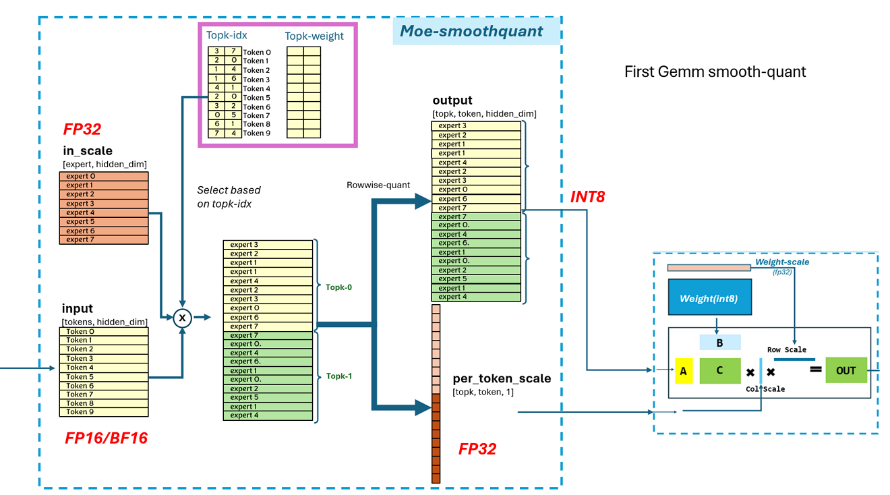

# moe-smoothquant

This folder contains example for moe-smoothquant using ck_tile tile-programming implementation.


Unlike standard smoothquant op, the input scale is from different expert `[expert, hidden]`, we need reuse the `topk-id` from previous `topk-softmax` and select the corresponding `expert` from current topk, and expand the output/per-token-scale by `topk`

## build
```
# in the root of ck_tile
mkdir build && cd build
sh ../script/cmake-ck-dev.sh  ../ <arch>  # you can replace this <arch> to gfx90a, gfx942...
make tile_example_moe_smoothquant -j`nproc`
```
This will result in an executable `build/bin/tile_example_moe_smoothquant`

## example
```
args:
          -t    tokens dimension (default:3328)
          -h    hidden_size dimension (default:4096)
          -e    experts (default:32)
          -k    topk (default:5)
     -stride    stride per row, if -1 then equal to hidden_size (default:-1)
          -v    cpu validation or not (default:1)
      -kname    print kernel name or not (default:1)
     -prec_i    input precision, fp16/bf16 (default:fp16)
     -prec_o    precision, int8/fp8 (default:int8)
     -warmup    cold iter (default:5)
     -repeat    hot iter (default:20)
       -json    0: No Json, 1: Dump Results in Json format (default:0)
   -jsonfile    json file name to dump results (default:moe_smoothquant.json)
```