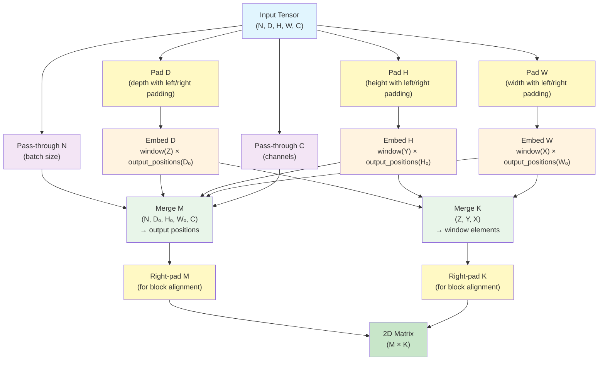

# Pooling Operator

This folder contains example for the pooling operator using ck_tile tile-programming implementation. Currently the pooling kernel only supports 2D and 3D pooling.

## Tensor Descriptor Transformations

The pooling kernel transforms the input tensor into 2D format suitable for reduction. This section explains the transformation pipeline for both 2D and 3D pooling operations.

### 3D Pooling Transformations

For 3D pooling, the input tensor has shape `(N, D, H, W, C)` where:
- `N`: batch size
- `D`: depth dimension  
- `H`: height dimension
- `W`: width dimension
- `C`: channel dimension

The transformations convert this 5D tensor into a 2D tensor where rows represent output positions (M) and columns represent pooling window elements (K).



**Transformation Steps:**
1. **Padding**: Apply left and right padding to spatial dimensions (D, H, W) to handle boundary conditions
2. **Sliding Windows**: Use embed transforms to create sliding windows across each spatial dimension, expanding each dimension into (window_size, output_positions)
3. **Reshaping**: Merge all dimensions into a 2D matrix where:
   - M dimension = N × Dₒ × Hₒ × Wₒ × C (total output positions)
   - K dimension = Z × Y × X (elements per pooling window)
4. **Block Alignment**: Apply right padding to ensure M and K dimensions are aligned to block size

### 2D Pooling Transformations

2D pooling follows the same transformation pipeline but operates on 4D tensors with shape `(N, H, W, C)`. The process is identical except:
- Only H and W dimensions are padded and embedded
- K dimension merges only (Y, X) window elements
- M dimension merges (N, Hₒ, Wₒ, C)

### Output Tensor Transformations

The output tensor transformations are simpler:
- Merge all output dimensions (N, Dₒ/Hₒ, Wₒ, C) into a single M dimension
- Apply right padding for block alignment
- The result is a 1D tensor that maps directly to the M dimension of the computation matrix

## build
```
# in the root of ck_tile
mkdir build && cd build
# you can replace <arch> with the appropriate architecture (for example gfx90a or gfx942) or leave it blank
../script/cmake-ck-dev.sh  ../ <arch>
# The 3D pooling example
make tile_example_pool3d -j`nproc`
```
This will result in an executable `build/bin/tile_example_pool3d`

## example
```
args:
          -N    batch size (default:2)
          -D    depth dimension (default:30)
          -H    height dimension (default:30)
          -W    width dimension (default:30)
          -C    channel dimension (default:32)
          -Z    pooling window depth (default:2)
          -Y    pooling window height (default:2)
          -X    pooling window width (default:2)
         -Sz    window stride depth (default:2)
         -Sy    window stride height (default:2)
         -Sx    window stride width (default:2)
         -Dz    window dilation depth (default:1)
         -Dy    window dilation height (default:1)
         -Dx    window dilation width (default:1)
     -LeftPz    left padding depth (default:1)
     -LeftPy    left padding height (default:1)
     -LeftPx    left padding width (default:1)
    -RightPz    right padding depth (default:1)
    -RightPy    right padding height (default:1)
    -RightPx    right padding width (default:1)
          -v    0: No validation, 1: CPU validation (default:1)
     -warmup    number of iterations before benchmark (default:0)
     -repeat    number of iterations to benchmark (default:1)
```
