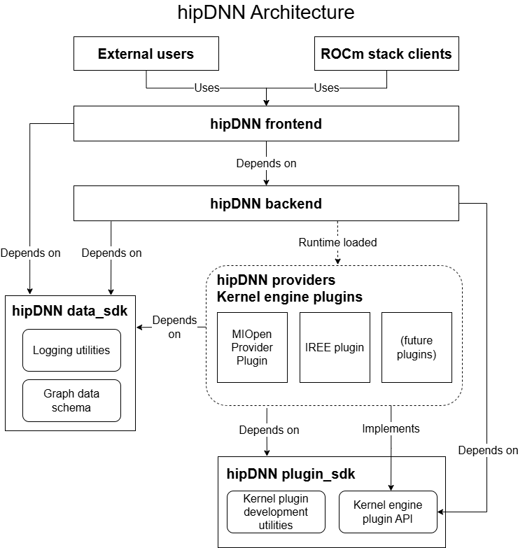

# hipDNN Design

> [!NOTE]
> 📝 We are in an early stage of development for hipDNN. This design is subject to change.

hipDNN is a graph-based deep learning library that enables multi-operation fusion for improved performance on AMD GPUs. It uses operation graphs as an intermediate representation to describe computations, allowing different backend engines to optimize and execute these graphs efficiently.

## Core Design Principles

- **Graph-based API**: Operations are expressed as computational graphs rather than individual function calls, enabling optimization opportunities
- **Plugin Architecture**: Backend kernel engines, and heuristics are implemented through plugins, allowing extensibility without modifying the core library
- **Performance through Fusion**: Multiple operations can be fused into single kernels for better performance
- **Engine Selection**: Heuristics will be implemented as plugins, allowing extensibility without modifying the core library, and benchmarking will be implemented as an extensible frontend API allowing customized engine selection logic
- **Industry Standard API**: Provides a familiar interface that matches established deep learning library conventions
- **No RTTI in public headers**: Public SDK headers (frontend, data_sdk, plugin_sdk) do not use `typeid`, `dynamic_cast`, or `dynamic_pointer_cast`. This allows consumers and plugins to compile with `-fno-rtti` (`/GR-` on MSVC) if desired. RTTI-free compilation is enforced in CI via the `HIPDNN_NO_RTTI_OPTIONS` CMake variable applied to the backend and select test targets.

## Memory Management

hipDNN adopts a caller-owned memory model:

1.  **Tensor Data**: The user is responsible for allocating and managing device memory for input and output tensors. These pointers are passed to the backend via the **Variant Pack**.
2.  **Workspace Memory**: Some graph executions require temporary scratch memory. The Backend calculates the required size during the Execution Plan phase (`HIPDNN_ATTR_EXECUTION_PLAN_WORKSPACE_SIZE`). The user must allocate this memory and pass the pointer during execution.
3.  **Host Memory**: API descriptors and graph structures manage their own host resources. Backend API users must explicitly destroy descriptors using `hipdnnBackendDestroyDescriptor`.

## Thread Safety

- **Library Handle (`hipdnnHandle_t`)**: This handle is **not thread-safe**. Users should create a unique handle for each thread or use external synchronization locks when sharing a handle across threads.
- **Descriptors**: Read-only access to finalized descriptors is thread-safe. Modifying a descriptor while it is being used in another thread is undefined behavior.

## High-Level Architecture

hipDNN has a plugin-based architecture in order to allow contributors and users to extend hipDNN without modifying the core library. Currently, hipDNN has support for engine plugins which provide the kernels to solve graphs. In the future hipDNN will support heuristic plugins to allow for improved automatic engine selection. Benchmarking with an extensible selection API will be added to the frontend to provide exhaustive tuning capabilities, but will require collecting samples from applicable engines to do so. Heuristic plugins will provide better default engine selection given a graph, and shouldn't require collecting samples from existing engines to do so.



### Components
**Frontend**: A header-only C++ library that provides the industry standard API for interacting with hipDNN. The frontend wraps the backend C API to provide a more user-friendly C++ interface.

**Backend**: A shared library which provides a C API for hipDNN. The backend is the core component of hipDNN which acts as a plugin loader and manager, connecting problems to plugins that can solve them.

**SDKs**: Header-only libraries that provide shared utilities and interfaces. hipDNN provides three SDKs: Data SDK (graph schemas and data structures), Plugin SDK (plugin API and utilities), and Test SDK (testing utilities and CPU reference implementations).

**Plugins**: Plugins will be added over time to provide additional operational support, or performance improvements. Plugins should be external projects to hipDNN.

## Component Details

### Error Handling Strategy

hipDNN uses a layered error handling approach designed to be robust across C/C++ boundaries:

1.  **Plugins**: Plugin entry points return `hipdnnPluginStatus_t` codes. Internal exceptions are caught at the plugin boundary and converted to status codes. Error strings are stored in thread-local storage via `PluginLastErrorManager`.
2.  **Backend (C API)**: All public API functions return `hipdnnStatus_t` codes. The backend catches any internal C++ exceptions, converts them to the appropriate status code, and stores the exception message. Users can retrieve descriptive error messages using `hipdnnGetLastErrorString`.
3.  **Frontend (C++ API)**: The C++ frontend checks `hipdnnStatus_t` codes from the backend. On failure, it retrieves the detailed error message via `hipdnnGetLastErrorString` and returns an `Error` object containing the error code and description. The frontend utilizes **value-based error handling** rather than throwing exceptions.

### SDKs

hipDNN provides three header-only SDK libraries that serve as the foundation for communication between different components.

#### Data SDK (`data_sdk`)

The Data SDK contains FlatBuffers schemas and data structures for graph representation.

- **Dependencies**: FlatBuffers
- **Purpose**: Provides data structures and serialization for graphs, tensors, and configurations
- **Expected Usage**: Consumed by Frontend, Backend, and Plugins for graph data handling
- **Core Functionality**:
  - FlatBuffer schema definitions for graphs, nodes, and attributes
  - Data structures for deserializing serialized graphs
  - Logging utilities and type helpers (half, bfloat16, etc.)

#### Plugin SDK (`plugin_sdk`)

The Plugin SDK contains the plugin API and utilities for creating engine plugins.

- **Dependencies**: Data SDK
- **Purpose**: Provides the interface and utilities for plugin development
- **Expected Usage**: Consumed by plugin projects
- **Core Functionality**:
  - Plugin API definitions (e.g., `hipdnnEnginePluginCreate`, `hipdnnEnginePluginExecuteOpGraph`)
  - Base classes for engine implementation
  - Utilities for plugin development

#### Test SDK (`test_sdk`)

The Test SDK provides utilities for testing plugins.

- **Dependencies**: Data SDK, Plugin SDK
- **Purpose**: Provides testing infrastructure for plugin validation
- **Expected Usage**: Consumed by plugin test suites
- **Core Functionality**:
  - CPU reference implementations for validation (convolution, batchnorm, etc.)
  - Test utilities (tolerances, seeds, logging)
  - Mock objects for unit testing

For the SDK development roadmap and planned features, see the [SDKs section in the Roadmap](./Roadmap.md#sdks).

### Frontend

The Frontend provides a user-friendly C++ interface to hipDNN, wrapping the lower-level C API provided by the Backend.

#### Key Characteristics
- **Header-only C++ library**: No compiled libraries, simplifying integration
- **Dependencies**: Backend and Data SDK
- **Purpose**: Provides easy to use API for accessing hipDNN backend
- **Expected Usage**: Consumed as a header-only dependency in user projects

#### Architecture Overview

##### Graph Class
The central abstraction in the Frontend is the `Graph` class, which:
- Manages the construction of operation graphs
- Handles the creation and configuration of nodes
- Orchestrates the execution workflow

##### Nodes
Nodes represent individual operations within a graph:
- Each node type (e.g., `BatchnormNode`, `PointwiseNode`) inherits from `INode`
- Nodes encapsulate their specific attributes and tensor connections
- Support lowering to backend descriptors for execution

##### Attributes
Attributes configure the behavior of nodes:
- Each node type has corresponding attribute classes (e.g., `Batchnorm_attributes`)
- Attributes include operation-specific parameters like epsilon, momentum, etc.
- Support builder pattern for easy configuration

#### Simplified Workflow Example
```cpp
// Create a graph
Graph graph;
graph.set_compute_data_type(DataType_t::FLOAT);

// Create tensors
auto x = Graph::tensor(/* tensor attributes */);
auto scale = Graph::tensor(/* tensor attributes */);
auto bias = Graph::tensor(/* tensor attributes */);

// Add operations
auto [y, mean, inv_var, _, _] = graph.batchnorm(x, scale, bias, bn_attributes);

// Build and execute
graph.build_operation_graph(handle);
graph.create_execution_plans();
graph.build_plans();
graph.execute(handle, variant_pack, workspace);
```

For complete working examples, see the official [samples](../samples/).

### Backend

The Backend is the core engine of hipDNN, responsible for managing plugins and orchestrating graph execution.

#### Key Characteristics
- **Installable library**: C API with ABI for language interoperability, dynamically loadable
- **Dependencies**: Data SDK
- **Purpose**: Provides a stable graph based API for describing kernel fusions
- **Expected Usage**: Library linked to the frontend API and expert user projects that provides access to the hipDNN backend API

#### Descriptor Types

The Backend uses descriptors as opaque handles to manage different aspects of graph execution:

##### 1. Operation Graph Descriptor (`HIPDNN_BACKEND_OPERATIONGRAPH_DESCRIPTOR`)
- Represents the computational graph to be executed
- Contains nodes, tensors, and their connections
- Created from serialized graph data or frontend graph lowering

##### 2. Engine Heuristic Descriptor (`HIPDNN_BACKEND_ENGINEHEUR_DESCRIPTOR`)
- Manages the selection of appropriate engines for a graph
- Queries plugins for applicable engines
- Extensible plugin design to control engine selection

##### 3. Engine Config Descriptor (`HIPDNN_BACKEND_ENGINECFG_DESCRIPTOR`)
- Represents a specific engine configuration
- Contains engine ID and configuration parameters
- Retrieved from heuristic results

##### 4. Engine Descriptor (`HIPDNN_BACKEND_ENGINE_DESCRIPTOR`)
- Represents a backend engine
- Contains engine ID, and a set of behavioral notes + configurable settings
- Retrieved from engine config Descriptor

##### 5. Execution Plan Descriptor (`HIPDNN_BACKEND_EXECUTION_PLAN_DESCRIPTOR`)
- Combines an engine configuration with a graph
- Manages workspace requirements
- Prepares for actual execution

##### 6. Variant Pack Descriptor (`HIPDNN_BACKEND_VARIANT_PACK_DESCRIPTOR`)
- Contains runtime data for execution
- Maps tensor UIDs to device memory pointers
- Includes workspace device memory pointer

#### Expected Workflow

1. **Create a Graph**: Build an operation graph using Frontend
2. **Create Heuristic Descriptor**: Initialize with the graph and desired heuristic mode
3. **Get Engine Configs**: Query available engine configurations from the heuristic
4. **Create Execution Plan**: Combine selected engine config with the graph
5. **Run Execution Plan**: Execute with variant pack containing tensor data

```c
// Simplified Backend workflow
hipdnnBackendDescriptor_t graph_desc, heuristic_desc, config_desc, plan_desc, variant_desc;

// 1. Create graph (from serialized data)
hipdnnBackendCreateAndDeserializeGraph_ext(&graph_desc, serialized_graph, size);

// 2. Create and configure heuristic
hipdnnBackendCreateDescriptor(HIPDNN_BACKEND_ENGINEHEUR_DESCRIPTOR, &heuristic_desc);
hipdnnBackendSetAttribute(heuristic_desc, HIPDNN_ATTR_ENGINEHEUR_OPERATION_GRAPH, ...);
hipdnnBackendFinalize(heuristic_desc);

// 3. Get engine configurations
hipdnnBackendGetAttribute(heuristic_desc, HIPDNN_ATTR_ENGINEHEUR_RESULTS, ...);

// 4. Create execution plan
hipdnnBackendCreateDescriptor(HIPDNN_BACKEND_EXECUTION_PLAN_DESCRIPTOR, &plan_desc);
hipdnnBackendSetAttribute(plan_desc, HIPDNN_ATTR_EXECUTION_PLAN_ENGINE_CONFIG, ...);
hipdnnBackendFinalize(plan_desc);

// 5. Execute
hipdnnBackendExecute(handle, plan_desc, variant_desc);
```

For the backend development roadmap and planned features, see the [Backend section in the Roadmap](./Roadmap.md#backend).

### Engine Plugins

Engine plugins provide the actual computational implementations for hipDNN graphs.

#### Key Characteristics
- **Separate installable projects**: Independent development and deployment
- **Dependencies**: Data SDK, Plugin SDK (and plugin-specific dependencies as needed)
- **Purpose**: Provides engines which are capable of solving graphs
- **Expected Usage**: Loaded at runtime by hipDNN backend

#### Plugin Architecture

##### Plugin Loading
- Backend discovers plugins at runtime via the default plugin path, or by using `hipdnnSetEnginePluginPaths_ext` to provide additional paths to load plugins from
- Each plugin exports standard entry points defined in the Plugin SDK

##### Engine Management
- Each plugin can provide multiple engines
- Engines must have globally unique IDs that remain constant run to run
- Plugins determine which engines are applicable for a given graph

##### Key Plugin Functions
```c
// Get all available engine IDs
hipdnnEnginePluginGetAllEngineIds(engine_ids, max_engines, num_engines);

// Check which engines can solve a graph
hipdnnEnginePluginGetApplicableEngineIds(handle, graph, engine_ids, max, num);

// Create execution context for a specific engine
hipdnnEnginePluginCreateExecutionContext(handle, config, graph, context);

// Execute the graph
hipdnnEnginePluginExecuteOpGraph(handle, context, workspace, buffers, num_buffers);
```

#### Engine Plugin Types

##### 1. Static Kernel Engines
- Provide pre-compiled kernels for specific operations
- Narrow support: Only handle specific configurations
- Example: MIOpen Provider Plugin
- **Advantages:**
  - Highly optimized for supported cases
  - Predictable performance
  - Lower compilation overhead

##### 2. Dynamic Kernel Engines
- Generate kernels at runtime based on graph structure
- Broad support: Handle general graph patterns
- Example: Future JIT-compilation plugins
- **Advantages:**
  - Flexible operation fusion
  - Support for novel graph patterns
  - Adaptable to hardware capabilities

See [Plugin Development](./PluginDevelopment.md) for advanced information on developing and using plugins.

### Reference Implementation: CPU Graph Executor
The CPU Graph Executor is a reference graph execution implementation build for graph verification and testing. See the [CPU Graph Executor Design Document](./rfcs/0001_CpuGraphExecutorDesign.md) for more details.
