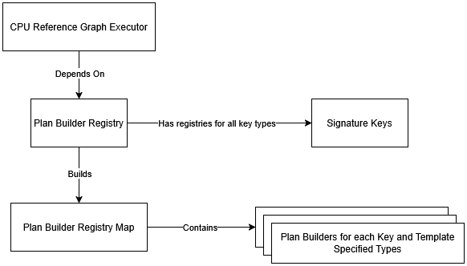
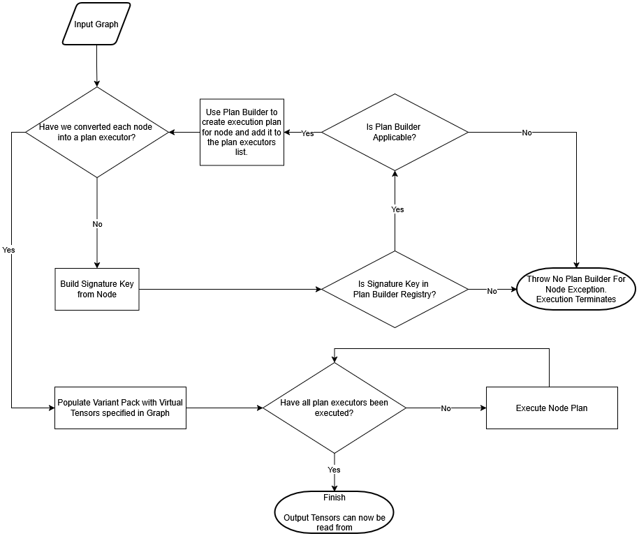

# CPU Graph Executor Design Document

## Table of Contents
1. [Executive Summary](#executive-summary)
2. [System Overview](#system-overview)
3. [Architecture Components](#architecture-components)
4. [Plan Builders](#plan-builders)
5. [Signature Key System](#signature-key-system)
6. [Registry Mechanism](#registry-mechanism)
7. [Execution Flow](#execution-flow)
8. [Supported Operations](#supported-operations)
9. [Extension Guidelines](#extension-guidelines)
10. [Performance & Usage Considerations](#performance--usage-considerations)
11. [Future Work](#future-work)

## Executive Summary

The CPU Graph Executor is a reference implementation system designed to execute computational graphs on CPU for testing and validation purposes within the hipDNN project. It provides a flexible, extensible architecture for executing various deep learning operations including BatchNormalization, Convolution, and Pointwise operations.

### Purpose
- **Reference Implementation**: Provides ground-truth results for validating GPU implementations
- **Testing Infrastructure**: Enables comprehensive testing of graph execution
- **Extensibility**: Supports easy addition of new operations through a plugin-like architecture
- **Type Safety**: Uses C++ templates to ensure compile-time type checking
- **Sequential Operation**: Executes operations sequentially in topological order

## System Overview

The CPU Graph Executor follows a modular architecture pattern with clear separation of concerns:



## Architecture Components

### Core Interfaces

#### IGraphNodePlanBuilder
- **Purpose**: Interface for creating execution plans for graph nodes
- **Methods**:
  - `isApplicable()`: Checks if builder can handle a specific node
  - `buildNodePlan()`: Creates an IGraphNodePlanExecutor for the node

#### IGraphNodePlanExecutor
- **Purpose**: Interface for executing plans with tensor data. Each plan executor is specialized for a specific operation and data type combination.
- **Methods**:
  - `execute()`: Executes the plan with provided tensor data

### Main Components

#### CpuReferenceGraphExecutor
- **Purpose**: Main orchestrator for executing computational graphs on CPU
- **Members**:
    - `_planRegistry`: Registry for looking up plan builders
- **Methods**:
    - `execute()`: Executes a graph from serialized buffer with tensor data
    - `buildPlanForNode()`: Creates execution plan for a single graph node
    - `buildSignatureKey()`: Generates signature key from node attributes
    - `populateVariantPackWithMissingVirtualTensors()`: Allocates temporary tensors

#### PlanBuilderRegistry
- **Purpose**: Central registry mapping signature keys to plan builders
- **Members**:
    - `_registry`: Map of signature keys to plan builders
    - `_initialized`: Lazy initialization flag
- **Methods**:
    - `getPlanBuilder()`: Retrieves appropriate builder for a signature key
    - `initializeRegistry()`: Performs one-time registry setup
    - `initializePlanBuilders()`: Registers all supported operation builders
    - `registerBuilder()`: Template method to register builder types

## Plan Builders

Plan Builders are instantiated for each supported operation & data type combination. All plan builders are then stored in the PlanBuilderRegistry for lookup during graph execution.

### Plan Builder Template-Based Type Safety

Each plan builder uses templates to ensure type safety:

```cpp
template <typename InputDataType,
          typename ScaleBiasDataType,
          typename MeanVarianceDataType,
          typename ComputeDataType>
class BatchnormBwdPlan : public IGraphNodePlanExecutor
```

## Signature Key System

The Signature Key system provides unique identification for operation configurations:

```
┌─────────────────────────────────────────────────────────────┐
│                  PlanRegistrySignatureKey                   │
│                        (Variant)                            │
├─────────────────────────────────────────────────────────────┤
│  - BatchnormFwdInferenceSignatureKey                        │
│  - BatchnormBwdSignatureKey                                 │
│  - BatchnormTrainSignatureKey                               │
│  - ConvolutionFwdSignatureKey                               │
│  - ConvolutionBwdSignatureKey                               │
│  - ConvolutionWrwSignatureKey                               │
│  - PointwiseSignatureKey                                    |
|  - ...                                                      │
└─────────────────────────────────────────────────────────────┘
```

### Signature Key Requirements
Each signature key must implement:
1. **Constructor from Node**: Build from `Node` and `tensorMap` for runtime graph parsing
2. **Constructor from Datatypes**: Build from base datatypes for direct instantiation
2. **hashSelf()**: Generate unique hash
3. **Equality operator**: Compare keys
4. **getPlanBuilders()**: Return map of supported builder types for this key

## Registry Mechanism

The registry provides a centralized mapping of signature keys to plan builders.

```
┌──────────────────────────────────────────────┐
│         _registry (PlanRegistryMap)          │
├──────────────────────────────────────────────┤
│  Key: PlanRegistrySignatureKey               │
│  Value: unique_ptr<IGraphNodePlanBuilder>    │
└──────────────────────────────────────────────┘
```
Runtime Registration Process:
1. The registry initializes on first access
2. Each signature key defines its supported plan builders, these are queried and registered during initialization
3. Builders are mapped to unique signature keys

## Execution Flow

The complete execution flow from graph input to results:


## Supported Operations

The CPU Reference Implementation supports a comprehensive set of deep learning operations for testing and validation purposes, including:
- **BatchNormalization**: Forward (training/inference modes) and backward operations
- **Convolution**: Forward pass, data gradients, and weight gradients
- **Pointwise**: Unary and binary element-wise operations (activations, arithmetic)

For a complete list of supported operations, datatypes, and layouts, please refer to the [CPU Reference Implementation Operation Support](../OperationSupport-ReferenceImpl.md) document.

## Extension Guidelines

### Adding a New Operation

To add support for a new operation, follow these steps:

#### 1. Create Plan Executor
```cpp
template <typename DataType>
class MyOperationPlan : public IGraphNodePlanExecutor {
public:
    void execute(const std::unordered_map<int64_t, void*>& variantPack) override {
        // Implementation
    }
};
```

#### 2. Create Plan Builder
```cpp
template <DataType DataTypeEnum>
class MyOperationPlanBuilder : public IGraphNodePlanBuilder {
public:
    bool isApplicable(...) const override { /* ... */ }
    std::unique_ptr<IGraphNodePlanExecutor> buildNodePlan(...) const override { /* ... */ }
};
```

#### 3. Create Signature Key
```cpp
class MyOperationSignatureKey {
public:
    MyOperationSignatureKey(DataType dataType1, DataType dataType2, /* ... */);
    MyOperationSignatureKey(const Node& node, const std::unordered_map<int64_t, const hipdnn_data_sdk::data_objects::TensorAttributes*>& tensorMap);
    size_t hashSelf() const;
    bool operator==(const MyOperationSignatureKey& other) const;
    static std::unordered_map<MyOperationSignatureKey,
                              std::unique_ptr<IGraphNodePlanBuilder>,
                              MyOperationSignatureKey> getPlanBuilders();
};
```

#### 4. Update Registry Variant
Add the new signature key to `PlanRegistrySignatureKey` variant:
```cpp
using PlanRegistrySignatureKey = std::variant<
    // ... existing keys ...
    MyOperationSignatureKey
>;
```

#### 5. Update Graph Executor
Add case to `buildSignatureKey()` method in `CpuReferenceGraphExecutor`:
```cpp
case NodeAttributes::MyOperationAttributes:
    return MyOperationSignatureKey(node, tensorMap);
```

#### 6. Test the New Operation
- Create unit tests to validate all newly added classes
- Add tests for the operation to the TestCpuReferenceGraphExecutor suite

### Adding a New Data Type for an Existing Operation
Find the existing signature key for the operation and add a new plan builder mapping in `getPlanBuilders()`.
```cpp
static std::unordered_map<MyOperationSignatureKey,
                          std::unique_ptr<IGraphNodePlanBuilder>,
                          MyOperationSignatureKey>
        getPlanBuilders()
{
    //existing mappings...
    addPlanBuilder<DataType::NewType>(map);
    return map;
}
```

### Best Practices

1. **Type Safety**: Use templates to ensure compile-time type checking
2. **Validation**: Implement thorough validation in `isApplicable()`
3. **Error Handling**: Provide clear error messages for unsupported configurations
4. **Testing**: Create comprehensive unit tests for new operations

## Performance & Usage Considerations

While the CPU Graph Executor is primarily for reference and testing:

1. **Memory Management**: Virtual tensors are allocated on-demand
2. **Sequential Execution**: Operations execute in topological order
3. **Type Specialization**: Templates enable different typed implementations
4. **Usability**: Designed to operate using the same API as hipdnn backend so a single graph can be built and used for the real and reference executors interchangeably.
5. **Performance**: Not performance optimized

## Future Work

1. **GPU Reference Executor**: Extend to support GPU reference execution
