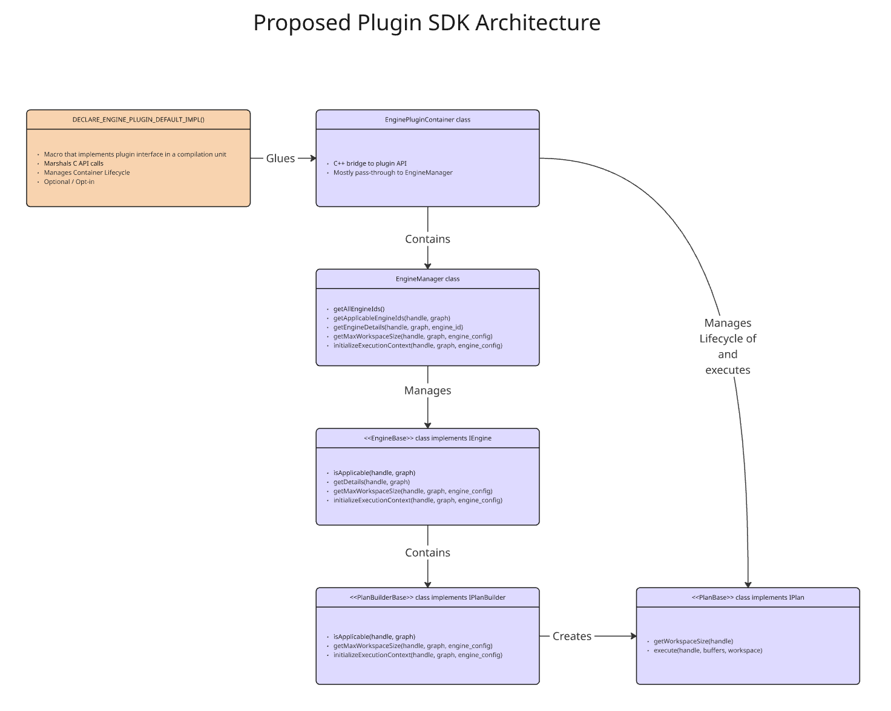

# hipDNN - Plugin SDK Design Document

- Contributors: Mitch Ousdahl, Sam Reeder, Adam Dickin
- Original Implementation: Adam Dickin

## Table of Contents
1. [Executive Summary](#1-executive-summary)
2. [Problem Statement](#2-problem-statement)
3. [Current System Overview](#3-current-system-overview)
4. [Proposed Design](#4-proposed-design)
5. [Key Design Decisions](#5-key-design-decisions)
6. [Risks](#6-risks)
7. [Execution Plan](#7-execution-plan)
8. [Testing Plan](#8-testing-plan)
9. [Future Considerations](#9-future-considerations)
9. [Glossary](#10-glossary)

## 1. Executive Summary
hipDNN represents a system for the validation and execution of complex graphs of tensor operations that can be expressed as a directed acyclic graph (DAG). Rather than directly include engines that can capably execute those graphs directly in hipDNN code, hipDNN has implemented a plugin mechanism wherein engine authors can fulfill a simple C-compatible API with the goal of generating a dynamic plugin library. This allows the system the capability for flexibility without recompilation, allows for future growth, and allows for a robust ecosystem of engine providers.

This proposal describes two pieces of work.

The first is to split the **Plugin SDK** from our existing **SDK**, with the eventual goal of making the original SDK a **Data SDK** that describes the data contract between the frontend and backend of hipDNN. The **Plugin SDK** will be solely to aid authors of plugins.

The second part of the proposal is for the design of an optional framework that will assist a hipDNN plugin developer to quickly and reliably create an engine plugin for hipDNN.

Currently, a basic shared-library C-compatible API for plugins has been defined by PluginApi.h. While plugin developers will be free to implement their plugins using solely this API, a set of helpful classes can provide some basic structure that will allow developers to:
- bootstrap a new engine plugin quickly
- provide mechanical guidance and guardrails
- create a comfortable object-oriented abstraction

## 2. Problem Statement
The C-compatible engine plugin API is certainly suggestive of certain concepts and patterns, such as Engines, Workspaces, Engine Configs, and Execution Contexts, but it can be somewhat opaque in how those plugin entry points relate to one another. What is the recommended life-cycle of an engine? Or an execution plan?

While the proposed design isn't meant to be prescriptive, it should work either as a direct implementation aid (using the classes directly) or a documentation aid (these classes suggest how an engine plugin is used by hipDNN).

## 3. Current System Overview
The hipDNN framework consists of a frontend (C++ Graph API), a backend (core runtime), and a plugin system. The backend prepares and dispatches execution to dynamically loaded plugins via a C-API interface.

The following diagram demonstrates how frontend calls pass through the backend and ultimately get handled by an engine plugin.  The call-stack demonstrated isn't exhaustive, it's mostly to illustrate the entry / exit points for each layer.  Our current implementation of the MIOpen plugin is overlayed to demonstrate how a plugin might implement the plugin interface.  The proposed plugin SDK will be an engine agnostic version of this existing design.

### 3.1 Object Lifetimes
For the plugin, there's a comment on `std::weak_ptr<MiopenContainer>` in [MiopenPlugin.cpp](../../../../dnn-providers/miopen-provider/MiopenPlugin.cpp) that describes why the weak_ptr / shared_ptr for the container exists.

To summarize, it's so that if the plugin is opened more than once, the container can be shared, but the container gets cleaned up if that last plugin ref drops off.

However, as the thread note indicates, that means that multiple threads can be accessing the container, the engine manager, the engines, and the plan builders.

Due to this, the backend maintains a lifecycle for two types of objects (with corresponding create / destroy calls in the plugin).
    - Plugin handle - This gets created when the plugin is intialized.  It is an opaque pointer, so plugin authors would typically use it for storing things like device state, and any further implementation handles (such as MIOpen's handles in the example of the MIOpen plugin)
    - Execution Context - This gets created when a plan gets finalized.  It is another opaque pointer, allowing plugin authors to store state relevant to plans.

### 3.2 Multi-Threading
Shared library files aren't reloaded by `dlopen` calls from different threads, which means that multiple threads can be accessing the proposed objects below from multiple threads at the same time.  Given that, plugin containers, engine managers, and plan builders should either be stateless or use thread-safe objects with locking around any stored state.

### MIOpen Provider Plugin Architecture

The MIOpen Provider Plugin serves as the kernel provider. It employs a modular C++ architecture, largely decoupled from the API layer.

*   **Dependency Injection Container (`MiopenContainer`):**
    This is the root object that manages the lifecycle and dependencies of all other components. It initializes the `EngineManager` and ensures that all necessary services are correctly injected.

*   **Engine Manager (`EngineManager`):**
    The central registry for execution engines. It orchestrates the selection of the appropriate engine for a given operation graph by querying its registered engines.

*   **Plan Builders (`IPlanBuilder`):**
    Each engine is associated with a set of Plan Builders. These components are responsible for:
    *   **Applicability:** Inspecting an operation graph to determine if the engine can execute it.
    *   **Resource Estimation:** Calculating the required workspace size.
    *   **Plan Construction:** Creating an executable `IPlan` object if the graph is supported.

*   **Plans (`IPlan`):**
    An `IPlan` represents a strategy for executing a specific operation graph. It encapsulates all the necessary logic and state to run the routine, abstracting the details from the higher-level engine management.

*   **C-API Interface:**
    A thin translation layer that exposes these internal C++ components to the backend via the required engine plugin C-API.

### Execution Flow

When the backend requests a graph execution, the flow within the plugin is as follows:

1.  **Ingestion:** The C-API bridge receives the raw graph handle and forwards it to the `MiopenContainer`.
2.  **Selection:** The `EngineManager` iterates through registered engines to find a candidate.
3.  **Compilation:** The selected Engine's `PlanBuilder` validates the graph and constructs an `IPlan`.
4.  **Execution:** The `IPlan` executes the operation, marshaling pointers from the backend's `VariantPack` to the underlying device kernels.

This architecture effectively separates the plugin interface from the engine implementation details. However, currently, this infrastructure is largely internal to the MIOpen plugin. The goal of the Plugin SDK is to standardize and provide these as reusable components for plugin development, so developers can focus on the implementations of the underlying kernels and libraries.

## 4. Proposed Design

Here is a rough diagram of the proposed SDK architecture, representing a macro and a hierarchy of classes.

### 4.1 Macro: `DECLARE_ENGINE_PLUGIN_DEFAULT_IMPL()`

There will be a macro (or a .inl file that gets #included) that declares all the engine plugin API entry points and glues them to an [EnginePluginContainer](#42-engineplugincontainer). It will be entirely optional and opt-in. If an engine plugin doesn't want to use them, they're free to implement the entry points themselves.

These default entry points will do the work of marshaling data between the C interface and the C++ `EnginePluginContainer` that handles the implementation of the interface. It'll do things like copy vectors to contiguous memory, wrap flatbuffer graphs and manage the default `EnginePluginContainer` lifecycle.

- **Arguments:** If the user wants to specify a custom class derived from `EnginePluginContainer`, they can do so, otherwise the default implementation will be used.

### 4.2 Class: `EnginePluginContainer`

This class encapsulates the lifecycle of an engine plugin from `hipdnnEnginePluginCreate()` to `hipdnnEnginePluginDestroy()`.

- **Lifecycle:** The default implementation will be an instance that is shared amongst plugin invocations and attached to the plugin handle via `shared_ptr`. A `weak_ptr` at global scope can be used to allow subsequent invocations of `hipdnnEnginePluginCreate()` to make an additional shared copy of the `EnginePluginContainer`. When the last `shared_ptr` of this class is destroyed (via destruction of the plugin handle), the `weak_ptr` ensures that the memory isn't held unnecessarily.

- **Methods:** The class will basically act as a C++ bridge to the plugin API. Each API call will have a corresponding method on it in `EnginePluginContainer`. Many of them will be passed through to an underlying `EngineManager`.
    - One slight deviation, the execution context lifecycle functions and the execute method will be handled directly in this class without passing through to EngineManager, since the execution context has an IPlan attached to it, and the EnginePluginContainer therefore has enough information to manage it without intervention.

- **Members:**
    - A private `EngineManager`

### 4.3 Class: `EngineManager`
This represents the collection of all engines that can be found in the plugin. This class is a private member of the `EnginePluginContainer`, and shares a lifespan with it.

- **Methods:** The class will implement the following:
    - `static vector<int64_t> getAllEngineIds()` - Returns a list of all engines managed by this `EngineManager`
    - `static vector<int64_t> getApplicableEngineIds(handle, graph)` - Returns a list of all engines that can handle the supplied graph
    - `engine_details getEngineDetails(handle, graph, engine_id)` - Pass-through to the engine indicated by `engine_id`
    - `size_t getMaxWorkspaceSize(handle, graph, engine_config)` - Pass-through to the engine indicated by `engine_id` from the engine_config
    - `execution_context initializeExecutionContext(handle, graph, engine_config)` - Pass-through to the engine indicated by `engine_id`

- **Members:**
    - A container of several `IEngine`-derived class instances.

### 4.4 Class: `EngineBase` (implements `IEngine` interface)
This represents an engine that can handle one or more graphs of operations.

For example, a `BatchNormEngine` might be able to handle single-op and simple fused graphs that contain batchnorm operations.

*Note:* You probably don't want to have an massive amount of engines in your plugin.  The plugin is responsible for choosing its solution given a graph, and without sampling.  The plan should be finalized and ready to go by execution time, which is when device pointers are available.

- **Lifecycle:**
    - The engines typically have the same lifecycle as the `EngineManager` that contains them.
    - The `engine_details` returned by `getDetails()` has explicit create/destroy entry-points in the plugin.
    - The `execution_plan` created by `initializeExecutionContext()` also has explicit create/destroy entry-points in the plugin.
    - Since engine_details and the execution_plan are "owned" by the plugin consumer, the EnginePluginContainer is sufficient to manage their cleanup during their destroy api calls.

- **Methods:** The class will implement the following:
    - `bool isApplicable(handle, graph)` - Returns true if this engine can handle the supplied graph. Typically it would do this by checking all its plan builders.
        - *Note:* only a single plan builder can be provided per engine. If multiple plan-builders have overlapping graph support, then it's up to the plugin implementor to decide on how to handle this selection. Two possible options could be splitting these plan builders up into multiple different engines, or having a priority selection system.
    - `engine_details getDetails(handle, graph)` - Returns details about this engine
    - `size_t getMaxWorkspaceSize(handle, graph, engine_config)` - Pass-through to the plan builders that are applicable, taking the Max of all workspaces queried (typically only one should be applicable for a given graph).
    - `execution_context initializeExecutionContext(handle, graph, engine_config)` - Pass-through to the appropriate plan builder.
        - *Note:* It's expected that only one plan builder will ever be applicable, and it's up to the plugin author to either split things up into more engines, or have some mechanism for choosing between plan builders if multiple plan builders are applicable.

- **Future Considerations:** Eventually engines will have behavioral notes (that will live in engine details) and settings (that will live in engine config)  This functionality is stubbed in somewhat for the future, but further work will need to be done here when those features land. Plugin authors will need to split their engines into groupings that have the same behavioral notes, and support similar engine configurations.

- **Members:**
    - A container of several `IPlanBuilder`-derived class instances.

### 4.5 Class: `PlanBuilderBase` (implements `IPlanBuilder` interface)
This represents a plan builder that can handle a specific graph of operations.

In the above example, a single `PlanBuilder` can handle a single batchnorm forward operation, while another might be able to handle batchnorm + activation.

- **Methods:** The class will implement the following:
    - `bool isApplicable(handle, graph)` - Returns true if this plan builder can handle this graph
    - `size_t getMaxWorkspaceSize(handle, graph, engine_config)` - Returns the maximum workspace required for the supplied graph
    - `execution_context initializeExecutionContext(handle, graph, engine_config)` - Creates an instance of an `IPlan`-derived class and attaches it to the execution context

### 4.6 Class: `PlanBase` (implements `IPlan` interface)
This class represents a ready-to-execute plan that can take device data and then execute the desired operations on it.

- **Lifecycle:** The plans typically share a lifespan with the `execution_context` they are attached to.  Since the plan is immutable after the point of creation, its lifecycle and execution can be safely handled by the EnginePluginContainer.

- **Methods:** The class will implement the following:
    - `size_t getWorkspaceSize(handle)` - Returns the workspace required for this plan
    - `void execute(handle, buffers, workspace)` - Executes the plan as built by the `IPlanBuilder` that created it

- **Members:** Since a plan gets attached to an execution context, it can have internal state.

### 4.7 Threading and Lifecycle Notes

Above of the plugin there are a few objects that have lifecycles managed by the backend / frontend.  They are usually opaque data tied to handles / descriptors which means that it's up to the plugin authors how they are used, but below are some examples of how they might be used in a plugin.

- **Plugin Handle:** Created with explicit create / destroy methods, this is an opaque pointer to an object ultimately defined by the plugin author.  It can be used to tie information from invocations of a plugin to other resources.  In the MIOpen plugin, for example, the handle contains a reference to EnginePluginContainer and a pointer to the stream passed into setStream calls.  This handle is usually created when a plugin is loaded during initialization.
    - *Note:* Care should be taken since that the handle that's used during plugin creation may not be the same as the one used during plan execution.  What this means, for example, is that a plugin may be instantiated and a plan created on one thread, for example, and then executed on a completely separate thread under the context of a different plugin handle.  So it would be unhelpful, for example, to store cache artifacts for plan exeuction on a plugin handle.

- **Engine Details:** Created when the framework requests engine details from the plugin.  The lifespan is controlled by the consuming application.

- **Execution Context:** Created when the framework creates an execution plan.  A typically use for this object is to attach an IPlan for it.  An execution plan represents a "finalized" plan, and is meant to be immutable and can be re-used with different device buffers.  The lifespan is controlled by the consuming application.

For threading purposes, be mindful that any object might be accessed from multiple threads.  For example, an execution context might be created and then passed to multiple threads with their own device buffers.  Just be mindful when adding members to classes like Engines, EngineManagers, EnginePluginContainers, etc. that you'll have to potentially protect any mutable state from unsafe thread access.  The easiest way to manage this is to keep these objects as stateless as possible, but that's a guideline, not a prohibition.

Future considerations will be adding the ability to have thread-safe containers and objects that would allow a plugin creator to easily implement thread-safe caches and other utilities.

### 4.7 Error Handling
Error handling will make use of C++ exceptions primarily, with the understanding that they will be transitioned into error codes at the C API interface.

## 5. Key Design Decisions
- Opt-in glue code via macros
- A single-instanced container
- Stateless classes for thread safety
- Use of wrappers and glue code to hide the details of the C API and provide a cleaner C++ interface for plugin writing

## 6. Risks
- **Plugin API Breaking Changes**: If the C-API interface needs to evolve during implementation, existing plugins may require updates, creating compatibility issues.  We have a future RFC incoming around how to safely handle versioning and ABI breaks.
- **Thread Safety Complexity**: While the design aims for stateless classes, ensuring thread safety across multiple plugin invocations and shared containers introduces potential race conditions and debugging challenges
- **Performance Overhead**: The additional abstraction layers (container → manager → engine → plan builder → plan) may introduce latency compared to direct C-API implementations
- **Adoption Risk**: Plugin developers may choose to bypass the SDK framework and implement directly against the C-API, reducing the value of this abstraction layer
- **Memory Management**: Shared/weak pointer lifecycle management across plugin boundaries and multiple threads could lead to memory leaks or premature destruction
- **Testing Coverage**: The complexity of multi-threaded, multi-plugin scenarios makes comprehensive testing challenging, potentially missing edge cases
- **Migration Complexity**: Moving existing MIOpen plugin to the new architecture risks introducing regressions while maintaining backward compatibility
- **Ecosystem Fragmentation**: Having both SDK and Plugin SDK may confuse developers about which components to use for different scenarios.  We will mitigate this by renaming the sdk to data_sdk in an upcoming effort.

## 7. Execution Plan
- Create blank `plugin_sdk`
    - Wait for TheRock submodule bump (TheRock is the CI/build infrastructure for ROCm libraries)
    - Update TheRock to add the the plugin_sdk component
    - Update rocm-libraries to use the new TheRock CI hash to have the merged changes from step #1
    - Changes in rocm-libraries to use the new artifacts
- Migrate `sdk/plugin` code to `plugin_sdk`
    - Establish `hipdnn_plugin_sdk` namespace
    - Modify consuming `CMakeLists.txt` to add required `plugin_sdk` dependencies and remove unnecessary `sdk` transitive dependencies
    - Modify consuming code to use the utilities from the new namespaces and the new include location
- Write new plugin helpers
- Migrate existing MIOpen plugin to consume the new plugin helpers
- Migrate existing MIOpen unit tests
- Write a reference CPU plugin that consumes the new plugin helpers

## 8. Testing Plan
- Execute existing MIOpen plugin unit tests
- Execute existing MIOpen plugin integration tests
- Execute new plugin helper unit tests
- Multi-threaded testing to verify thread safety of stateless components
- Performance benchmarking to measure overhead of abstraction layers
- Memory leak detection using valgrind or similar tools

## 9. Future Considerations
- Behavioral notes will be added to the engine_details.
    - These are which are tags which will identify certain engine characteristics used for filtering
    - The behavorial notes on engines are controlled by plugin authors
- Engine config settings which allow the user to control the behavior of the engine
    - The available settings, and value ranges are controlled by plugin authors
- Serialization of execution plans

## 10. Glossary

- **DAG (Directed Acyclic Graph)**: A graph structure representing tensor operations where edges indicate data flow and no cycles exist
- **Engine**: A component capable of executing one or more types of operation graphs
- **Engine Config**: Configuration parameters that specify how an engine should execute a particular graph
- **Execution Context**: Runtime state and resources needed to execute a specific plan
- **Execution Plan**: A compiled, ready-to-execute representation of an operation graph for a specific engine
- **Plan Builder**: A component responsible for determining if an engine can handle a graph and constructing execution plans
- **Plugin**: A dynamically loaded library that provides engine implementations via the hipDNN plugin API
- **TheRock**: The CI/build infrastructure system for ROCm libraries
- **Workspace**: Temporary memory buffer required by an engine to execute operations
