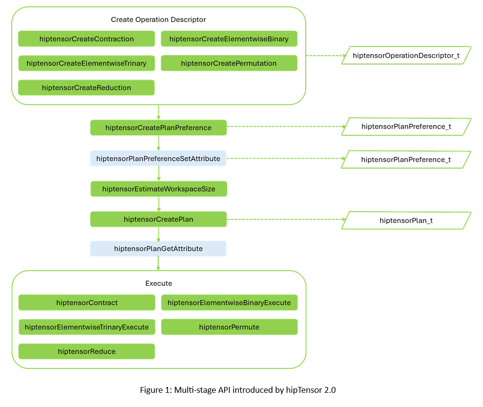

.. meta::
   :description: A high-performance HIP library for tensor primitives
   :keywords: hipTensor, cuTensor, ROCm, library, API, tool

.. _Transition to hipTensor 2.0:

=============================
Transition to hipTensor 2.0
=============================

This document provides an overview of the key features and architecture of the updated hipTensor 2.0 API, highlights the primary differences between versions 1.x and 2.0, and guides you through the process of migrating your existing code to the new API.

--------------------------------
Overview
--------------------------------

hipTensor 2.0 features a multi-stage API for all supported operations, as shown in Figure 1. The main stages include creating an operation descriptor, restricting kernel space, planning (kernel selection), and execution, with optional stages shown in grey.

This new structure combines all supported operations which include contractions, reductions, elementwise, and permutation into a single ``hiptensorOperationDescriptor_t`` object, enabling a consistent execution process. The updated API also allows querying the plan to determine the exact workspace size required by the operation, minimizing applications' memory usage.

--------------------------------
Key differences
--------------------------------

The main differences between the 1.x and the new 2.0 API include:

* ``hipDataType`` -> `hiptensorDataType_t <../api-reference/api-reference.html#hiptensordatatype-t>`_. For example, HIP_R_32F -> HIPTENSOR_R_32F.
* ``hiptensorComputeType_t`` -> `hiptensorComputeDescriptor_t <../api-reference/api-reference.html#hiptensorcomputedescriptor-t>`_. For example, HIPTENSOR_COMPUTE_32F -> HIPTENSOR_COMPUTE_DESC_32F.

  .. note::

     The previously deprecated compute types ``HIPTENSOR_R_MIN`` and ``HIPTENSOR_C_MIN`` have been removed.

* ``hiptensorInitTensorDescriptor`` -> `hiptensorCreateTensorDescriptor() <../api-reference/api-reference.html#hiptensorcreatetensordescriptor>`_
* ``hiptensorContractionDescriptor_t`` -> `hiptensorOperationDescriptor_t <../api-reference/api-reference.html#hiptensoroperationdescriptor>`_
* ``hiptensorInitContractionDescriptor`` -> `hiptensorCreateContraction() <../api-reference/api-reference.html#hiptensorcreatecontraction>`_
* ``hiptensorInitContractionFind`` -> `hiptensorCreatePlanPreference() <../api-reference/api-reference.html#hiptensorcreateplanpreference>`_
* ``hiptensorContractionGetWorkspaceSize`` -> `hiptensorEstimateWorkspaceSize() <../api-reference/api-reference.html#hiptensorestimateworkspacesize>`_
* ``hiptensorInitContractionPlan`` -> `hiptensorCreatePlan() <../api-reference/api-reference.html#hiptensorcreateplan>`_
* ``hiptensorContraction`` -> `hiptensorContract() <../api-reference/api-reference.html#hiptensorcontract>`_
* ``hiptensorElementwiseBinary`` -> `hiptensorElementwiseBinaryExecute() <../api-reference/api-reference.html#hiptensorelementwisebinaryexecute>`_
* ``hiptensorElementwiseTrinary`` -> `hiptensorElementwiseTrinaryExecute() <../api-reference/api-reference.html#hiptensorelementwisetrinaryexecute>`_
* ``hiptensorPermutation`` -> `hiptensorPermute() <../api-reference/api-reference.html#hiptensorpermute>`_
* ``hiptensorReduction`` -> `hiptensorReduce() <../api-reference/api-reference.html#hiptensorreduce>`_
* “Init” functions are now replaced by “Create” and “Destroy” pairs:

  * ``hiptensorInit`` -> `hiptensorCreate() <../api-reference/api-reference.html#hiptensorcreate>`_ and `hiptensorDestroy() <../api-reference/api-reference.html#hiptensordestroy>`_
  * ``hiptensorInitTensorDescriptor`` -> `hiptensorCreateTensorDescriptor() <../api-reference/api-reference.html#hiptensorcreatetensordescriptor>`_ and `hiptensorDestroyTensorDescriptor() <../api-reference/api-reference.html#hiptensordestroytensordescriptor>`_
  * ``hiptensorInitContractionDescriptor`` -> `hiptensorCreateContraction() <../api-reference/api-reference.html#hiptensorcreatecontraction>`_ and `hiptensorDestroyOperationDescriptor() <../api-reference/api-reference.html#hiptensordestroyoperationdescriptor>`_
  * ``hiptensorInitContractionFind`` -> `hiptensorCreatePlanPreference() <../api-reference/api-reference.html#hiptensorcreateplanpreference>`_ and `hiptensorDestroyPlanPreference() <../api-reference/api-reference.html#hiptensordestroyplanpreference>`_
  * ``hiptensorInitContractionPlan`` -> `hiptensorCreatePlan() <../api-reference/api-reference.html#hiptensorcreateplan>`_ and `hiptensorDestroyPlan() <../api-reference/api-reference.html#hiptensordestroyplan>`_

* `hiptensorOperator_t <../api-reference/api-reference.html#hiptensoroperator-t>`_, for example, ``HIPTENSOR_OP_IDENTITY``, is no longer included in `hiptensorTensorDescriptor_t <../api-reference/api-reference.html#hiptensortensordescriptor>`_ and has been moved to operation creation. For example, `hiptensorCreateContraction() <../api-reference/api-reference.html#hiptensorcreatecontraction>`_).
* Alignment is now set in `hiptensorCreateTensorDescriptor() <../api-reference/api-reference.html#hiptensorcreatetensordescriptor>`_, rather than within each operation. This change ensures that a `hiptensorTensorDescriptor_t <../api-reference/api-reference.html#hiptensortensordescriptor>`_ fully defines the physical layout of the tensor in memory.

.. _migrate-contraction:

-------------------------------------------------------
Example 1: Migrating a contraction from 1.x to 2.0
-------------------------------------------------------

First, update the DataType names to reflect the prefix change from ``HIP_`` to ``HIPTENSOR_``. For example, ``HIP_R_32F`` becomes ``HIPTENSOR_R_32F``.

**hipTensor 1.x**
::

   hipDataType_t typeA = HIP_R_32F;
   hipDataType_t typeB = HIP_R_32F;
   hipDataType_t typeC = HIP_R_32F;

**hipTensor 2.0**
::

   hiptensorDataType_t typeA = HIPTENSOR_R_32F;
   hiptensorDataType_t typeB = HIPTENSOR_R_32F;
   hiptensorDataType_t typeC = HIPTENSOR_R_32F;

With initialization functions replaced by "Create" and "Destroy" pairs, pointers to hipTensor objects are no longer required. You can now directly allocate structures using `hiptensorCreate() <../api-reference/api-reference.html#hiptensorcreate>`_. Any memory allocated by `hiptensorCreate() <../api-reference/api-reference.html#hiptensorcreate>`_ can be safely released using `hiptensorDestroy() <../api-reference/api-reference.html#hiptensordestroy>`_.

**hipTensor 1.x**
::

   hiptensorHandle_t* handle; 

**hipTensor 2.0**
::

   hiptensorHandle_t handle;

``hiptensorInitTensorDescriptor`` is replaced by `hiptensorCreateTensorDescriptor() <../api-reference/api-reference.html#hiptensorcreatetensordescriptor>`_. This is more than a name change- the last argument has been updated. Instead of specifying `hiptensorOperator_t <../api-reference/api-reference.html#hiptensoroperator-t>`_ (now part of the operation descriptor), you can now specify the tensor pointer alignment in bytes.

**hipTensor 1.x**
::

   hiptensorTensorDescriptor_t descA;
   hiptensorInitTensorDescriptor(handle,
                                 &descA,
                                 nmodeA,
                                 extentA.data(),
                                 NULL,/*stride*/
                                 typeA, HIPTENSOR_OP_IDENTITY);      

**hipTensor 2.0**
::

   hiptensorTensorDescriptor_t descA;
   hiptensorCreateTensorDescriptor(handle,
                                   &descA,
                                   nmodeA,
                                   extentA.data(),
                                   NULL,/*stride*/
                                   typeA, kAlignment);
   
In the new API, a contraction is represented by a `hiptensorOperationDescriptor_t <../api-reference/api-reference.html#hiptensoroperationdescriptor>`_, initialized using `hiptensorCreateContraction() <../api-reference/api-reference.html#hiptensorcreatecontraction>`_.

**hipTensor 1.x**
::

   hiptensorContractionDescriptor_t desc;
   hiptensorInitContractionDescriptor(handle,
                                      &desc,
                                      &descA, modeA.data(), alignmentRequirementA,
                                      &descB, modeB.data(), alignmentRequirementB,
                                      &descC, modeC.data(), alignmentRequirementC,
                                      &descC, modeC.data(), alignmentRequirementC,
                                      typeCompute);

**hipTensor 2.0**
::

   hiptensorOperationDescriptor_t desc;
   hiptensorCreateContraction(handle,
                              &desc,
                              descA, modeA.data(), HIPTENSOR_OP_IDENTITY,
                              descB, modeB.data(), HIPTENSOR_OP_IDENTITY,
                              descC, modeC.data(), HIPTENSOR_OP_IDENTITY,
                              descC, modeC.data(), 
                              descCompute);                             

``hiptensorContractionFind_t`` has been renamed to `hiptensorPlanPreference_t <../api-reference/api-reference.html#hiptensorplanpreference>`_ to reflect its applicability to all operations, not just contractions. Its function remains the same: configuring the behavior of `hiptensorCreatePlan() <../api-reference/api-reference.html#hiptensorcreateplan>`_.

**hipTensor 1.x**
::

   hiptensorContractionFind_t find;
   hiptensorInitContractionFind(handle,
                                &find,
                                HIPTENSOR_ALGO_DEFAULT); 

**hipTensor 2.0**
::

   hiptensorPlanPreference_t planPref;
   hiptensorCreatePlanPreference(handle,
                                 &planPref,
                                 HIPTENSOR_ALGO_DEFAULT,
                                 HIPTENSOR_JIT_MODE_NONE);

``hiptensorContractionGetWorkspaceSize`` has been renamed to `hiptensorEstimateWorkspaceSize() <../api-reference/api-reference.html#hiptensorestimateworkspacesize>`_. Three values of `hiptensorWorksizePreference_t <../api-reference/api-reference.html#hiptensorworksizepreference-t>`_ are available; note that ``HIPTENSOR_WORKSPACE_RECOMMENDED`` has been renamed to ``HIPTENSOR_WORKSPACE_DEFAULT``.

**hipTensor 1.x**
::

   uint64_t worksize = 0;
   hiptensorContractionGetWorkspaceSize(handle,
                                        &desc,
                                        &find,
                                        HIPTENSOR_WORKSPACE_RECOMMENDED,
                                        &worksize);

**hipTensor 2.0**
::

   uint64_t workspaceSizeEstimate = 0;
   hiptensorEstimateWorkspaceSize(handle,
                                  desc,
                                  planPref,
                                  HIPTENSOR_WORKSPACE_DEFAULT,
                                  &workspaceSizeEstimate);

``hiptensorInitContractionPlan`` has been renamed to `hiptensorCreatePlan() <../api-reference/api-reference.html#hiptensorcreateplan>`_.

**hipTensor 1.x**
::

   hiptensorContractionPlan_t plan;
   hiptensorInitContractionPlan(handle,
                                &plan,
                                &desc,
                                &find,
                                worksize);

**hipTensor 2.0**
::

   hiptensorPlan_t plan;
   hiptensorCreatePlan(handle,
                       &plan,
                       desc,
                       planPref,
                       workspaceSizeEstimate);

After creating a plan, you can query the created plan to find the actual workspace required to execute the operation.

**hipTensor 1.x**
::

   void *work = nullptr;
   if (worksize > 0)
      if (hipSuccess != hipMalloc(&work, worksize))
      {
         work = nullptr;
         worksize = 0;
      }

**hipTensor 2.0**
::

   uint64_t actualWorkspaceSize = 0;
   hiptensorPlanGetAttribute(handle,
                             plan,
                             HIPTENSOR_PLAN_REQUIRED_WORKSPACE,
                             &actualWorkspaceSize,
                             sizeof(actualWorkspaceSize));
                             
   void *work = nullptr;
   if (actualWorkspaceSize > 0)
   CHECK_HIP_ERROR(hipMalloc(&work, actualWorkspaceSize));

``hiptensorContraction`` has been renamed to `hiptensorContract() <../api-reference/api-reference.html#hiptensorcontract>`_.

**hipTensor 1.x**
::

   hiptensorContraction(handle,
                        &plan,
                        (void*) &alpha, A_d, B_d,
                        (void*) &beta,  C_d, C_d,
                        work, worksize, 0 /* stream */);

**hipTensor 2.0**
::

   hipStream_t stream;
   CHECK_HIP_ERROR(hipStreamCreate(&stream));
   
   hiptensorContract(handle,
                     plan,
                     (void*) &alpha, A_d, B_d,
                     (void*) &beta,  C_d, C_d,
                     work, actualWorkspaceSize, stream);

.. _migrate-reduction:

------------------------------------------------------------
Example 2: Migrating a reduction operation from 1.x to 2.0
------------------------------------------------------------

Reduction operations, along with :ref:`migrate-permutation-elementwise`, were previously available only through an execution function, for example, a single-stage API. In hipTensor 2.0, reductions now follow the same multi-stage API used for all operations. The steps to compute a reduction with the new API are very similar to :ref:`migrate-contraction` and are illustrated below.

**hipTensor 1.x**
::

   uint64_t worksize = 0;
   hiptensorReductionGetWorkspaceSize(handle,
                                      A_d, &descA, modeA.data(),
                                      C_d, &descC, modeC.data(),
                                      C_d, &descC, modeC.data(),
                                      opReduce, typeCompute, &worksize);
   void *work = nullptr;
   if (worksize > 0) 
   {
      hipMalloc(&work, worksize); 
   }

**hipTensor 2.0**
::

   const hiptensorOperator_t opReduce = HIPTENSOR_OP_ADD;
   hiptensorOperationDescriptor_t desc;
   hiptensorCreateReduction(handle, &desc,
                           descA, modeA.data(), HIPTENSOR_OP_IDENTITY,
                           descC, modeC.data(), HIPTENSOR_OP_IDENTITY,
                           descC, modeC.data(), opReduce,
                           descCompute);
   
   const hiptensorAlgo_t algo = HIPTENSOR_ALGO_DEFAULT;
   
   hiptensorPlanPreference_t planPref;
   hiptensorCreatePlanPreference(handle,
                                &planPref,
                                algo,
                                HIPTENSOR_JIT_MODE_NONE);
   
   uint64_t worksize = 0;
   const hiptensorWorksizePreference_t workspacePref = HIPTENSOR_WORKSPACE_DEFAULT;
   CHECK_HIPTENSOR_ERROR(hiptensorEstimateWorkspaceSize(handle,
                                         desc,
                                         planPref,
                                         workspacePref,
                                         &worksize));
   void* work = nullptr;
   if(worksize > 0)
   {
       if(hipSuccess != hipMalloc(&work, worksize))
       {
           work     = nullptr;
           worksize = 0;
       }
   }

   hiptensorPlan_t plan;
   hiptensorCreatePlan(handle,
                      &plan,
                      desc,
                      planPref,
                      workspaceSizeEstimate);

**hipTensor 1.x**
::

   const hiptensorOperator_t opReduce = HIPTENSOR_OP_ADD;
   hiptensorReduction(handle,
                     (const void*)&alpha, A_d, &descA, modeA.data(),
                     (const void*)&beta,  C_d, &descC, modeC.data(),
                     C_d, &descC, modeC.data(),
                     opReduce, typeCompute, work, worksize, 0 /* stream */);

**hipTensor 2.0**
::

   hiptensorReduce(handle, plan,
                  (const void*)&alpha, A_d,
                  (const void*)&beta,  C_d,
                  C_d, work, actualWorkspaceSize, stream);

.. _migrate-permutation-elementwise:

-----------------------------------------------------------------------------
Example 3: Migrating a permutation and elementwise operations from 1.x to 2.0
-----------------------------------------------------------------------------

In the new API, permutations and elementwise operations use the same multi-stage approach. The steps to compute an elementwise binary operation are illustrated below.

**hipTensor 1.x**
::
       
   Not available.

**hipTensor 2.0**
::

   hiptensorOperationDescriptor_t  desc;
   hiptensorCreateElementwiseBinary(handle,
                                   &desc,
                                   descA, modeA.data(), HIPTENSOR_OP_IDENTITY,
                                   descC, modeC.data(), HIPTENSOR_OP_IDENTITY,
                                   descC, modeC.data(), HIPTENSOR_OP_ADD,
                                   descCompute);
   
   const hiptensorAlgo_t algo = HIPTENSOR_ALGO_DEFAULT;
   
   hiptensorPlanPreference_t  planPref;
   hiptensorCreatePlanPreference(handle,
                                &planPref,
                                algo,
                                HIPTENSOR_JIT_MODE_NONE);
   
   hiptensorPlan_t  plan;
   hiptensorCreatePlan(handle,
                      &plan,
                      desc,
                      planPref,
                      0 /* workspaceSizeLimit */);

**hipTensor 1.x**
::

   hiptensorElementwiseBinary(handle,
                             (void*)&alpha, A_d, &descA, modeA.data(),
                             (void*)&gamma, C_d, &descC, modeC.data(),
                             C_d, &descC, modeC.data(),
                             HIPTENSOR_OP_ADD, 
                             typeCompute, 0 /* stream */);

**hipTensor 2.0**
::
   
   hiptensorElementwiseBinaryExecute(handle,
                                     plan,
                                     (void*)&alpha, A_d,
                                     (void*)&gamma, C_d,
                                     C_d, 0 /* stream */));

Other examples involving `hiptensorPermute() <../api-reference/api-reference.html#hiptensorpermute>`_ are similar to the example above.
