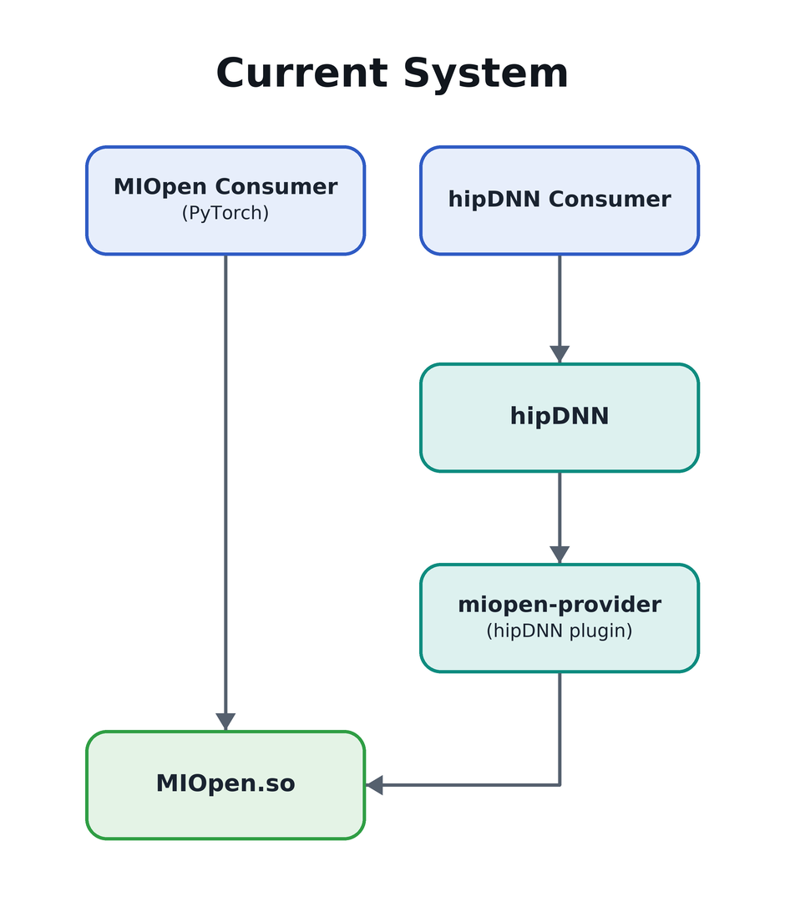
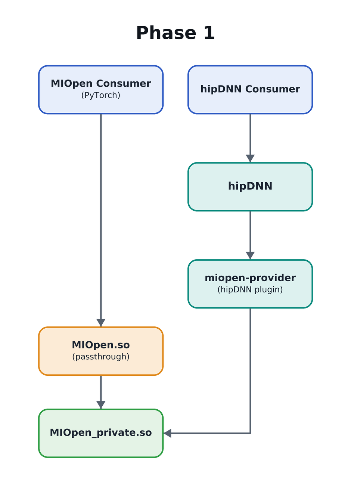
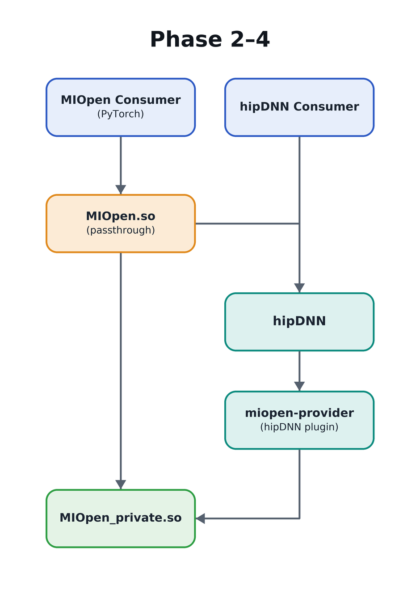

# MIOpen → hipDNN Forwarding Wrapper

- Contributors: Nolan Hanna, Mitch Ousdahl

## Table of Contents
1. [Executive Summary](#1-executive-summary)
2. [Problem Statement](#2-problem-statement)
3. [Current System Overview](#3-current-system-overview)
4. [Proposed Design](#4-proposed-design)
5. [Key Design Decisions](#5-key-design-decisions)
6. [Risks](#6-risks)
7. [Execution Plan](#7-execution-plan)
8. [Testing Plan](#8-testing-plan)
9. [Future Considerations](#9-future-considerations)
10. [Glossary](#10-glossary)

## 1. Executive Summary

### Why

Frameworks like PyTorch, TensorFlow, ONNX Runtime, and JAX/XLA already have substantial integration with MIOpen — call sites, tuning DBs, build infrastructure, CI coverage. There is external pushback against going all-in on a hipDNN backend at this juncture: the migration work for those framework teams is non-trivial, the timing is bad for several of them, and hipDNN is still maturing. At the same time, we want MIOpen consumers to start benefiting from hipDNN's engine ecosystem (performance work, fusion graphs, new architectures) without waiting for that migration. A forwarding wrapper lets us route selected calls through hipDNN behind the existing MIOpen API, decoupling the rollout of hipDNN-backed execution from any framework-side rework.

### What

This RFC proposes a thin wrapper layer in front of MIOpen that preserves the existing MIOpen C API verbatim from the consumer's point of view, while internally choosing — on a per-entry-point basis — whether to forward the call to the original MIOpen implementation or to hipDNN. The public/private library split is **always built**; behavior is governed at runtime by an env var that defaults to pure pass-through. With the default in effect, MIOpen behaves functionally as it does today: every call lands on the original MIOpen implementation, just via one extra function-call hop measured at ≈1 ns/call (§4.3.2). Opting in (per op family, via env var) routes selected calls to hipDNN instead. The split is:

- **MIOpen Private** — the existing MIOpen implementation, with the public C entry points renamed in source to a `_impl` suffix (e.g. `miopenConvolutionForward_impl`). Functionally identical to today's library, just relocated behind a private symbol surface. Ships as `libMIOpen_private.so`.
- **MIOpen Public** — a new lightweight shared library that re-exports the original public symbol names (e.g. `miopenConvolutionForward`) and dispatches each call either to MIOpen Private or to hipDNN. Ships as `libMIOpen.so` (the filename consumers link against today, SONAME preserved).

The wrapper reaches the private library via direct link-time linkage (`libMIOpen.so` → `-lMIOpen_private`). Because the public API and SONAME do not change, this work is invisible to existing MIOpen consumers — they continue to call `miopenConvolutionForward` and link against `libMIOpen.so` exactly as today. The forwarding decision happens behind that boundary.

### hipDNN dependency posture

Because forwarding is opt-in and off by default, `libMIOpen.so` links hipDNN **weakly** during the rollout window: an install that has MIOpen but not hipDNN loads and runs exactly as today, and only a consumer who turns forwarding on needs hipDNN present. Turning forwarding on when hipDNN is unavailable is a loud error, not a silent no-op. When the forwarding default eventually flips to `enabled` (§9), hipDNN becomes a hard runtime dependency. The wrapper also pins to a single hipDNN major version and uses only hipDNN's stable base-graph API, so a consumer upgrading hipDNN underneath the wrapper cannot break linking. Full detail in §4.9.

### Investigation status

A first-cut Phase 1 prototype has been built and exercised; raw findings are catalogued in `0001a_InvestigationReference.md` (referred to throughout this RFC as "the investigation reference"). At a high level, the prototype confirms that the public/private split builds, links, runs, and is performance-neutral; surfaces one wrapper-induced test breakage with a clear fix path; and exposes a wiring gap in the hipDNN MIOpen-provider plugin that this RFC now addresses in Phase 1 by installing a parallel `_impl`-form public header alongside the regular MIOpen headers. Specific findings are cited inline below (investigation reference §1–§5 are this Phase 1 evidence).

A separate, later **Phase 2 forwarding prototype** (investigation reference §6, ticket ALMIOPEN-1965) goes one step further and actually redirects `miopenConvolutionForward` into hipDNN end-to-end through `MIOpenDriver`, building the hipDNN backend-descriptor graph by hand. It establishes that the redirect path is viable and provides a concrete argument-translation worked example, and it initially surfaced what looked like a headline cold-start regression: a fresh process took ~4 s vs. native's ~0.2 s warm-process wall time. **Follow-up investigation has since re-attributed this to a one-time runtime load of the GPU device libraries on the forwarded path, not to a missing persistent plan cache.** Because forwarding ultimately executes through the same MIOpen Private code, it shares MIOpen's existing kernel cache — there is no double compilation and no per-process plan rebuild beyond that one-time device-library load. This substantially de-risks the concern relative to the original prototype reading; it remains a Phase 1 exit-criterion-4 measurement (§7) to confirm in the wrapper build, and is reflected in the risks table (§6). *(The raw prototype numbers in investigation reference §6 predate this re-attribution and should be read together with it.)*

### Pivot summary

The design pivoted away from an earlier draft that used a build-time CMake flag (`MIOPEN_ENABLE_HIPDNN_WRAPPER`) to gate the entire wrapper, and from a Phase 4 framing of the provider's direct private linkage. The pivoted design (1) always builds the public/private split and gates routing behavior at runtime, (2) renames the public-API symbols directly in the MIOpen source (no `-include` macro header) so consumers and providers see a single, stable source representation, (3) installs the `_impl`-form header in Phase 1 so the hipDNN MIOpen-provider plugin can be rewired against `libMIOpen_private.so` early, and (4) moves the provider's direct private linkage from Phase 4 into Phase 1. Full rationale, affected sections, concerns addressed, and new risks are documented in `RFC-pivot-summary.md`.

### Phased approach

The work is broken into four phases (full detail in §7). **Phase 1 is gated on two prerequisites, both outside this RFC.** First, the unmerged MIOpen layering refactor that lets the driver and tests stop depending on internal symbols (and therefore lets the same release disable the long-standing leakage of MIOpen internals into `libMIOpen.so`) must land first. Without it, the wrapper would bake today's leaked-internals surface into its public contract and external consumers known to depend on those internals (e.g. MIGraphX) would have no clean migration window. Second, the hipDNN frontend — which the wrapper consumes to reach hipDNN — must gain a runtime (`dlopen`) backend-loading mode, because as a header-only library it otherwise forces a hard hipDNN-backend dependency onto `libMIOpen.so` that would violate §4.9's weak-linkage posture even with forwarding off. See the §7 Phase 1 prerequisite notes and the corresponding risk rows in §6.

1. **Pass-through wrapper + provider direct private linkage.** Establish the two-library split, dispatch plumbing, and the consumer-side `_impl` header install. Rewire hipDNN's MIOpen provider to call MIOpen Private directly (link-time, against `libMIOpen_private.so`) so the loop hazard is structurally removed before any forwarding lands. Every public entry point still forwards to MIOpen Private. Validate that overhead is negligible.
2. **Selective hipDNN forwarding.** Forward the **convolution op family** — the chosen first and, within this RFC's scope, only forwarded op family — to hipDNN via the compile-time forwarding set when `MIOPEN_HIPDNN_FORWARDING=enabled`. Convolution is already realized end-to-end by the Phase 2 forwarding prototype (investigation reference §6); subsequent op families (batchnorm likely next) are future work (§9).
3. **Env var and logging mapping.** Translate MIOpen's debug/tuning/logging surface to hipDNN's, scoped to the variables that frameworks actually use in production.
4. **Performance baselining.** Publish end-to-end performance numbers across the wrapper-pass-through and wrapper-forwarding configurations now that the provider's direct private linkage is already in place from Phase 1.

> **Open question — wrapper ownership.** Long-term ownership of the wrapper layer (the new `MIOpen Public` artifact, the routing policy module, and the env-var translation work in Phase 3) is not yet assigned. Candidates include an integration team or the FDE function. Needs alignment with @BradPepersAMD before Phase 1 exit so that on-call rotations, bug triage, and the eventual default-flip decision (§9) have a clear DRI.

## 2. Problem Statement

hipDNN is being positioned as the next-generation graph-execution surface for AMD's deep-learning stack, but MIOpen still has a large installed base and a stable C API that frameworks (PyTorch, TensorFlow, ONNX Runtime, JAX/XLA, etc.) depend on directly. We want a path for MIOpen consumers to benefit from hipDNN's engine ecosystem — performance work, new architectures, fusion graphs — without requiring those consumers to migrate their integration code or rebuild against a new header.

This wrapper is an explicitly **temporary** measure. The longer-term goal is for frameworks to consume hipDNN features directly so that we no longer need to add new functionality to MIOpen. Eventually MIOpen itself will be deprecated and the public API exposed by this wrapper will go away — though that endpoint is expected to be a long way off, is out of scope for this RFC, and is not blocked or driven by the work proposed here. In the meantime, the wrapper gives us a way to put framework calls in front of hipDNN without forcing framework teams to do migration work first.

Concretely, we want the ability to:

- Redirect specific MIOpen API calls to hipDNN at runtime, on a per-entry-point basis.
- Roll the redirection out incrementally — one operation, or one path within an operation, at a time — and roll it back just as easily.
- Prove that the forwarding layer itself adds negligible overhead before we migrate any production traffic onto it.
- Default the wrapper to a pure pass-through so consumers who don't opt into hipDNN forwarding see today's MIOpen behavior. Existing consumers (no env-var change, no code change) get today's library semantics plus an ≈1 ns/call wrapper hop measured to be in the noise (§4.3.2).
- Let hipDNN's existing MIOpen provider bypass the wrapper to avoid the round-trip cost when hipDNN is already in the call stack — wired up in Phase 1 so the loop hazard is structurally removed before any forwarding lands.

What we are **not** trying to do in this RFC:

- Change the MIOpen public API.
- Rewrite MIOpen on top of hipDNN.
- Deprecate or remove any MIOpen entry points.

## 3. Current System Overview

MIOpen exposes a flat C API through `include/miopen/miopen.h`. Each public entry point is implemented in a corresponding `*_api.cpp` file under `src/` (e.g. `convolution_api.cpp`, `batch_norm_api.cpp`, `layernorm_api.cpp`). The API layer translates handle/descriptor objects, builds a `ProblemDescription`, calls into the solver framework, and returns a `miopenStatus_t`.

Consumers link against `libMIOpen.so` and call these symbols directly. There is no shim layer between the public symbol and the implementation; `miopenConvolutionForward` in the consumer binary resolves to the function defined in `convolution_api.cpp`.

hipDNN already ships with a MIOpen *provider plugin* (`dnn-providers/miopen-provider/`) that calls **into** MIOpen the normal way. Today, the call direction is exclusively `caller → MIOpen` and `hipDNN → MIOpen` — never `MIOpen → hipDNN`.

Today's call graph:

## 4. Proposed Design

### 4.1 Runtime feature flag

The public/private split is **always built** in every MIOpen configuration. Behavior is governed at runtime by an env var, tentatively `MIOPEN_HIPDNN_FORWARDING` (name TBD; default: `disabled`).

- **`disabled`** *(default)*: Every public entry point dispatches to MIOpen Private. The wrapper hop is ≈1 ns/call (§4.3.2), measured to be in the noise on any real op. Functionally equivalent to today's MIOpen from the consumer's perspective.
- **`enabled`**: The per-entry-point routing policy in §4.4 is consulted; selected ops are forwarded to hipDNN, others remain on Private. A companion env var (`MIOPEN_DISABLE_HIPDNN_FOR`) provides finer-grained opt-out control.

Why a runtime flag rather than the build-time CMake flag from earlier drafts:

- **One artifact to build, test, and ship.** CI does not need to maintain a wrapper-off matrix in parallel with a wrapper-on matrix. The single artifact is the one that ships, which removes the divergence risk between configurations.
- **Operator-controlled rollback.** Any consumer who hits a regression can set `MIOPEN_HIPDNN_FORWARDING=disabled` without rebuilding or replacing the library. This is the practical recovery lever during the rollout window.
- **Cleaner default flip.** When the time comes (§9), changing the default is a one-line change to the env-var parser. Consumers who have already deployed the library pick up the new default on next process start; no rebuild required.
- **Same surface area either way.** The public/private split, the rename, and the wrapper code are present in every build, so there is no "the wrapper-off path is the one that works because that's the one anyone actually ships." Every consumer is exercising the same code paths.

### 4.2 Symbol surface split (architecture)

The public API symbols are split across two libraries — a thin **Public** wrapper and the existing implementation, which becomes **Private**. After Phase 1, the wrapper is a pure pass-through to Private by default; from Phase 2 onward the wrapper may also forward to hipDNN when the runtime env var opts in. The hipDNN MIOpen-provider plugin reaches MIOpen Private directly via link-time direct private linkage from Phase 1 onward (see §4.5 and the diagram in §7 Phase 1).

- **MIOpen Private**: contains the entire current MIOpen library, with each public-API entry point **renamed in source** from `miopenFoo` to `miopenFoo_impl`. The rename is applied directly to the function definitions and to internal headers, so the existing implementation TUs compile against the `_impl` names. All other MIOpen symbols (internal helpers, solver classes, etc.) are unchanged.
- **MIOpen Public**: a new, small shared library. For each public entry point, it defines a wrapper that decides where to dispatch (Private vs. hipDNN, governed by §4.1) and forwards the arguments. The exported symbol set is identical to today's `libMIOpen.so`, so no consumer code change is required.

How the two libraries are physically packaged, named on disk, and bound together is the subject of §4.3.

### 4.3 Implementation

The wrapper ships as a thin shared library that reuses the existing MIOpen `.so` filename; the implementation library is renamed.

#### 4.3.1 Packaging and link surface

| Aspect | Value |
|---|---|
| Public wrapper artifact | `libMIOpen.so` (same filename consumers link against today) |
| Private implementation artifact | `libMIOpen_private.so` |
| Symbol rename in Private | each public entry point → `_impl` suffix (applied directly in source — see §4.6) |
| Wrapper → Private binding | direct link at build time (`-lMIOpen_private`) |
| Wrapper → hipDNN binding | **weak** link during the opt-in rollout (missing hipDNN does not block `libMIOpen.so` load); promoted to a hard link when the forwarding default flips — see §4.9, §9 |
| Consumer impact | none — same `-lMIOpen` link line, same SONAME |
| User runtime opt-in | none for pass-through (default); env-var opt-in for hipDNN forwarding (§4.1, §4.4) |

The call path is a plain function call (one indirection), the wrapper is a normal library that can be packaged and shipped through the existing channels, and consumers don't need to know the wrapper exists. The Phase 1 provider direct private linkage (§4.5) is a straightforward link-line change in `dnn-providers/miopen-provider/CMakeLists.txt`.

Investigation status (see investigation reference §1, §2, §4 for full data):
- **Confirmed viable.** The prototype produces `libMIOpen.so.1` as the wrapper and `libMIOpen_private.so.1` as the implementation, with the wrapper holding 263 public exports and the private library holding 263 `_impl` symbols (4 non-renamed survivors, none implicated in any collision). `MIOpenDriver` links and runs correctly against the split; gtest results show 261/265 binaries clean. The prototype used a `-include miopen_private_rename.h` macro-rename mechanism, which has since been replaced in this design by a direct source rename (§4.6); the prototype's symbol-surface findings still apply because the resulting symbol set is identical.
- **Symbol-rename collisions.** No collisions observed in the prototype against the renamed surface.
- **Still to be validated.**
  - SONAME / SOVERSION inheritance, and a **public-symbol-superset check**: the wrapper-built `libMIOpen.so` must export a superset of the public entry points implemented in `libMIOpen_private.so` (every `miopenFoo_impl` in Private has a matching `miopenFoo` export in the wrapper) and must export no `_impl` symbols itself. This is derived from the two libraries in the same build, so it needs no pre-wrapper baseline snapshot. The prototype builds reuse `.so.1`; the formal CI gates listed in §6 and §8 are not yet wired up.
  - Packaging implications for ROCm distributors: shipping a second `.so` and ensuring both end up in the right paths.
    - **Coordinator:** TBD (named owner required before Phase 1 exit). Stakeholders to contact before Phase 1 exit: **TheRock superbuild maintainers, ROCm release-engineering, distro packagers (Ubuntu, RHEL, SUSE), container-image maintainers (`rocm/dev-*` images), Conda-forge ROCm, and the framework wheel teams (PyTorch ROCm, TensorFlow ROCm)**. Sign-off must be captured in a tracking ticket. Each of these consumers has a build/packaging assumption that "MIOpen ships as one `.so`"; surfacing this late turns into a release-readiness blocker. Note: under the runtime-flag design, *every* ROCm release ships the split, so this coordination is unconditional rather than gated on a "wrapper-enabled distro" subset.
    - **Co-versioning invariant (load-bearing for packagers).** `libMIOpen.so.<X>` and `libMIOpen_private.so.<X>` are produced from the same source tree, released together, and **must be installed at the same version**. Distros and other downstream packagers must package them together with an exact-version dependency, never split them into independently-upgradable packages, and never allow one to upgrade ahead of the other. This is the practical consequence of §4.7's lockstep SOVERSION policy: `libMIOpen.so`'s hard `DT_NEEDED` on `libMIOpen_private.so` means a version-skewed install either fails at load (different SOVERSION → loader rejects the bind) or silently misbehaves (same SOVERSION but a wrapper-vN call lands on a private-vM `_impl` with mismatched signature). Quotable forms for packagers:
      - **RPM**: `Requires: libMIOpen-private = %{version}-%{release}` (exact-equals, not `>=`).
      - **dpkg / Debian**: `Depends: libmiopen-private (= ${binary:Version})`.
      - **Conda**: pin `libmiopen-private` to the same `=<version>=<build>` as `libmiopen` in the recipe.
      - **Wheels / single-archive bundles** (PyTorch ROCm, TensorFlow ROCm, container images): both `.so` files are bundled from the same release artifact set; no per-file substitution.
    - **CI gate (new Phase 1 sub-task — see §7 Phase 1 task 8).** Before a release artifact is built, CI extracts the embedded version metadata from `libMIOpen.so.<X>` and `libMIOpen_private.so.<X>` and fails the build if they disagree. Same gate also asserts the wrapper's `DT_NEEDED` entry for the private library resolves to the same `<X>` the wrapper was built at.
  - Interaction with the existing `MIOpen_with_plugins` CMake target. The proxy bundles two classes of consumer that reach past the public C API into MIOpen internals — the CK grouped-conv plugins and the internal-symbol-using tests — which must bind `libMIOpen_private.so` once the public wrapper stops re-exporting internals. The design for this is in §4.10 (CK plugins rewired to `MIOpen_private` in Phase 1; driver and tests handled by the §7 layering-refactor prerequisite). What remains is the Phase 1 implementation and its validation (tasks 12–13), not an open feasibility question.

#### 4.3.2 Findings from the prototype

A prototype split build was stood up; full data is in the investigation reference (§1–§4). Headlines:

- **Build and link.** The split configuration produces the expected `libMIOpen.so.1` wrapper + `libMIOpen_private.so.1` implementation. `MIOpenDriver` and the gtest binaries link and run; smoke tests show identical solver selection and verification numerics between the split and a non-split baseline (investigation reference §1).
- **Runtime path proof.** With per-stub `fprintf` instrumentation, a single `MIOpenDriver convfp16` invocation produced 45 wrapper-traversal lines on the split build and 0 on the baseline — every public call in the run went through the wrapper hop, no hidden bypasses (investigation reference §2).
- **Test suite.** 261 of 265 gtest binaries clean on the split build. Of the 4 case failures: 2 are wrapper-induced (`test_smoke_tuning_policy` asserts on captured `MIOPEN_LOG_FUNCTION` stderr that now contains `_impl` names) and 2 are environmental (`test_db_sync` missing a `.kdb` file). 2 timeouts (`test_lrn`, `test_soft_max`) were progressing when the per-binary 1200 s budget fired — not failures (investigation reference §3). The wrapper-induced fix is tracked as a Phase 1 follow-up (see §7 Phase 1 task list).
- **Performance.** Aggregate GPU kernel time differs by ≤2% between configurations (signed direction varies by phase — i.e., noise); wall-clock is the same or slightly faster on the split build. Direct microbenchmark of the worst-case no-work API (`miopenGetVersion`) puts the wrapper hop at **≈1 ns/call (upper bound)** in steady state; cold-load cost is **+6 major page faults** and ≤1 MB RSS (investigation reference §4). The negligible-overhead premise that justifies the whole design is empirically supported.

Taken together, the prototype clears the feasibility bar for Phase 1. Outstanding items (SONAME/SOVERSION CI gates, packaging coordination) remain as noted in §4.3.1; the `MIOpen_with_plugins` interaction is resolved by the design in §4.10; and the wiring gap that blocks the provider's direct private linkage is addressed in §4.5.

#### 4.3.3 Considered alternative: `dlopen`/`dlsym` + `LD_PRELOAD`

An earlier draft proposed a dynamic-loader-based wrapper (`dlopen("libMIOpen.so")` + `dlsym("miopenFoo")`, opted in via `LD_PRELOAD`) as a fallback in case the public/private split turned out to be infeasible. Investigation found that the dynamic-loader path carries real correctness, operational, and portability costs that the direct-linkage design does not — symbol resolution ordering with `RTLD_NEXT`, static-initializer ordering, fork/exec safety of cached function pointers, thread-safety of first-call resolution, lack of link-time validation of the hipDNN ABI, opaque static-analysis (`nm`/`ldd`/`readelf -d` don't see hipDNN as a dependency), environment-dependent library discovery (`LD_LIBRARY_PATH`/RPATH/`ld.so.cache`), POSIX-only API (Windows needs a separate `LoadLibrary` shim), and a function-pointer indirection on every forwarded call that defeats inlining. The previously open edge cases — `RTLD_DEEPBIND` interactions, static-linked consumers where `LD_PRELOAD` does not interpose, `setuid` binaries where the loader strips `LD_PRELOAD` — each compound that surface area.

Because the prototype (§4.3.2) cleared the split-build path's feasibility bar, the dynamic-loader path is **not pursued**. It is recorded here so that if a future hard blocker forces a revisit, the prior analysis is available rather than re-derived from scratch.

### 4.4 Per-entry-point routing policy

Each wrapper function consults a routing decision: "should this call go to hipDNN or to MIOpen Private?" In Phase 1 the answer is always "Private". As later phases add hipDNN coverage, the policy becomes more nuanced.

Routing inputs that the policy may consider:

- The entry point itself (some are forwarded, some are not).
- Argument shape (e.g. forward only certain layouts/dtypes).
- A compile-time list (the **forwarding set**) for entry points that are known-good and forwarded when `MIOPEN_HIPDNN_FORWARDING=enabled`. This list is owned and updated by MIOpen developers as each op is qualified in Phase 2 and beyond; consumers do not opt individual ops *in* at runtime, they get whatever the compile-time list says when they enable forwarding.
- An opt-out environment variable (`MIOPEN_DISABLE_HIPDNN_FOR=...`) so that a single op family can be force-routed back to MIOpen Private without rebuilding. This is the recovery lever when a forwarded op misbehaves in production and is the documented rollback path called out in §9 (the "loud" default-flip communication promises this knob will exist). `MIOPEN_DISABLE_HIPDNN_FOR=*` disables forwarding for every op while leaving `MIOPEN_HIPDNN_FORWARDING=enabled` in effect.

The routing decision is centralized in one place (a small `routing.cpp` or equivalent) so that adding/removing a forwarded op is a one-line change.

> **Why no opt-in env var.** An earlier draft also proposed an opt-in env var (`MIOPEN_USE_HIPDNN_FOR=<ops>`) so that operators could ad-hoc-enable individual ops without rebuilding. We dropped it: the compile-time forwarding set already gives MIOpen developers the surface they need to stage ops, and combining an opt-in env var with the opt-out env var creates interaction-rule complexity ("which wins when both are set, and why") that does not pay for itself. The opt-out alone gives consumers everything they need for emergency rollback, which is the only runtime knob the rollout actually depends on.

### 4.5 hipDNN MIOpen-provider direct private linkage (Phase 1)

Today, hipDNN's MIOpen provider plugin calls into `libMIOpen.so`. Once the wrapper exists, that call would land in MIOpen Public, which from Phase 2 onward might in turn forward back into hipDNN — a loop that, even if guarded against actual recursion, adds an unnecessary hop. The provider is therefore wired to call MIOpen's private API directly in **Phase 1**, before any forwarded ops land, so the loop hazard is structurally removed rather than relied on a thread-local recursion guard during the rollout window.

The MIOpen provider is changed to link directly against `libMIOpen_private.so` and call the `_impl` symbols. This routes hipDNN-originated calls straight to the private implementation when hipDNN is the original caller, so the wrapper only sits in the path when an *external* consumer (e.g. PyTorch) called MIOpen.

**Wiring gap from the investigation, and the fix.** The provider's CMakeLists already conditionally links `MIOpen_private` when that target is exported, and the prototype confirms the link selection works as intended — but the resulting plugin **links and then fails to load** because the provider's translation units `#include <miopen/miopen.h>` and therefore reference the unrenamed names (`miopenCreate`), while `libMIOpen_private.so.1` only exports `_impl`-suffixed names (`miopenCreate_impl`). The `dlopen` step aborts at the plugin's first MIOpen relocation. Additionally, `libMIOpen.so.1` carries a hard `DT_NEEDED` on `libMIOpen_private.so.1`, so the install always loads both files transitively — direct private linkage changes *which exports bind*, not *which files load*. Full evidence in investigation reference §5.

The chosen fix (selected from the three options sketched in investigation reference §5.7) is to **install a parallel `_impl`-form public header**, `<miopen/miopen_impl.h>`, alongside the regular `<miopen/miopen.h>`. The header declares the same API surface but with each function declared under its `_impl` name. The exported `MIOpen_private` CMake target carries `INTERFACE_INCLUDE_DIRECTORIES` pointing at the install location of this header, so any consumer that links `MIOpen_private` automatically gets the `_impl` declarations on its include path. The MIOpen provider plugin opts in by including `<miopen/miopen_impl.h>` in place of `<miopen/miopen.h>` for the TUs that talk to MIOpen Private.

Why this option over the alternatives:
- Option 1 from §5.7 (install the macro-rename header + auto-apply `-DMIOPEN_BUILDING_PRIVATE -include miopen_private_rename.h` via the `MIOpen_private` target) carries the same fragility surface called out in earlier drafts: any TU that mentions a `miopenFoo` symbol *as a string* (debug-tracing macros, logging metadata, embedded format strings) gets silently rewritten, and the forced-include order is load-bearing. Acceptable inside MIOpen's own build where the surface area is auditable; not acceptable to push onto consumers.
- Option 3 (export private-side aliases so `libMIOpen_private.so.1` publishes both `miopenFoo` and `miopenFoo_impl`) re-creates the exact risk the split was trying to remove — the private library becomes reachable via the public name surface, and any future static-analysis or symbol-leak check has to special-case it.

The parallel `_impl` header keeps the public include path untouched, keeps macro rewriting out of consumer TUs, and keeps the private library exporting only `_impl` names. The cost is one extra installed header file and a small amount of conditional compilation in the MIOpen provider.

**Phase 1 verification.** The rewired provider plugin must `dlopen` and run correctly against `libMIOpen_private.so`, with its MIOpen calls resolving to the `_impl` symbols in the private library rather than to the wrapper. This is covered functionally by the provider tests (§7 Phase 1) and statically by the provider-side object-file check in §4.7 (built object files reference only `_impl` symbols from `libMIOpen_private.so`).

### 4.6 Header story

Three concerns the header story has to satisfy:

1. **The public header `<miopen/miopen.h>` is unchanged.** Consumers see the same declarations, the same names, and the same include path as today.
2. **MIOpen Private's source compiles against the `_impl` names directly.** The public-API function definitions in `src/*_api.cpp` are renamed in source from `miopenFoo` to `miopenFoo_impl`, and the internal private-side declarations they consume are likewise renamed. There is no `-include` macro header, no forced rewrite at preprocess time, no `MIOPEN_BUILDING_PRIVATE` define. The renamed names are what is actually in the source tree.
3. **Consumers that need to call the `_impl` names (the MIOpen provider plugin, §4.5) get a parallel `<miopen/miopen_impl.h>` header** that declares the API in `_impl` form. This header is installed alongside `<miopen/miopen.h>` and exposed via `MIOpen_private`'s `INTERFACE_INCLUDE_DIRECTORIES`, so any consumer that links `MIOpen_private` picks it up automatically.

**Why direct source rename rather than the prototype's macro-include mechanism.** The prototype used `-DMIOPEN_BUILDING_PRIVATE -include miopen_private_rename.h` to `#define` each `miopenFoo` to `miopenFoo_impl` across every Private-side TU. The prototype showed that the mechanism works — 263/263 entry points renamed cleanly with no observed collisions (investigation reference §1, §5) — but the macro approach carries two fragility modes that direct source rename does not:

- Any third-party header included in the same TU that mentions a `miopenFoo` symbol *as a string* (debug-tracing macros, logging facility metadata, embedded format strings) gets silently rewritten.
- The forced-include order is load-bearing; any TU that subverts it picks up unrenamed signatures and confusing link errors.

Neither surfaced in the prototype, but with the direct rename the surface area collapses to zero: there is no rewrite happening, so neither fragility mode is reachable. The cost is the one-time edit to rename the public-API function definitions in the source tree; that edit is mechanical (the public API surface is enumerated in `<miopen/miopen.h>`) and the resulting source is what every reader of MIOpen Private's source from that point onward sees, which is its own readability win.

**`<miopen/miopen_impl.h>` generation and maintenance.** The parallel `_impl` header is generated from `<miopen/miopen.h>` at build configuration time (or hand-maintained with a CI check that the two stay in sync — pick deferred to implementation), so it cannot drift from the public API. Including it from inside MIOpen's own build is forbidden (the rename is already applied in source, and re-including would only add confusion); a CI check asserts no MIOpen TU includes the `_impl` header.

**Invariant: the `_impl` header is not in MIOpen's normal public include path.** It is installed under the same prefix but is only added to a consumer's include path via the `MIOpen_private` target. Consumers that find `MIOpen` (the public target) get only `<miopen/miopen.h>`. This keeps the `_impl` names invisible to consumers who have no business calling them. The leakage check from §6 (`nm` of `libMIOpen.so` shows no `_impl` exports, and no `_impl` appears in the staged public headers) catches violations.

### 4.7 `MIOpen_private` ABI policy

Once the hipDNN MIOpen-provider plugin links `libMIOpen_private.so.1` and calls `_impl` symbols directly (§4.5), `MIOpen_private` stops being a build-time-only convenience and becomes a stable, versioned ABI consumed by a separate build artifact — the plugin lives at `dnn-providers/miopen-provider/` in this same `rocm-libraries` monorepo (a sibling location to MIOpen at `projects/miopen/` and to hipDNN core at `projects/hipdnn/`), but its build, install, and release artifact are distinct from MIOpen's. This section states the SOVERSION policy, the version-skew matrix, and the runtime behavior on mismatch so the plugin team has something to build against and packagers have something to pin.

**SOVERSION policy: lockstep with `libMIOpen.so`.**

- `libMIOpen_private.so` SOVERSION bumps **in lockstep with `libMIOpen.so` SOVERSION**, on the same release cadence, out of the same source tree. They are never released independently. The two libraries' `<X>` and `<Y>` in `.so.<X>.<Y>` always match.
- The SOVERSION bumps whenever either (a) the public C API in `<miopen/miopen.h>` has an ABI-incompatible change (the existing MIOpen policy) or (b) any `_impl` signature in `<miopen/miopen_impl.h>` has an ABI-incompatible change. Because the two headers are kept in sync (§4.6), in practice these reduce to the same trigger.
- Adding new entry points (e.g. `miopenGetLastForwardedError()` from §6.1) is an additive change and does not bump SOVERSION — same policy the public library already follows.

**Version-skew matrix for `{wrapper, private, provider plugin}`.**

| Scenario | Behavior |
|---|---|
| Wrapper vN, Private vN (in-tree case) | Supported, the only configuration MIOpen CI exercises directly. |
| Wrapper vN, Private vM (M ≠ N) | **Unsupported.** Concern 5's packaging-coupling invariant (§4.3.1) makes this not-occur in correctly-packaged installs. If it does occur (broken package split, manual install error), the loader will surface it as either a missing `_impl` symbol on the wrapper's first call into Private, or — if SOVERSION matches but signatures don't — as a `DT_NEEDED` SOVERSION mismatch at `libMIOpen.so` load. Both produce a hard error at load/first-call rather than silent misbehavior. |
| Provider plugin built against Private vN, loads Private vN | Supported, the configuration the in-tree provider tests exercise. |
| Provider plugin built against Private vN, loads Private vM (M > N, same SOVERSION) | Supported. New `_impl` additions in vM are not consumed by the older plugin; the plugin only calls the `_impl` symbols it was compiled against, all of which remain present and ABI-compatible by SOVERSION definition. |
| Provider plugin built against Private vN, loads Private vM (different SOVERSION) | The dynamic loader rejects the bind at plugin `dlopen` (the plugin's `DT_NEEDED libMIOpen_private.so.<N>` does not resolve against an installed `libMIOpen_private.so.<M>`). Plugin load fails loudly; hipDNN's plugin-loading layer reports the failure. No silent fallback. |

**Cross-project coordination.** The MIOpen-provider plugin at `dnn-providers/miopen-provider/` and hipDNN core at `projects/hipdnn/` both live in the same `rocm-libraries` monorepo as MIOpen itself — not in separate repositories. The three projects share a source tree but have distinct build targets, distinct install artifacts, and (potentially) distinct downstream packaging and release-tag cadences. The lockstep SOVERSION policy bounds the coordination cost: the plugin only has to rebuild against a new Private SOVERSION when it bumps, on the same trigger it would already rebuild against a new public-MIOpen SOVERSION. The monorepo layout makes *build-time* coordination easy (all three projects' sources move together; CI can rebuild the plugin against MIOpen Private in the same pipeline that bumped the SOVERSION) but does not by itself solve *deployment-time* skew, since downstream packagers may still split the installs into separate packages — the co-versioning packaging invariant in §4.3.1 covers that side. The investigation reference §5.3 records one prior occurrence of the skew failure mode (a TheRock-bundled pre-built provider linked against an older MIOpen install that lacked `MIOpen_private`); after this policy lands, the same situation surfaces at plugin `dlopen` time with a clear SOVERSION-mismatch message rather than a missing-target build failure.

**Internal symbols visible to `MIOpen_private` consumers.** The provider plugin links `libMIOpen_private.so` directly, which means the loader resolves *any* symbol the plugin references against Private's full export set — not just the `_impl` C API. The `_impl` rename only covered the public-API surface; MIOpen's internal C++ symbols (solver classes, helpers) remain exported by `libMIOpen_private.so` exactly as they are by today's `libMIOpen.so`. The provider plugin is expected to consume **only** the `_impl` C API declared in `<miopen/miopen_impl.h>`; reaching into Private's internal C++ symbols is unsupported and is covered by the same internal-symbol-leakage cleanup the Phase 1 prerequisite (§7) addresses. A CI check on the provider side asserts that its built object files reference only `_impl` symbols from `libMIOpen_private.so`. (The CK grouped-conv plugins are a *deliberate* internal-symbol consumer — unlike the provider plugin they legitimately bind Private's internal C++ types — and are handled separately in §4.10.)

### 4.8 Tuning DB behavior under forwarding

MIOpen maintains on-disk tuning state (`.kdb` kernel databases, find-db, perf-db) that is written and read by the public API. When the wrapper forwards an op to hipDNN, that state interacts with a backend (hipDNN) that did not produce it. This section states the chosen behavior, the rollback implication, and the compatibility commitment for pre-wrapper on-disk files.

**Chosen behavior: bypass.** When an op is forwarded to hipDNN, the wrapper does **not** consult MIOpen's tuning DB for that call, and the hipDNN execution does not write back into MIOpen's tuning DB. Any pre-existing tuned entries for that op in `.kdb` / find-db / perf-db are silently inert for the duration the forwarding flag is on. hipDNN's own internal tuning (if any) lives entirely on the hipDNN side at hipDNN-managed paths; the two DBs do not interact.

- Calls that fall through to MIOpen Private (forwarding disabled for the call, or the op not in the forwarding set) consult and update the MIOpen tuning DB exactly as today. The wrapper does not change the read/write semantics on the MIOpen-Private side.
- The wrapper does not introduce any new on-disk format or new paths under MIOpen's tuning-DB roots.

**Rollback implication.** Because forwarded calls do not write to MIOpen's tuning DB, flipping `MIOPEN_HIPDNN_FORWARDING=disabled` (or unsetting it) returns control to MIOpen Private with the same tuning DB state it had before forwarding was enabled — modulo entries written by non-forwarded calls during the forwarding window. There is no "two diverging DBs at different versions" failure mode to clean up. An operator who flips forwarding off after a rollout regression sees their original tuned entries take effect immediately on the next call, with no cache or file-system reset needed.

**Pre-wrapper `.kdb` compatibility.** `.kdb` files written by pre-wrapper MIOpen remain readable by the wrapper-shipped MIOpen Private without modification. The split into Public + Private libraries does not change the on-disk format, the file paths, or the kernel-database schema — MIOpen Private inherits MIOpen's existing tuning-DB code unchanged. Phase 1 exit criterion `test_db_sync` (which already exists and exercises `.kdb` loading) covers this assertion; no new test is required.

**Out of scope.** Passing MIOpen tuning hints into hipDNN as a translated "configuration suggestion" is not pursued in this RFC. The two backends' tuning representations are structurally different and there is no hipDNN-side surface today for accepting MIOpen-shaped hints; revisiting this is left to a future RFC if forwarding becomes the long-term path for an op family.

### 4.9 hipDNN dependency posture and API-version pinning

This section states how `libMIOpen.so` depends on hipDNN at link and load time, how that posture changes when the forwarding default flips (§9), and how the wrapper pins to a hipDNN API version so that version skew on the installed hipDNN cannot break the wrapper. It resolves the two questions left open in earlier drafts: "is hipDNN now a mandatory dependency?" and "what happens when the installed hipDNN is present but the wrong version?"

**Linking posture: weak now, hard at the default-flip.**

- **During the rollout (default `disabled`): weak linkage.** `libMIOpen.so` does *not* carry a hard `DT_NEEDED` on `libhipdnn_backend.so`. The hipDNN backend symbols the wrapper forwards into are referenced weakly, so an install that has MIOpen but not hipDNN still loads and runs `libMIOpen.so` normally — every call lands on MIOpen Private exactly as today. This is the deliberate choice over option 7(a)'s "hipDNN is mandatory from day one": the overwhelming majority of installs during the rollout window will never turn forwarding on, and forcing a hard hipDNN dependency on all of them just to enable an opt-in feature would be a gratuitous packaging disruption. Weak linkage here is distinct from the `dlopen`-as-wrapper-mechanism rejected in §4.3.3 — that rejection was about how the *wrapper reaches MIOpen Private*; this is about how the wrapper *optionally* reaches the hipDNN backend. Achieving this weak posture depends on a hipDNN-side prerequisite: because the wrapper reaches hipDNN through hipDNN's *header-only* frontend, which today hard-links the backend and references its C-API symbols directly, the frontend must first gain a runtime (`dlopen`) backend-loading mode before `libMIOpen.so` can consume it without inheriting a hard `DT_NEEDED` on `libhipdnn_backend.so` — see the §7 Phase 1 hipDNN-frontend prerequisite note.
- **Enabling forwarding without hipDNN present is a hard, loud error.** If a consumer sets `MIOPEN_HIPDNN_FORWARDING=enabled` on a system where the weakly-linked hipDNN backend symbols did not resolve, the wrapper does **not** silently degrade to pass-through. It emits a clear diagnostic (e.g. "hipDNN forwarding requested but libhipdnn_backend.so is unavailable") and fails the affected call(s), so the misconfiguration is obvious rather than masked as "forwarding silently did nothing." Pure pass-through with the flag left at `disabled` is unaffected and never touches hipDNN.
- **At the default-flip (§9): hard dependency.** When `MIOPEN_HIPDNN_FORWARDING` defaults to `enabled` for a validated op set, `libhipdnn_backend.so` becomes a hard runtime requirement of `libMIOpen.so` — the weak references are promoted to a normal `DT_NEEDED`, and an install that lacks hipDNN fails to load `libMIOpen.so` at process start. This is acceptable at that point precisely because the flip is gated on hipDNN being a shipped, validated part of the stack; it is not acceptable during the opt-in rollout window. Adding the hard packaging dependency in the same release that flips the default is part of the successor "default-flip" RFC's deliverables (§9).

**API-version pinning: link against hipDNN's stable base-graph API.**

The wrapper is tied to a single hipDNN **major** version and deliberately uses only hipDNN's stable base-graph surface (the "V1.0" frontend API), not cutting-edge backend features.

- The wrapper compiles against the stable base-graph API only; backend symbols outside that subset are excluded from compilation, so they cannot become link-time dependencies. The practical effect: *"we only use the base graph at the V1.0 API; every other backend symbol is removed from compilation, so no link errors can happen even when swapping a V2 hipDNN backend down to V1."* There are no references to newer-than-V1.0 symbols that could fail to resolve, so the wrapper can link and run against an older hipDNN backend even when a newer one is installed (and vice-versa within the supported range).
- Pinning to the stable subset is what makes version skew tractable: because the wrapper never reaches for a symbol that exists only in a newer hipDNN, a present-but-different-version hipDNN does not break the wrapper as long as the stable base-graph API is intact across that range. Adopting any newer hipDNN feature is a deliberate, separately-versioned decision — it does not happen implicitly when a consumer upgrades hipDNN underneath.

**Runtime behavior on a present-but-wrong hipDNN version.** Resolved against hipDNN's own versioning model (hipDNN RFC `0005_Versioning.md`); see the confirmation note below.

- **Primary mechanism — init-time version query (matches hipDNN's compatibility model).** hipDNN handles version differences by *dynamic version query + graceful failure*, not by SONAME-based loader rejection: the backend exposes a runtime version-reporting API (hipDNN RFC 0005 §4.5, §7.2) and consumers are expected to query it and degrade gracefully on an unsupported version (§4.6.3). The wrapper follows that model — at init it queries the hipDNN backend's reported version and asserts the major matches the one it was built against; an unexpected major is treated as unavailable for forwarding (pass-through when `disabled`, loud error when `enabled`, §6.1). Because hipDNN does **not** commit to bumping `libhipdnn_backend.so`'s SONAME per major, this query — not the loader — is the reliable gate against a silently-incompatible major, so it is load-bearing and is kept.
- **Within-major skew is safe by hipDNN guarantee.** Within a single major, hipDNN guarantees the consumer-facing API is forward-compatible and that minor releases only *add* — nothing is removed (RFC 0005 §4.2 "Minor version", §4.7). The wrapper pins to the **base** V1.0 API precisely to stay in that guaranteed direction: an older consumer (built against 1.0) running against an equal-or-newer 1.x backend is exactly hipDNN's *forward*-compatible case. (hipDNN's *backward* compatibility — a newer consumer against an older backend — is still future work in RFC 0005 §4.6.3, a further reason to pin to the oldest API in the major rather than a newer minor.)
- **SONAME / weak-link behavior (secondary).** A missing or unresolved `libhipdnn_backend.so` is handled by the weak-link posture above (pass-through when `disabled`, loud error when `enabled`; hard load failure post-flip). This catches "absent" cleanly; it is not relied upon to catch "present-but-wrong-major," which is the version query's job.

> **Confirmed against hipDNN RFC `0005_Versioning.md` (2026-06-16).**
> - **(b) stable API preserved within a major — confirmed.** Minor versions add only, never remove, and the consumer-facing API is forward-compatible within a major (§4.2, §4.7).
> - **(c) queryable runtime version — confirmed.** The backend is a dynamic-version-query component and "add api functions for reporting library version" is planned work (§4.5, §7.2); the frontend already places dynamic version guards that fail gracefully on unsupported backend versions (§4.6.3).
> - **(a) SONAME bumped per major — not committed.** RFC 0005 does not specify ELF SONAME behavior and instead builds cross-version handling on dynamic version queries plus graceful failure. Consequence: the wrapper must not rely on the loader to reject a wrong-major hipDNN; the init-time version query is the load-bearing gate (resolving the earlier decision gate in favor of keeping it).
> - **Terminology.** In hipDNN's component model the runtime `.so` the wrapper depends on is the **backend** (the C API, `libhipdnn_backend.so`; `hipdnn_backend` + `hipdnn_backend_private` share one version, §4.6.2); the header-only frontend is compiled into the wrapper. "V1.0 API" here means hipDNN major-version-1's stable backend C API. All hipDNN components share a single major version (§4.2), so "the pinned hipDNN major" is unambiguous.

### 4.10 `MIOpen_with_plugins` and internal-symbol consumers

`MIOpen_with_plugins` (`src/CMakeLists.txt`) is an `INTERFACE` target that links `MIOpen` and adds build-order dependencies on the CK grouped-conv plugin shared libraries (`MIOpenCKGroupedConv_*.so`). MIOpen's own internal executables — `MIOpenDriver`, the gtest binaries, the legacy Boost.Test binaries, and the speedtests — link this proxy instead of `MIOpen` directly, so that building any one of them also builds the CK plugins it `dlopen`s at runtime. When CK is disabled the proxy is a plain pass-through to `MIOpen`.

The proxy itself is not the concern: `target_link_libraries(MIOpen_with_plugins INTERFACE MIOpen)` keeps pointing at whatever `MIOpen` resolves to — after the split, the public wrapper — and the build-order dependency on the CK `.so` files is orthogonal to the symbol split. The concern is the **two classes of consumer the proxy bundles that reach past the public C API into MIOpen's internal C++ symbols** (`ProblemDescription`, `ConvSolution`, `InvokerFactory`, etc., pulled in via `src/include`). Once `libMIOpen.so` becomes the thin public wrapper that exports only the public C API, those consumers can no longer resolve the internals against it — they must bind `libMIOpen_private.so`.

**1. CK grouped-conv plugins.** Each `MIOpenCKGroupedConv_*.so` links `MIOpen` and includes MIOpen's internal headers (`src/ck_impl/CMakeLists.txt`) for the shared solver types. After the split those are internal C++ symbols that live only in `libMIOpen_private.so`. The plugins are therefore **rewired to link `MIOpen_private` directly** — the same direct-private-linkage seam the hipDNN provider uses (§4.5), except the CK plugins consume internal C++ symbols rather than the `_impl` C API, so they do **not** include `<miopen/miopen_impl.h>`. This is in-scope Phase 1 work (§7 Phase 1 task 12). The §4.7 ABI note already establishes that `libMIOpen_private.so` keeps exporting these internal symbols exactly as today's `libMIOpen.so` does, so the plugins' needs are met without any new export contract.

**2. Internal executables (driver and tests).** These are handled by the layering refactor that §7 already names as a Phase 1 prerequisite:

- **MIOpenDriver** is refactored to drop its private-symbol dependency entirely and becomes a pure public-API consumer, so it links the public wrapper cleanly.
- **The gtest / ctest binaries that genuinely need internal access are moved into the private layer** by the refactor and continue to link `libMIOpen_private.so`, retaining their internal-symbol access.
- **As this RFC is implemented, the tests that need no private access are moved back onto the public surface.** These public-API tests are precisely the ones used to exercise forwarding **flag-on vs flag-off** behavior through the public API (`MIOPEN_HIPDNN_FORWARDING=disabled` vs `enabled`), since by construction they touch only the public surface the wrapper routes. This relayering is §7 Phase 1 task 13.

Net effect: after the prerequisite refactor and the Phase 1 CK-plugin rewire, no consumer bundled by `MIOpen_with_plugins` depends on internal symbols re-exported by the public wrapper — the CK plugins and the internal-needing tests bind `libMIOpen_private.so`, while the driver and the public-API tests bind the wrapper. The `MIOpen_with_plugins` interaction that earlier drafts left open (§4.3.1) is resolved by these two moves rather than remaining a feasibility unknown.

## 5. Key Design Decisions

Each decision below ties back to one or more bullets in the problem statement (§2). If a decision can't be tied back, that's a signal either to drop the decision or to widen the problem statement.

### 5.1 Split into Public + Private libraries instead of a single library with two symbol sets

**Ties to:** "Roll the redirection out incrementally … and roll it back just as easily" and "Eventually let hipDNN's existing MIOpen provider bypass the wrapper."

A single shared object that exports both `miopenConvolutionForward` and `miopenConvolutionForward_impl` would also work, but a split keeps the dependency direction one-way, which is what the incremental-rollout and provider-bypass goals depend on.

| | Pros | Cons |
|---|---|---|
| **Split (chosen)** | Explicit one-way dependency: Public depends on Private; Private has no knowledge of the wrapper. hipDNN's provider can link Private directly (Phase 4). Wrapper symbol footprint stays small and inspectable. Wrapper can be stripped/optimized independently of MIOpen proper. | Two artifacts to package and ship. Slightly more build-system complexity. |
| **Single `.so` with both symbol sets** | One artifact. No SONAME juggling. | The `_impl` symbols leak into anything that links against MIOpen — the provider can't cleanly bypass the wrapper without seeing both surfaces. Harder to reason about which symbol set is "the API." |

### 5.2 Runtime flag instead of a build-time flag

**Ties to:** "Default the wrapper to a pure pass-through so consumers who don't opt into hipDNN forwarding see today's MIOpen behavior" and "Roll the redirection out incrementally … and roll it back just as easily."

An earlier draft used a build-time CMake flag (`MIOPEN_ENABLE_HIPDNN_WRAPPER`, default OFF) to gate the entire mechanism. The flag-off build was bit-identical to today's MIOpen. The pivot replaces that with a runtime env var that defaults to `disabled`; the public/private split, the rename, and the wrapper code are always built. The justification for the change is that the build-time approach had three downstream problems that compounded over the rollout window:

- **CI doubled.** Maintaining a wrapper-off and a wrapper-on matrix in parallel was expected to add ~4–6.5 hours per full-arch pipeline run, based on the most recent successful MIOpen CI build (~6 hours) and TheRock Release portable Linux package builds (~4–6.5 hours). Parallelizing the matrix kept wall-clock flat but doubled compute.
- **Configuration divergence risk.** Two artifacts means two code paths that can diverge. The wrapper-off artifact is the one anyone runs in production until the default flips, so it becomes the artifact that "is supposed to work," and the wrapper-on artifact gets exercised less. The split incentive structure is exactly the wrong one for catching regressions in the path that is supposed to eventually become the default.
- **Default flip becomes a packaging migration.** Flipping the default under the build-time scheme requires every downstream distro/wheel/container to rebuild and re-publish before consumers see the new behavior. Under the runtime scheme it is a one-line change to the env-var parser; consumers pick up the new default on the next process start with no rebuild.

| | Pros | Cons |
|---|---|---|
| **Runtime flag (chosen)** | Single artifact: one build to test, one binary to ship. Operator-controlled rollback (`MIOPEN_HIPDNN_FORWARDING=disabled`) without rebuilding. Clean default flip when the time comes. Every consumer exercises the same code paths, so the pass-through path gets continuous coverage rather than being the one that "doesn't ship." | Wrapper is always present in the binary and in the call path; consumers cannot get a literally byte-identical-to-today's-MIOpen artifact. Mitigation: the ≈1 ns/call wrapper hop is in the noise on any real op (§4.3.2); a public-symbol-superset check (§6, §7 Phase 1 task 8) asserts the wrapper exports every public entry point the private library implements (and no `_impl` symbols), so the public symbol set is preserved. |
| **Build-time flag** | Flag-off artifact is bit-identical to today's MIOpen; clean A/B comparison for perf regression detection. | Doubled CI, configuration divergence risk, packaging migration on default flip. The bit-equivalence guarantee was load-bearing in the prior draft but is replaced here by the wrapper-hop overhead measurement plus the public ABI check. |

### 5.3 Direct linkage rather than a `dlopen`/`dlsym` + `LD_PRELOAD` wrapper

**Ties to:** "Prove that the forwarding layer itself adds negligible overhead" and "Let hipDNN's existing MIOpen provider bypass the wrapper."

The chosen design ships `libMIOpen.so` as a wrapper that link-time depends on `libMIOpen_private.so` and (weakly, during the opt-in rollout — §4.9) on `libhipdnn_backend.so`. The dispatch is a plain function call. An earlier draft kept a `dlopen`/`dlsym` + `LD_PRELOAD` design as a fallback in case the direct-linkage path turned out to be infeasible; the prototype (§4.3.2) cleared the feasibility bar, so the dynamic-loader fallback is dropped from the live design and documented in §4.3.3 as a considered alternative.

Why direct linkage:
- **No user-side opt-in.** No `LD_PRELOAD` to set, no per-process initialization to remember.
- **Plain function-call dispatch.** ≈1 ns/call upper bound (§4.3.2); easiest to argue is overhead-free.
- **Provider direct private linkage is a link-line change** (§4.5).
- **SONAME is preserved**, so consumers see no change.
- **Link-time ABI validation.** hipDNN ABI breaks surface as build failures in CI rather than `dlsym` returning `NULL` deep inside a production workload. (Weak linkage during the rollout — §4.9 — preserves this build-time validation against the hipDNN the wrapper was built against; it only changes the *runtime-missing* case from a hard load failure into a clean fall-through.)
- **Works the same on Windows and Linux** (modulo SONAME / DLL naming) — no `LoadLibrary` shim.

The downsides of direct linkage are limited to the build-system mechanics for producing a split (renaming the implementation library, packaging two `.so` files), which the prototype confirmed are tractable. See §4.3.3 for the full catalog of why the dynamic-loader path was not pursued.

### 5.4 Phase env vars and logging separately

**Ties to:** "Roll the redirection out incrementally — one operation, or one path within an operation, at a time."

MIOpen has a substantial set of debug / tuning / logging environment variables and a logging subsystem with its own conventions. hipDNN has a different set. Mapping these requires care — some MIOpen knobs have no hipDNN analog and vice versa, some affect the call path before any forwarding decision can be made, and some affect kernel selection inside MIOpen Private in ways the wrapper can't influence. Gating the forwarding work on resolving the mapping would block incremental rollout. Phase 2 explicitly defers it (by only forwarding ops insensitive to env vars), Phase 3 takes it on as the focus.

| | Pros | Cons |
|---|---|---|
| **Phase separately (chosen)** | Forwarding rollout starts immediately on insensitive ops. Env-var mapping gets the design attention it deserves rather than being rushed. | A subset of ops is off-limits for forwarding until Phase 3 lands. |
| **Block on env-var/logging mapping first** | Single, complete forwarding story at launch. | Pushes any user-visible benefit out by months for a problem that doesn't affect early targets. |

### 5.5 Direct private linkage for the MIOpen provider in Phase 1 rather than Phase 4

**Ties to:** "Let hipDNN's existing MIOpen provider call the private MIOpen API directly to avoid the round-trip cost when hipDNN is already in the call stack — wired up in Phase 1 so the loop hazard is structurally removed before any forwarding lands."

An earlier draft deferred the direct private linkage to Phase 4. The pivot moves it to Phase 1 because (a) Phase 2 is the first phase that can actually create the loop (hipDNN provider → wrapper → hipDNN), and structurally removing the loop before that point eliminates a class of recursion-guard bugs and reasoning load entirely, and (b) the consumer-side `_impl` header that the direct linkage needs (§4.5) is also the mechanism the provider plugin needs to load successfully against `libMIOpen_private.so`, so the two changes are coupled and don't benefit from being split across phases.

| | Pros | Cons |
|---|---|---|
| **Phase 1 (chosen)** | Loop hazard removed structurally before any forwarding lands; no thread-local recursion-guard needed during Phase 2. Couples the `_impl` header install (which the plugin needs to load) with the link-line change (which the plugin needs to reach the private API directly) — both land together. Provider tests exercise the direct-linked path from day one. | Couples the wrapper rollout to a hipDNN-side build change; Phase 1's blast radius is larger. Mitigation: the change is contained to `dnn-providers/miopen-provider/CMakeLists.txt` and one header include swap. |
| **Phase 4** | Phase 1 changes stay minimal. The wrapper is validated end-to-end before hipDNN's build is touched. | Until Phase 4, hipDNN-originated calls go through the wrapper unnecessarily, and once Phase 2 lands, the loop is gated by a recursion guard rather than by structure. |

## 6. Risks

| Risk | Likelihood | Impact | Mitigation |
|---|---|---|---|
| Per-call overhead from the wrapper is non-negligible for short-running ops | Low | High | **Largely mitigated by the prototype**: microbenchmark of the worst-case no-work API (`miopenGetVersion`) shows ≈1 ns/call upper-bound steady-state cost and +6 major page faults at cold load (investigation reference §4). For any real op that touches the GPU, wrapper hop is unmeasurable. This overhead is now paid in every configuration (pass-through is no longer a separate build); the measurement therefore covers every shipped consumer rather than only opted-in builds. |
| Renaming public symbols to `_impl` collides with existing internal symbols somewhere in MIOpen | Low | Medium | The renaming is mechanical and applied directly in source (§4.6); collisions surface at compile or link time. We grep the source for `_impl` suffixes on the public-API names before merging. Prototype run produced 263/263 renamed entry points with 4 unrelated non-renamed survivors and no observed collisions (investigation reference §5.4). |
| Behavioral divergence between MIOpen and hipDNN for a forwarded op (precision, edge cases, error codes) | Medium | High | Phase 2 forwards a small, well-tested set first under `MIOPEN_HIPDNN_FORWARDING=enabled` opt-in. The existing MIOpen test suite is the acceptance gate — anything that regresses against pass-through behavior is reverted. Prototype runs at the pass-through level confirm 261/265 gtest binaries clean and identical solver selection in smoke tests (investigation reference §1, §3), so the gate is in working order before any forwarding lands. |
| Environment variables silently change meaning when forwarding is on | High if unaddressed | Medium | The default of `disabled` means the env-var surface remains MIOpen-native until a consumer opts in. Phase 2 explicitly does *not* forward any op whose behavior is sensitive to env vars we haven't mapped. Phase 3 builds the mapping. |
| hipDNN ABI churn breaks the wrapper | Low | Medium | Likelihood reduced by API-version pinning (§4.9): the wrapper links only hipDNN's stable base-graph (V1.0) API and excludes other backend symbols from compilation, so a newer hipDNN cannot introduce an unresolved symbol and a consumer upgrading hipDNN within the pinned major does not break linking. Any remaining breakage (a change to the stable base-graph API itself) surfaces at link time in CI and is coordinated with the wrapper's release cadence. |
| Consumers that statically link MIOpen lose the wrapper indirection | Low–Medium (assumption — needs confirmation) | Low | Currently flagged as low-likelihood, but this is an assumption that needs confirmation: **before Phase 1 exit, reach out to the framework and downstream-consumer teams (PyTorch ROCm, TensorFlow ROCm, internal AMD consumers) to inventory whether anyone actually static-links MIOpen today.** If any production consumer does, the risk likelihood and the mitigation both need to be re-scoped. Until then, document that the wrapper requires the shared-library build; if a static-link consumer surfaces and matters, a separate mechanism (likely link-time symbol substitution) is needed. |
| Loop / recursion if the MIOpen provider in hipDNN re-enters the wrapper | Low | High | The Phase 1 provider direct private linkage (§4.5) structurally prevents the loop: the provider links `libMIOpen_private.so` directly and calls `_impl` symbols, never touching `libMIOpen.so`. Until Phase 2 lands, the wrapper has nothing to forward to hipDNN anyway. The provider-side static check in §4.7 (the plugin's object files reference only `_impl` symbols from `libMIOpen_private.so`) confirms the direct linkage holds. |
| Operator sets `MIOPEN_HIPDNN_FORWARDING=enabled` on a workload Phase 2 has not validated | Medium | Medium | The opt-in is intentional and per-process; the failure mode (forwarded op misbehaves) is recoverable via `MIOPEN_HIPDNN_FORWARDING=disabled` or per-op `MIOPEN_DISABLE_HIPDNN_FOR=<op>` (§4.4). Documentation lists the validated op set per release; routing tracing (Phase 2 task) makes "what got forwarded" visible at runtime. |
| `_impl` symbols or the `_impl` header leak into a consumer that links only `libMIOpen.so` | Low | High | The rename is applied directly in source; there is no rewrite macro to leak. The `_impl` declarations live in `<miopen/miopen_impl.h>`, which is reachable only via `MIOpen_private`'s `INTERFACE_INCLUDE_DIRECTORIES`. CI checks: (a) `grep -r '_impl' <staged public headers under MIOpen>` returns no matches (the `_impl` header is staged separately under the private install path); (b) `nm` of the built `libMIOpen.so` shows no `*_impl` exports; (c) **public-symbol-superset check** — the wrapper's exported public symbols are a superset of the public entry points in `libMIOpen_private.so` (each `miopenFoo_impl` has a matching `miopenFoo` in the wrapper), so no entry point is silently dropped. Checks (b) and (c) read both libraries from the same build, so no pre-wrapper baseline snapshot is needed; wrapper-only additions like `miopenGetLastForwardedError()` (§6.1) are permitted by construction (the public set may exceed the private set). Signatures are guaranteed by both libraries being generated from one source tree, so no separate signature-diff is required. |
| Pre-existing internal-symbol leakage in `libMIOpen.so` undermines the wrapper's clean-API-surface premise | High (today) | High | Today's `libMIOpen.so` exports a large set of internal symbols (solver/internal classes, helpers) that are not part of the public C API. MIOpenDriver and the gtest binaries reach into these symbols directly, and external consumers — notably MIGraphX — are known to bind against MIOpen internals that the public API does not promise. If the wrapper is built on top of that leaky surface, the symbol-leakage gates above are validating a polluted surface: the wrapper would faithfully re-export the internal symbols, and downstream consumers would continue to depend on internals that the wrapper has no contract over. **Mitigation: the unmerged layering refactor that splits MIOpen so the driver and tests no longer need internal symbols (and that lets us disable internal symbol leakage) is a prerequisite to Phase 1 — see §7 Phase 1 prerequisite note.** Once that lands, the symbol checks (§4.6, §6) run against a library whose exported surface is the public C API, not the public C API plus accumulated internals. |
| hipDNN frontend's header-only structure forces a hard hipDNN-backend dependency on `libMIOpen.so` even with forwarding off | High (today) | High | The wrapper reaches hipDNN through hipDNN's header-only frontend, whose `INTERFACE` CMake target hard-links `hipdnn_backend` and whose `HipdnnBackendWrapper` calls backend C-API symbols directly — so merely consuming the frontend gives `libMIOpen.so` a `DT_NEEDED` on `libhipdnn_backend.so` and bakes direct backend references into its translation units, defeating §4.9's weak-linkage requirement (load and run with no hipDNN present while `disabled`). Being header-only, there is no `.so` seam at which the backend could be weak-linked or `dlopen`'d after the fact. **Mitigation: a hipDNN-side `HipdnnDynamicWrapper` that resolves the backend via `dlopen`/`dlsym`, selected by a new `RUNTIME_LOAD_BACKEND` CMake flag plus an `NV_CUDNN_FRONTEND`-style compile define, is a prerequisite to Phase 1 — see §7 Phase 1 prerequisite note (tracked by an ALMIOPEN ticket to be filed with the rest of this RFC's implementation tickets).** With the flag on, the frontend drops `hipdnn_backend` from its `INTERFACE` link line and a symbol check confirms no backend symbol is referenced directly, so a dynamic-mode `libMIOpen.so` carries zero hipDNN references until forwarding actually runs. |
| hipDNN is missing, broken, or fails at runtime | Medium | High | Behavior is defined per failure class (unavailable / present-wrong-version / per-call). During the rollout, weak linkage (§4.9) keeps a missing or incompatible-major hipDNN from blocking `libMIOpen.so` load, so pass-through consumers are unaffected and forwarding consumers get a loud error; a thread-local "last forwarded error" mechanism tells on-call which side failed. See §4.9 and §6.1. |
| Cold-start wall time on the forwarded path is higher than native on a fresh process | Low–Medium (re-attributed after investigation) | Medium | The Phase 2 forwarding prototype initially showed a fresh process at ~4 s vs native's ~0.2 s warm-process wall time, which first read as a missing-persistent-cache regression (investigation reference §6). **Follow-up investigation re-attributes the bulk of this to a one-time runtime load of the GPU device libraries on the forwarded path, not to a missing plan cache.** Because forwarding executes through the same MIOpen Private code, it shares MIOpen's existing kernel cache — no double compilation, no per-process plan rebuild beyond that one-time device-library load — so a dedicated cross-process plan cache is likely **not** required. Phase 2 confirms this by measuring against Phase 1 exit criterion 4 (cold-start ≤ 1.10× of `disabled`) and accounting for the one-time device-library load; the remaining open item is the unstable plan-build time observed across cold runs (§6 concern 2). |

### 6.1 Failure-mode behavior for hipDNN forwarding

Three failure classes, each with explicit defined behavior:

- **hipDNN unavailable (missing, or its symbols don't resolve)** — during the rollout window `libMIOpen.so` links hipDNN **weakly** (§4.9), so a missing or SONAME-unresolved `libhipdnn_backend.so` does **not** prevent `libMIOpen.so` from loading; the wrapper's hipDNN references simply do not resolve. (A hipDNN that *is* present but is the wrong major — which may still resolve at the loader, since hipDNN does not guarantee a per-major SONAME bump — is caught separately by the init-time version query in the next bullet.) The wrapper detects this at init, logs once to stderr, sets an internal `hipdnn_unavailable` flag, and continues. With `MIOPEN_HIPDNN_FORWARDING=disabled` (the default) this is invisible — every call lands on MIOpen Private as usual. With forwarding requested, the affected calls fail loudly (§4.9) rather than silently degrading, so the misconfiguration is obvious. *(This corrects the earlier draft: under a hard-link assumption the loader rejected `libMIOpen.so` before any wrapper code could run, so this defensive measure could never execute. Weak linkage during the rollout is what makes it reachable. Once the default flips and hipDNN becomes a hard dependency — §4.9, §9 — missing hipDNN reverts to a clean load-time failure at process start, acceptable at that point because hipDNN is then a validated, shipped part of the stack.)*
- **Present-but-wrong hipDNN version** — caught by the init-time version query in §4.9, which is the load-bearing gate because hipDNN does not guarantee a per-major SONAME bump (hipDNN RFC 0005). The wrapper queries the backend's reported version at init and, on an unexpected major, routes into the same "unavailable" handling (pass-through when `disabled`, loud error when `enabled`) rather than letting the mismatch surface inside a forwarded call. A *same-major* hipDNN is safe by hipDNN's within-major forward-compatibility guarantee — which is exactly why the wrapper pins to the base V1.0 API (§4.9).
- **Per-call hipDNN failure** — a forwarding attempt returns a hipDNN-side error. **The failure is propagated to the caller as a translated `miopenStatus_t`. We do not silently fall back to MIOpen Private mid-execution**, because silent fallback would mask correctness regressions (hipDNN returned a wrong-but-not-error result, MIOpen would have returned right) and hide perf regressions. Operators retain `MIOPEN_DISABLE_HIPDNN_FOR=<op>` (§4.4) as the kill switch for a flaking op.
- **Error-code distinguishability.** A translated `miopenStatus_t` alone is ambiguous — on-call cannot tell from `MIOPEN_STATUS_INTERNAL_ERROR` whether to read MIOpen source or hipDNN source. The wrapper provides:
  - a thread-local accessor `miopenGetLastForwardedError()` returning the hipDNN-side status (if any) for the most recent forwarded call on the current thread, and
  - a `[hipDNN-forwarded]` prefix on the `miopenGetErrorString` message for any forwarded-error code, so log scraping is unambiguous.
  - A new dedicated error code (`MIOPEN_STATUS_FORWARDED_ERROR`) was considered but rejected for Phase 2 because it would change the visible status set for any consumer that opts into forwarding; the thread-local accessor is additive and does not. To be re-evaluated if forwarded-error patterns turn out to warrant their own bucket.

### 6.2 hipDNN as an upstream dependency — change communication

With forwarding enabled, hipDNN is in MIOpen's runtime dependency chain, so changes on the hipDNN side can now reach MIOpen consumers who never integrated hipDNN directly. A full supply-chain / advisory policy is out of scope for this RFC, but the basic commitment is noted here for visibility: **critical hipDNN changes that affect forwarded behavior — breaking changes, security fixes (CVEs), or ABI bumps — must be surfaced to MIOpen users** through MIOpen's existing release notes and changelog channels, so consumers are not blindsided by behavior originating in a dependency they did not knowingly add. The concrete advisory/coordination process is left to a follow-up.

## 7. Execution Plan

The work is broken into four phases. Each phase ends with the existing MIOpen test suite green in the default (`MIOPEN_HIPDNN_FORWARDING=disabled`) configuration; phases that forward to hipDNN additionally run the suite with the relevant forwarding env vars set.

> **Estimates.** Rough per-phase effort estimates, in person-sprints:
> - **Phase 1:** 2
> - **Phase 2:** 2–4
> - **Phase 3:** 2–4
> - **Phase 4:** 1
>
> Phase 1 is the best understood — the prototype already covers most of it (investigation reference §1–§4) and the remaining work (direct source rename, `_impl` header install, provider rewire, env-var plumbing, CI gates, wrapper-induced test fix) is well-scoped. **Phase 2 onward should still be treated as quite rough**: the actual cost depends on which op families end up in the forwarding set, on hipDNN's coverage at the time, on what the framework-env-var audit (§7 Phase 3 task 1) surfaces, and on how much of the existing MIOpen env-var surface turns out to be production-relevant. Re-scope these numbers as each phase enters planning.

### Phase 1 — Pass-through wrapper, source rename, and provider direct private linkage

> **Prerequisite — internal-symbol leakage must be addressed before Phase 1 starts.** Today's `libMIOpen.so` exports a large set of internal symbols (solver/internal classes, helpers) that are not part of the public C API. This has two downstream consequences that block Phase 1 from achieving its stated goal of a clean public/private split:
>
> 1. **MIOpen's own internal consumers (MIOpenDriver, gtest binaries) reach into these internals directly**, so they cannot run today against a library whose only exported surface is the public C API. As long as that's true, the wrapper's `libMIOpen.so` cannot stop re-exporting internals without breaking MIOpen's own driver and tests.
> 2. **External libraries are known to depend on the leaked internals.** MIGraphX, in particular, binds against MIOpen internals that are not part of the public API. If the wrapper inherits today's leaky surface, those external consumers continue to depend on symbols that the wrapper has no contract over and that hipDNN forwarding cannot honor.
>
> There is an unmerged refactor that splits MIOpen along cleaner layers so that the driver and (to a large degree) the tests no longer need access to hidden internal symbols. **That refactor must land before Phase 1 begins**, so that:
>
> - The symbol-superset and header-leakage checks (§4.6, §6, §7 Phase 1 task 8) run against a library whose exported surface is the public C API rather than the public C API plus accumulated internals.
> - The same MIOpen release that introduces the wrapper can also disable the remaining internal symbol leaks — giving external consumers (notably MIGraphX) a single, clearly-flagged release in which to migrate off the leaked symbols. Bundling the symbol-leak fix with the wrapper rollout means downstream consumers absorb one disruption rather than two.
> - The header-leakage and symbol-superset CI gates added in Phase 1 task 8 are checking the intended surface (public C API only) rather than locking in today's polluted one.
> - The layering split is what lets **MIOpenDriver become a pure public-API consumer with no private-symbol dependency**, and it **moves the gtest/ctest binaries that need internal access into the private layer**, where they keep that access by binding `libMIOpen_private.so`. The complementary moves owned by *this* RFC — rewiring the CK plugins to `MIOpen_private` and relayering the no-private-access tests back onto the public surface (where they serve as the forwarding flag-on/flag-off tests) — are described in §4.10 and scheduled as Phase 1 tasks 12–13.
>
> The refactor is large and is owned outside this RFC; the Phase 1 kickoff is gated on its merge. If the refactor slips, Phase 1 slips with it — proceeding without it would either bake the leakage into the wrapper's public contract or force a second disruptive consumer-migration release later.

> **Prerequisite — the hipDNN frontend must support runtime (`dlopen`) backend loading before Phase 1 starts.** The wrapper reaches hipDNN through hipDNN's **header-only** frontend. As that frontend is structured today, merely consuming it forces a hard dependency on the hipDNN backend, which is incompatible with §4.9's weak-linkage posture (`libMIOpen.so` must load and run with no hipDNN present while `MIOPEN_HIPDNN_FORWARDING=disabled`). Two structural facts cause this:
>
> 1. **The frontend's CMake `INTERFACE` target hard-links the backend.** `projects/hipdnn/frontend/CMakeLists.txt` does `target_link_libraries(hipdnn_frontend INTERFACE hipdnn_data_sdk hipdnn_backend)`, so every frontend consumer — including the wrapper — inherits a `DT_NEEDED` on `libhipdnn_backend.so`.
> 2. **The frontend's backend shim calls the backend C API directly.** `HipdnnBackendWrapper` (`projects/hipdnn/frontend/include/hipdnn_frontend/detail/BackendWrapper.hpp`) forwards each `IHipdnnBackend` method straight to `hipdnnCreate`, `hipdnnBackendExecute`, etc., so those backend symbols are baked as undefined references into the consumer's *own* translation units. Because the frontend is header-only, there is no separate `.so` seam at which the backend could be weak-linked or `dlopen`'d after the fact — the usual weak-linkage trick is unavailable.
>
> The fix is hipDNN-side: add a second `IHipdnnBackend` implementation — `HipdnnDynamicWrapper` — that resolves each backend entry point through `dlopen`/`dlsym` at first use instead of referencing it directly, so a frontend consumer carries no link-time or load-time dependency on the backend and loads it only when forwarding actually runs. A new CMake flag (the `RUNTIME_LOAD_BACKEND` option — the concept is anticipated in the frontend but the flag and the dynamic wrapper do not exist yet) selects which wrapper the frontend compiles in and, when on, drops `hipdnn_backend` from the frontend's `INTERFACE` link line; a matching compile define (modelled on cuDNN's `NV_CUDNN_FRONTEND`) keeps consumer source identical across both modes, so the wrapper code looks the same whether the backend is direct-linked or runtime-loaded.
>
> Note the two-flag separation this sets up, which matches the intended rollout (§9): every shipped MIOpen build compiles the dynamic backend-load mode **on** (`RUNTIME_LOAD_BACKEND` enabled), so the backend is never a hard dependency; whether the backend is actually loaded and called is then governed entirely at runtime by `MIOPEN_HIPDNN_FORWARDING`. A static check must confirm that, with the compile flag on, no backend symbol is referenced directly anywhere in the frontend — all backend access goes through the wrapper — so a dynamic-mode consumer has zero unresolved references to `libhipdnn_backend.so` until forwarding is turned on.
>
> This work is owned in hipDNN and will be tracked by an ALMIOPEN ticket filed alongside the rest of this RFC's implementation tickets. The Phase 1 kickoff is gated on its merge: without it, §4.9's weak-linkage requirement cannot be met and `libMIOpen.so` would acquire a hard hipDNN dependency the moment the wrapper consumes the frontend, regardless of the `MIOPEN_HIPDNN_FORWARDING` default.

A prototype covering the build/link mechanics, runtime path, wrapper stubs, and performance characterization has been built (investigation reference §1–§4). The Phase 1 increment over the prototype is: convert the macro-based rename to a direct source rename (task 3), install the parallel `_impl` header (task 4), rewire the MIOpen provider for direct private linkage (task 5), add the runtime env var (task 7), stand up the CI gates (task 8), confirm existing PyTorch-on-ROCm CI covers the wrapper build (task 9), the wrapper-induced test fix (task 11), rewire the CK grouped-conv plugins for direct private linkage (task 12), and relayer the no-private-access tests onto the public surface (task 13).

Goal: establish the two-library split, the dispatch plumbing, the runtime env-var control surface, and the provider's direct private linkage, with **all** public entry points dispatching to MIOpen Private when `MIOPEN_HIPDNN_FORWARDING=disabled` (the default). From the consumer's perspective with the default in effect, behavior is functionally identical to today's MIOpen.

Tasks:
1. Add the `MIOpen_private` CMake target and wire its `INTERFACE_INCLUDE_DIRECTORIES` to expose `<miopen/miopen_impl.h>` (see task 4). The build always produces both `libMIOpen.so` (wrapper) and `libMIOpen_private.so` (implementation). CMake should emit a clear status message at configure time announcing the build state ("MIOpen wrapper: built — runtime default is pass-through; hipDNN forwarding controlled by MIOPEN_HIPDNN_FORWARDING env var") so that downstream packagers cannot miss the structural change.
2. Confirm build-system mechanics, SONAME and SOVERSION inheritance, and `MIOpen_with_plugins` interaction. *(Status: build-system mechanics and runtime path confirmed by the prototype — investigation reference §1, §4. SONAME/SOVERSION CI gate is task 8; the `MIOpen_with_plugins` interaction is resolved by the §4.10 design and implemented in tasks 12–13.)*
3. **Direct source rename.** Rename the public-API function definitions in `src/*_api.cpp` (and the corresponding internal headers under `src/include/miopen/`) from `miopenFoo` to `miopenFoo_impl`. Mechanical edit driven by the public API surface enumerated in `<miopen/miopen.h>`. *(Status: prototype used a macro-based `-include` mechanism (§4.6 historical), produced 263/263 renamed entry points. Direct source rename replaces that and is new Phase 1 work.)*
4. **Install `<miopen/miopen_impl.h>`.** Generate or hand-maintain the parallel `_impl`-form public header alongside `<miopen/miopen.h>` (§4.6). Install it under the private include subtree and add it to `MIOpen_private`'s `INTERFACE_INCLUDE_DIRECTORIES`. CI check: a TU built against `MIOpen_private` and including `<miopen/miopen_impl.h>` resolves the `_impl` declarations; a TU built against `MIOpen` only and including `<miopen/miopen.h>` resolves only the public names.
5. **Rewire the MIOpen provider plugin for direct private linkage (Phase 1).** In `dnn-providers/miopen-provider/`, swap the link target to `MIOpen_private` and the include from `<miopen/miopen.h>` to `<miopen/miopen_impl.h>` for the TUs that talk to MIOpen. Verify `dlopen` of the resulting plugin succeeds and that the provider's MIOpen calls resolve to the `_impl` symbols in `libMIOpen_private.so` (covered by the provider tests and the §4.7 object-file check).
6. Generate the wrapper source file. Each entry point has a stub that forwards the call to the corresponding `_impl` symbol via a plain function call. *(Status: 263 stubs in place; runtime-traversal proof in investigation reference §2.)*
7. **Add the `MIOPEN_HIPDNN_FORWARDING` env var** (§4.1) and the wrapper's runtime dispatcher. Phase 1 only needs the `disabled` path to be load-bearing; `enabled` is parsed and accepted but is functionally equivalent to `disabled` because no op is in the forwarding set yet. A configuration banner is emitted to stderr once at first wrapper call summarizing the resolved mode.
8. Add the **header-leakage, symbol-superset, and co-versioning CI checks** described in §6, §4.6, and §4.3.1: (a) `grep -r '_impl' <staged public headers under MIOpen install root>` returns no matches; (b) `nm` of the built `libMIOpen.so` shows no `_impl` exports; (c) **public-symbol-superset check**: the wrapper's exported public symbols are a superset of the public entry points in `libMIOpen_private.so` — for every `miopenFoo_impl` exported by Private there is a matching `miopenFoo` exported by the wrapper — so no entry point is silently dropped. Checks (b) and (c) read both libraries from the same build, so no pre-wrapper baseline snapshot is required; wrapper-only additions such as `miopenGetLastForwardedError()` (§6.1) are permitted by construction. (d) **co-versioning check** (§4.3.1 invariant): extract embedded version metadata from `libMIOpen.so.<X>` and `libMIOpen_private.so.<X>` and fail the build if they disagree, and assert the wrapper's `DT_NEEDED libMIOpen_private.so.<X>` entry resolves to the same `<X>` the wrapper was built at. *(Status: not yet wired into CI.)*
9. **Confirm existing PyTorch-on-ROCm CI exercises the wrapper build.** Because the wrapper preserves the public API and ABI, PyTorch-on-ROCm consumes the wrapper build exactly as it consumes MIOpen today — no new sample, harness, or integration work is required, and the existing PyTorch ROCm regression coverage (§8.2) exercises the pass-through path automatically once the wrapper build is what ships. The only Phase 1 action is to confirm the wrapper build is the MIOpen under test, not to stand up new coverage. *(Status: expected automatic; confirm during Phase 1.)*
10. Run the MIOpen test suite **and** the MIOpen provider tests (in `dnn-providers/miopen-provider/`) with the default env var setting (`disabled`); all must be green. *(Status: gtest pass on the prototype — 261/265 binaries clean, with 2 wrapper-induced case failures in `test_smoke_tuning_policy` (see task 11), 2 environmental case failures in `test_db_sync` (missing `gfx942.kdb`), and 2 timeouts in `test_lrn`/`test_soft_max` that were still progressing at the 1200 s per-binary budget — investigation reference §3.)*
11. **Wrapper-induced test fix** (known-issue follow-up surfaced by task 10). `test_smoke_tuning_policy` asserts on captured stderr from `MIOPEN_LOG_FUNCTION`, which now contains `_impl`-suffixed function names rather than the public names the test was written against. **Fix: relax the test assertion to accept the `_impl` form.** The alternative of normalizing the wrapper's log output back to the public name was considered but rejected: under direct source rename, the function names are genuinely `_impl` in source, so normalizing the log would be hiding the actual control flow from the test rather than reflecting it. Investigation reference §3 has the failure details.
12. **Rewire the CK grouped-conv plugins for direct private linkage (§4.10).** In `src/ck_impl/CMakeLists.txt`, switch each `MIOpenCKGroupedConv_*.so` from linking `MIOpen` to linking `MIOpen_private`, so the plugins resolve MIOpen's internal C++ symbols (`ProblemDescription`, `ConvSolution`, `InvokerFactory`) against `libMIOpen_private.so` rather than the public wrapper. The plugins consume internal C++ symbols, not the `_impl` C API, so they do not include `<miopen/miopen_impl.h>`. Verify each plugin still builds, loads via `dlopen`, and is exercised by the driver/tests that bundle it through `MIOpen_with_plugins`. *(Status: new Phase 1 work; depends on task 1.)*
13. **Relayer the no-private-access tests onto the public surface (§4.10).** The layering refactor (§7 prerequisite) moves the gtest/ctest binaries that need internal symbols into the private layer (linking `libMIOpen_private.so`). As part of this RFC, move the tests that need no private access back onto the public `MIOpen` target so they exercise the wrapper, and use them to test flag-on vs flag-off execution through the public API (`MIOPEN_HIPDNN_FORWARDING=disabled` vs `enabled`). *(Status: new work; the flag-on coverage becomes load-bearing from Phase 2 onward, when ops are actually forwarded.)*
14. **Capture the pre-wrapper baseline and run the one-time pass-through overhead comparison (§8.1).** Before the Phase 1 split lands, snapshot the pre-wrapper `libMIOpen.so`, then run a **manual, one-time** performance comparison of the pass-through wrapper (`MIOPEN_HIPDNN_FORWARDING=disabled`) against that snapshot on representative hardware and **document the results** to confirm the wrapper hop is negligible (Phase 1 exit criteria 2 and 3). This is a one-off characterization, not a CI job — there is no per-merge wrapper-off artifact to compare against. Establishing this equivalence is what licenses `disabled` to become the comparison baseline for Phase 2 onward (§8.1). *(Status: characterized on the prototype — wall-clock same or slightly faster vs baseline, GPU kernel-time deltas ≤ 2%, dispatch hop ≈1 ns/call; investigation reference §4. Remaining work is to repeat and document this against the Phase 1 wrapper build.)*

Exit criteria (Phase 1):

1. **Functional parity (default mode).** Wrapper build passes the same MIOpen test suite + MIOpen provider tests with `MIOPEN_HIPDNN_FORWARDING=disabled` (the default) as the pre-wrapper baseline. Phase 1 explicitly does not exercise the env-var or logging mapping — the forwarded op set is empty, so env-var-sensitive paths are out of scope for this phase. Tasks deliberately select ops whose pass-through behavior is insensitive to env-var state. Env-var coverage is the focus of Phase 3. *(Status: provisionally met on the prototype for the gtest suite — 261/265 binaries clean — pending the test fix in task 11 and the environmental `test_db_sync` setup gap. Investigation reference §3.)*
2. **Steady-state wall-clock overhead.** Wrapper adds < 1% wall-clock overhead on a representative end-to-end workload, measured against the pre-wrapper baseline snapshot. This is the gate for the wrapper itself being acceptable as a permanent piece of the call path that every consumer now pays. *(Status: met on the prototype. End-to-end conv workload shows wall-clock the same or slightly faster vs baseline; aggregate GPU kernel time deltas ≤ 2% with signed direction varying by phase. Investigation reference §4.)*
3. **Per-call overhead breakdown (gate, not a target).** Measure overhead from each of: parameter translation, hipDNN graph building (where applicable in later phases — measured here so the Phase 2 number can be compared cleanly), dispatch indirection. If any single component dominates the < 1% budget, escalate before Phase 2 starts. Mitigation strategies that are pre-approved if translation overhead is a problem: caching translated graphs, caching descriptor conversions, lazy materialization of hipDNN handles. *(Status: dispatch indirection measured at ≈1 ns/call upper bound. Parameter translation and hipDNN graph building are Phase 2 measurements — there is no forwarded op to translate against in Phase 1.)*
4. **Cold-start vs warm-start compilation time.** Measure first-call latency separately from steady-state. The risk we are gating against is that hipRTC compilation (or any other one-time JIT work on either side) happens *twice* — once on a MIOpen Private path and once on a hipDNN path — for a workload that, before this work, would have compiled it only once. The exit criterion is that cold-start latency for any forwarded op family with `MIOPEN_HIPDNN_FORWARDING=enabled` is ≤ 1.10× cold-start with `=disabled`, and warm-start is within the < 1% steady-state budget above. *(Status: pass-through cold-load characterized — +6 major page faults, ≤1 MB RSS, no detectable wall-clock change (investigation reference §4). The Phase 2 forwarding prototype initially showed a fresh process at ~4 s vs ~0.2 s warm-process native, which first read as a cold plan-build regression (investigation reference §6 concern 1); follow-up investigation re-attributes the bulk of that to a one-time runtime load of the GPU device libraries, not a missing plan cache. Because forwarding executes through the same MIOpen Private code, MIOpen's kernel cache is shared and there is no double compilation, so the gate is expected to be satisfiable once the one-time device-library load is accounted for — it no longer requires a dedicated cross-process plan cache. The gate stays open as a Phase 2 measurement to confirm this in the wrapper build; the unstable plan-build time across cold runs (§6 concern 2) remains to be characterized.)*
5. **PyTorch-on-ROCm CI signal.** Existing PyTorch-on-ROCm CI is green against the wrapper build (pass-through default). Because the public API/ABI is unchanged, this requires no new coverage — only confirmation that the wrapper build is what their CI exercises. *(Status: expected automatic; confirm during Phase 1.)*
6. **Header-leakage, symbol-superset, and co-versioning CI gates green.** The checks added in task 8 are wired into CI and pass. *(Status: not yet wired up.)*
7. **Provider direct private linkage verified (§4.5).** `dlopen` of the rewired MIOpen provider plugin succeeds, the provider tests pass against `libMIOpen_private.so`, and the §4.7 object-file check (provider references only `_impl` symbols) passes. *(Status: not yet wired up — depends on tasks 4 and 5.)*
8. **CK plugins and test relayering verified (§4.10).** The CK grouped-conv plugins link `libMIOpen_private.so`, build, and `dlopen` correctly; the driver/tests that bundle them via `MIOpen_with_plugins` pass; MIOpenDriver links the public wrapper with no private-symbol dependency; and the no-private-access tests run against the public wrapper (providing the flag-on/flag-off harness used from Phase 2 onward). *(Status: not yet wired up — depends on tasks 12–13 and the §7 layering-refactor prerequisite.)*

### Phase 2 — hipDNN forwarding for selected entry points

Goal: actually forward the **convolution op family** to hipDNN — the chosen first and, within this RFC's scope, only forwarded op family. Defer environment-variable and logging concerns.

Tasks:
1. **Set the initial compile-time forwarding set to the convolution op family** (§4.4). This is the decided first target for this RFC: hipDNN already covers convolution, the behavior is well-understood, and the Phase 2 forwarding prototype already redirects `miopenConvolutionForward` end-to-end (investigation reference §6), so it is the lowest-risk op family to qualify first. Convolution forward is what the prototype proves out; the remaining convolution entry points (backward-data, backward-weights, and the bias/activation-fused convolution paths) are qualified during this phase against the same argument-translation and numerical-verification gates. The forwarding set lives in the routing policy module and determines which ops are forwarded when `MIOPEN_HIPDNN_FORWARDING=enabled`; it stays scoped to convolution for the duration of this RFC. (Batchnorm is the expected next op family but is out of scope here — see §9.)
2. Implement the routing policy module — a single source file that the wrapper consults to decide Private vs. hipDNN per call (consulting the compile-time forwarding set and `MIOPEN_DISABLE_HIPDNN_FOR`).
3. Implement the hipDNN call paths: argument translation from MIOpen descriptors to hipDNN graph + variant pack, hipDNN execution, result translation back to `miopenStatus_t`. *(The Phase 2 forwarding prototype already realizes this for `miopenConvolutionForward` — it builds the hipDNN backend-descriptor conv graph by hand, finalizes/caches an execution plan, and runs end-to-end via `MIOpenDriver`; it also enumerates the descriptor fields with no 1:1 hipDNN analog today, declining alpha/beta scaling, `groupCount != 1`, and > 5 spatial dims. Investigation reference §6 is the worked example to generalize from.)*
4. Wire the opt-out env var (`MIOPEN_DISABLE_HIPDNN_FOR=...`, §4.4) into the routing policy. `MIOPEN_DISABLE_HIPDNN_FOR=*` forces every op back to MIOpen Private while leaving `MIOPEN_HIPDNN_FORWARDING=enabled` in effect (this is the "wrapper enabled but every op back on MIOpen" rollback path documented in §9).
5. **Add routing tracing.** When `MIOPEN_LOG_LEVEL` (or a wrapper-specific equivalent) is set, every wrapper invocation logs a single line containing the entry-point name, the resolved `MIOPEN_HIPDNN_FORWARDING` mode, the routing decision (Private vs. hipDNN), and the reason (in the compile-time forwarding set, env-var opt-out, policy fall-through). This is the on-call instrument for "why did this call go where I didn't expect" investigations and is a prerequisite for confidently flipping the `MIOPEN_HIPDNN_FORWARDING` default in any environment.
6. Implement the failure-mode behavior defined in §4.9 and §6.1: the init-time hipDNN version query (query the hipDNN backend's reported runtime version via its version-reporting API, treat an unexpected major as unavailable-for-forwarding) — load-bearing per §4.9 because hipDNN gates compatibility on dynamic version queries rather than SONAME (hipDNN RFC 0005 §4.5–§4.7) — hipDNN-unavailable handling under weak linkage (pass-through when `disabled`; a loud error when forwarding is requested but hipDNN did not resolve — not a silent no-op), per-call hipDNN errors propagated (not silently absorbed), and the `miopenGetLastForwardedError()` thread-local + `[hipDNN-forwarded]` error-string prefix. Add tests for the missing-hipDNN-with-forwarding-enabled failure class (weak-link case) and the wrong-major-version assertion. *(Note: the Phase 2 forwarding prototype currently falls back silently on **any** hipDNN failure (investigation reference §6 concern 4), which is broader than this design. Reconciling the prototype's blanket fallback with §6.1's "decline-unsupported-up-front but propagate genuine per-call errors" split is part of this task.)*
7. **Confirm cold-start behavior on the forwarded path against exit criterion 4.** The prototype's ~4 s fresh-process wall time (vs native's ~0.2 s warm-process) initially read as a missing-cross-process-cache regression, but follow-up investigation re-attributes the bulk of it to a one-time runtime load of the GPU device libraries; because forwarding executes through the same MIOpen Private code, MIOpen's kernel cache is shared and there is no double compilation (investigation reference §6 concern 1, as re-attributed). Measure cold-start with `MIOPEN_HIPDNN_FORWARDING=enabled` against `=disabled`, accounting for the one-time device-library load, and confirm it clears Phase 1 exit criterion 4 (cold-start ≤ 1.10×). Only if that measurement still shows a per-process plan rebuild beyond the device-library load is dedicated cross-process plan persistence (or enabling/sharing hipDNN's own on-disk kernel cache) needed. Also investigate the unstable plan-build time (1.3 ms vs 3.9 s across cold runs, §6 concern 2).
8. Document the explicit non-coverage of env-var / logging mapping for this phase. Forwarded ops in this phase should be ones whose behavior is *not* sensitive to MIOpen env vars or logging-related state.
9. **Wire the public gtest suite into CI as a standing dual-configuration job, run with numerical verification.** Configure CI to run the public-layer gtests (the no-private-access tests relayered onto the wrapper in Phase 1 task 13) **twice against the same wrapper build — once with `MIOPEN_HIPDNN_FORWARDING=disabled` and once with `=enabled`** — with both runs required green for the job to pass. This makes the flag-off/flag-on coverage a permanent, automatically-enforced gate (rather than a per-phase manual run), so every subsequent change is checked against both the pass-through path and the convolution-forwarding path. The `=enabled` run uses **numerical verification** (`-V 1` on driver-level tests, tolerance checks on gtest): the prototype validated execution but not correctness (it ran `-V 0` — investigation reference §6 concern 5), so confirming the redirected output matches native MIOpen is a Phase 2 gate, not an assumption. Add targeted tests for any forwarded-op edge case not already covered. Phase 2 is where this gate becomes load-bearing because it is the first phase with a non-empty forwarding set (in Phase 1 the `=enabled` run is functionally identical to `=disabled`). *(Status: new Phase 2 work; depends on tasks 1 and Phase 1 task 13.)*

Exit criteria: the convolution op family forwards to hipDNN under `MIOPEN_HIPDNN_FORWARDING=enabled` and passes the MIOpen test suite *with numerical verification*; routing tracing is wired up; failure-mode behavior matches §6.1; the public gtest suite runs green in CI in **both** the `disabled` and `enabled` configurations as a standing dual-configuration gate (task 9); and cold-start on the forwarded path clears Phase 1 exit criterion 4 (per task 7, accounting for the one-time device-library load now understood to be the main contributor — investigation reference §6 as re-attributed).

### Phase 3 — Environment variable and logging mapping

Goal: build a translation layer for the cross-cutting concerns deferred in Phase 2 — **scoped to the variables that frameworks actually use in production**, rather than an exhaustive port of the full MIOpen env-var surface. The exhaustive approach was considered and rejected: the long-tail MIOpen-only variables are largely diagnostic/tuning-debug knobs whose users are MIOpen developers (who have other means of investigation) rather than framework consumers, and trying to port all of them would blow up Phase 3's scope and timeline without delivering proportional consumer-facing value.

Tasks:
1. **Audit framework usage first.** Survey the actual MIOpen env-var usage in PyTorch ROCm, TensorFlow ROCm, ONNX Runtime, JAX/XLA, and any internal AMD-consumer build/CI to identify which MIOpen env vars are set in production environments. This is the input to the mapping prioritization — variables nobody outside MIOpen actually sets are deprioritized.
2. From the audit output, classify each variable that does see production use: (a) directly maps to a hipDNN env var, (b) maps to a hipDNN concept under a different name, (c) no hipDNN equivalent — document behavior when forwarding is on. The remaining MIOpen-specific variables (the long tail not surfaced by the audit) are documented as **incompatible with hipDNN forwarding**: when one of them is set, the wrapper either refuses to forward the affected op family or emits a one-time warning, as decided per variable.
3. Inventory logging conventions on both sides; decide whether the wrapper translates MIOpen log calls to hipDNN log calls, leaves them alone, or emits both. The routing-tracing log added in Phase 2 stays on the MIOpen side regardless — it is wrapper instrumentation, not a backend log.
4. Implement the env-var translation at wrapper init time (and on relevant per-call boundaries for variables that change kernel selection).
5. Document the mapping in user-facing docs, including the explicit list of MIOpen-only variables that are not honored when forwarding is enabled.
6. Re-run the test suite, including any tests that exercise env-var-sensitive behavior.

Exit criteria: env-var-sensitive ops that the audit (task 1) identified as production-relevant can be safely forwarded; user-facing documentation explains the mapping and lists the MIOpen-only variables that are incompatible with hipDNN forwarding.

### Phase 4 — Performance baselining

Goal: produce a definitive performance comparison between the two rollout configurations now that the env-var and logging mapping (Phase 3) is in place and the provider's direct private linkage (Phase 1) has already been validated.

The pre-wrapper baseline is **not** re-compared here. Wrapper-on-vs-pre-wrapper was the Phase 1 exit gate, and the pre-wrapper snapshot was taken on long-ago hardware/driver state — re-using it months later would mix wrapper overhead with unrelated drift in the rest of the stack. From Phase 2 onward, **`disabled` is the comparison baseline** (see §8 Testing Plan for the rationale).

Tasks:
1. Run the broader benchmark suite (MIOpenDriver, framework-level workloads) in the two runtime configurations against the same wrapper-built binary: `MIOPEN_HIPDNN_FORWARDING=disabled` (the today-equivalent reference) and `MIOPEN_HIPDNN_FORWARDING=enabled` with hipDNN forwarding for the validated set from Phase 2. Report deltas. The reference is `disabled` measured on the same build and the same hardware/driver as `enabled`, not the pre-wrapper snapshot.
2. Re-verify the Phase 1 provider direct private linkage (§4.5) against the current build: `dlopen` of the MIOpen provider plugin succeeds, the provider tests pass, and the §4.7 object-file check still holds. This is a regression sentinel — the direct linkage lived from Phase 1, but Phase 2/3 changes to the wrapper or to the `_impl` header could break it.
3. Decide, based on the data, whether to flip the `MIOPEN_HIPDNN_FORWARDING` default from `disabled` to `enabled` (with the validated op set). The decision criteria are out of scope for this RFC — see §9.
4. **Write an op-onboarding playbook capturing the end-to-end convolution learnings.** Now that the convolution op family has been carried through Phases 1–4, distill the experience into a step-by-step playbook for adding a *new* op family end-to-end. This is explicitly the on-ramp for the subsequent op families (§9 — batchnorm next) and is **written to be executed by an AI agent**: concrete, ordered, with exact file locations, the commands/gates to run at each step, and the decision points called out as checkable conditions rather than prose the agent has to infer. At minimum it covers: (a) adding the op to the compile-time forwarding set in the routing policy module (§4.4); (b) the argument-translation pattern from MIOpen descriptors to a hipDNN graph + variant pack, generalized from the convolution worked example (investigation reference §6), including how to enumerate descriptor fields with no 1:1 hipDNN analog and decline the unsupported cases up front; (c) wiring the failure-mode behavior (§6.1) and confirming the tuning-DB bypass semantics (§4.8) hold for the new op; (d) adding the op's tests to the standing dual-configuration CI gate (Phase 2 task 9) and running them with numerical verification (`-V 1`); (e) the env-var / logging-mapping checklist (Phase 3) for any variable the new op is sensitive to; (f) re-baselining performance `disabled` vs `enabled` (Phase 4 task 1) for the new op. Each section should link the canonical example commit/PR from the convolution work so the agent has a concrete reference implementation to mirror. The playbook lives in the MIOpen docs tree (not under the RFC folder, since it is developer documentation rather than an RFC). *(Status: new Phase 4 work; the convolution rollout through Phases 1–4 is the source material.)*

Exit criteria: performance numbers published for both runtime configurations (`disabled` and `enabled`); provider direct private linkage still verified (§4.5, §4.7); the op-onboarding playbook (task 4) is published in the docs tree and is concrete enough for an AI agent to follow end-to-end; informed default-flip decision delegated to the successor RFC named in §9.

## 8. Testing Plan

The existing MIOpen test suites are the acceptance gate. There is only one shipped artifact — the wrapper build — so CI runs the suite against that artifact with the relevant `MIOPEN_HIPDNN_FORWARDING` setting per phase.

- **Unit and gtest layer** (`test/gtest/`) — every test that passes today must pass with `MIOPEN_HIPDNN_FORWARDING=disabled` (the default), no exceptions. Any divergence is a bug in the wrapper or in the routing policy, not an excuse to skip a test. From Phase 2 onward, the suite is additionally run with `MIOPEN_HIPDNN_FORWARDING=enabled` (which exercises whatever ops the Phase 2 compile-time forwarding set contains). This dual run is not a manual per-phase step: §7 Phase 2 task 9 wires the public-layer gtests into CI as a **standing dual-configuration job** that runs the same wrapper build once each way (`disabled` and `enabled`) with both runs required green, so the flag-off and flag-on paths are gated automatically on every change from Phase 2 onward.
- **Legacy Boost.Test layer** (`test/`) — same rule.
- **MIOpenDriver** — the standalone driver is run with both env-var settings on representative shapes for each forwarded op (from Phase 2 onward).
- **CTest aggregate** (`make check`) — must be green in the default mode before merging each phase, and additionally in the enabled mode for any phase that introduces or modifies a forwarded op.

### 8.1 Perf comparison baseline policy

The prior draft included a wrapper-off vs wrapper-on A/B comparison built into the testing plan as the perf regression detector. That comparison is **dropped**: with the runtime flag, there is no wrapper-off artifact to compare against on a per-merge basis. The replacement is a two-stage baseline policy:

1. **Phase 1: pre-wrapper baseline snapshot vs `disabled`.** A snapshot of the pre-wrapper `libMIOpen.so` is captured once *before* the Phase 1 split lands, and a **manual, one-time** performance comparison of `disabled` against that snapshot is run on representative hardware and its results documented, to demonstrate that the wrapper hop is in the noise (Phase 1 exit-criteria 2 and 3; §7 Phase 1 task 14). This is a one-off characterization, not a CI job — there is no per-merge wrapper-off artifact to compare against, so the comparison is conducted and recorded by hand rather than wired into CI. (This snapshot is for the perf comparison only; the symbol-superset and leakage checks in §7 Phase 1 task 8 derive their baseline from the private library in the same build and need no pre-wrapper snapshot.) **This is the only point at which the pre-wrapper baseline is the comparison reference.**
2. **Phase 2 onward: `disabled` is the comparison reference.** Once Phase 1 has established that wrapper-on (`disabled`) is performance-equivalent to the pre-wrapper baseline, the snapshot stops being useful as a comparison target. Other MIOpen work is continuing in parallel during this rollout, so a perf measurement taken weeks or months after the snapshot was captured will mix wrapper effects with unrelated drift in the rest of the stack. From Phase 2 onward, `MIOPEN_HIPDNN_FORWARDING=enabled` is measured against `MIOPEN_HIPDNN_FORWARDING=disabled` **on the same build, same hardware, same driver, same day** — the only valid attribution for "what did forwarding change."

This two-stage policy is sufficient for the rollout decisions and avoids the maintenance cost of a second build configuration in CI.

New tests added by this work:

- A "wrapper disabled" smoke test that asserts, with `MIOPEN_HIPDNN_FORWARDING=disabled`, that a call to `miopenConvolutionForward` produces the same output as the pre-wrapper baseline within tolerance. (Phase 1.)
- A "wrapper routes to hipDNN" test that asserts, for each forwarded op, the wrapper's hipDNN path returns the same result as the wrapper's Private path within tolerance. (Phase 2 onward.)
- A microbenchmark target measuring wrapper overhead on a no-op-equivalent entry point. (Phase 1.)
- A symbol-set check that runs `nm` on the built `libMIOpen.so` and `libMIOpen_private.so` to verify the wrapper exports a superset of the private library's public entry points and exports no `_impl` symbols. This replaces a dedicated sample-consumer build — MIOpen is consumed the same way as today, so no new sample program is needed. (Phase 1 — guards against dropped entry points and symbol/header leakage from §6.)
- A provider-link smoke test that compiles a small program against the installed `MIOpen_private` CMake target, includes `<miopen/miopen_impl.h>`, and verifies that the resulting binary resolves `_impl` symbols against `libMIOpen_private.so` with zero unresolved references. (Phase 1.)
- A provider object-file check (§4.7) verifying the rewired MIOpen provider references only `_impl` symbols from `libMIOpen_private.so` — i.e. hipDNN-originated calls reach MIOpen Private directly, not via the wrapper. (Phase 1, re-verified in Phase 4.)

### 8.2 Leveraging PyTorch tests and benchmarks

PyTorch is the largest in-tree consumer of MIOpen and exercises the C API along paths that MIOpen's own test suite does not — real model graphs, autograd-driven shape combinations, mixed-dtype workloads, and the MIOpen tuning DB integration. Because the wrapper preserves the public ABI, PyTorch's own coverage is a high-value, no-extra-implementation source of integration testing.

- **PyTorch unit tests** — run the convnet, batchnorm, and RNN test modules from PyTorch's test suite (e.g. `test_nn.py`, `test_cudnn.py` paths that map to MIOpen on ROCm) against the wrapper build with the default env-var setting (`disabled`); from Phase 2 onward additionally with `MIOPEN_HIPDNN_FORWARDING=enabled` and the validated op allow-list. These catch behavioral regressions that MIOpen-only tests miss.
- **TorchBench / model zoo** — run a handful of representative workloads (ResNet, BERT, a small transformer training step) under both env-var settings. These provide a real-world signal on overhead and on any subtle numerical regressions introduced by forwarded ops.
- **PyTorch microbenchmarks** — `torch.utils.benchmark` op-level scripts on the ops being forwarded in Phase 2, to spot per-call overhead before it shows up in end-to-end numbers.

Because the wrapper preserves the public API and ABI, this PyTorch coverage is exercised automatically by the existing PyTorch-on-ROCm regression CI once the wrapper build is what ships — no new coverage needs to be stood up. The only Phase 1 action is to confirm the wrapper build is the MIOpen their CI tests against. The same coverage is reused throughout Phases 2–4 (with `enabled` added from Phase 2).

## 9. Future Considerations

- **Rollout lifecycle.** The flag-based design is meant to roll out in three stages, each gating the next on evidence:
  1. **Opt-in (Phases 1–3).** `MIOPEN_HIPDNN_FORWARDING` defaults to `disabled`; the hipDNN backend is compiled in dynamic-load mode (§7 Phase 1 prerequisite) and is loaded only if a consumer opts in. No change for consumers who do not opt in, and no hard hipDNN dependency.
  2. **Default-on, still reversible.** Once benchmarks and downstream projects show no perf or coverage regression across a broad validation pass, the default flips to `enabled` (see "Default flip" below). This is expected to be a long stage with wide testing across projects and benchmarks. A regression in the field is recoverable same-day by setting `MIOPEN_HIPDNN_FORWARDING=disabled` per process or, if severe, by resetting the shipped default back to `disabled` until the issue is resolved — so the weak/optional-dependency posture (§4.9) is retained through this stage to keep that rollback path working.
  3. **Hard dependency, flag retired.** Only after the default has been stable at `enabled` for an extended period does the final step make `libhipdnn_backend.so` a hard runtime dependency and **remove the feature flag(s)**, retiring the dynamic-load and pass-through machinery. This is the terminal exit gate of the rollout and, like the default flip, is owned by the successor RFC.
- **Granular feature flags.** A single `MIOPEN_HIPDNN_FORWARDING` switch may be too coarse for the default-on stage. The design anticipates possibly splitting it into a primary hipDNN-backend flag plus per-operation-category flags (e.g. convolution-API routing, normalization-API routing) so forwarding can be enabled or rolled back for one op family without affecting the others. The runtime `MIOPEN_DISABLE_HIPDNN_FOR=<op>` opt-out (§4.4) already provides per-op rollback within a single enabled switch; whether to promote that to first-class per-category enable flags is a rollout-time decision for the successor RFC, informed by how validation proceeds op family by op family.
- **Subsequent op families.** This RFC's forwarding scope is the **convolution op family only** (§7 Phase 2). The expected next target is **batchnorm / the normalization API**, but it is deliberately out of scope here and is likely to be taken up only **after Phase 4** — as follow-on work, potentially folded into the successor RFC that owns the default-flip decision or handled as a dedicated op-onboarding effort. Each additional op family follows the same Phase 2 pattern: add it to the compile-time forwarding set, implement and validate its argument translation with numerical verification, then re-baseline performance. The **op-onboarding playbook** produced in Phase 4 (§7 Phase 4 task 4) captures this end-to-end procedure from the convolution work and is written to be executed by an AI agent, so it is the intended starting point for batchnorm and every op family after it. The per-op-category rollback knobs (§4.4, and the granular-flag note below) exist so that onboarding a new family later cannot destabilize convolution forwarding already in the field.
- **Default flip.** Whether and when `MIOPEN_HIPDNN_FORWARDING` defaults to `enabled` (with some validated op set) depends entirely on Phase 4 measurements. Even after a flip, the `disabled` mode stays supported indefinitely. The actual *bar* for performing the flip — what perf/regression/coverage criteria must be hit, who signs off, what notice period downstream consumers get — is **out of scope for this RFC and will be the subject of a successor RFC** so that the decision criteria get the design attention they deserve rather than being inferred from this document. Three non-negotiables for the eventual flip, called out here so the implementation lands with the necessary affordances:
  - **Communicate loudly.** Release notes, ROCm SDK changelog, framework-team direct outreach, and a deprecation-style banner on first wrapper process startup (when the resolved mode is `enabled` by default rather than by explicit opt-in) for at least one release cycle. The Phase 1 configuration banner (§7 Phase 1 task 7) provides the hook.
  - **Documented disable path.** A consumer must be able to opt out of the new default in one step at runtime, without rebuilding. Three layered opt-outs: (a) `MIOPEN_HIPDNN_FORWARDING=disabled` at the process level, which forces pure pass-through and never goes away; (b) `MIOPEN_DISABLE_HIPDNN_FOR=*` for the "wrapper is enabled but I want every op back on MIOpen" case; (c) per-op `MIOPEN_DISABLE_HIPDNN_FOR=<op>` for surgical opt-outs. All three are picked up on next process start; no rebuild or library replacement required.
  - **Reversible by env var alone.** The runtime-flag design makes the flip itself a one-line change in the env-var parser, and it makes a *rollback* (if the flipped default causes regressions in the field) a same-day operation rather than a re-release of the library.
  - **hipDNN becomes a hard dependency at the terminal step, not the flip itself.** To preserve same-day reversibility through the default-on stage, the weak/optional-dependency posture (§4.9) is retained when the default first flips to `enabled`: `libMIOpen.so` still loads without `libhipdnn_backend.so`, so a consumer can fall back to `disabled` even on an install where hipDNN is absent or broken. Promoting hipDNN to a hard runtime requirement of `libMIOpen.so` — and removing the feature flag(s) and the dynamic-load/pass-through machinery — is the *terminal* step (rollout lifecycle stage 3 above), taken only after the `enabled` default has been stable for an extended period. Packaging adds the hard dependency in that terminal release, and the successor RFC owns the coordination. (Note the terminal step is a one-way disruption for installs that previously carried MIOpen without hipDNN; it is the cost of making forwarding permanent and is part of why it is gated behind its own RFC.)
- **Removing the wrapper later.** If hipDNN ever subsumes MIOpen entirely, the wrapper could be retired in favor of consumers calling hipDNN directly. The phased approach keeps that door open.
- **Static-linking story.** Consumers who static-link MIOpen are out of scope here. If they become important, we would need a separate mechanism — likely link-time symbol substitution rather than runtime dispatch.
- **Windows / ROCm-on-Windows.** Direct linkage works the same on both platforms (modulo SONAME / DLL naming), so the design itself is not Windows-specific. The hipDNN-backend dynamic-loading prerequisite (§7 Phase 1) must also be cross-platform — `dlopen`/`dlsym` on Linux, `LoadLibrary`/`GetProcAddress` on Windows — so the weak/optional-dependency posture holds on Windows too rather than being a Linux-only affordance. Not blocking for the Linux rollout but called out so the dynamic wrapper is not built Linux-only.

We deliberately do **not** plan a third routing-heuristics layer (per shape / dtype / arch) on top of the wrapper. hipDNN already has its own routing heuristics, and when hipDNN can't handle a problem it is expected to fall through to its MIOpen provider — which has MIOpen's existing heuristics. Adding a third decision layer at the wrapper level would mostly duplicate work already happening one level down. The wrapper's routing policy stays minimal: hand-curated allow/deny per entry point, driven by what hipDNN supports.

## 10. Glossary

- **MIOpen Public** — the new wrapper shared library. Exports the original public API symbol set. Ships as `libMIOpen.so` (the filename consumers link against today). Always built.
- **MIOpen Private** — the existing MIOpen library, built with its public-API entry points renamed in source to a `_impl` suffix, so the wrapper can call them without symbol collision. Ships as `libMIOpen_private.so`. Always built.
- **`_impl` suffix** — the rename applied in source to each public-API entry point inside MIOpen Private (e.g. `miopenConvolutionForward` → `miopenConvolutionForward_impl`).
- **`<miopen/miopen_impl.h>`** — the parallel `_impl`-form public header (§4.6) that declares the API under its `_impl` names. Installed alongside `<miopen/miopen.h>` but exposed only via `MIOpen_private`'s `INTERFACE_INCLUDE_DIRECTORIES`. Used by the rewired MIOpen provider plugin.
- **`MIOPEN_HIPDNN_FORWARDING`** — runtime env var controlling wrapper behavior (§4.1). Values: `disabled` (default, every call to MIOpen Private) and `enabled` (per-op routing policy consulted).
- **`MIOPEN_DISABLE_HIPDNN_FOR`** — opt-out env var (§4.4) listing op families that must not be forwarded even when `MIOPEN_HIPDNN_FORWARDING=enabled`. `=*` disables forwarding for every op. This is the documented runtime rollback knob.
- **Compile-time forwarding set** — the list, owned by MIOpen developers in the routing policy module, of ops that get forwarded to hipDNN when `MIOPEN_HIPDNN_FORWARDING=enabled`. There is no opt-in env var for individual ops; the compile-time list is the only way an op enters the forwarding set, and `MIOPEN_DISABLE_HIPDNN_FOR` is the only way to remove one at runtime.
- **Routing policy** — the centralized decision of, per entry point and per call, whether to dispatch to MIOpen Private or to hipDNN. Consulted only when `MIOPEN_HIPDNN_FORWARDING=enabled`. Inputs: the compile-time forwarding set, `MIOPEN_DISABLE_HIPDNN_FOR`, and optionally argument shape.
- **`libhipdnn_backend.so`** — the hipDNN backend shared library the wrapper forwards into. Linked **weakly** during the rollout (forwarding is opt-in; a missing hipDNN does not block `libMIOpen.so` load) and promoted to a hard dependency when the forwarding default flips (§4.9, §9). The wrapper links only its stable base-graph (V1.0) API surface.
- **MIOpen provider** — hipDNN's existing engine plugin that calls into MIOpen. From Phase 1 onward, it uses **direct private linkage**: it links `libMIOpen_private.so` directly and calls `_impl` symbols rather than going through the wrapper.
- **Direct private linkage (provider)** — the Phase 1 wiring change (§4.5) that has the hipDNN MIOpen-provider plugin link and call MIOpen's private API directly, structurally preventing the wrapper → hipDNN → wrapper loop hazard.
- **Pass-through / forwarding** — shorthand for the wrapper's two functional modes. Pass-through: every call lands on MIOpen Private. Forwarding: selected ops are routed to hipDNN per the routing policy.
