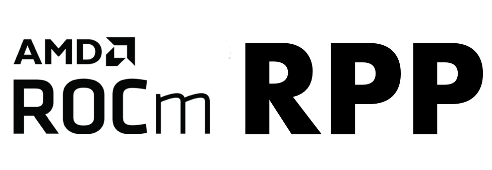
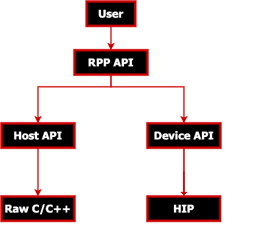
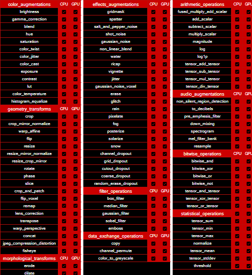
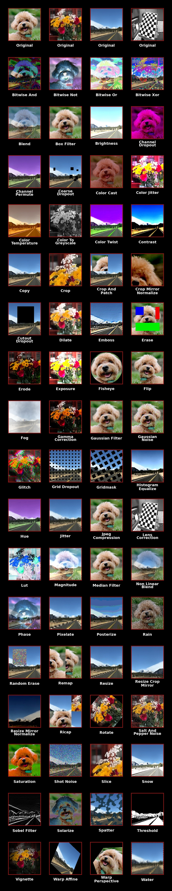
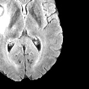
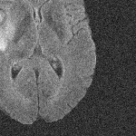
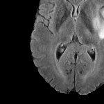
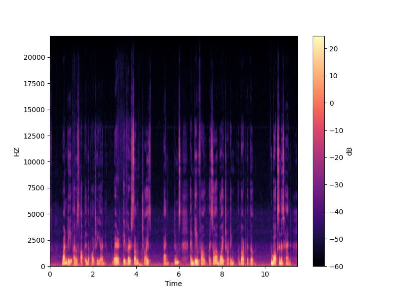

[](https://opensource.org/licenses/MIT)
[](https://gpuopen-professionalcompute-libraries.github.io/rpp/)

<p align="center"></p>


> [!NOTE]
> The published documentation is available at [ROCm Performance Primitives (RPP)](https://rocm.docs.amd.com/projects/rpp/en/latest/index.html) in an organized, easy-to-read format, with search and a table of contents. The documentation source files reside in the `docs` folder of this repository. As with all ROCm projects, the documentation is open source. For more information on contributing to the documentation, see [Contribute to ROCm documentation](https://rocm.docs.amd.com/en/latest/contribute/contributing.html).

AMD ROCm Performance Primitives (RPP) library is a comprehensive, high-performance computer
vision library for AMD processors that have `HIP`, or `CPU` backends.

<p align="center"></p>

#### Latest release
[](https://github.com/ROCm/rpp/releases)

## Supported Augmentations / Primitives

RPP supports various 2D image, 3D image (voxel), audio and miscellaneous augmentations and primitives as listed below.

<p align="center"></p>

## Supported 2D Image Augmentations Samples

<p align="center"></p>

## Supported 3D Image Augmentations Samples

<div align="center">

| &nbsp; | Input<br>(3D voxel image) | &nbsp; |
|:-------------------------:|:-------------------------:|:-------------------------:|
| &nbsp; |  | &nbsp; |
| add_scalar<br>(3D scalar addition) | subtract_scalar<br>(3D scalar subtraction) | multiply_scalar<br>(3D scalar multiplication) |
|  |  |  |
| fused_multiply_add_scalar<br>(brightened 3D image) | gaussian_noise<br>(3D noise augmentation) | flip<br>(3D flip augmentation) |
|  |  |  |

</div>

slice (3D slice - 100x200 from 240x240x155):

<p align="center"></p>

## Supported Audio Augmentations Samples

Spectrogram functionality output represented as an image:

<p align="center"></p>

## Prerequisites

### Operating Systems
* Linux
  * Ubuntu - `22.04` / `24.04`
  * RedHat - `8` / `9`
  * SLES - `15 SP7`


### Hardware
* **CPU**: [AMD64](https://rocm.docs.amd.com/projects/install-on-linux/en/latest/reference/system-requirements.html)
* **GPU**: [AMD Radeon&trade; Graphics](https://rocm.docs.amd.com/projects/install-on-linux/en/latest/reference/system-requirements.html) / [AMD Instinct&trade; Accelerators](https://rocm.docs.amd.com/projects/install-on-linux/en/latest/reference/system-requirements.html)

> [!IMPORTANT]
> * [ROCm-supported hardware required for HIP backend](https://rocm.docs.amd.com/projects/install-on-linux/en/latest/reference/system-requirements.html)
> * `gfx908` or higher GPU required

* Install ROCm `7.0.0` or later with [amdgpu-install](https://rocm.docs.amd.com/projects/install-on-linux/en/latest/how-to/amdgpu-install.html): **Required** usecase:`rocm`
> [!IMPORTANT]
> `sudo amdgpu-install --usecase=rocm`

### Compiler
* AMD Clang++ Version 18.0.0 or later - installed with ROCm
> [!NOTE]
> * For CPU only backend use Clang Version `5.0.1` or later
>   ```shell
>    sudo apt install clang
>   ```
> * To use GNU compiler or custom compilers use `-D CMAKE_CXX_COMPILER` during build

### Libraries
* CMake Version `3.10` or later
  ```shell
  sudo apt install cmake
  ```
* HIP
  ```shell
  sudo apt install hip-dev
  ```

* OpenMP
  ```shell
  sudo apt install openmp-extras-dev
  ```

* Half-precision floating-point library - Version `1.12.0` or later
  ```shell
  sudo apt install half
  ```

> [!IMPORTANT]
> * Required compiler support
>   * C++17
>   * OpenMP
>   * Threads
> * On Ubuntu 22.04 - Additional package required: libstdc++-12-dev
>  ```shell
>  sudo apt install libstdc++-12-dev
>  ```


>[!NOTE]
> * All package installs are shown with the `apt` package manager. Use the appropriate package manager for your operating system.

## Installation instructions

The installation process uses the following steps:

* [ROCm-supported hardware](https://rocm.docs.amd.com/projects/install-on-linux/en/latest/reference/system-requirements.html) install verification

* Install ROCm `7.0.0` or later with [amdgpu-install](https://rocm.docs.amd.com/projects/install-on-linux/en/latest/how-to/amdgpu-install.html) with `--usecase=rocm`

> [!IMPORTANT]
> Use **either** [package install](#package-install) **or** [source install](#source-install) as described below.

### Package install

Install RPP runtime, development, and test packages.
* Runtime package - `rpp` only provides the rpp library `librpp.so`
* Development package - `rpp-dev`/`rpp-devel` provides the library, header files, and samples
* Test package - `rpp-test` provides CTest to verify installation

> [!NOTE]
> Package install will auto install all dependencies.

#### Ubuntu

```shell
sudo apt install rpp rpp-dev rpp-test
```

#### RHEL

```shell
sudo yum install rpp rpp-devel rpp-test
```

#### SLES

```shell
sudo zypper install rpp rpp-devel rpp-test
```

### Source build and install

* Clone RPP git repository

  ```shell
  git clone https://github.com/ROCm/rpp.git
  ```

#### HIP Backend

  ```shell
  mkdir build-hip
  cd build-hip
  cmake ../rpp
  make -j8
  sudo make install
  ```
### Running Tests
  After installing RPP, refer to the [Verify installation](#verify-installation) section below for instructions on running tests.

## Verify installation

The installer will copy

* Libraries into `${ROCM_PATH}/lib`
* Header files into `${ROCM_PATH}/include/rpp`
* Samples, and test folder into `${ROCM_PATH}/share/rpp`
* Documents folder into `${ROCM_PATH}/share/doc/rpp`

### Verify with rpp-test package

Test package will install CTest module to test rpp. Follow below steps to test package install

```shell
mkdir rpp-test && cd rpp-test
cmake ${ROCM_PATH}/share/rpp/test/
ctest -VV
```
> [!NOTE]
> * **Ubuntu**: Install Nifti-Imaging to run all tests
> ```
> git clone https://github.com/NIFTI-Imaging/nifti_clib.git
> cd nifti_clib
> git reset --hard 84e323cc3cbb749b6a3eeef861894e444cf7d788
> mkdir build && cd build && cmake ..
> sudo make -j$nproc install
> ```
> * **SLES/RHEL**: Install [prerequisites](utilities/test_suite#prerequisites) to run all tests

## Test Functionalities

To test latest Image/Voxel/Audio/Miscellaneous functionalities of RPP using a python script please view [AMD ROCm Performance Primitives (RPP) Test Suite](utilities/test_suite/README.md)

## Adding RPP to your CMake project
To add RPP to your CMake project, you can use the following code after installation:

```cmake
find_package(rpp REQUIRED)
target_link_libraries(your_target PRIVATE rpp::rpp)
```

HIP backend support is automatic: `rpp::rpp` transitively propagates the HIP include paths and link libraries, and `rpp/rpp.h` includes `rpp_backend.h` which sets `RPP_BACKEND_HIP` for your compiled sources.

> [!NOTE]
> `find_package(rpp REQUIRED)` sets the following variables in your CMake project:
> * `rpp_BACKEND_TYPE` - "HIP" or "CPU" — useful for conditional CMake logic (e.g. adding HIP-specific sources)
> * `rpp_AUDIO_AUGMENTATIONS_SUPPORT` - ON or OFF

> [!TIP]
> If CMake is unable to find RPP, the following fixes can be tried:
> * Ensure `${ROCM_PATH}/bin` is in your `PATH`: `export PATH=${ROCM_PATH}/bin:$PATH`.
> * Ensure `CMAKE_PREFIX_PATH` includes `${ROCM_PATH}/lib/cmake`.


## MIVisionX support - OpenVX extension

[MIVisionX](https://github.com/ROCm/MIVisionX) RPP extension
[vx_rpp](https://github.com/ROCm/MIVisionX/tree/master/amd_openvx_extensions/amd_rpp#amd-rpp-extension) supports RPP functionality through the OpenVX Framework.

## Technical support

For RPP questions and feedback, you can contact us at `mivisionx.support@amd.com`.

To submit feature requests and bug reports, use our
[GitHub issues](https://github.com/ROCm/rpp/issues) page.

## Documentation

You can build our documentation locally using the following code:

* Sphinx

  ```bash
  cd docs
  pip3 install -r .sphinx/requirements.txt
  python3 -m sphinx -T -E -b html -d _build/doctrees -D language=en . _build/html
  ```

* Doxygen

  ```bash
  doxygen .Doxyfile
  ```

## Release notes

All notable changes for each release are added to our [changelog](CHANGELOG.md).

## Tested configurations

* Linux distribution
  * Ubuntu - `22.04` / `24.04`
  * RedHat - `8` / `9`
  * SLES - `15 SP7`
* ROCm: rocm-core - `7.0.0`+
* CMake - Version `3.10`+
* AMD Clang++ - Version `18.0.0`+
* Half - IEEE 754-based half-precision floating-point library - Version `1.12.0` / package V`1.12.0`
* OpenCV - [4.6.0](https://github.com/opencv/opencv/releases/tag/4.6.0)
