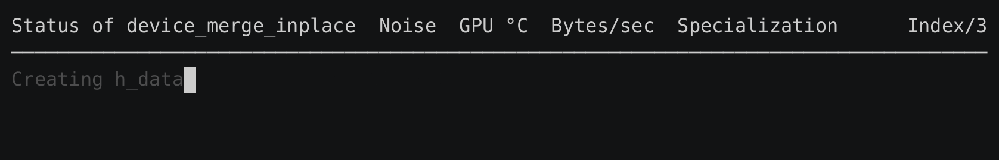
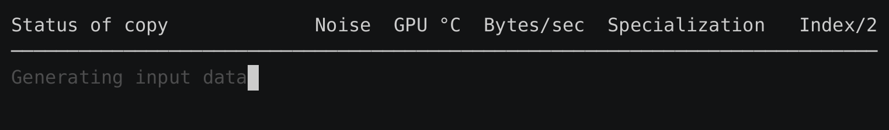

# primbench

primbench is a single-header HIP and CUDA benchmarking library.



## Features

- Simple benchmarking API
- Colored progress output
- GPU warming and cooling
- GPU cache clearing
- Batching and stream blocking
- Detailed JSON output
- Linux and Windows support

## Dependencies

### Required

- HIP or CUDA
- C++17 or later

### Optional (recommended)

For GPU temperature monitoring:
- [AMD SMI](https://rocm.docs.amd.com/projects/amdsmi/en/latest/) (HIP only, not available on Windows; typically included with ROCm)
- [NVML](https://developer.nvidia.com/management-library-nvml) (CUDA only; ships with NVIDIA drivers)

These libraries allow primbench to keep the GPU within a stable temperature range, reducing benchmark noise and improving reproducibility.

> [!IMPORTANT]
> If AMD SMI (HIP) or NVML (CUDA) is not available, for example on Windows, or if you choose not to link against these libraries, you **must** disable GPU monitoring by compiling with:
> ```
> -DPRIMBENCH_NO_MONITORING
> ```

## Example

The HIP benchmark [`examples/copy_benchmark.cpp`](./examples/copy_benchmark.cpp) demonstrates how primbench is used:

```cpp
#include "primbench.hpp"

// All benchmarked types must be declared
// This allows you to for example format `long long` as `int64_t`, or `i64`
PRIMBENCH_REGISTER_TYPE(char, "char")
PRIMBENCH_REGISTER_TYPE(long long, "long long")

// Simple copy kernel
template<typename T, unsigned int BlockSize, unsigned int ItemsPerThread>
__global__ __launch_bounds__(BlockSize)
void copy_kernel(const T* input, T* output)
{
    unsigned int idx = threadIdx.x + blockIdx.x * BlockSize * ItemsPerThread;
#pragma unroll
    for(unsigned int i = 0; i < ItemsPerThread; ++i)
        output[idx + i * BlockSize] = input[idx + i * BlockSize];
}

template<typename T>
struct copy_benchmark : public primbench::benchmark_interface
{
    primbench::json meta() const override
    {
        // This meta() method must return an `algo` key
        // The `algo` name must be identical across all queued specializations
        // primbench::json objects can be nested
        return primbench::json{}.add("algo", "copy").add("type", primbench::name<T>());
    }

    // This contains both the setup and running of the benchmark
    void run(primbench::state& state) override
    {
        const auto& stream = state.stream;
        const auto& bytes  = state.size;

        // primbench::log() calls report progress in gray
        // They help with discovering slow setup steps
        primbench::log("Calculating items");
        size_t                 N              = bytes / sizeof(T);
        constexpr unsigned int BlockSize      = 256;
        constexpr unsigned int ItemsPerThread = 4;

        const size_t items_per_block = BlockSize * ItemsPerThread;
        const size_t items = items_per_block * ((N + items_per_block - 1) / items_per_block);

        primbench::log("Generating input data");
        std::vector<T> h_input(items);
        for(size_t i = 0; i < items; ++i)
            h_input[i] = T(i);

        primbench::log("Allocating output vector");
        std::vector<T> h_output(items);

        primbench::log("Allocating device memory");
        T* d_input;
        T* d_output;
        PRIMBENCH_CHECK(hipMalloc(&d_input, items * sizeof(T)));
        PRIMBENCH_CHECK(hipMalloc(&d_output, items * sizeof(T)));

        primbench::log("Copying to device");
        PRIMBENCH_CHECK(hipMemcpyAsync(d_input,
                                       h_input.data(),
                                       items * sizeof(T),
                                       hipMemcpyHostToDevice,
                                       stream));

        dim3 grid(items / items_per_block);
        dim3 block(BlockSize);

        // primbench uses this to calculates the items/sec and bytes/sec
        state.set_items(items);
        state.add_reads<T>(items);
        state.add_writes<T>(items);

        // This passes a lambda to primbench, which calls it many times
        // primbench completely handles synchronization
        state.run(
            [&] {
                copy_kernel<T, BlockSize, ItemsPerThread>
                    <<<grid, block, 0, stream>>>(d_input, d_output);
            });

        PRIMBENCH_CHECK(hipFree(d_input));
        PRIMBENCH_CHECK(hipFree(d_output));
    }
};

int main(int argc, char* argv[])
{
    primbench::executor executor(argc, argv);

    executor.queue<copy_benchmark<char>>();
    executor.queue<copy_benchmark<long long>>();

    executor.run();
}
```

It is compiled and run like so on Linux:

```bash
hipcc -o copy_benchmark examples/hip/copy_benchmark.cpp -I. -lamd_smi && ./copy_benchmark
```

And like so in PowerShell on Windows:
```bash
hipcc -o copy_benchmark.exe examples/hip/copy_benchmark.cpp -I. -DPRIMBENCH_NO_MONITORING -std=c++17 -g --offload-arch=$(amdgpu-arch) ; ./copy_benchmark.exe
```

Its equivalent CUDA benchmark is compiled and run like so on Linux:

```bash
nvcc -o copy_benchmark examples/cuda/copy_benchmark.cu -I. -lnvidia-ml && ./copy_benchmark
```

It outputs this `results.json`:
```json
{
    "context": {
        "results_version": "4.0.0",
        "general": {
            "algorithm": "copy",
            "specialization_count": 2,
            "library_build_type": "debug",
            "gpu": {
                "name": "AMD Radeon RX 9070 XT",
                "arch": "gfx1201",
                "pci_bus_id": "0000:83:00.0"
            },
            "backend": {
                "name": "hip",
                "hip_version": "6.4.43482-0f2d60242",
                "runtime_version": "6.4.43482",
                "driver_version": "6.4.43482",
                "compiler": {
                    "name": "clang",
                    "version": "19.0.0git (https://github.com/RadeonOpenCompute/llvm-project roc-6.4.0 25133 c7fe45cf4b819c5991fe208aaa96edf142730f1d)"
                }
            },
            "monitoring": {
                "name": "amdsmi",
                "version": "25.3.0"
            },
            "temperature_type": "edge",
            "host_name": "host",
            "date": "2025-11-24T15:01:50+00:00"
        },
        "settings": {
            "size": 134217728,
            "hot": false,
            "seed": 42,
            "json_out": "results.json",
            "csv_out": "",
            "filter": "",
            "dry": false,
            "min_gpu_ms_per_batch": 10,
            "min_secs": 1,
            "noise_timeout_secs": 10,
            "batch_window_size": 10,
            "noise_tolerance_percent": 1,
            "min_gpu_temp": 50,
            "max_gpu_temp": 60,
            "max_warming_secs": 60,
            "max_cooling_secs": 60,
            "output_batches": false,
            "spaces_per_indent": 4,
            "stream_blocking_timeout_secs": 10
        },
        "flags": {
            "sync": false
        }
    },
    "specializations": [
        {
            "index": 0,
            "name": "type: char",
            "bytes_per_second": 7.5628e+11,
            "items_per_second": 3.7814e+11,
            "bytes_per_item": 2,
            "items": 134217728,
            "noise_timeout": false,
            "noise_percent": 0.0521193,
            "meta": {
                "algo": "copy",
                "type": "char"
            },
            "elapsed_secs": {
                "host": 1.01423,
                "gpu": 0.511131
            },
            "gpu_temp_celsius": {
                "start": 49,
                "end": 49
            },
            "calls": {
                "kernel_calls_per_batch": 32,
                "ms_per_batch": 11.3546,
                "batches": 45,
                "kernel_calls": 1440
            }
        },
        {
            "index": 1,
            "name": "type: long long",
            "bytes_per_second": 1.29793e+12,
            "items_per_second": 8.11204e+10,
            "bytes_per_item": 16,
            "items": 16777216,
            "noise_timeout": false,
            "noise_percent": 0.0519677,
            "meta": {
                "algo": "copy",
                "type": "long long"
            },
            "elapsed_secs": {
                "host": 1.015,
                "gpu": 0.423253
            },
            "gpu_temp_celsius": {
                "start": 49,
                "end": 49
            },
            "calls": {
                "kernel_calls_per_batch": 64,
                "ms_per_batch": 13.2405,
                "batches": 32,
                "kernel_calls": 2048
            }
        }
    ],
    "summary": {
        "noise_timeouts": 0,
        "elapsed_secs": {
            "host": 6.67644,
            "gpu": 0.934384
        }
    }
}
```

## Command-line Options

You can also pass `--help` to benchmarks to print the available options.

| Option                                   | Description                                                                                                                                                                        |
| ---------------------------------------- | ---------------------------------------------------------------------------------------------------------------------------------------------------------------------------------- |
| `--help`                                 | Display this help and exit.                                                                                                                                                        |
| `--size`                                 | Input size. Benchmarks decide what this represents, but it is commonly the number of bytes or items. Supports the suffixes KiB/MiB/GiB, e.g. `--size 256KiB`. (default: 128MiB)    |
| `--hot`                                  | Skip clearing the GPU cache between batch iterations.                                                                                                                              |
| `--seed`                                 | Seed used for input generation. (default: 42)                                                                                                                                      |
| `--json-out`                             | JSON path to write benchmark results to. (default: results.json)                                                                                                                   |
| `--csv-out`                              | CSV path to write benchmark results to.                                                                                                                                            |
| `--filter`                               | Regex filter of specialization names to benchmark.                                                                                                                                 |
| `--dry`                                  | Perform a dry run. JSON and CSV files are still output, but benchmark setup and execution are skipped.                                                                             |
| `--min-gpu-ms-per-batch`                 | Minimum duration of a batch in milliseconds (GPU time). (default: 10)                                                                                                              |
| `--min-secs`                             | Minimum total benchmark duration in seconds (wall time). (default: 1)                                                                                                              |
| `--noise-timeout-secs`                   | Maximum total benchmark duration in seconds before timing out a noisy run (wall time). (default: 10)                                                                               |
| `--batch-window-size`                    | Number of batch times used in the noise (coefficient of variation) window to decide early benchmark stopping. (default: 10)                                                        |
| `--noise-tolerance-percent`              | Noise tolerance of batch times in percent, used to determine whether a benchmark can be stopped early. (default: 1)                                                                |
| `--min-gpu-temp`                         | Minimum GPU temperature in °C. Too low slows benchmarks; too high increases noise. (default: 50)                                                                                   |
| `--max-gpu-temp`                         | Maximum GPU temperature in °C. Too low slows benchmarks; too high increases noise. (default: 60)                                                                                   |
| `--max-warming-secs`                     | Maximum seconds allowed for GPU warming before an error is thrown. (default: 60)                                                                                                   |
| `--max-cooling-secs`                     | Maximum seconds allowed for GPU cooling before an error is thrown. (default: 60)                                                                                                   |
| `--output-batches`                       | Output a `batches` array for each specialization, containing per-batch details.                                                                                                    |
| `--spaces-per-indent`                    | Number of spaces per indentation level in JSON output. Set to 0 for no indentation. (default: 4)                                                                                   |
| `--stream-blocking-timeout-secs`         | Maximum stream blocking duration in seconds before timing out. Stream is blocked while queueing kernel calls. Use `primbench::flags::sync` if kernel is synchronous. (default: 10) |

### Adding Custom Options

Benchmarks can register additional custom options, which will also be listed by `--help`:
```c++
// 3 is passed as the default value
size_t dimensions = executor.get<size_t>("dimensions", 3, "The number of dimensions");
```

If there are any custom options, the object `context.custom_settings` is output to `results.json`.

## Passing Settings Programmatically

Benchmarks can optionally provide a `primbench::settings` struct when constructing the executor. This allows a benchmark to set defaults directly in code:

```cpp
primbench::settings settings;
settings.min_gpu_ms_per_batch    = 100;
settings.noise_tolerance_percent = 2;
primbench::executor executor(argc, argv, settings);
```

Starting with C++20, you can also use designated initializers to set fields inline:

```cpp
primbench::executor executor(argc,
                             argv,
                             {
                                 .min_gpu_ms_per_batch = 100,
                                 .noise_tolerance_percent = 2,
                             });
```

All command-line options are stored in this same `settings` struct and are written verbatim to `context.settings` in the JSON output. If an option is provided both programmatically and on the command line, the command-line value always takes precedence.

## Filtering Specializations

You can use the `--filter` option with a regex pattern to benchmark only specific specializations. For example, to benchmark only the `type: long long` specialization from the example program:

```bash
./copy_benchmark --filter 'type: long long'
```

The filter matches against the specialization name. Other valid patterns include:

```bash
./copy_benchmark --filter long  # Matches any name containing 'long'
./copy_benchmark --filter 'l.*g'  # Contains an 'l' followed by a 'g' later
./copy_benchmark --filter '^type: long long$'  # Exact regex match
```

## Noise

Noise is the variance in throughput between runs. It is measured as the coefficient of variation, which is the standard deviation divided by the mean.

primbench's primary goal is to minimize noise so that real performance improvements are easier to see. For example, if a benchmark has 10% noise, a 4% performance improvement can't be distinguished from noise.

Other processes running on the same GPU can introduce noise, so those processes should be stopped by the user before running any benchmarks.

Benchmarks that have been noisy for more than 10 seconds are automatically timed out (`--noise-timeout-secs`):



### GPU Warming and Cooling

To reduce noise and ensure consistent timings, primbench ensures the GPU is within a stable temperature range. Cold GPUs boost and inflate performance; hot GPUs throttle and add variance.

Before benchmarking a batch, primbench:

* Warms the GPU to ≥ 50 °C (`--min-gpu-temp`).
* Cools it if it exceeds 60 °C (`--max-gpu-temp`).


Temperatures are read using AMD SMI/NVML. Warming uses short GPU workloads; cooling waits until the GPU naturally drops back into range. If either process takes more than 60 seconds, primbench aborts (`--max-warming-secs`, `--max-cooling-secs`).

### GPU Temperature Sensor Selection

primbench supports multiple GPU temperature sensors exposed by AMD SMI, such as `edge` and `hotspot`. At startup, it probes the available sensors and selects the first one that successfully returns a reading. The chosen sensor type is cached and used consistently for warming, cooling, and reporting. If no supported sensor can be read, primbench terminates with an error.

The selected temperature sensor type is recorded in the JSON output as `context.general.temperature_type`.

primbench always uses the GPU temperature sensor called `gpu` for CUDA benchmarks.

### GPU Cache Clearing

primbench clears the GPU cache before each batch to reduce noise and ensure consistent timings. This simulates a "cold run" by preventing leftover data from previous kernel executions from affecting results.

* The `--hot` flag skips cache clearing, allowing a "hot cache" scenario where data is reused between batches.
* The default cache size is 256 MiB, but `PRIMBENCH_GPU_CACHE_SIZE` can be overridden at compile time to match your GPU's cache size.

### Timing Details

Kernels often only take a few microseconds to run on the GPU, leading to a lot of variance in how long each kernel call takes. For this reason, primbench calculates the noise across the last 10 *batches*, rather than the noise across the last 10 *kernel calls* (`--batch-window-size`).

The number of kernel calls in a batch is dynamically decided. The number of kernel calls is doubled until the batch takes *at least* 10 milliseconds to run on the GPU (`--min-gpu-ms-per-batch`).

Before timing the first batch, primbench issues a single unmeasured kernel launch as a warmup, giving the GPU a chance to cache the kernel's instructions before real measurements begin.

In some cases, the recorded start time occurs before the kernel actually begins executing, since event recording is asynchronous. To reduce this timing noise, primbench queues the start, kernel, and stop events together in one atomic sequence.

It does this by briefly blocking GPU execution with a lightweight spinlock kernel until all events are enqueued. Once queued, the block is released and execution proceeds:

```c++
block(stream);
hipEventRecord(start, stream);
kernel(stream);
hipEventRecord(stop, stream);
unblock(stream);
elapsed = stop - start;
```

When benchmarking synchronous algorithms, the `primbench::flags::sync` flag must be passed to the executor to disable stream blocking, since the spinlock will otherwise deadlock after 10 seconds (`--stream-blocking-timeout-secs`).

## Outputting CSV

Benchmarks can produce a CSV file alongside the JSON output by passing `--csv-out results.csv`.

This CSV is a condensed version of the `results.json` file. It includes only index, name, throughput, and noise:

```
index,name,bytes_per_second,gib_per_second,items_per_second,noise_timeout,noise_percent
0,"type: char",7.5628e+11,704.340,3.7814e+11,0,0.0521193
1,"type: long long",1.29793e+12,1208.79,8.11204e+10,0,0.0519677
```

If you only want CSV output and don't need the JSON file, pass `--json-out /dev/null`.

## Preserving Input Between Kernel Calls

For benchmarks that modify input data in-place, `state.run_before_every_iteration(lambda)` allows you to restore inputs before each kernel call. This ensures every kernel call starts from a clean state, producing deterministic results. Note that this is **not** related to noise reduction; it only prevents mutated inputs from affecting subsequent kernel calls.

## Outputting the Branch Name and Commit Hash

If the macros `BRANCH_NAME` and/or `COMMIT_HASH` are defined at compile time, they are included in `results.json` as:
- `context.general.branch_name`
- `context.general.commit_hash`

The command below embeds the current branch and commit hash.
If the repository is in a detached HEAD state (for example in CI or when checking out a specific commit), no branch is active and `BRANCH_NAME` is set to `DETACHED`.

```bash
hipcc -o copy_benchmark examples/hip/copy_benchmark.cpp \
  -I. \
  -lamd_smi \
  -DBRANCH_NAME=\"$(git symbolic-ref -q --short HEAD || echo DETACHED)\" \
  -DCOMMIT_HASH=\"$(git rev-parse --short HEAD)\" \
  && ./copy_benchmark
```

## CLI Colors

primbench follows the [Standard for ANSI Colors in Terminals](https://bixense.com/clicolors/):

* Colors are **enabled by default only when stdout is a terminal**.
* Colors can be **forced off** by setting the `NO_COLOR` environment variable.
* Colors can be **forced on** by setting the `CLICOLOR_FORCE` environment variable.
