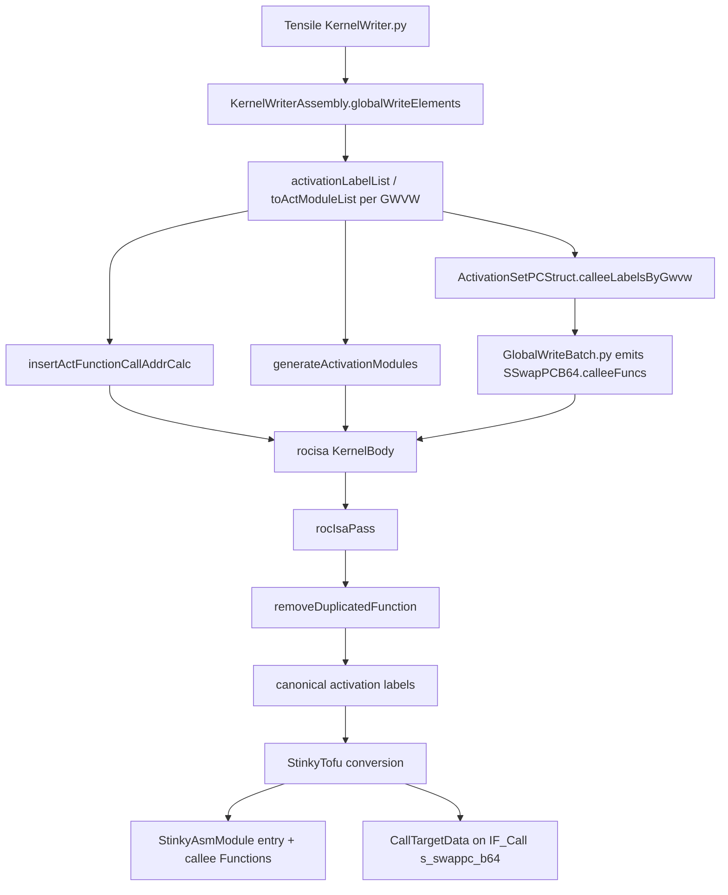

# Long-Branch CFG Construction

This document describes how StinkyTofu builds correct Control-Flow Graphs (CFGs) for AMDGPU kernels that use the **`s_setpc_b64` long-branch idiom** (runtime PC fixup to a distant label). **`s_swappc_b64`** is a **call** (`IF_Call`): it does not use `IF_Branch` / `IF_IndirectBranch` for CFG purposes; use `getCallTargets()` / `CallTargetData` for callee metadata, and expect normal **fall-through** in the caller CFG after the call site.

## Why this matters

The AMDGPU short branches (`s_branch`, `s_cbranch_*`) carry their target as a 16-bit signed immediate. When a target label is more than ±32 KiB away the
assembler rejects the branch and the kernel writer must emit a **long-branch idiom** that computes the target PC at runtime via `s_getpc_b64`, an `s_add_i32` against the label, a 64-bit add/sub of the offset, and finally `s_setpc_b64`:

```
s_getpc_b64  s[D:D+1]                  // PC of next instruction
s_add_i32    sX, label_target, 4       // displacement from PC anchor
s_add_u32    sD,   sD,   sX            // 64-bit add (low half)
s_addc_u32   sD+1, sD+1, 0             // 64-bit add (carry)
s_setpc_b64  s[D:D+1]                  // jump to label_target
```

Because `s_setpc_b64` takes its target from a **register**, it is an *indirect* branch as far as the assembler is concerned.
Without `LabelData` the CFG builder cannot know which label it targets, and the basic block containing the long branch ends up with no statically-known successor edge. That broke:

- dominator analysis (the long-branch target appeared unreachable),
- DAG scheduling at region boundaries that crossed long branches,
- waitcnt insertion across long branches, and
- any pass that walked CFG successors to propagate state.

The branch vocabulary and the long-branch lowering pass together rebuild the
CFG correctly for these instructions without changing what the assembler
emits.

## Two input paths into StinkyTofu

There are two ways AMDGPU instructions reach the StinkyTofu Asm IR; the long-branch story differs slightly between them.

| Path | Source | Long-branch metadata source |
|------|--------|-----------------------------|
| **rocisa Python frontend** | TensileLite (`KernelWriterAssembly.py` etc.) emits a `rocisa::Module` and calls `rocisa.toStinkyTofuModule(...)`. | The `SLongBranch*` helpers in rocisa stamp the target label on the `SSetPCB64`; the converter reads it and stamps `LabelData`. |
| **Raw `.s` files** | `RawAsmParser` (used by `stinkytofu-opt` and FileCheck tests) parses assembly text. | No rocisa hint exists; `LongBranchLoweringPass` pattern-matches the idiom and stamps `LabelData`. |
| **Textual `.stir` files** | `IRParser` parses serialized StinkyTofu IR. | Use serialized `mod.label` on `s_setpc_b64` if present; otherwise the instruction remains an opaque indirect branch unless a recovery pass can prove the target. |

Both paths converge on the same StinkyTofu IR shape: an `s_setpc_b64`
instruction carrying a `LabelData{X}` modifier whose `label` is the target.
Downstream passes only need to read `getBranchTargets()` — they do not need
to know which path produced the metadata.

### Quick IR example

```
st.module @kernel {
  st.func @entry() {
    ^bb_before:
      "st.s_getpc_b64"(s[62:63]) { issueCycles = 1, latencyCycles = 1 }
      "st.s_add_i32"(s64, label_PrefetchEnd, 4) { issueCycles = 1, latencyCycles = 1 }
      "st.s_add_u32"(s62, s62, s64) { issueCycles = 1, latencyCycles = 1 }
      "st.s_addc_u32"(s63, s63, 0) { issueCycles = 1, latencyCycles = 1 }
      // Metadata only — emitted asm is still s_setpc_b64 s[62:63]
      "st.s_setpc_b64"(s[62:63]) {
        issueCycles = 1, latencyCycles = 1,
        mod.label = { label = "label_PrefetchEnd", alignment = 1 }
      }

    ^label_PrefetchEnd:
      "st.s_nop"(0) { issueCycles = 1, latencyCycles = 1 }
  }
}
```

`getBranchTargets` on the `s_setpc_b64` returns `{"label_PrefetchEnd"}`; `CFGBuilderPass`
adds a successor edge `bb_before → label_PrefetchEnd`. Without `mod.label`, the same
`s_setpc_b64` would return `{}` and the CFG would not know the target block.

## Branch vocabulary

"Branch vocabulary" is the small set of flags, modifiers, and helper predicates that the CFG builder and every branch-aware pass agree to speak in. Adding it does not, by itself, change any CFG: it gives producers (the converter, `LongBranchLoweringPass`) a uniform place to record **`LabelData` on `s_setpc_b64`** for long branches, and gives consumers a single API (`isBranch` / `isIndirectBranch` / `getBranchTargets`) to read it back. **Calls** (`IF_Call`, e.g. `s_swappc_b64`) use `isCall()` / `getCallTargets()` instead and are not wired as CFG branch edges.

### Instruction flags (`InstFlag`)

`IF_IndirectBranch` in `include/stinkytofu/hardware/Flags.def` marks **branches** whose target PC comes from a register (today: `s_setpc_b64`). It is always set together with `IF_Branch`. **`IF_Call`** marks call-like sites such as `s_swappc_b64` (LLVM AMDGPU `isCall`); it is not combined with `IF_Branch` for CFG.

### Branch helpers (`StinkyAsmIR.hpp`)

`include/stinkytofu/ir/asm/StinkyAsmIR.hpp` exposes the canonical predicates that all passes should use to classify branches:

| Helper | Returns true for |
|--------|------------------|
| `isBranch(inst)` | Any branch (direct, conditional, indirect). **Not** `s_swappc_b64` (`IF_Call`). |
| `isCall(inst)` | `IF_Call` (e.g. `s_swappc_b64`). |
| `isControlTransfer(inst)` | Branches or calls. Use this when a pass needs a scheduling/control boundary rather than a CFG branch. |
| `isConditionalBranch(inst)` | `s_cbranch_*` family. |
| `isUnconditionalBranch(inst)` | `isBranch && !isConditionalBranch`. |
| `isIndirectBranch(inst)` | `IF_IndirectBranch` set (e.g. `s_setpc_b64`). |

The CFG-relevant query is `getBranchTargets(inst) -> std::vector<std::string>`. It returns label names that `CFGBuilderPass` may wire as successor edges within the current `Function`, in source order:

1. **`LabelData` modifier → `{label}`**. Set by the converter for normal rocisa branches and for `SSetPCB64.longBranchLabel`; also set by `LongBranchLoweringPass` after pattern-matching the raw-asm idiom.
2. **`isIndirectBranch(inst)` → `{}`**. Without `LabelData` an indirect branch has no statically-known successor.
3. **Legacy `LiteralString` first src operand → `{src0_string}`**. This is the path used by `s_branch` / `s_cbranch_*` parsed from raw `.s`, where the parser stores the label as the literal-string operand.

A single-target shim, `getBranchTarget(inst)`, returns the first element of `getBranchTargets(inst)` (or `""` if empty) for callers that pre-date the multi-target form.

Call-site metadata uses a separate query:

| Helper | Returns |
|--------|---------|
| `getCallTargets(inst)` | `CallTargetData.callees` when `inst` is `IF_Call`; otherwise `{}`. |

`CallTargetData` is for call-graph, diagnostics, and scheduling visibility. It is
not a branch target list, and `CFGBuilderPass` never turns it into CFG successor
edges.

### ISA reclassification and CFG fall-through rules

The Gfx1250 instruction table (`hardware/src/gfx/Gfx1250/Gfx1250Instructions.def`)
now reflects the actual hardware semantics:

```
SSwappcB64Inst, "s_swappc_b64", .flags = {Call, HasSideEffect}, ...
SSetpcB64Inst,  "s_setpc_b64",  .flags = {Branch, IndirectBranch, HasSideEffect}, ...
```

`CFGBuilderPass` (in `src/transforms/asm/CFGBuilderPass.cpp`) adds successor edges
from `getBranchTargets` and fall-through only for **conditional** branches.
**Unconditional** branches (including `s_setpc_b64` without `LabelData`) do not
fall through. **`s_swappc_b64`** is not `IF_Branch`, so the CFG adds a normal
fall-through edge to the following block; `CallTargetData` never becomes a CFG successor list.

| Instruction | Successor edges (`getBranchTargets`) | Fall-through |
|-------------|--------------------------------------|--------------|
| `s_setpc_b64` (no `LabelData`) | none | no — block after is unreachable |
| `s_setpc_b64` with `LabelData{X}` | block labelled `X` | no |
| `s_swappc_b64` | none (`getCallTargets` / `CallTargetData` only) | **yes** — next block in source order |

`tests/unit/asm/SetpcSwappcCfgTest.cpp` exercises `s_setpc_b64` and `s_swappc_b64` CFG behaviour.

## Long-branch lowering

`LabelData` on an `s_setpc_b64` is what turns it from "opaque indirect jump" into "direct branch to label X" for CFG purposes. Two components produce that modifier — one per input path — and the StinkyTofu converter is the place where both meet.

### `LongBranchLoweringPass` — for raw `.s` input

- Header: `include/stinkytofu/transforms/asm/LongBranchLoweringPass.hpp`
- Source: `src/transforms/asm/LongBranchLoweringPass.cpp`
- Tests:  `tests/unit/asm/LongBranchLoweringTest.cpp`, `tests/filecheck/cfg_long_branch.s`

The pass walks each basic block and, for every `s_setpc_b64` that carries no `LabelData`, scans **backward within the same block** for the rocisa long-branch fingerprint:

```
s_getpc_b64                  s[D:D+1]              (optional anchor)
s_add_i32                    sX, LBL, ±4
s_abs_i32  sX, sX                                  (optional, negative arm)
s_add_u32  / s_sub_u32       sD,   sD,   sX
s_addc_u32 / s_subb_u32      sD+1, sD+1, 0
s_setpc_b64                  s[D:D+1]
```

Matching is done with a small reverse state machine (`NeedAddC → NeedAddLo → NeedAddI`) keyed off the SGPR pair `s[D:D+1]` consumed by the `s_setpc_b64`.
The label "LBL" comes from the `s_add_i32 ?, LBL, ±4` anchor (its first src operand is a `LiteralString`). The pass stops the backward walk when it hits any other branch, so it never crosses into a previous long-branch region.

Defensive properties:

- **Idempotent**: skips any `s_setpc_b64` that already has `LabelData`.
- **No instruction rewriting**: only attaches a `LabelData` modifier; the emitted assembly is byte-identical.
- **Preserves CFG analyses** (`return preserveCFGAnalyses();`): subsequent CFG construction picks up the new modifier automatically.

The pass is registered with `stinkytofu-opt` as `LongBranchLoweringPass` (see `tools/stinkytofu-opt/stinkytofu-opt.hpp::availablePasses`) so it can be invoked standalone, e.g.:

```bash
stinkytofu-opt --arch gfx1250 input.s --LongBranchLoweringPass --emit-asm
```

> **Pipeline status:** the default `gfx1250` backend uses
> `LongBranchLoweringPass` inside the scoped `expertScheduleMode2` pipeline before
> that region's `CFGBuilderPass`. It is not run as a global whole-kernel pass.
> The Tensile production path normally goes through the rocisa converter, which
> already stamps `LabelData` from `SSetPCB64.longBranchLabel` before the kernel-wide
> `CFGBuilderPass`. If you bring up a raw `.s` kernel and need long-branch CFG
> edges outside `expertScheduleMode2`, add `LongBranchLoweringPass` to your pass
> manager before `CFGBuilderPass`.

### `SSetPCB64.longBranchLabel` — for the rocisa Python frontend

When TensileLite generates a long branch via `rocisa::SLongBranch`, `SLongBranchPositive`, or `SLongBranchNegative` (`rocisa/include/instruction/extension.hpp`), the helper now records the target label directly on the terminating `s_setpc_b64`:

```cpp
struct SSetPCB64 : public BranchInstruction {
    // Optional long-branch target hint. Empty == "no hint".
    // Set by the SLongBranch* helpers; consumed by the StinkyTofu
    // converter. Does NOT change toString() or the emitted assembly.
    std::string longBranchLabel;
    // ...
};
```

A small inline helper, `addSSetPCB64WithLongBranchLabel(module, src, labelName, comment)`, builds an `SSetPCB64`, stamps `longBranchLabel`, and appends it to the module in one step. Every `SLongBranch*` helper goes through it, so the field is set wherever the long-branch idiom is emitted from rocisa.

The field is exposed to Python via nanobind:

```python
inst = rocisa.instruction.SSetPCB64(src=sgpr(62, 2), comment="branch to label_foo")
assert inst.longBranchLabel == ""        # default
inst.longBranchLabel = "label_foo"       # publicly settable
assert str(inst) == "s_setpc_b64 s[62:63]                          // branch to label_foo\n"  # unchanged
```

The field is preserved by both the C++ copy constructor (used by
`SSetPCB64::clone()`) and the nanobind `__deepcopy__` hook in
`rocisa/src/instruction/branch.cpp`, so neither rocisa-internal IR
manipulation nor Python-level `deepcopy` drops the long-branch hint.

### Converter integration

`src/conversion/rocisa/ToStinkyTofuUtils.cpp::legalizeInstruction()` first handles
`SSwapPCB64` as a call:

```cpp
if (auto* swappc = dynamic_cast<rocisa::SSwapPCB64*>(rocisaInst)) {
    assert(isCall(*inst) && "SSwapPCB64 must lower to an IF_Call instruction");
    if (!swappc->calleeFuncs.empty()) {
        inst->addModifier<CallTargetData>(CallTargetData{swappc->calleeFuncs});
    }
    return {nullptr, nullptr};
}
```

This must happen **before** the branch block because `s_swappc_b64` is lowered as
`IF_Call`, not `IF_Branch`. It does not stamp `LabelData`, and the callee list
will not become CFG successor edges.

For rocisa branches (including `SSetPCB64` long-branch metadata), the converter
then uses:

```cpp
if (isBranch(*inst)) {
    auto* branchInst = dynamic_cast<rocisa::BranchInstruction*>(rocisaInst);

    // SSetPCB64 carries its target in a dedicated longBranchLabel field
    // (the base BranchInstruction::labelName is always "" for SSetPCB64).
    // When the field is empty the instruction is a generic indirect set-PC
    // and we leave LabelData unset so getBranchTargets()'s isIndirectBranch
    // fallback returns {}.
    if (auto* setpc = dynamic_cast<rocisa::SSetPCB64*>(rocisaInst)) {
        if (!setpc->longBranchLabel.empty()) {
            inst->addModifier<LabelData>(LabelData{setpc->longBranchLabel});
        }
        return {nullptr, nullptr};
    }

    inst->addModifier<LabelData>(LabelData{branchInst->labelName});
    return {nullptr, nullptr};
}
```

Net effect of the rocisa field plus the converter step:

- Every `s_setpc_b64` produced by an `SLongBranch*` helper arrives in
  StinkyTofu carrying `LabelData{<target>}`.
- Every `s_setpc_b64` produced by some other rocisa caller (or by raw `.s`)
  stays unannotated so `LongBranchLoweringPass` can recover the target later.
- Every other rocisa branch class (`SBranch`, `SCBranchSCC0`, ...) keeps
  its existing behaviour: `LabelData{branchInst->labelName}` is stamped
  unconditionally.

## Activation function-call flow

Function-call support adds multi-function StinkyTofu modules and explicit
call-target metadata, but it does not change long-branch CFG rules. Long branches
still use `LabelData` on `s_setpc_b64`; activation calls use `CallTargetData` on
`s_swappc_b64`.



Key source locations:

- TensileLite activation labels and bodies:
  `projects/hipblaslt/tensilelite/Tensile/KernelWriterAssembly.py`
- TensileLite call-site instruction:
  `projects/hipblaslt/tensilelite/Tensile/Components/GlobalWriteBatch.py`
- rocisa pass entry point:
  `projects/hipblaslt/tensilelite/rocisa/rocisa/src/pass/pass.cpp`
- rocisa duplicate activation removal:
  `projects/hipblaslt/tensilelite/rocisa/rocisa/src/pass/remove.cpp`
- StinkyTofu rocisa conversion:
  `shared/stinkytofu/src/conversion/rocisa/ToStinkyTofuUtils.cpp`

### TensileLite producer flow

After the kernel body is generated, `KernelWriter.py` runs `rocIsaPass` with
duplicate activation cleanup enabled for activation-call kernels:

```python
ripo = rocIsaPassOption()
ripo.removeDupFunc = bool(kernel["ActivationFuncCall"])
ripo.numWaves = kernel["NumThreads"] // kernel["WavefrontSize"]

if kernel["ProblemType"]["ActivationType"] == "all":
  ripo.removeDupAssign = False
if self.states.archCaps["HasSchedMode"]:
  ripo.insertDelayAlu = True

passResult = rocIsaPass(moduleKernelBody, ripo)
```

When `kernel["ActivationFuncCall"]` is true, `globalWriteElements(...)` allocates:

- `sgprOffsetActivation`: SGPR pair holding the selected callee PC.
- `sgprOffsetBack`: SGPR pair where `s_swappc_b64` saves the return PC.
- `vgprActCopy`: VGPR window used to copy activation inputs/results across the
  call boundary.

It also builds per-vector-width activation labels:

```python
activationLabelList = {}
toActModuleList = {}
activationEnumStrList = ActivationType.getEnumStrList(...)
for gwvw in vectorWidths:
  if gwvw in activationLabelList:
    continue
  activationLabelList[gwvw] = []
  toActModuleList[gwvw] = []
  for enumStr in activationEnumStrList:
    name = self.labels.getNameInc("Activation_%s_VW%u" % (enumStr.capitalize(), gwvw))
    activationLabelList[gwvw].append(Label(name, ""))
    toActModuleList[gwvw].append(Label("To_%s" % name, ""))
```

Those labels are captured on `ActivationSetPCStruct` as the frontend's
authoritative call-target knowledge:

```python
calleeLabelsByGwvw = {
  gwvw: tuple(label.getLabelName() for label in labels)
  for gwvw, labels in activationLabelList.items()
}
activationSetPCStruct = self.ActivationSetPCStruct(
  sgprOffsetActivation=sgprOffsetActivation,
  sgprOffsetBack=sgprOffsetBack,
  vgprActCopy=tmpVgpr.idx,
  calleeLabelsByGwvw=calleeLabelsByGwvw)
```

### Why activation labels duplicate

Activation labels are created with `self.labels.getNameInc(...)`. Repeated base
names receive suffixes:

```text
label_Activation_Dgelu_VW1
label_Activation_Dgelu_VW1_1
label_Activation_Dgelu_VW1_2
```

Duplicates arise because global-write generation can emit several structurally
similar activation-call regions:

- full-width and edge-width store paths,
- beta and non-beta paths,
- factor-dimension branches,
- GSU/StreamK or multiple-buffer global-write modes,
- `ActivationType=all`, where every call site has a list of possible activation
  enum callees,
- deferred edge/global-write blocks that move store work out of the inline path.

TensileLite emits activation helpers while building each global-write path, not
as one global function table up front:

```text
path A global store
  compute activation target address
  call activation body
  later emits activation body label_Activation_Dgelu_VW1

path B global store
  compute activation target address
  call activation body
  later emits activation body label_Activation_Dgelu_VW1_1
```

Both paths may need the same activation body because they share the same `gwvw`
and register context. During generation, however, each path asks for "the
activation body for this path" independently. `getNameInc(...)` creates fresh
labels so assembly labels stay unique until a later pass proves sharing is safe.

The important distinction is:

```text
Call sites are not duplicates.
Activation bodies can be duplicates.
```

Even after duplicate cleanup, each global-write path may still need its own
address-calculation block:

```asm
label_To_Activation_Dgelu_VW1:
  s_add_i32 ..., label_Activation_Dgelu_VW1, 4

label_To_Activation_Dgelu_VW1_1:
  s_add_i32 ..., label_Activation_Dgelu_VW1, 4
```

Both call sites now target the same kept callee body:

```asm
label_Activation_Dgelu_VW1:
  ...
  s_setpc_b64 s[26:27]
```

Fresh labels are still correct at generation time: two bodies with the same
activation enum can use different VGPR/temp-register windows. The safe merge
point is rocisa's `removeDuplicatedFunction`, which groups by an activation
function wrapper name that includes vector width and register context.

### Address calculation blocks

`insertActFunctionCallAddrCalc(...)` emits an `InsertActFuncCallAddrCalc` module
for a call-site placement:

```python
module = Module(getActFuncBranchModuleName())
setAddrEndLabel = Label(self.labels.getNameInc("ActivationSetPCAddrEnd"), "")
toActModules = deepcopy(toActModuleList[gwvw])
```

For `ActivationType=all`, it branches on `ActivationType` to one of the
`To_Activation_*` labels:

```python
if index != 0:
  enumIndex = ActivationType.getEnumIndex(activationEnumStrList[index])
  module.add(self.getSCMPKInstruction("EQU32", "ActivationType", enumIndex,
                                      comment="activationType == %u" % enumIndex))
  module.add(SCBranchSCC1(toActModule.getLabelName(), "Branch if true"))
```

Each `To_Activation_*` block computes a PC-relative target address:

```python
module.add(toActModule)
with self.allocTmpSgpr(1, tag="insertActFunctionCallAddrCalc_tmpSgprInfo") as tmpSgprInfo:
  module.addModuleAsFlatItems(SGetPositivePCOffset(sgprOffset, activationLabelModule, tmpSgprInfo))
module.add(SBranch(setAddrEndLabel.getLabelName()))
```

The resulting assembly shape is:

```asm
label_To_Activation_Dgelu_VW1:
s_getpc_b64 s[12:13]
s_add_i32 s8, label_Activation_Dgelu_VW1, 4 // target branch offset
s_add_u32 s12, s12, s8
s_addc_u32 s13, s13, 0
s_branch label_ActivationSetPCAddrEnd
```

The `s_add_i32` operand is the branch-target label that
`removeDuplicatedFunction` later canonicalizes.

### Activation body modules and call sites

`generateActivationModules(...)` creates a wrapper module named by
`getActFuncModuleName(...)`:

```python
actModules = Module(getActFuncModuleName(
  gwvw, activationSetPCStruct.vgprActCopy, tmpVgpr.idx, actTempSgpr))
```

That wrapper name includes vector width and register context:

```cpp
"ActFunc_VW" + gwvw + "_Sgpr" + sgpr + "_Tmp" + tmpVgpr + "_" + tmpSgpr
```

Inside the wrapper, each concrete activation body is a callable module:

```python
actModule = Module(activationLabelModule.getLabelName())
actModule.isCallable = True
actModule.callableName = activationLabelModule.getLabelName()
actModule.add(activationLabelModule)
...
actModule.add(SSetPCB64(src=sgpr(activationSetPCStruct.sgprOffsetBack, 2)))
actModules.add(actModule)
```

The call site is emitted in `GlobalWriteBatch.py`:

```python
swappc = SSwapPCB64(dst=sgpr(self.activationSetPCStruct.sgprOffsetBack, 2),
                    src=sgpr(self.activationSetPCStruct.sgprOffsetActivation, 2))
calleeLabelsByGwvw = getattr(self.activationSetPCStruct, "calleeLabelsByGwvw", None)
if calleeLabelsByGwvw:
  calleeFuncs = list(calleeLabelsByGwvw.get(self.gwvw, ()))
  if calleeFuncs:
    swappc.calleeFuncs = calleeFuncs
activationModule.add(swappc)
```

This attaches possible callees to `SSwapPCB64` without changing assembly text.
For `ActivationType=all`, the list can contain several labels.

## rocisa duplicate activation removal

`rocIsaPass` runs duplicate function removal before macro/composite lowering:

```cpp
if(option.removeDupFunc)
{
    removeDuplicatedFunction(kernel->body);
}

macroToInstruction(kernel->body);
compositeToInstruction(kernel->body);
convertTextVariablesToRegisters(kernel->body);
```

That ordering matters: duplicate cleanup still sees high-level `Module`, `Label`,
`SAddI32`, and `SSwapPCB64` objects, so it can update both address-calculation
operands and call metadata before StinkyTofu conversion.

### Finding and removing duplicates

`_findActFunc(...)` recursively walks the module tree and collects modules whose
name contains `ActFunc_VW`:

```cpp
if(mod->name.find("ActFunc_VW") != std::string::npos)
{
    modFunc[mod->name].push_back(mod);
}
```

The key is the wrapper module name, not just the activation enum. This groups
activation bodies that share vector width and register context, and it avoids
merging bodies that look semantically similar but use different VGPR/temp
register windows.

For each wrapper-name group with more than one module, the pass:

1. Captures the first activation label from each duplicate wrapper.
2. Removes all wrappers from their original parents.
3. Adds only the first wrapper to a trailing `AddToLast` module.
4. Rewrites callers with `_replaceActBranchLabel(module, labels)`.

The final assembly keeps one canonical activation body group near the end.

### Canonicalizing address calculations and call metadata

For modules named `InsertActFuncCallAddrCalc`, `_replaceActBranchLabel(...)`
checks whether any `SAddI32` instruction with comment `"target branch offset"`
references a duplicate label. If so, it rewrites all target labels in that
dispatch module with the same suffix rule.

The first label in `labels` is canonical:

```text
labels[0] = label_Activation_Dgelu_VW1
labels[1] = label_Activation_Dgelu_VW1_1
```

For labels in the same dispatch module:

- same underscore count as the canonical label: replace the final suffix with
  the canonical final suffix,
- one more underscore than the canonical label: strip the final suffix,
- anything else: treat as an unexpected label shape.

This canonicalizes exact duplicates and sibling activation labels:

```text
label_Activation_Dgelu_VW1_1 -> label_Activation_Dgelu_VW1
label_Activation_Drelu_VW1_1 -> label_Activation_Drelu_VW1
```

The sibling rewrite matters for `ActivationType=all`: one duplicate wrapper group
may be discovered through the first child label, but the same dispatch module and
`SSwapPCB64.calleeFuncs` list contain every activation enum label for that
generated region.

`_replaceActBranchLabel(...)` also visits `SSwapPCB64` instructions:

```cpp
else if(auto swappc = std::dynamic_pointer_cast<SSwapPCB64>(item))
{
    for(auto& callee : swappc->calleeFuncs)
    {
        callee = canonicalizeDuplicateActivationLabel(callee);
    }
}
```

Without this step, assembly could correctly jump to
`label_Activation_Dgelu_VW1`, while StinkyTofu metadata still says
`label_Activation_Dgelu_VW1_1`.

## StinkyTofu module and call semantics

`StinkyAsmModule` owns one entry `Function` plus zero or more callee `Function`s.
Emission and dumps are deterministic: entry first, then callees. `AsmPrinter`
prints a module in an MLIR-like format:

```text
st.module @kernel_name {
  st.func @entry() {
    ^entry:
      ...
  }

  st.func @label_Activation_Gelu_VW8() {
    ^entry:
      ...
  }
}
```

The StinkyTofu converter treats rocisa modules marked callable as function
boundaries:

```python
actModule.isCallable = True
actModule.callableName = activationLabelModule.getLabelName()
```

Because `removeDuplicatedFunction` runs before StinkyTofu conversion, the
converter sees the canonical callable body set. `SSwapPCB64.calleeFuncs` lowers
to `CallTargetData` on `s_swappc_b64`; `CFGBuilderPass` remains per-function and
does not add CFG edges from entry call sites to activation callee functions.

The practical split is:

| Metadata | Producer | Consumer | Meaning |
|----------|----------|----------|---------|
| `LabelData` | rocisa branch lowering or `LongBranchLoweringPass` | `getBranchTargets()` / `CFGBuilderPass` | Intra-function branch successor. |
| `CallTargetData` | `SSwapPCB64.calleeFuncs` | `getCallTargets()` / call analysis | Possible callee functions for an `IF_Call` site. |

## End-to-end CFG behaviour

The branch vocabulary plus the two `LabelData` producers together cover every way an `s_setpc_b64` can reach the CFG builder. The interesting axis is whether anyone managed to attach `LabelData` before `CFGBuilderPass` runs:

| Scenario | Producer of `LabelData` | CFG result |
|----------|-------------------------|------------|
| TensileLite kernel → rocisa → converter | Converter reads `longBranchLabel` | Direct edge `setpc_block → target_block`; block after `s_setpc_b64` is unreachable. |
| Raw `.s` long branch followed by `LongBranchLoweringPass` | The pass pattern-matches the idiom | Same as above. |
| Raw `.s` long branch, pass not run | none | No successor, no fall-through; block after `s_setpc_b64` is unreachable. |
| Bare `s_setpc_b64` with no idiom around it | none | Same as the previous row. |

The last two rows are not a regression: hardware semantics really do
say the target is unknown statically. Code that needs a successor edge
must either stamp `LabelData` itself or arrange for `LongBranchLoweringPass`
to run before the CFG it depends on is built.

## See also

- [Architecture Overview](../developer/architecture.md) — IR levels, build
  chain, pass pipeline.
- [Adding Instructions](../developer/adding-instructions.md) — how
  instruction flags reach the per-arch `.def` table.
- [stinkytofu-opt](../../tools/stinkytofu-opt/README.md) — driver used by
  the FileCheck tests cited above.
