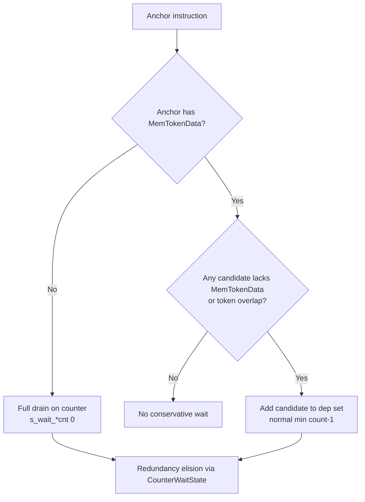
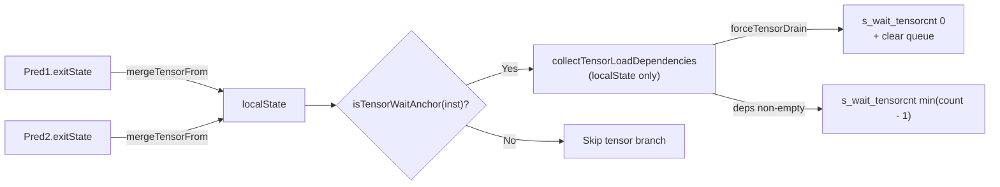

# StinkyWaitCntInsertionPass - Def-Use Chain Based Wait Count Insertion

`StinkyWaitCntInsertionPass` inserts `s_waitcnt` instructions so that asynchronous memory operations complete before their results are consumed. It determines where waits are needed by walking instruction-level def-use chains, rather than tracking individual registers.

### Key Characteristics

- **Instruction-level tracking** via def-use chains (not register-level)
- **Three counter types**: DS (`dlcnt`), buffer/load (`vlcnt`), tensor (`tlcnt`)
- **Cross-block analysis** using pre-scanned exit states and predecessor lookup; the tensor queue is additionally seeded into `localState` from every predecessor at block entry
- **Tensor handling** integrated into Phase 2 via the `isTensorWaitAnchor` predicate (barriers + DS reads/writes/atomics) and `collectTensorLoadDependencies`; no separate heuristic phase
- **Selective processing**: only basic blocks approved by `PassContext::shouldProcessBasicBlock` are analyzed and modified

## Pass Flow

```
+---------------------------------------------------------------+
|              StinkyWaitCntInsertionPass::run()                 |
+---------------------------------------------------------------+

                  Function Entry
                        |
                        v
            +-----------------------+
            |  buildUseDefChain()   |   Build instruction-level
            |                       |   def-use chains with PHIs
            +-----------+-----------+
                        |
                        v
            +-----------------------+
            |  buildBlockExitStates |   Pre-scan processed blocks to
            |                       |   record in-flight DS / buffer /
            |                       |   tensor-load ops at exit
            +-----------+-----------+
                        |
                        v
            +-----------------------+
            | traverseCFGInRPO      |   For each processed block
            |                       |   (reverse post-order):
            | 1. computeRequiredWaits  Seed predecessor tensor state
            |                          into localState; determine
            |                          (anchor, waitSpec) pairs across
            |                          all three counters
            | 2. emitWaitInstructions  Insert s_wait_* before each anchor
            +-----------+-----------+
                        |
                        v
            +-----------------------+
            |  removePHIs           |   Strip PHI pseudo-instructions
            +-----------+-----------+
                        |
                        v
                  Function Exit
```

## Dependency Resolution: collectSources

Before the pass can determine where waits are needed, it must resolve each instruction's dependencies back to the memory operations that produce its inputs. The `collectSources` function does this by walking the def-use chain and flattening through PHI nodes.

PHI pseudo-instructions represent merge points in the CFG where a value may come from different predecessors. Instead of treating a PHI as a dependency itself, the pass recursively replaces it with all of its incoming values (the real instructions behind the PHI). A `seenPhi` set prevents infinite recursion on cyclic PHI webs (e.g., loop-carried dependencies).

```
v_wmma uses v[0:3]
  -> def-use chain: v[0:3] comes from PHI
       -> PHI incoming[0]: ds_read (from preloop block)
       -> PHI incoming[1]: ds_read (from loop body)
  -> collectSources returns: {ds_read_preloop, ds_read_loop}
```

An optional filter restricts which sources are collected. For wait count insertion, only DS and buffer memory operations are kept:

```cpp
collectSources(inst, [](StinkyInstruction* src) {
    return isDSMemoryOp(*src) || isBufferMemoryOp(*src);
});
```

## Data Structures

### PendingMemOpTracker

Tracks in-flight (not yet waited-on) memory operations as ordered queues. Each processed basic block has an associated tracker that represents its exit state.

```
+----------------------------------------------+
|            PendingMemOpTracker               |
+----------------------------------------------+
| pendingDSOps:         deque<Instruction*>    |  DS reads/writes in issue order
| activeDSTokens:       unordered_set<int>     |  MemTokenData tokens from DS ops
| pendingBufferOps:     deque<Instruction*>    |  Global loads/stores in issue order
| pendingTensorLoadOps: deque<Instruction*>    |  tensor_load_to_lds in issue order (tlcnt)
+----------------------------------------------+
| pendingDSCount() / pendingBufferCount() / pendingTensorLoadCount() -> int  |  Queue sizes
| pendingDSCountFrom(inst)         -> int      |  Ops from inst to end of DS queue
| pendingBufferCountFrom(inst)     -> int      |  Ops from inst to end of buffer queue
| pendingTensorLoadCountFrom(inst) -> int      |  Ops from inst to end of tensor queue
| hasUntaggedDSOp() / hasUntaggedTensorLoadOp() -> bool                       |  Conservative fallback hooks
| recordDSOperation(inst)          -> bool     |  Append DS op + collect tokens
| recordBufferOperation(inst)      -> bool     |  Append buffer op
| recordTensorLoadOperation(inst)  -> bool     |  Append tensor load
| mergeTensorFrom(other)           -> void     |  Tensor-only union (predecessor seeding)
| trimQueueToLastWait(queue, lastWait)         |  Remove completed ops from front
+----------------------------------------------+
```

The `pendingDSCountFrom(inst)` / `pendingBufferCountFrom(inst)` / `pendingTensorLoadCountFrom(inst)` methods return how many ops remain from `inst` to the end of the queue. This value directly maps to the hardware wait count immediate: it represents the number of outstanding ops that must still complete (including `inst` itself). Returns 0 if `inst` is not found in the queue.

There is no `activeTensorTokens` companion to `activeDSTokens`. Tensor token-overlap is computed on demand by walking `pendingTensorLoadOps` and reading each load's `MemTokenData` modifier (see `collectTensorLoadDependencies`); seeding the deque alone via `mergeTensorFrom` is therefore sufficient to give a successor block full cross-block visibility into in-flight tensor loads.

### WaitCountSpec

A descriptor for which wait counter(s) to emit before an anchor instruction. Each field is either a non-negative count immediate or `kUnused` (-1) if that counter is not needed.

```
+--------------------------------+
|         WaitCountSpec          |
+--------------------------------+
| dsCount:     int  (dlcnt)      |  s_wait_dscnt immediate, or kUnused
| bufferCount: int  (vlcnt)      |  s_wait_loadcnt immediate, or kUnused
| tensorCount: int  (tlcnt)      |  s_wait_tensorcnt immediate, or kUnused
+--------------------------------+
```

### CounterWaitState

Per-counter bookkeeping during a single block walk. Tracks the last emitted wait value and how many new ops have been issued since, enabling redundancy elision.

```
+--------------------------------+
|       CounterWaitState         |
+--------------------------------+
| lastEmittedWait: int           |  Value of last emitted wait (or kUnused)
| opsSinceLastWait: int          |  New ops issued since last wait
+--------------------------------+
| recordNewOp()                  |  Increment opsSinceLastWait
| needsNewWait(required) -> bool |  Is another wait actually needed?
| recordEmittedWait(value)       |  Record that a wait was emitted
+--------------------------------+
```

## Memory Tokens (MemTokenData)

Several instructions in the IR carry `MemTokenData` modifiers -- integer token IDs that represent logical LDS memory regions. These tokens are attached upstream by `StinkyBuildImplicitDependencyPass`, which assigns them to tensor loads, DS writes, DS reads, and barriers to express implicit ordering dependencies that are not visible in the register def-use chain.

This pass uses `MemTokenData` in three ways, all driven from inside `computeRequiredWaits`:

1. **DS barrier conflict**: if a barrier's tokens overlap with the `activeDSTokens` accumulated from pending DS ops, force a `s_wait_dscnt 0`.
2. **LDS write-after-read (WAR)**: if an LDS writer (`tensor_load_to_lds` / `ds_write`) has tokens that overlap with prior pending DS reads, synthesize WAR dependencies and emit an `s_wait_dscnt` that drains them. `collectLdsWarDependencies` applies a per-pair same-pipeline filter (via `isOnSameDSPipeline`), so a `ds_write` writer skips candidate readers it already shares a hardware pipeline (and therefore FIFO ordering) with.
3. **Tensor-wait anchor**: any instruction matching `isTensorWaitAnchor` (barriers, DS reads, DS writes, DS atomics) is checked against `localState.pendingTensorLoadOps` for token overlap. The deque is seeded from every predecessor's exit state at block entry via `PendingMemOpTracker::mergeTensorFrom`, so the local view already covers cross-block in-flight tensor loads. `collectTensorLoadDependencies` returns a `TensorWaitDepResult { deps, forceTensorDrain }` and the caller emits an `s_wait_tensorcnt` whose value is computed by the same `computeWaitValueForCounter` machinery that drives DS / buffer.

### Conservative Fallback for Missing `MemTokenData`

`StinkyBuildImplicitDependencyPass` does not always attach `MemTokenData`. When `passCtx.getPassFeatureConfig().barrierConfig.unrollMovableBarrier == false` the upstream pass skips all LDS-token annotation, so the three sites above receive instructions with no tokens at all. To stay correctness-safe in that mode (and in any other situation where a single op fails to be annotated), the pass applies a hybrid conservative policy whenever a required token is missing.

| Site | Anchor missing tokens (writer / barrier) | Candidate missing tokens (reader / pending op / pending tensor load) |
|------|------------------------------------------|----------------------------------------------------------------------|
| DS barrier conflict | Barrier without `MemTokenData` triggers `s_wait_dscnt 0` whenever pending DS ops exist; queue cleared. | An untagged pending DS op (`hasUntaggedDSOp()`) triggers `s_wait_dscnt 0` on the next barrier, regardless of whether the barrier itself is tagged. |
| WAR-on-LDS | Writer without `MemTokenData` triggers `s_wait_dscnt 0` if any non-same-pipeline DS read/atomic is pending (current block or any predecessor exit state). Same-pipeline filter still applies. | A reader/atomic without `MemTokenData` is widened into the WAR dep set; the normal `min(count - 1)` algorithm then picks the wait value. |
| Tensor-wait anchor | Anchor without `MemTokenData` (`collectTensorLoadDependencies` returns `forceTensorDrain == true`) emits `s_wait_tensorcnt 0` and clears `pendingTensorLoadOps`. | A pending tensor load without `MemTokenData` (`hasUntaggedTensorLoadOp()`) is conservatively treated as conflicting and added to `deps`; `min(count - 1)` over that widened set picks the wait value. |

The "anchor missing" branch always reduces to a wait-0 on the appropriate counter, subject to the standard `CounterWaitState::needsNewWait` redundancy elision (so back-to-back drains do not double-emit). The "candidate missing" branch never inflates the value beyond what the normal `min(count - 1)` path would compute for an overlapping op at the same position. Every conservative branch logs a `PASS_DEBUG` line so investigations into perf regressions in `unrollMovableBarrier=false` mode can identify which sites fired.



`isLdsWriterAnchor` (formerly `isLdsWriterWithTokens`) now identifies LDS writers structurally so the WAR scan runs unconditionally; the actual choice of conservative vs. per-token path lives in `collectLdsWarDependencies`, which returns an `LdsWarResult { deps, forceDsDrain }`. `PendingMemOpTracker::hasUntaggedDSOp()` is the helper used by the barrier path to detect candidate-side missing tokens. The tensor-wait anchor path is symmetric: `isTensorWaitAnchor` triggers the scan unconditionally, `collectTensorLoadDependencies` returns a `TensorWaitDepResult { deps, forceTensorDrain }`, and `hasUntaggedTensorLoadOp()` is available for callers that need to detect candidate-side missing tokens directly.

## Core Algorithm: computeRequiredWaits

This method walks a single basic block in program order and determines which instructions need a preceding wait. It returns a list of `(anchorInstruction, WaitCountSpec)` pairs.

### Per-instruction logic

```
Block entry (run once before the per-instruction loop):

  0. Seed the tensor queue:
     For each predecessor of bb whose exit state is in blockExitMemState,
     call localState.mergeTensorFrom(pred.exitState). This appends every
     pending tensor load (deduped by pointer) so the local view alone
     covers cross-block in-flight tensor loads. DS / buffer queues are
     intentionally NOT seeded here -- their helpers walk predecessors
     explicitly (see computeWaitValueForCounter and collectLdsWarDependencies).

For each non-PHI instruction in the block:

  1. If it is a tensor-wait anchor (isTensorWaitAnchor: barrier / DS read /
     DS write / DS atomic):
     -> collectTensorLoadDependencies returns { deps, forceTensorDrain }:
          Anchor has MemTokenData: walk localState.pendingTensorLoadOps;
          add token-overlapping loads (and any candidate missing
          MemTokenData) to deps.
          Anchor lacks MemTokenData: forceTensorDrain == true if any
          tensor load is pending; deps is left empty.
     -> If forceTensorDrain: emit s_wait_tensorcnt 0 (subject to
          redundancy elision); clear pendingTensorLoadOps.
     -> Else if !deps.empty(): run computeWaitValueForCounter against the
          tensor queue and emit s_wait_tensorcnt min(count - 1).
     This branch is independent of the barrier-vs-DS branch below; a
     barrier exercises both, possibly emitting a wait on each counter.

  2. If it is a barrier and pendingDSOps is non-empty:
       Drain when any of the following holds:
         a. Barrier tokens overlap with activeDSTokens (tagged-barrier path)
         b. Barrier lacks MemTokenData (anchor-missing-tokens fallback)
         c. Any pending DS op lacks MemTokenData (candidate-missing-tokens fallback)
     -> Emit DS wait-0 (all pending DS ops must complete)
     -> Clear DS state and continue to next instruction

  3. Collect its memory-op dependencies via collectSources
     (flatten through PHIs, filter to DS/buffer ops only)

  4. If it is an LDS writer anchor (tensor_load_to_lds / ds_write):
     -> collectLdsWarDependencies returns { deps, forceDsDrain }:
          Writer has MemTokenData: scan pending DS reads/atomics in current
          block + each CFG predecessor's exit state; add token-overlapping
          ones (and any reader missing MemTokenData) to memOpDependencies.
          Per-pair filter inside the helper: candidates on the same hardware
          pipeline as the writer (isOnSameDSPipeline) are skipped because the
          hardware FIFO-retires them on the shared counter. In practice this
          means a ds_write writer adds no synthetic WAR deps against prior
          ds_read / ds_atomic on dlcnt.

          Writer lacks MemTokenData: forceDsDrain == true if any non-same-
          pipeline candidate exists in the current block or any predecessor;
          deps is left empty. The caller emits s_wait_dscnt 0 instead of
          running the per-pair min(count - 1) computation.

  5. If forceDsDrain (only set by the conservative branch):
     -> Emit DS wait-0 (subject to redundancy elision)
     -> Clear DS state; the buffer counter still runs via memOpDependencies

  6. If memOpDependencies is not empty, for each counter (DS, buffer):
     a. Compute the required wait value (current block + predecessors)
        Skip the DS branch when forceDsDrain already emitted the drain.
     b. Check if a new wait is actually needed (redundancy elision)
     c. If needed, record the (anchor, waitSpec) pair

  7. Tail recording: only AFTER any wait has been emitted, record inst as a
     DS / buffer / tensor-load op (if applicable) so it appears as in-flight
     for subsequent iterations. This matches hardware semantics: the wait
     executes before the consumer issues, so its queue snapshot must exclude
     the consumer itself.

After the loop:
  8. Trim exit-state queues (DS, buffer, tensor) based on last emitted waits
  9. Store the trimmed state into blockExitMemState for successor blocks.
     The tensor queue stored here naturally propagates through successor
     blocks via Step 0 of their own computeRequiredWaits invocations.
```

### Barrier token conflict handling

When a barrier instruction carries `MemTokenData` tokens that overlap with the `activeDSTokens` accumulated from pending DS operations, the pass forces a `s_wait_dscnt 0` before that barrier. This ensures all DS operations sharing a token with the barrier complete before the barrier executes.

```
Pending DS ops: [ds_read @token=1, ds_write @token=2]
activeDSTokens: {1, 2}

Barrier @tokens=[2, 3]:
  -> hasTokenOverlap({1,2}, [2,3]) = true (token 2)
  -> Emit s_wait_dscnt 0 before barrier
  -> Clear activeDSTokens and pendingDSOps
```

### LDS write-after-read (WAR) handling

`tensor_load_to_lds` and `ds_write` are LDS *writers*. If a prior `ds_read` is still draining on the DS counter, the writer cannot be safely issued because it would clobber memory that the read is still consuming. The pure SSA-style def-use chain captures **read-after-write** (a `ds_read` lists its LDS writer as a source) but never captures **write-after-read** -- a writer never lists prior readers as sources. The pass therefore runs `collectLdsWarDependencies` inside `computeRequiredWaits` for every LDS writer anchor (no longer gated on `MemTokenData`):

```
For each LDS writer anchor (tensor_load_to_lds / ds_write):

  Scan pending DS reads/atomics in two scopes (mirrors computeWaitValueForCounter):
    1. Current block: localState.pendingDSOps
    2. Each CFG predecessor's refined exit state in blockExitMemState

  If the writer has MemTokenData:
    For each scanned op:
      if op is a DS read (or DS atomic) and NOT isOnSameDSPipeline(writer, op):
        if op has no MemTokenData               -> add to memOpDependencies (widen)
        elif hasTokenOverlap(op.tokens, writer.tokens) -> add to memOpDependencies

  If the writer has NO MemTokenData (conservative fallback):
    if any scanned op is a DS read / DS atomic NOT on the same pipeline:
      forceDsDrain = true                       (caller emits s_wait_dscnt 0)
```

#### Same-pipeline filter (isOnSameDSPipeline)

`collectLdsWarDependencies` applies a per-pair pipeline filter: if the writer and the candidate reader share the same hardware memory pipeline, the pair is skipped because hardware FIFO retirement on the shared counter already enforces ordering. An explicit `s_wait_dscnt` would be redundant.

| Writer / candidate reader pair        | Same pipeline?       | Synthetic WAR? |
|---------------------------------------|----------------------|----------------|
| `ds_write`  vs `ds_read` / `ds_atomic`  | Yes (both on `dlcnt`)  | No (skipped)   |
| `tensor_load_to_lds` vs `ds_read` / `ds_atomic` | No (`tlcnt` vs `dlcnt`) | Yes            |

`isOnSameDSPipeline` currently returns true iff both instructions are DS memory ops; future pipelines (e.g. additional split counters) can be threaded through the same helper without touching the caller.

A `ds_write` whose data operand was produced by a prior `ds_read` (a real RAW dependency via the SSA def-use chain) still gets its usual `s_wait_dscnt` from `computeWaitValueForCounter`; only the WAR synthesis path is filtered.

The synthesized deps then flow through the existing DS-counter pipeline. `computeWaitValueForCounter` selects `min(pendingDSCountFrom(dep) - 1)` over the set, which is the position of the *youngest* token-overlapping read; waiting on that read implicitly drains all older overlapping reads because the DS counter retires FIFO. The buffer counter is unaffected because `pendingBufferCountFrom(read) == 0` for DS reads.

Because DS / buffer recording is deferred to step 5 of the per-instruction logic above, the writer itself is **not** in `pendingDSOps` at scan time. This makes the wait value match hardware semantics for DS-op writers (e.g. `ds_write`): the queue at wait-emission time excludes the writer, so `pendingDSCountFrom(dep) - 1` directly gives the count of older ops that must drain. An `op != writer` guard is retained inside the helper as defense-in-depth.

```
Pending DS ops:    [r0 @t=0, r1 @t=0, r2 @t=1, r3 @t=1]
                       ^      ^
                       token-0 reads -- "youngest" is r1 at position 3 from end

tensor_load_to_lds @tokens=[0]:
  -> hasTokenOverlap({0}, {0}) for r0, r1 -> add to memOpDependencies
  -> r2, r3 have token=1, no overlap -> not added
  -> DS-counter wait = min(pendingDSCountFrom(r0)-1=3, pendingDSCountFrom(r1)-1=2) = 2
  -> Emit s_wait_dscnt 2 before tensor_load_to_lds
     (r0, r1 complete; r2, r3 stay in flight)
```

#### Relationship to barrier conflict handling

Both paths look at token overlap against pending DS ops, but they are not the same:

| Aspect             | Barrier conflict             | WAR-on-LDS                                 |
|--------------------|------------------------------|--------------------------------------------|
| Trigger            | `isBarrier(inst)` + tokens   | `isTensorLoad(inst) \|\| isDSWrite(inst)` + tokens |
| Source set checked | `activeDSTokens` (any DS op) | `pendingDSOps` (DS reads / atomics only)   |
| Pipeline filter    | None                         | `isOnSameDSPipeline(writer, op)` skipped -- removes ds_write/ds_read pairs |
| Wait emitted       | Always `s_wait_dscnt 0`      | `min(count - 1)` over conflicting reads    |
| Effect on queue    | Clears `pendingDSOps`        | Trim happens via the standard `lastEmittedWait` path |

Barrier handling is the bigger hammer (drain everything sharing a token). WAR handling is more surgical: it lets newer non-conflicting DS ops keep flowing.

## Wait Value Computation: computeWaitValueForCounter

This method computes the minimum wait count value needed for a single counter (DS or buffer) given the consumer instruction's memory-op dependencies. It is called twice per consumer instruction -- once for the DS counter, once for the buffer counter -- with a callback that delegates to the appropriate `pendingCountFrom` method:

```cpp
// DS counter
computeWaitValueForCounter(
    localState.pendingDSCount(), localState, memOpDependencies, dsWait,
    [](const PendingMemOpTracker& t, StinkyInstruction* s) {
        return t.pendingDSCountFrom(s);   // delegates to DS queue lookup
    });

// Buffer counter
computeWaitValueForCounter(
    localState.pendingBufferCount(), localState, memOpDependencies, bufferWait,
    [](const PendingMemOpTracker& t, StinkyInstruction* s) {
        return t.pendingBufferCountFrom(s);   // delegates to buffer queue lookup
    });
```

### Algorithm

```
Input:
  initialPendingCount  = total pending ops for this counter in current block
  localState           = current block's PendingMemOpTracker
  memOpDependencies    = set of source instructions the consumer depends on
  counterState         = last emitted wait state for this counter
  getCountFrom(tracker, inst)  = callback to query a specific queue

Start with: requiredWait = initialPendingCount

For each dependency source:
  count = getCountFrom(localState, source)

  Case 1: source found in current block (count > 0)
    requiredWait = min(requiredWait, count - 1)
    needsWait = true

  Case 2: source not in current block
    (skip predecessor lookup if lastEmittedWait == 0 -- all ops already completed)
    count = getCountFrom(blockExitMemState[source's parent block], source)
    if count > 0: collect (count - 1) into predecessorValues
    needsWait = true

After loop:
  if predecessorValues not empty:
    requiredWait += min(predecessorValues)

Return (requiredWait, needsWait)
```

Note: when a source is a buffer op, the DS queue lookup returns 0, so the DS counter correctly ignores it (and vice versa). This means all dependencies are passed to both counter computations, and each counter naturally filters to its own op type.

### Why `count - 1`?

The hardware wait count represents how many ops may still be outstanding *after* the wait completes. If a dependency is at position `count` from the end of the queue, we need everything from the dependency onward to complete. The wait immediate tells the hardware "let at most N ops remain outstanding", so we pass `count - 1`: all ops up to and including the dependency complete, leaving `count - 1` newer ops still in flight.

```
Queue:  [op_A] [op_B] [op_C] [op_D]
                 ^
                 dependency is op_B
                 pendingCountFrom(op_B) = 3  (op_B, op_C, op_D)
                 wait value = 3 - 1 = 2
                 -> s_wait_dscnt 2: let 2 ops remain (C, D), completing A and B
```

### Predecessor contribution

When a dependency comes from a predecessor block, the pass adds the minimum predecessor contribution to the current block's wait value. This handles the case where some ops were issued in a predecessor and more were issued in the current block -- the total number of in-flight ops visible to the hardware is the sum.

```
Predecessor block exit state:
  pendingDSOps = [pred_op0, pred_op1]

Current block (so far):
  pendingDSOps = [cur_op0, cur_op1, cur_op2]

Instruction uses pred_op1:
  Current block: pendingDSCountFrom(pred_op1) = 0  (not in current block)
  Predecessor:   pendingDSCountFrom(pred_op1) = 1  (pred_op1 is last)
  predecessorValues = [1 - 1] = [0]

  requiredWait = initialPendingCount + min(predecessorValues)
               = 3 + 0 = 3
  -> s_wait_dscnt 3
```

## Redundancy Elision

Not every computed wait needs to produce an instruction. `CounterWaitState::needsNewWait` checks whether the previously emitted wait already covers the required value:

```
needsNewWait(required) =
    lastEmittedWait == kUnused                         // No wait emitted yet
    OR lastEmittedWait + opsSinceLastWait > required   // Gap has grown past coverage
```

The intuition: after emitting `s_wait_dscnt N`, at most N ops remain outstanding. If K new ops are issued after that, the effective outstanding count becomes `N + K`. A new wait is only needed if this effective count exceeds the required value.

**Example:**

```
1. s_wait_dscnt 2    -> lastEmittedWait=2, opsSinceLastWait=0
                        effective outstanding: 2
2. ds_read ...       -> opsSinceLastWait=1, effective outstanding: 3
3. ds_read ...       -> opsSinceLastWait=2, effective outstanding: 4

4. instruction needs wait value 3
   -> needsNewWait(3): 2 + 2 = 4 > 3 -> true, emit new wait

5. instruction needs wait value 5
   -> needsNewWait(5): 2 + 2 = 4 <= 5 -> false, skip (already satisfied)
```

## Cross-Block Analysis

### Exit state pre-scanning

`buildBlockExitStates` walks all processed blocks once (those passing `shouldProcessBasicBlock`), recording every DS and buffer memory operation in issue order. This populates `blockExitMemState[bb]` with the full set of in-flight ops at each block's exit point, before any waits are considered.

### Refined exit state

After `computeRequiredWaits` finishes a block, it trims the exit state based on the last emitted wait. Without this, successor blocks would see ops that are already guaranteed to have completed, leading to unnecessarily large wait values.

```
Before trim: pendingDSOps = [op_A, op_B, op_C, op_D], lastEmittedWait = 2
After trim:  pendingDSOps = [op_C, op_D]  (only 2 ops remain in-flight)
```

The trimmed state is stored back into `blockExitMemState[&bb]`, overwriting the pre-scanned state. Successor blocks then see only the ops that are genuinely still in-flight.

### Predecessor lookup guard

When looking up a dependency in a predecessor's exit state, the pass skips the lookup if `counterState.lastEmittedWait == 0`. A wait-0 means all outstanding ops for that counter have completed, so no predecessor ops can still be in-flight -- the lookup would be wasted work and could produce incorrect (non-zero) contributions.

## Tensor Wait Anchors and Cross-Block Seeding

Tensor waits no longer live in a separate post-pass heuristic. They are emitted from inside `computeRequiredWaits` on the same `(anchor, WaitCountSpec)` machinery that drives the DS and buffer counters.

### Anchor set

`isTensorWaitAnchor(inst)` matches every instruction that may consume the result of a `tensor_load_to_lds` via LDS and therefore needs an `s_wait_tensorcnt` before it issues:

- `s_barrier`
- `ds_read` (any width)
- `ds_write` (any width)
- `ds_atomic`

Tensor loads themselves are deliberately excluded: the hardware FIFO already orders them on the shared `tlcnt` counter, so a synthetic wait between two tensor loads would be redundant. The set mirrors the modifier sites tagged by `StinkyBuildImplicitDependencyPass`.

### Cross-block seeding

`buildBlockExitStates` walks every processed block once and calls `recordTensorLoadOperation` for each `tensor_load_to_lds` it sees, leaving the resulting `pendingTensorLoadOps` in `blockExitMemState[bb]` (alongside `pendingDSOps` and `pendingBufferOps`). At the top of `computeRequiredWaits(bb)`, before the per-instruction loop:

```cpp
for (BasicBlock* pred : bb.getPredecessors()) {
    auto it = blockExitMemState.find(pred);
    if (it == blockExitMemState.end()) continue;
    localState.mergeTensorFrom(it->second);
}
```

`mergeTensorFrom` appends every pending tensor load from `pred` while skipping pointers already present, so multiple converging CFG paths do not duplicate the same op. The result: by the time the per-instruction loop starts, `localState.pendingTensorLoadOps` already contains every still-in-flight tensor load on every path reaching `bb`.



DS and buffer queues are intentionally NOT seeded this way; their per-counter wait computation walks predecessors explicitly inside `computeWaitValueForCounter` / `collectLdsWarDependencies`. Seeding only the tensor queue keeps DS / buffer behaviour byte-identical to the pre-tensor implementation.

### Per-anchor wait emission

`collectTensorLoadDependencies(anchor, bb, localState)` walks `localState.pendingTensorLoadOps`:

- Anchor with `MemTokenData`: include each load whose `MemTokenData` overlaps the anchor's tokens (or that lacks `MemTokenData`, conservative widening) into `deps`. The caller then runs `computeWaitValueForCounter` against the tensor queue, picking `min(pendingTensorLoadCountFrom(dep) - 1)` -- the position of the youngest conflicting load.
- Anchor without `MemTokenData`: any pending load forces `forceTensorDrain == true`, and the caller emits `s_wait_tensorcnt 0` then clears `localState.pendingTensorLoadOps`.

Both paths are subject to the standard `CounterWaitState::needsNewWait` redundancy elision so back-to-back anchors do not double-emit.

### Exit-state preservation

After the per-instruction loop, `localState.trimQueueToLastWait(localState.pendingTensorLoadOps, tensorState.lastEmittedWait)` trims completed loads off the front of the queue, then `blockExitMemState[&bb] = localState` stores the trimmed view for successor blocks to consume. Because the tensor queue was seeded from predecessors at the top, this exit state correctly carries cross-block tensor visibility through the entire CFG.

## Emit Phase: emitWaitInstructions

For each `(anchorInst, waitSpec)` pair, the method inserts wait instructions immediately before the anchor using `AsmIRBuilder::create`. Each counter that has a non-`kUnused` value produces one instruction:

| WaitCountSpec field | Emitted instruction | Modifier |
|---------------------|---------------------|----------|
| `dsCount` | `s_wait_dscnt <N>` | `SWaitCntData.dlcnt` |
| `bufferCount` | `s_wait_loadcnt <N>` | `SWaitCntData.vlcnt` |
| `tensorCount` | `s_wait_tensorcnt <N>` | `SWaitTensorCntData.tlcnt` |

## Example Walkthrough

### Input: DS reads consumed by WMMA

```assembly
label_LoopBeginL:
    ds_read_b128 v[0:3],  v8           ; DS op 0
    ds_read_b128 v[4:7],  v9           ; DS op 1
    ds_read_b128 v[8:11], v10          ; DS op 2
    ds_read_b128 v[12:15], v11         ; DS op 3
    v_wmma_f32 v[16:23], v[0:3], v[4:7], v[16:23]    ; uses DS ops 0,1
    v_wmma_f32 v[24:31], v[8:11], v[12:15], v[24:31]  ; uses DS ops 2,3
```

### Analysis

```
After recording DS ops 0-3:
  pendingDSOps = [op0, op1, op2, op3], pendingDSCount = 4

At first v_wmma (uses op0, op1):
  initialPendingCount = 4
  op0: pendingDSCountFrom = 4, requiredWait = min(4, 4-1) = 3
  op1: pendingDSCountFrom = 3, requiredWait = min(3, 3-1) = 2
  needsNewWait(2): lastEmittedWait is kUnused -> true
  -> Emit s_wait_dscnt 2

At second v_wmma (uses op2, op3):
  initialPendingCount = 4  (queue unchanged; trimming happens after the loop)
  op2: pendingDSCountFrom = 2, requiredWait = min(4, 2-1) = 1
  op3: pendingDSCountFrom = 1, requiredWait = min(1, 1-1) = 0
  needsNewWait(0): lastEmitted=2, opsSinceLastWait=0, 2+0=2 > 0 -> true
  -> Emit s_wait_dscnt 0
```

### Output

```assembly
label_LoopBeginL:
    ds_read_b128 v[0:3],  v8
    ds_read_b128 v[4:7],  v9
    ds_read_b128 v[8:11], v10
    ds_read_b128 v[12:15], v11
    s_wait_dscnt 2                                     ; <-- inserted
    v_wmma_f32 v[16:23], v[0:3], v[4:7], v[16:23]
    s_wait_dscnt 0                                     ; <-- inserted
    v_wmma_f32 v[24:31], v[8:11], v[12:15], v[24:31]
```

## File Structure

```
anonymous namespace {
    // --- Free-standing helpers ---
    collectSourcesRec(...)         // Recursive PHI-flattening source collection
    collectSources(...)            // Entry point for source collection
    isDSMemoryOp(...)              // DS read or write predicate
    isBufferMemoryOp(...)          // Global load or store predicate
    hasTokenOverlap(A, B)          // Template: any shared token between containers
    isLdsWriterAnchor(...)         // tensor_load_to_lds / ds_write (token-agnostic)
    isTensorWaitAnchor(...)        // barrier / ds_read / ds_write / ds_atomic
    isOnSameDSPipeline(a, b)       // Same hardware FIFO (DS dlcnt) pair?

    // --- Data structures ---
    struct PendingMemOpTracker     // In-flight DS / buffer / tensor-load queues
                                   //   .hasUntaggedDSOp() / .hasUntaggedTensorLoadOp()
                                   //   .mergeTensorFrom(other) for predecessor seeding
    struct LdsWarResult            // { deps, forceDsDrain } from WAR analysis
    struct TensorWaitDepResult     // { deps, forceTensorDrain } from tensor anchor analysis
    struct WaitCountSpec           // Wait counter immediate triplet (ds, buffer, tensor)

    // --- Pass class ---
    class StinkyWaitCntInsertionPass : public StinkyInstPass {
        struct CounterWaitState    // Per-counter state during block walk

        buildBlockExitStates()             // Phase 1: pre-scan all blocks (DS / buffer / tensor)
        scanBlockMemOps()                  //    helper: record ops in one block
        computeWaitValueForCounter()       //    Per-counter wait value computation
        collectLdsWarDependencies()        //    WAR-on-LDS scan for ds_write / tensor_load_to_lds
        collectTensorLoadDependencies()    //    Tensor-anchor scan against pendingTensorLoadOps
        computeRequiredWaits()             // Phase 2: seed tensor queue, determine waits per block
        emitWaitInstructions()             // Phase 3: insert wait IR nodes
        removePHIs()                       // Phase 4: cleanup
    };
}

namespace stinkytofu {
    createStinkyWaitCntInsertionPass()  // Public factory
}
```

## Companion: StinkyRemoveWaitCntPass

`StinkyRemoveWaitCntPass` is the precondition pass that strips stale wait-counter instructions before `StinkyWaitCntInsertionPass` issues fresh ones. The gfx1250 backend ([shared/stinkytofu/src/pipeline/backend/Gfx1250Backend.cpp](../../src/pipeline/backend/Gfx1250Backend.cpp)) calls it (with the default) right after the CFG builder; the insertion pass then runs later in the pipeline against a clean slate.

The pass walks every basic block approved by `PassContext::shouldProcessBasicBlock` and removes instructions matching either of two disjoint flag bits:

| Flag bit          | Always removed?               | Opcodes (gfx1250)                                                                                                            |
|-------------------|-------------------------------|------------------------------------------------------------------------------------------------------------------------------|
| `IF_WaitCnt`      | Yes (`isWaitCnt(inst)`)       | `s_wait_dscnt`, `s_wait_loadcnt`, `s_wait_storecnt`, `s_wait_asynccnt`, `s_wait_kmcnt`, `s_wait_xcnt`, `s_wait_loadcnt_dscnt`, `s_wait_storecnt_dscnt`, `s_waitcnt` |
| `IF_WaitTensorCnt`| Only when `removeTensorWaitCnt` is true (the new default) -- `isTensorWaitCnt(inst)` | `s_wait_tensorcnt` |

The two flags are mutually exclusive on any given opcode, so the predicate is the simple OR `isWaitCnt(inst) || (removeTensorWaitCnt && isTensorWaitCnt(inst))`.

### Default policy

`createStinkyRemoveWaitCntPass(bool removeTensorWaitCnt = true)` defaults to `true`. Earlier revisions defaulted to `false`, leaving `s_wait_tensorcnt` instructions in place; the new default ensures a fully clean slate so the insertion pass owns every wait.
